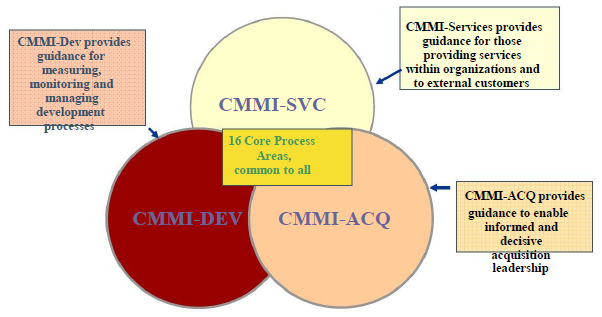
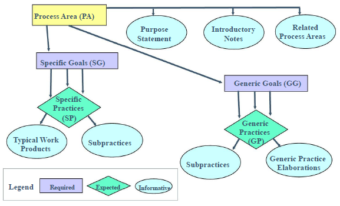
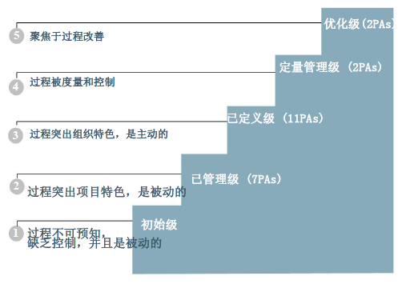
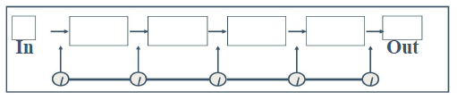
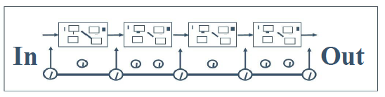
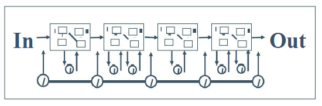
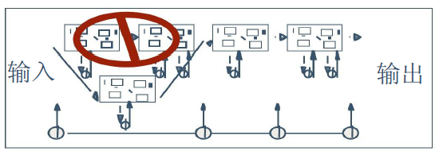
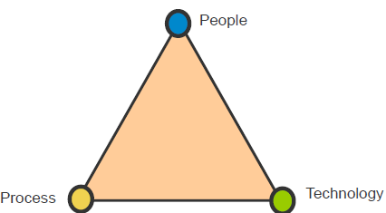

---
title: CMM与CMMI
date: 2021-03-18 20:21:34
summary: 本文分享CMM与CMMI的相关内容。
tags:
- 软件质量
- 软件工程
categories:
- 软件工程
---

# 成熟组织和不成熟组织

不成熟的组织的五大弊病：
- 过程临时拼凑、不能严格遵守。
- 制定进度和预算不是基于估计，经常超出进度和预算。
- 产品质量难以预测，没有判断质量的客观基础。
- 为满足进度，常在产品功能和质量上作出让步。
- 过程是反应式的，解决即时危机。

成熟组织的六大优点：
- 在全组织范围内具有一致定义的过程。
- 过程被严格的遵守，过程的执行符合度被评价和加强。
- 产品和过程的度量被有效的使用。
- 进度和预算是基于以前的性能数据预测的，是现实的。
- 通常都能达到产品的成本、进度、功能和质量的预测结果。
- 过程是前瞻性的，注重对缺陷的预防。

# CMM和CMMI

CMM和CMMI都是软件过程模型。

根据经验总结出来的最佳实践，按某种方式结合起来组成了过程模型。
过程模型可以理解为方法和框架。

CMMI可以帮助认定一个组织是否成熟。

CMM：Capability Maturity Model（能力成熟度模型）

CMMI：Capability Maturity Model Integration（能力成熟度模型集成）

CMMI是卡耐基梅隆大学软件工程研究院受美国国防部委托制定的软件过程改良、评估模型，是一个基于优秀实践所建立的过程模型。

CMMI构造了一个软件过程成熟度框架。将软件过程的成熟度划分为不同的阶段，并将这些阶段排序，每个阶段对应一个成熟度等级。

该框架描述了一条从无序的、混乱的过程到成熟的、有纪律的软件过程的进化途径。

CMMI是为了提供一个有秩序的、有纪律的框架，以便在此框架内阐述管理过程和工程过程的问题而专门研制的，因此不包括：
- 特定应用领域内的专门知识
- 具体的软件技术
- 选择、雇佣、激励人员

之前写过一篇[CMM相关的文章](https://blankspace.blog.csdn.net/article/details/113854904)，感兴趣可以阅读。

# 过程域

过程域(PA)是指某领域的一组相关的活动。当这些活动共同完成时，能满足在这一领域实施改善的一组重要的目标。

CMMI-DEV模型中共有22个过程域：
- 原因分析和解决方案(CAR)
- 配置管理(CM)
- 决策分析与解决方案(DAR)
- 集成项目管理+IPPD (IPM+IPPD)
- 度量分析(MA)
- 组织革新与推广(OID)
- 组织过程定义+IPPD (OPD+IPPD)
- 组织过程焦点(OPF)
- 组织过程性能(OPP)
- 组织培训(OT)
- 产品集成(PI)
- 项目监督与控制(PMC)
- 项目策划(PP)
- 过程和产品质量保证(PPQA)
- 定量项目管理(QPM)
- 需求开发(RD)
- 需求管理(REQM)
- 风险管理(RSKM)
- 供方协议管理(SAM)
- 技术解决方案(TS)
- 确认(VAL)
- 验证(VER)

过程域组件： 

过程域的内容：
- 目的陈述
- 介绍性说明
- 相关的过程域
- 特殊目标和实践总结
- 以目标组织的特殊实践
    - 特殊目标和特殊实践
- 以目标组织的通用实践
    - 通用目标和通用实践

# CMMI不同成熟度等级的关注点

## Level 1: 依赖有能力的个人和英雄

- 在特别的、无序的情况下执行过程
- 性能依赖于人员的能力
- 当最好的人员被指定执行任务时，才能取得高质量和例外的
- 性能结果
- 性能很难被预知
- 管理活动可能无法发挥效果

行为特征：个人英雄主义
1. 几乎没有明显的稳定的软件过程。组织一般不提供开发和维护软件的稳定环境，组织中缺乏健全的管理机制。
2. 在危机时刻，项目会抛弃预定的规程，回复到仅作编码和测试。成功依赖于杰出的项目经理以及一支有经验的、战斗力强的软件队伍。
3. 过程能力是不可预测的，因为随着工作进展软件过程经常被改变或修改（即过程是无序的）。进度、预算、功能和产品质量一般是不可预测的。性能依赖于个人的能力、且随个人固有的技能、知识的不同而变化。只能通过个人的能力而不是组织的能力去预测性能。

## Level 2: 关注基本的项目管理

- 项目管理更加规范
- 组织方针被建立并被遵循
- 项目计划和过程描述被文档化并被遵循
- 提供足够的资源
- 在整个生命周期中明确责任和职责
- 历史项目是成功的，类似项目也是成功的
- 时间紧迫的情况下，通过规则保证现有的活动得到执行
- 在确定的时间点上，活动和工作产品的状态是可视的

行为特征：有纪律的、可重复的
1. 已建立管理软件项目的方针和规程。基于类似项目的经验对新项目进行规划和管理。软件项目的有效管理过程被制度化，组织能重复以前项目的成功经验。
2. 项目已设置基本的软件管理控制。项目能够及时跟踪软件成本、进度和功能性；已经实施配置管理和子承包商的管理。
3. 过程能力是有纪律的，软件项目的规划和跟踪是稳定的，能重复以前的成功。由于遵循基于以前项目性能所制定的切实可行的计划，项目过程处在项目管理系统的有效控制之下。

## Level 3: 关注过程标准化（组织级）

行为特征：标准的、一致的
1. 已经建立组织标准软件过程（文档化、被集成）。
2. 存在专门负责软件过程活动的组（SEPG）。
3. 实施全组织的培训。
4. 项目通过裁减组织的标准软件过程去建立项目定义软件过程。
5. 过程能力是标准和一致的，因为无论软件工程活动还是管理活动，过程都是稳定和可重复的。
6. 在所建立的产品线内，成本、进度和功能性均受控制、对软件质量也进行跟踪。

## Level 4: 关注定量管理

- 分析涉及了处理过程偏差的特定原因
- 定量分析度量数据以建立目标、产品质量、服务质量和过程性能的需求

行为特征：定量的、可预测的
1. 组织对软件产品和过程都设置定量的质量目标，并对所有的项目都测量起重要的软件过程活动的生产率和质量。
2. 利用组织软件过程数据库收集和分析项目过程数据。
3. 各个软件过程都有妥善定义的和一致的度量。项目通过将其过程性能的变化限制在定量饿可接受的范围之内，实现对其产品和过程的控制。
4. 过程能力是可预测的，因为过程是已测量的并在可测的范围内运行。该等级的过程能力使得组织能在定量限制的范围内预测过程和产品质量方面的趋势。当超过限制范围时，采取措施予以纠正。软件产品具有可预测的高质量。

## Level 5: 关注持续的过程改进

- 分析涉及了处理过程偏差的一般原因
- 度量用于
    - 选择改善和创新
    - 估计改善和创新的成本和效益
    - 度量改善和创新的实际成本和效益

行为特征：不断改进的
1. 在优化级，整个组织集中精力进行不断的过程改进。
2. 组织实施缺陷预防，为了预防缺陷，组织主动的识别出弱点并预先针对性地加强过程。组织的软件项目分析缺陷以确定其发生的原因、采取对策，同时将经验教训告知其他项目。
3. 组织对新技术和对过程的改善建议进行分析，识别出有价值的技术创新和过程改善，并推广到整个组织。
4. 过程能力可特征化为不断改进，组织为扩大其过程能力的范围进行着不懈的努力，因而不断改善其项目的过程性能。既通过现有过程中增量式前进的办法，也通过采取新技术、新方法的革新办法，使改进不断出现。

## 等级具有不可跳跃性

每一个等级都是更高等级的基础，不论能力等级还是成熟度等级都是累积的、不可跳跃。

较高的等级包含较低等级的所有实践。

# CMMI的应用

- 软件过程改进
    - 组织策划、设计和实施对其软件过程的更改
- 软件过程评估
    - 关注组织自身的软件过程改善• 过程在开放与合作的环境中进行
    - 目的暴露软件过程中存在的问题，帮助组织实施过程的改善
- 软件能力评价
    - 关注软件承包商的过程成熟度
    - 过程在面向审计的环境中进行
    - 目的选择合格的承包商，降低由于承包商选择不当而引发的风险

# CMMI的收益

- 提高进度和预算的可预计性
- 缩短生命周期时间
- 提高生产力
- 提高质量
- 改善客户满意度
- 提高员工士气
- 增加利润
- 降低质量成本
