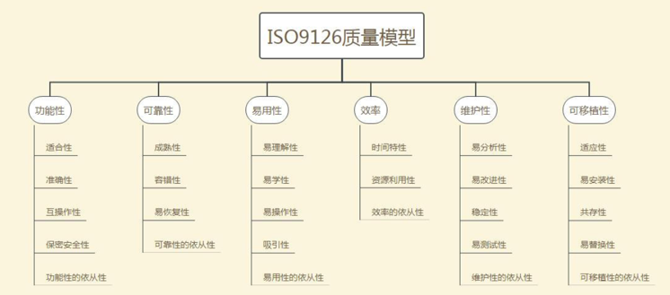

---
title: ISO-9126质量模型
date: 2021-03-19 20:58:43
summary: 本文分享ISO-9126质量模型的相关内容。
tags:
- 软件质量
- 软件工程
categories:
- 软件工程
---

# 软件质量特性

- 功能性
    - 适合性
    - 准确性
    - 互操作性
    - 依从性
    - 安全性
- 可靠性
    - 成熟性
    - 容错性
    - 易恢复性
- 易用性
    - 易理解性
    - 易学性
    - 易操作性
- 效率
    - 时间效率
    - 空间效率
- 可维护性
    - 易分析性
    - 易改变性
    - 稳定性
    - 易测试性
- 可移植性
    - 适应性
    - 已安装性
    - 遵循性
    - 易替换性

## 功能性

**功能性**是指软件系统是否满足了客户的需求。
- 适合性：软件系统所提供的功能是用户所需要的，用户所需要的功能软件系统是否已提供。
- 准确性：软件系统提供给用户的功能是否满足用户对该功能的精确度要求。
- 互操作性：软件系统与一个或多个周边系统进行信息交互的能力。
- 安全性：防止未得到授权的人或系统访问相关的信息或数据，保证得到授权的人或系统能正常访问相关的信息或数据。

## 可靠性

**可靠性**是指软件系统是否能够一直在一个稳定的状态上满足可用性。
- 成熟性：软件系统防止内部错误扩散而导致失效的能力。
- 容错性：软件系统防止外部接口错误扩散而导致系统失效的能力。
- 易恢复性：软件系统失效后重新恢复其原有功能、性能的能力，包括对原有能力恢复的程度与速度。

## 易用性

**易用性**是衡量用户使用软件系统需要付出多大的努力的质量属性。
- 易理解性：用户在使用软件系统的过程中，展示给用户的信息准确、清晰、易懂，能帮助用户准确理解系统当前真实的状态并指导其进一步的操作。
- 易学性：软件系统提供相关的辅助手段以帮助用户学习使用它的能力。
- 易操作性：软件系统使用户基本不用额外学习即能操作软件的能力。
- 吸引性：软件系统具有某些独特的、能让用户眼前一亮的属性。

## 效率

**效率**是衡量软件正常运行需要耗费多少时间及物理资源的质量属性，是性能测试的重点内容。
- 时间效率：软件系统该在各业务场景下完成用户指定的业务请求所需的响应时间。
- 资源效率：软件系统在完成用户指定的业务请求所消耗的系统资源。

## 可维护性

**可维护性**是衡量对已经完成的软件系统进行调整需要多大的努力的质量属性。
- 易分析性：软件系统提供辅助手段帮助开发人员分析识别缺陷、失效产生的原因并找出待修复部分的能力。
- 易改变性：软件系统的缺陷修复容易被实施，这与软件的设计有着密切关系。
- 稳定性：软件系统在长时间连续工作环境下能否正常工作而无异常情况。
- 易测试性：软件系统存在可测试的难易程度。

## 可移植性

**可移植性**是指衡量软件能否方便地部署到不同的运行环境中的能力。
- 适应性：软件系统无需做任何相应变动就能适应不同运行环境的能力。
- 易安装性：平台变化后成功安装软件系统的难易程度。
- 共存性：软件系统在公共环境与其共享资源的其它系统共存的能力。
- 易替换性：软件系统的升级能力，包括在线升级、打补丁升级等。

