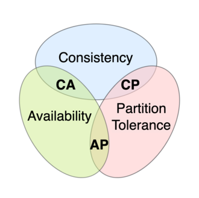

---
title: 软件一致性
date: 2023-02-18 14:35:26
summary: 本文分享软件一致性和软件开发一致性的相关内容。
tags:
- 软件质量
- 软件工程
categories:
- 软件工程
---

# 软件一致性

软件开发过程中的一个重要方面正是正在设计和实现的软件系统的各个部分之间的一致性。

软件一致性要求不同评估者使用相同方法对同一项目进行的一系列测量应产生相似的结果。软件一致性是指软件在功能、界面、行为、性能方面在不同系统、不同设备、不同环境下的一致性，即软件在不同系统、不同设备、不同环境下的表现和性能都要统一、达到同样的标准。

软件一致性的实现，涉及到多个层面，包括界面一致性，功能一致性，性能一致性，行为一致性，数据一致性，安全一致性等等。
- 界面一致性指的是软件的界面在不同的系统和设备上要保持一致，以便满足用户的使用习惯。
- 功能一致性指的是软件在不同平台，不同设备，不同环境下的功能要保持一致，以便满足用户的需求。
- 性能一致性指的是软件在不同平台，不同设备，不同环境下的性能要保持一致，以便确保软件的可靠性和稳定性。
- 行为一致性指的是软件在不同平台，不同设备，不同环境下的行为要保持一致，以便满足用户的期望。
- 数据一致性指的是软件在不同平台，不同设备，不同环境下的数据要保持一致，以便满足用户的需求。
- 安全一致性指的是软件在不同平台，不同设备，不同环境下的安全要保持一致，以便满足用户的安全需求。

总的来说，软件一致性是指软件在不同系统、不同设备、不同环境下的表现和性能都要保持一致，以便满足用户的需求，并确保软件的可靠性和稳定性。

# 软件开发一致性

软件开发的一致性需要统一性、一致性或单一的工作方式。

坚持一致性使开发干净的代码变得更加容易，从而使软件开发人员受益。此外，最终产品的最终用户会因获得易于使用的产品而受益。

软件开发的一致性非常重要，它胜过改进和创新。例如，三个软件开发人员$A$、$B$、$C$长期致力于一个程序。 软件开发人员$A$使用一种方法，直到被软件开发人员$B$取代，后者采用了不同的更好的方法。随着时间的推移，软件开发人员$B$被软件开发人员$C$取代，后者现在很难跟踪以前开发人员的不同方法。这在软件开发过程中造成了许多障碍，包括时间和其他资源的浪费。 

软件开发一致性的最大好处是通过提供简单的解决方案，最终的程序可以达到甚至超过现行的质量标准。此外，一致性有助于顺利推进工作，保障项目按时完成。坚持一致性的组织能够在各个方面提供令客户满意的用户体验，提升市场竞争力。

# 分布式系统CAP定理

理论计算机科学存在CAP 定理，指出任何分布式数据存储只能提供以下三个保证中的两个：
- 一致性(Consistency)：每次读取都会收到最近的写入或错误，所有节点在同一时间的数据完全一致。
- 可用性(Availability)：每一个非故障的节点必须对每一个请求作出一个(非错误)响应，但不能保证它包含最新的写入。
- 分区容错(Partition Tolerance)：分布式系统在遇到某节点或网络分区故障的时候，仍然能够对外提供满足一致性和可用性的服务。当分布式系统中有某一个或者几个机器宕掉了，其他剩下的机器还能够正常运转满足系统需求。尽管节点之间的网络丢弃或延迟了任意数量的消息，但系统仍继续运行。

当发生网络分区故障时，可以有以下两种选择：
- cancel，降低可用性，确保一致性。
- continue，提供可用性，存在不一致的风险。

因此，如果存在网络分区，则必须在一致性或可用性之间做出选择。

# 数据库事务ACID性质

数据库事务具有ACID的性质：
- 原子性(Atomicity)：事务的所有操作在数据库中要么全部正确的反映出来，要么完全不反映。
- 一致性(Consistency)：隔离执行事务时（没有其他事务并发执行时）保持数据库的一致性。
- 隔离性(Isolation)：尽管多个事务可能并发执行，但系统保证，对于任何一对事务$T_{i}$和$T_{j}$，在$T_{i}$看来，$T_{j}$或者在$T_{i}$开始之前已经完成执行，或者在$T_{i}$完成之后开始执行。因此，每个事务都感觉不到系统中有其他事务在并发执行。
- 持久性(Durability)：当一个事务完成后，它对数据库的改变必须是永久的，即使系统出现故障。
