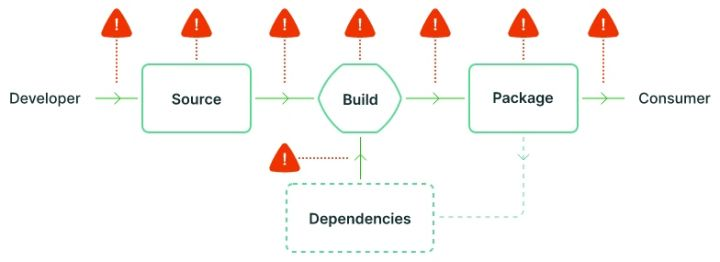
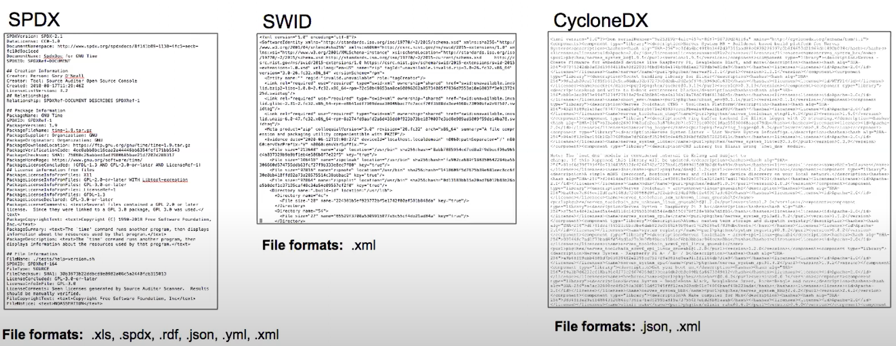
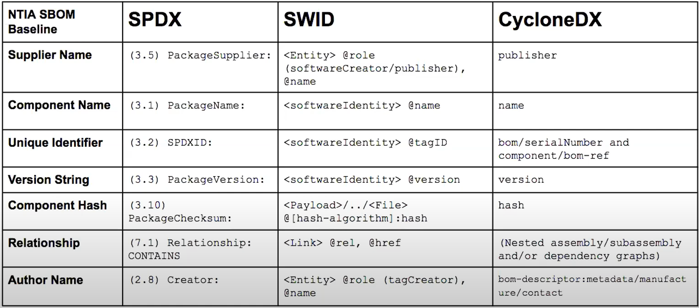

---
title: 软件供应链安全与SBOM
date: 2023-02-10 19:38:18
summary: 本文分享软件供应链安全与SBOM的相关内容。
tags:
- 软件质量
- 软件供应链安全
- 软件工程
categories:
- 软件工程
---

# 软件供应链安全

太阳风网络攻击事件、Log4j网络攻击事件等安全事件提醒我们，要重视软件供应链安全。

2021年5月12日，美总统拜登签署了“关于改善国家网络安全（EO14028）”的行政命令，其中的第4节针对“加强软件供应链安全”提出了一系列具体要求，旨在迅速改善美国软件供应链的安全性和完整性，特别是优先解决关键软件的问题。要求中大部分内容涉及标准、指南、措施的制定修订及对美联邦机构遵守和使用它们的限定。

EO14028所涉软件供应链安全标准指南主要包括五类，即关键软件的安全使用指南、软件供应链的安全开发指南、针对供应商软件的安全测试标准、包含软件物料清单(SBOM)与网络安全标识在内的安全标记标准以及面向组织供应链风险管控的综合安全管理指南。

推荐阅读：[从概念到安全实践：软件供应链基础指南](https://zhuanlan.zhihu.com/p/529478119)

# SBOM

> A software bill of materials (SBOM) is a list of components in a piece of software. Software vendors often create products by assembling open source and commercial software components. The SBOM describes the components in a product. It is analogous to a list of ingredients on food packaging: where you might consult a label to avoid foods that may cause an allergies, SBOMs can help companies avoid consumption of software that could harm their organization.
> The concept of a BOM is well-established in traditional manufacturing as part of supply chain management. A manufacturer uses a BOM to track the parts it uses to create a product. If defects are later found in a specific part, the BOM makes it easy to locate affected products.

SBOM是构建给定软件以及它们之间的供应链关系所需的组件、库和模块的完整、正式结构化列表。这些组件可以是开源的或专有的、免费的或付费的，并且可以广泛使用或限制访问。

SBOM能够为生产者、消费者和软件操作者提供可深入理解供应链的信息。SBOM的本质是一种数据文件，与漏洞管理系统联动，不仅能够帮助企业实现从核心供应商到分支供应商的任务分解，还能够及时发现产品中的安全漏洞以及攻击风险，在攻击发生时，快速发现问题并定位责任。

SBOM的优点：
1. 识别和避免已知漏洞。
2. 量化和管理许可证。
3. 确定安全和许可证合规性要求。
4. 能够量化软件包中固有的风险。
5. 管理漏洞缓解措施（包括对新漏洞进行修补和补偿控制）。
6. 由于提高了效率并减少了计划外和计划外的工作，从而降低了运营成本。

推荐阅读：[awesome-sbom](https://github.com/awesomeSBOM/awesome-sbom)

## SBOM要素内容

下面分享SBOM最基本要素内容：

| 要素类别 | 要素内容 |
|:----:|:----:|
| 数据字段 | 每个组件的文档baseline信息：供应者、组件名称、组件版本、其他唯一标识符、依赖关系、SBOM数据作者、时间戳 |
| 自动化支持 | 支持自动化，以通过自动生成和机器可读性支持跨软件生态系统的扩展 生成和使用SBOM的数据格式，如SPDX、CycloneDX、SWID标识 |
| 实践和过程 | 为将SBOM集成到安全开发生命周期操作中，定义其请求的操作、生成和使用，包含频率、深度、已知的未知情况、分发和交付、访问控制和容错 |

## SBOM数据格式

- [SPDX](https://docs.google.com/document/d/1A1jFIYihB-IyT0gv7E_KoSjLbwNGmu_wOXBs6siemXA/edit)
- [SWID](https://docs.google.com/document/d/1oebYvHcOhtMG8Uhnd5he0l_vhty7MsTjp6fYCOwUmwM/edit)
- [CycloneDX](https://docs.google.com/document/d/1biwYXrtoRc_LF7Pw10TO2TGIhlM6jwkDG23nc9M_RiE/edit)

### SPDX

十多年前，开源社区确定了对SBOM“成分列表”的需求并开始应对挑战。事实上的行业标准，也是当今使用最广泛的方法，称为软件包数据交换[SPDX](https://spdx.dev)。现在，SPDX可以解决NTIA(美国国家电信和信息管理局)提议的SBOM最低要素内容，以及更广泛的用例。

SPDX在过去十年中有机地发展以适应软件行业，涵盖许可证合规性、安全性等问题。该社区由来自数百家公司的数百人组成，标准本身是当今市场上最强大、最成熟和采用的SBOM。 索尼、英特尔、大众、Snyk和Synopsys在内的大公司已经使用SPDX。

推荐阅读：[spdx-examples](https://github.com/spdx/spdx-examples)

2021年9月9日，Linux基金会、联合开发基金会和SPDX社区宣布，SPDX规范已作为[ISO/IEC 5962:2021](https://www.iso.org/standard/81870.html)发布，并被公认为国际开放安全性、许可证合规性和其他软件供应链工件的标准。

### CycloneDX

CycloneDX是一个轻量级SBOM规范，用于软件安全上下文和供应链组件分析。它可以传达软件组件清单、外部服务及他们之间的关系。CycloneDX是一个开源的OWASP标准。该项目创建于2017年，目标是创建一个完全自动化的、以安全为中心的SBOM标准。核心工作组每年都通过基于风险的标准流程生成不可变的、向后兼容的版本。CycloneDX整合了现有规范，包括Package URL、CPE、SWID和SPDX许可证ID及表达式。CycloneDX SBOM可以表示为XML、JSON和protobuf。

CycloneDX可以捕获开源代码组件的动态特性，其源代码易获取、可修改和可再发布。该规范可以表示组件谱系，包括从任何角度描述组件谱系的祖先、后代和变体，以及其提交、补丁和使其具有唯一性的差异。

CycloneDX项目维护了一个受社区支持的列表，该列表包含了所有支持该标准或与该标准交互操作的已知开源和专有工具。
