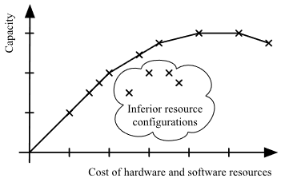
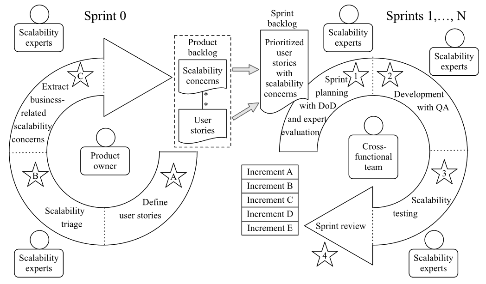
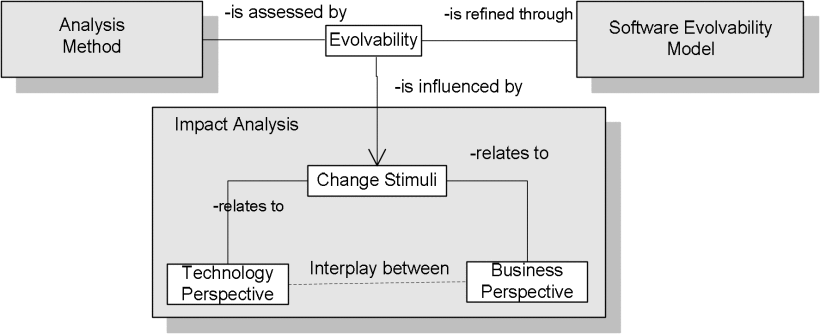
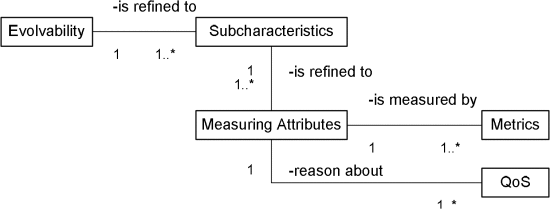

---
title: 软件可扩展性
date: 2023-02-19 23:56:32
summary: 本文分享软件可扩展性的相关内容。
tags:
- 软件质量
- 软件工程
categories:
- 软件工程
---

# 软件可扩展性

可扩展性是当系统的应用领域和设计的特征在操作范围内发生变化时，系统将质量目标满足其利益相关者可接受的水平的能力。在考虑计算机系统的可扩展性时，不仅要考虑软件，还要考虑它在上运行的基础设施(硬件)。

可扩展性也可以定义为软件通过消耗更多(硬件)资源来增加其容量的能力。对于云计算，可扩展性是云通过扩展其消费的低层服务的数量来增加其容量的能力。可扩展软件可以保持稳定，同时适应变化、​​升级、检修和资源减少。

可扩展性建立在容量和性能的基础上，但侧重于工作负载的增长。系统容量是指系统在其性能目标范围内可以处理的最大工作负载，通常以90%的响应时间限制来衡量。工作负载是工作量和负载的乘积。我们将一次操作涉及的工作量与操作频率、负载分开。每天写一次大文档会带来高工作量但低负载，而每毫秒多次读取几个字节是低工作量但高负载。

下面文章提出ScrumScale模型：Inger Anne Tøndel and Gunnar Brataas. 2022. SecureScale: Exploring Synergies between Security and Scalability in Software Development and Operation. In Proceedings of the 2022 European Interdisciplinary Cybersecurity Conference (EICC '22). Association for Computing Machinery, New York, NY, USA, 36–41. https://doi.org/10.1145/3528580.3528587

可扩展性通常是稳定性和竞争力的标志，因为它意味着网络、系统、软件或组织已准备好应对涌入的需求、提高的生产力、趋势、不断变化的需求，甚至是新竞争对手的出现或引入。

## 纵向扩展

向上扩展，也称垂直扩展，也称纵向扩展，涉及通过使用更先进或更强大的硬件来实现容量增长。磁盘空间或更快的CPU用于处理增加的工作量。

纵向扩展能比横向扩展提供更好的性能。纵向扩展将一切资源都集中在一处，允许更快的回报和更少的脆弱性。

纵向扩展的应用程序扩大规模的问题在于扩展空间有限。因为硬件越先进，它就越昂贵。
纵向扩展的应用程序实施新硬件也需要时间。

由于这些限制，纵向扩展对于需要快速增长且几乎没有通知的软件来说并不是最佳解决方案。

## 横向扩展

向外扩展，也称水平扩展，也称横向扩展，在企业用途中的应用比纵向扩展要广泛得多。

横向扩展时，软件会通过使用更多的硬件并将增加的工作负载分散到新的基础架构中来实现增长。

横向扩展的成本较低，因为额外的服务器或CPU可以是当前使用的相同类型或任何兼容类型。
横向扩展的扩展速度较快，因为无需导入或重建任何内容。

横向扩展的软件受到服务器通信速度的限制，在速度上有一定的折衷。不过，这种差异还不足以被大多数用户注意到，并且有一些工具可以帮助开发人员将影响降到最低。

因此，在构建可伸缩应用程序时，横向扩展被认为是更好的解决方案。

# 软件可演化性

对于长期存在的工业软件，生命周期成本的最大部分与软件的演进有关，以满足不断变化的需求。在这种情况下，软件的可扩展性已被认为是增加软件的战略决策、特性和经济价值的基本要素。它描述了系统在整个系统生命周期内以尽可能低的成本适应其需求变化，同时保持架构完整性的能力。

软件演进的特点是软件不可避免的变化和软件复杂性的增加，这反过来可能导致巨大的成本，除非严格考虑变化适应性。对于更改超出可维护性的长寿命系统尤其如此。系统以经济高效的方式适应各种变化的能力变得至关重要。

Software Evolvability Framework

Software Evolvability Model
