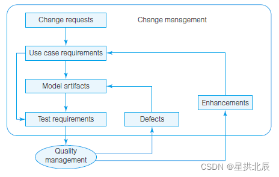
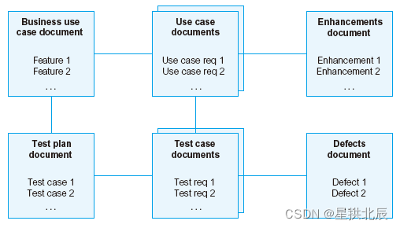

---
title: 软件可追踪性
date: 2022-03-05 19:47:55
summary: 本文分享软件变更管理与可追踪性的相关内容。
tags:
- 软件质量
- 软件工程
categories:
- 软件工程
---

# 软件变更

变更无处不在，其含义有业务维度和系统维度的阐述。
- 变更管理的业务方面更强调与新信息系统相关的变更行为和组织影响.
- 变更管理是管理软件产品和过程以及管理软件系统演化过程中的团队活动的过程，以系统合理性为目的。

质量控制需要找出需要进行修正的故障。为了得到修正，必须将这些故障提交变为变更请求，然后分配开发人员。

有些变更请求不是故障，而是改进。故障和改进都需要经历状态变化，都可能要进行排序，都有所有者，都需要追踪到它们在测试文档和用例文档中的起源。

要管理变更，就需要相应的变更请求管理工具。

在实际的生产实践中，70%的线上故障都是由变更直接导致的。想要降低线上故障次数，控制变更是核心。
- 线下验证要做好，不能跳过线下验证直接上线到生产环境。
- 要按照规定做好分级变更，即，变更正式操作生产环境时，把变更过程分成若干阶段，在每个阶段引入完整的变更检查。 最重要的步骤是小流量(灰度)，原则是当一个程序打算上线到生产环境时，需先小规模的在线上生效，观察验证一段时间（通常不少于20分钟），详细检查确认服务正常之后，再做分批次的推全。 从变更的整体流程上来看，确实会有一些bug和问题在线下环境缺乏触发场景，无法发现，但是几乎所有的问题都可以在线上小流量（灰度）阶段得到验证和拦截。
- 分批次推全。建议至少分5组完成上线。每组生效20%的实例；这样的并发度，反过来要求核心服务必须在峰值性能下留有至少20%的性能buffer。
- 避免并发过大。如果在线上一次性起停了全部实例，在服务更新的3分钟时间里面，这个服务对外是停服的。
- 变更检查应该被重视，即便做了灰度和分级，如果没有在做完灰度和分级以后仔细检查，前面所做的就形同虚设了，也可能会出现问题。
- 优先回滚，在线上变更过程中（灰度、全量环境）出现任何问题，都需要立即回滚。线上变更过程遇到问题，要克制自己查原因的冲动，优先回滚，再查原因。可以留1-2台机器保留现场，其他部分先回滚。确认服务恢复之后，问题原因可以慢慢查。
- 不要在高峰期做变更，因为：
    - 高峰期出问题之后的影响较大。
    - 高峰期变更更容易出现服务过载问题。
    - 高峰期不好协调人力。

# 软件可追踪性

可追踪性是测试与变更管理的基础，其目的是捕获、链接、追踪每一个重要的开发制品，包括需求。
可追踪性的最终目的是保证整个文件集中各种文档和模型的正确性和一致性，如从需求文档到技术文档，再到用户文档。

追踪的条目可以是文本描述或图形模型。可追踪性在这些条目之间建立了外部连接，这些连接可能是直接的或间接的。如果修改了追踪路径上的任何条目，那就可以对连接进行影响分析。

可追踪性、测试和变更管理经常与用例需求中列出的系统服务相关，而系统约束的实施也需要进行测试和管理。

可追踪性、测试和变更管理本身不是目的，不必过于强调，开发者的注意力应该集中在开发上。关注这些问题会显著增加项目成本，但不管理这些问题又会显著地增加项目的长期成本。

由于可追踪性是质量与变更管理的基础，所以应该采用成本-效益分析来确定项目追踪的范围和深度。
至少应该保证用例需求和故障之间的可追踪性，更复杂的模型还会有更复杂的可追踪性关系。

业务用例文档中列出了系统特征。测试计划文档确定了测试用例。特征与测试用例和用例文档中的用例需求连接。测试用例文档中的测试需求可以追踪到测试用例和用例需求。测试需求与故障连接，改进与用例需求连接。故障与改进之间不需要追踪。

追踪包括：
- 从系统特征到用例和用例需求
- 从测试计划到测试用例和测试需求
- 从UML图到文档和需求
- 从用例需求到测试需求
- 从测试需求到故障
- 从用例需求到改进
