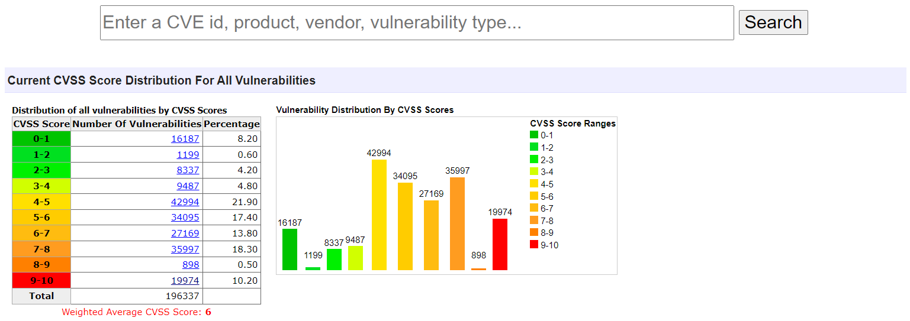
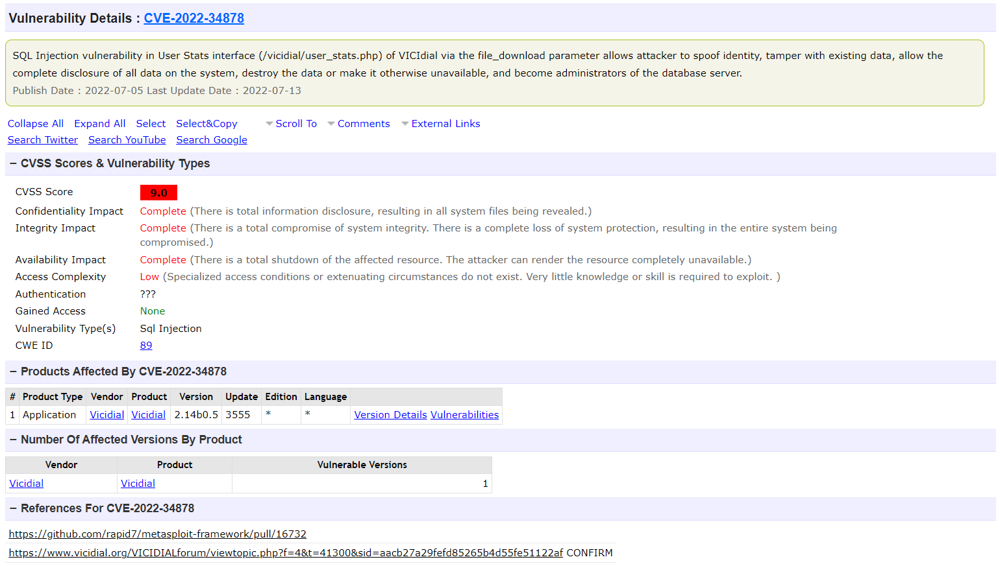

---
title: 软件安全性
date: 2023-02-18 15:45:06
summary: 本文分享软件安全性的相关内容。
tags:
- 软件质量
- 软件工程
categories:
- 软件工程
---

# 软件安全

安全是系统的一种属性，它反映了系统正常或异常运行的能力，没有造成人身伤害或死亡的危险，也没有对系统环境造成破坏。考虑软件安全性很重要，因为大多数故障严重的设备现在都包含基于软件的控制系统。

安全性和可靠性相关但又不同。可靠性与给定规范的一致性和服务交付有关。安全涉及确保系统不会造成损坏，无论它是否符合其规范。系统可靠性对于安全至关重要，但还不够。

可靠的系统可能不安全：
- 系统中的潜在故障可能多年未被发现，而且很少出现。
- 规格错误：系统可以按照指定的方式运行，但仍然会导致事故。
- 硬件故障可能会产生规范中难以预料的虚假输入。
- 在错误的时间发出正确的命令通常是操作人员错误的结果。

# 安全关键系统

在安全关键系统中，系统运行始终安全是至关重要的，即系统永远不会对人员或系统环境造成损害。

系统安全关键性可以分为两个级别：
- 主要安全关键系统：嵌入式软件系统，其故障会导致相关硬件发生故障并直接威胁到人们。
- 次级安全关键系统：其故障会导致其他系统出现故障，进而产生安全后果的系统。

软件安全术语：
- 事故(不幸)：导致人员伤亡、财产损失或环境损失的计划外事件或事件序列。
- 冒险：可能导致或促成事故的情况。
- 损害：衡量因事故造成的损失。损害的范围从许多人因事故死亡到轻伤或财产损失不等。
- 危害严重程度：对特定危害可能导致的最严重损害的评估。
- 危险概率：造成危险的事件发生的概率。
- 风险：这是衡量系统发生事故的可能性的指标。可以通过考虑危害概率、危害严重性和危害导致事故的概率来评估风险。

系统安全策略：
- 危险规避：让某些类别的危险根本不会发生。
- 危险检测和消除：在危险导致事故发生之前检测并消除危险。
- 伤害限制：支持保护功能，最大限度地减少事故可能造成的损害。

意外是不可避免的。复杂系统中的事故很少有单一原因，因为这些系统被设计为对单点故障具有弹性。几乎所有事故都是故障组合的结果，而不是单一故障。想要预测所有问题组合可能是不可能的，尤其是在软件控制系统中，因此实现完全安全是不可能的。

# 安全需求工程

安全需求工程的目标是确定保护需求，确保系统故障不会造成伤害或死亡或环境破坏。安全需求定义了永远不应发生的情况和事件。系统中应包含的检查和恢复功能，以及针对系统故障和外部攻击提供保护的功能。

危害驱动分析包括以下内容：
- 危害识别：识别可能威胁系统的危险。这些风险可能是物理故障、电气故障、生物故障、服务故障等。
- 危害评估：了解风险出现的可能性以及事故或事件发生时的潜在后果。依据可接受程度，风险可以分为无法容忍的风险(绝不能发生或导致事故)、合理可行的最低风险(必须在给定成本和进度限制的情况下将风险的可能性降至最低)、可接受的风险(风险的后果是可以接受的和不应产生额外费用来降低危险概率)。风险的可接受程度取决于人文、社会和政治方面的考虑。
- 危害评估过程：针对每个已识别的危害，评估危害概率、事故严重程度、预估风险、可接受性。
- 危害分析：关注发现特定系统中风险的根本原因。危害分析的方法可能是：
    - 归纳的、自下而上的：从建议的系统故障开始，评估该故障可能引起的危害。
    - 演绎的，自上而下的：从危险开始并推断出可能的原因。
- 降低风险：确定可靠性要求，这些要求规定了应如何管理风险并确保不会发生事故/事件。降低风险策略包括：避免危险、危险检测和消除、危害限制。

# CVE

通用漏洞披露(CVE)是一个安全项目，它由美国国土安全部资助，Mitre公司进行维护主要关注公开发布的软件漏洞。CVE使用安全内容自动化协议(SCAP)来收集有关安全漏洞和披露的信息，为它们提供唯一的标识符，并根据不同的标识符对它们进行编目。

一旦漏洞被记录下来，Mitre公司就会为其提供一个唯一的ID。在Mitre漏洞数据库公布数天后，国家漏洞数据库(NVD)会公布CVE和相应的安全分析。

每个新的CVE条目都会获得一个唯一的ID：CVE+\<YEAR\>+整数序列号，例如$CVE-2022-34878$

每个CVE都会从NVD接收一个CVSS分数，以表明其严重性。NVD的安全严重程度排名有助于响应者(包括开发人员、DevSecOps和安全团队)确定如何处理漏洞以及何时进行处理。修复资源往往是根据CVSS分数的高低进行分配的。CVSS分数遵循一个由多个安全性指标组成的公式。确定漏洞威胁程度所涉及的因素包括其攻击源头、攻击复杂性、包含漏洞的系统处理的数据的机密性、被利用的系统的完整性等等。

[www.cvedetails.com](https://www.cvedetails.com)为CVE漏洞数据提供了一个易于观察使用的Web页面。开发者可以浏览供应商、产品和版本，并查看与其相关的CVE条目、漏洞。开发者还可以查看有关供应商、产品和产品版本的统计信息。

CVE的详细信息页面示例：

