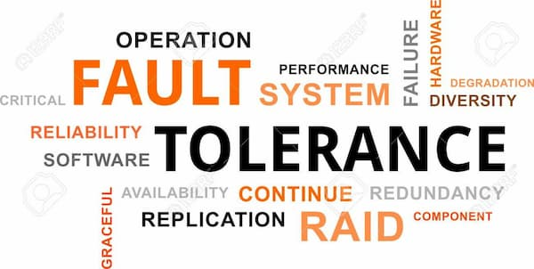
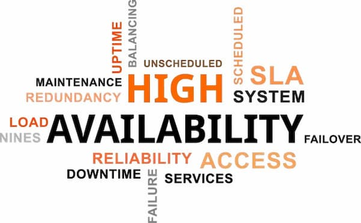

# 软件容错、高可用、灾备

标题里面的三个术语，很**容易混淆**，专业人员有时也会用错。

本文就用图片解释它们有何区别。

# 容错

容错（fault tolerance）指的是， **发生故障时，系统还能继续运行**。

飞机有四个引擎，如果一个引擎坏了，剩下三个引擎，还能继续飞，这就是"容错"。同样的，汽车的一个轮子扎破了，剩下三个轮子，也还是勉强能行驶。

容错的目的是，发生故障时，系统的运行水平可能有所下降，但是依然可用，不会完全失败。
# 高可用

高可用（high availability）指的是， **系统能够比正常时间更久地保持一定的运行水平**。

汽车的备胎就是一个高可用的例子。如果没有备胎，轮胎坏了，车就开不久了。备胎延长了汽车行驶的可用时间。

注意，高可用不是指系统不中断（那是容错能力），而是指一旦中断能够快速恢复，即中断必须是短暂的。如果需要很长时间才能恢复可用性，就不叫高可用了。上面例子中，更换备胎就必须停车，但只要装上去，就能回到行驶状态。
# 灾备

灾备（又称灾难恢复，disaster recovery）指的是， **发生灾难时恢复业务的能力**。

上图中，飞机是你的 IT 基础设施，飞行员是你的业务，飞行员弹射装置就是灾备措施。一旦飞机即将坠毁，你的基础设施就要没了，灾备可以让你的业务幸存下来。

灾备的目的就是，保存系统的核心部分。一个好的灾备方案，就是从失败的基础设施中获取企业最宝贵的数据，然后在新的基础设施上恢复它们。注意，灾备不是为了挽救基础设置，而是为了挽救业务。

# 总结

上面三个方面可以结合起来，设计一个可靠的系统。

- 容错：发生故障时，如何让系统继续运行。
- 高可用：系统中断时，如何尽快恢复。
- 灾备：系统毁灭时，如何抢救数据。

# 转载来源
[阮一峰的博客](http://www.ruanyifeng.com/blog/2019/11/fault-tolerance.html)

----------------------------

# 对上述内容的解读
## V1
容错： 降频
高可用： 重启
灾备： 重装系统

## V2
容错：异常控制
高可用：模块化、版本控制
容灾：备份、镜像

## V3
容错：必须要“可用”，允许“低可用”
高可用：必须“高可用”
容灾：“灾难发生，依然可用”

-----------------------------------

# 知乎回答

高可用是目标，容灾是实现这一目标的手段

## 可用性是什么？
可用性是一种安全属性，是信息安全三要素CIA中的A：
- 保密性（Confidentiality）
- 完整性（Intergrity）
- 可用性（Availablility）

高可用是系统的重要目标，但往往不是最重要的。例如军用系统中保密性最重要（宁可毁掉系统也不愿机密落入敌手）

商业系统中完整性最重要（宁愿服务终止，账本泄露也不容许篡改）

只不过保密性与完整性不好衡量，非常不适合拿出来吹逼。

而可用性有一个简单粗暴的衡量指标：系统能正常运行的时间占总时间的百分比。比如99%的可用性就表示系统保证在99%的时间内正常服务。

通常99.99%四个九可以称为高可用，载人航天中，这一标准是99.9999%。

## 容错是什么？	
容错是一种提高可靠性的手段。造成错误的原因叫做故障（fault），能预料并应对故障的系统特性可称为容错（fault-tolerant）或韧性（resilient）。

通常一些“小错“，硬件错误，软件错误，人为错误，忍一忍也就过去了。给出问题的用户报个错，系统还是“可用”的。毕竟好死不如赖活着。	

但某些错误 —— 灾难，是苟不了的，整个机房被水淹没，光缆挖断之类的事情。通常会直接使服务不可用。要容这种错，有必要用些诸如x地x中心复制，自动故障迁移的容灾技术。	

容灾通常就是奔着系统高可用去的。换句话说，不支持“容灾”，哪好意思管自己叫“高可用”。不过容灾总是有限度的，假设整个地球被黑洞吞没，那要容灾除非把主机托管到太空中去。而且并不是所有的情况下，容灾都是好东西的。	

面对疾病，我们有两种策略：预防与治疗。预防太费钱费事，人们通常会选择有病再治。类似的道理，比起阻止错误，我们通常更倾向于容忍错误。但也有预防胜于治疗的情况（比如不存在治疗方法时）。安全问题就属于这种情况。	

如果攻击者要希望获取军用系统中的保密数据，或者程序Bug即将破坏商业系统中的数据完整性。很多时候我们都是希望宁为玉碎不为瓦全，不要容这种错的。这种与容错背道而驰的哲学称为速死（Fail-Fast）

因此当服务商吹嘘高可用时。不要忘了看一看，这些服务的保密性怎么样？

## 转载说明
用途：分享、学习
作者：冯若航
链接：[https://www.zhihu.com/question/278172049/answer/398357428](https://www.zhihu.com/question/278172049/answer/398357428)
来源：知乎

------------------------------
# 知乎回答
在信息安全领域，高可用指的是通过各种技术手段、架构设计、软硬件实现方法，提高信息系统及系统的各个组成部分、支持组件的可用性。常见手段有：冗余的网络链路、服务器的集群等等。

举个例子，重要网络节点的硬件防火墙设备，可能会因为流量过大，造成设备处理性能急剧下降，进而显著影响整个网络的可用性。解决的思路一般是两台设备配置高可用模式。常见的高可用模式分两种，一种是主主模式，两台设备同时在线共同处理。另一种是主备模式，通过设备间的心跳机制做故障切换。

而容灾，一般特指面对自然灾害时的处理与恢复能力。在ISO27002种有专门一个Domain讲业务连续性，而ISO22301是一份专门讲业务连续性的国际标准。感兴趣可以Google标准全文仔细研究。概括来说，容灾设计一般是通过多个机房提高企业容灾能力，遇到灾害时，即使一个机房无法服务，可通过技术手段近乎无缝的将流量切换到其他机房。

有其他答案中提到了两地三中心的概念，这在前几年的金融业是非常主流的一种说法。在有关业务连续性的指南中也有要求，灾备机房应距离主机房XX千米以外。同城灾备、异地灾备应该如何设计，都是有要求的。不过最近国内的大型互联网企业已经逐渐淡化两地三中心的概念，并非是抛弃灾备设计，而是转而将以前的灾备机房的地位逐步提高，通过复杂的网络设计实现了多机房并行处理业务。

无论技术如何发展，企业面对地震、火灾等自然灾害时的应对能力、连续服务保障能力，都是业务连续性管理的重中之重。

