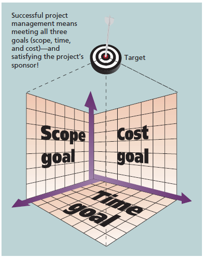

---
title: 软件时效性
date: 2023-02-20 00:43:17
summary: 本文分享软件时效性和软件响应性的相关内容。
tags:
- 软件质量
- 软件工程
categories:
- 软件工程
---

# 软件时效性

软件时效性(timeliness)是对信息的可访问性和可用性的时间期望。时效性可以衡量为从预期信息到可以随时使用信息之间的时间。

# 软件响应性

软件响应性设计涉及软件产品响应用户输入、外部界面刺激或与软件元素交互的及时性。开发者必须评估软件结构设计以确定是否可以增强设计以提高软件产品对请求操作的响应能力。

有研究者提供了以下指导方针来解决增强软件对基于用户的请求的响应：
- 提供有关所请求操作的及时反馈：
    - 及时确认用户输入。
    - 为花费大量时间的操作提供数据处理进度指示器。
    - 最初通过提供最重要的信息来响应，然后在可用时披露其他信息。
    - 提醒用户响应复杂请求所需的预期延迟。
- 确定数据处理操作的优先级：
    - 推迟低优先级的数据处理操作，直到计算资源可用。
    - 预测数据处理需求并尽可能提前执行操作。
- 优化任务队列积压：
    - 根据优先级重新排序任务队列。
    - 刷新被事件取代或可能不再需要的任务。
- 多任务绩效监督：
    - 监控多任务处理进度并调整资源分配以优化任务执行和终止。
    - 平衡任务持续时间和资源承诺。
    - 预测任务持续时间并确定任务的离散性、并发性和同步策略。
    - 通过预测资源冲突和僵局情况，建立资源监控和调解监督程序。

# 数据时效性

在数据进入数据库之前确保数据质量(准确性和时效性)比在数据存储之后要容易得多。想要让数据更好地发挥作用，数据库中的数据必须准确、及时并且在需要时可用。

主要的数据质量问题是数据缺失、数据错误、数据难理解、数据不一致。数据缺失的原因可能是数据未能输入到数据库中，也可能是误删数据库中的数据。数据错误可能是最难检测和预防的问题。与数据错误不同，发现难以理解的数据相对容易，尽管发现数据的真实含义可能与发现错误的数据一样困难。

# 嵌入式软件时效性

软件时效性，即满足时序约束的能力，在嵌入式软件系统中起着至关重要的作用。时序约束用于指定系统操作的周期，这是实时系统的典型要求，或者用于指定系统响应时间，这是嵌入式系统提供安全关键功能时的必要条件。

尽管嵌入式系统旨在确保其操作在预先指定的时序约束内工作，但软件工程师提供的大多数时序规范都具有不确定性。

软件规范中的时间不确定性可能由多种原因造成，包括设计选择。这种设计选择的一个常见示例是以特定频率轮询传感器。这种情况在嵌入式系统中很常见，因为许多现实世界的事件只能通过在控制循环中轮询环境来检测，因此无法准确确定系统何时能够观察和处理它们。时间不确定性可能反过来导致非确定性系统行为，这使得测试预言机的定义具有挑战性。

# 操作系统实时性

当对处理器操作或数据流动有严格时间要求时，就需要使用实时系统，因此，它常用于控制特定应用的设备。

实时系统有明确和固定的时间约束。处理必须在确定的时间约束内完成，否则系统会失败。一个实时系统只有在其时间约束内返回正确结果才是正确工作。

实时系统有硬实时系统和软实时系统两种类型。

硬实时系统保证关键任务按时完成，要求对系统内所有延迟都有限制。与分时系统矛盾，因此没有一个现代通用操作系统支持硬实时功能。
通常只有少量或根本没有使用任何类型的辅助存储器，数据通常存在短期存储器或ROM中。

软实时系统限制较弱，关键实时任务的优先级要高于其他任务的优先级，且在完成之前能保证其高优先级。需要限制操作系统内核的延迟。
软实时系统可应用与一些其他领域，如多媒体、虚拟现实和高级科学研究项目。这些系统需要高级操作系统功能。

# 软件项目管理时间约束

每个项目都会在不同程度上受到范围目标、时间目标和成本目标的约束，这些限制条件在项目管理中被称为三项约束。

如上图所示，建立了一个坐标轴为范围目标、成本目标和时间目标的空间直角坐标系，项目的目标在空间中有对应的范围目标、成本目标和时间目标映射。

成功的项目管理意味着约束条件应该得到满足。

项目经理必须综合考虑三项约束，事实上这三项约束往往还存在冲突，需要取舍和权衡。
有经验的项目经理往往会判断出当前项目中三项约束中更为重要的是什么，并做好取舍和权衡。
