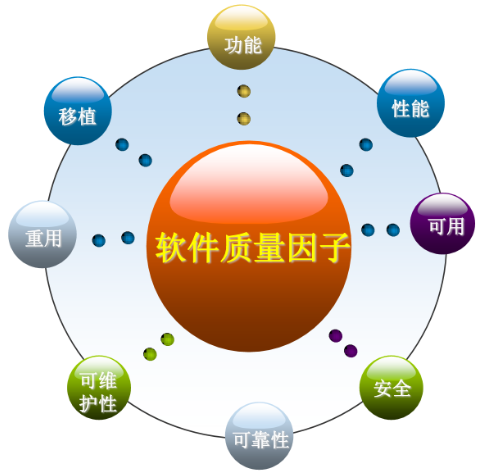

---
title: 软件质量
date: 2021-03-23 11:09:12
summary: 本文分享软件质量的相关内容。
mathjax: true
tags:
- 软件质量
- 软件工程
categories:
- 软件工程
---

# 软件质量

[ISO](https://blankspace.blog.csdn.net/article/details/115015142)对**质量**的定义是：
- 反映实体满足明确和隐含需求的能力特性总和。
- 一组固有特性满足要求的程度。

**软件质量**是反映一个软件产品或服务满足明确和隐含需要的能力的程度，不同的团队可能会根据上下文使用不同的定义。

从客户的角度，高质量的软件意味着满足要求和适用；从生产者的角度，高质量的软件意味着以最经济的手段制造出市场上最有用的产品。

软件质量在很大程度上取决于代码的质量。代码质量很重要，因为它会影响整体软件质量。质量会影响代码库的安全、可靠和可靠程度。软件的高质量对于当今的许多开发团队来说至关重要，对于那些开发安全关键系统的人来说尤其重要。

尽管软件质量与软件测试息息相关，但软件质量并非仅由测试小组负责。

软件需求是衡量软件质量的基础。针对不同项目，所要求的的软件质量的重要性各不相同，这些质量有助于实现软件产品满足的功能性需求。

质量特性为质量因素提供了更完全、更具体的定义，有助于说明个质量因素之间的关系，方便了质量检查和质量定量观测，使我们能准确地确定质量观测的范围。



常见的质量属性：
- [性能](https://blankspace.blog.csdn.net/article/details/115145525) (Performance)
- [可靠性](https://blankspace.blog.csdn.net/article/details/129058539) (Reliability)
    - [独立性](https://blankspace.blog.csdn.net/article/details/114685284) (Independence)
    - [准确性](https://blankspace.blog.csdn.net/article/details/123453455) (Correctness)
    - [完整性](https://blankspace.blog.csdn.net/article/details/129083574) (Integrity)
    - [健壮性](https://blankspace.blog.csdn.net/article/details/128983427) (Robustness)
    - [一致性](https://blankspace.blog.csdn.net/article/details/129089328) (Consistency)
- [安全性](https://blankspace.blog.csdn.net/article/details/129089277) (Safety)
- [可用性](https://blankspace.blog.csdn.net/article/details/104633041) (Usability)
- [可支持性/适应性](https://blankspace.blog.csdn.net/article/details/113961269) (Supportability/Adaptiveness)
    - [可理解性](https://blankspace.blog.csdn.net/article/details/129105377) (Understandability)
    - [可维护性](https://blankspace.blog.csdn.net/article/details/103163747) (Maintainability)
    - [可伸缩性/可扩展性](https://blankspace.blog.csdn.net/article/details/129107093) (Scalability/Evolvability)
- [可复用性](https://blankspace.blog.csdn.net/article/details/123469131) (Reusability)
- [可移植性](https://blankspace.blog.csdn.net/article/details/123458729) (Portability)
- [互操作性](https://blankspace.blog.csdn.net/article/details/129017866) (Interoperability)
- [生产能力](https://blankspace.blog.csdn.net/article/details/129032679) (Productivity)
- [时效性](https://blankspace.blog.csdn.net/article/details/129107094) (Timeliness)
- [可观察性](https://blankspace.blog.csdn.net/article/details/128983816) (Visibility)
- [可测试性](https://blankspace.blog.csdn.net/article/details/114981689) (Testability)

|质量特性因子 |含义| 说明|
|--|--|--|
| [功能性](https://blankspace.blog.csdn.net/article/details/114068063) |软件所实现的功能能达到它的设<br/>计规范和满足用户需求的程度|任何类型的软件,功能特性都是<br/>不可缺少的重要指标|
| [性能](https://blankspace.blog.csdn.net/article/details/115145525) |在规定条件下,实现软件功能所需<br/>的响应时间和计算机资源(CPU、<br/>内存、磁盘空间和数据吞吐量)的<br/>使用程度|性能性经常称为“效率”|
| [可靠性](https://blankspace.blog.csdn.net/article/details/129058539) |在满足一定条件的应用环境中，<br/>软件能够正常维持其工作的能力，<br/>在出现一些错误操作时，软件可<br/>以具有容错性，如果软件意外退<br/>出，重新启动后可以恢复最近的<br/>软件数据|某些关系到生命财产安全的特<br/>定领域的软件，例如航天、金<br/>融等系统的软件，可靠性是重<br/>要的指标|
| [安全性](https://blankspace.blog.csdn.net/article/details/129089277) |为了防止意外或人为的破坏，软<br/>件应具备的自身保护能力|对于军用软件和国家机密软件，<br/>软件安全性非常重要|
| [可用性](https://blankspace.blog.csdn.net/article/details/104633041) |用户在理解、学习和操作软件的<br/>过程中的付出的努力的难易程度|办公软件、应用系统|
| [可维护性](https://blankspace.blog.csdn.net/article/details/103163747) |软件在运行维护过程中，如果出<br/>现了运行故障或者扩展新功能，<br/>软件系统是否具有可分析性和良<br/>好的扩展性，重新设计后的软件<br/>的稳定性和可测试性|可把软件的维护性细分为“可维<br/>护性”和“可扩展性”|
| [可移植性](https://blankspace.blog.csdn.net/article/details/123458729) |软件从现有运行平台向另一个运<br/>行平台过度的适应程度和平台可<br/>替换性|旧系统升级改造，需要跨不同操<br/>作系统时，此特性重点关注|
| [可复用性](https://blankspace.blog.csdn.net/article/details/123469131) |整个软件或其中一部分能作为软<br/>件包而被再利用的程度|重用性高的软件设计，可以大大<br/>降低开发成本，提高软件的稳定<br/>性|

# 软件质量控制和软件质量保证

[软件质量控制和软件质量保证](https://blankspace.blog.csdn.net/article/details/115059962)都是至关重要的，要区别清楚。

质量控制为保证行动提供了一种手段，以控制和衡量项目、过程或设施的特征，以满足既定的要求。

质量保证为使项目或项目符合既定的技术要求提供充分的信心所必需的所有行动的计划和系统模式。

确认(verification)是保证软件符合说明书的过程；验证(validation)是保证软件满足用户要求的过程。

开发者可以通过以下方式提高软件质量：
- 应用编码标准。编码标准确保每个人都使用正确的风格，它提高了代码库的一致性和可读性。这是降低复杂性和提高质量的关键。
- 自动分析代码。开发者始终应该把质量放在首位，最好是在代码审查开始之前就分析代码质量。
- 遵循编码最佳实践。
- 重构遗留代码。提高现有代码库质量的一种方法是通过重构，重构遗留代码可以帮助开发者清理代码库并降低其复杂性。

# 软件质量管理

软件质量管理属于软件项目管理的一个重要知识域，和项目综合管理并行执行，存在于计划、执行、监控三个项目管理过程组。

项目质量管理的目的是确保项目满足它所应满足的需求，项目管理工作致力于满足或超越干系人的需求和期望。

项目质量管理非常重要。如果干系人对项目管理或项目产品质量不满意，则项目组需要对范围、时间和成本做出调整以满足干系人的需要和期望。

软件质量管理包含三个过程：
- 计划质量管理
- 实施质量保证
- 质量控制：[软件质量控制的一些工具和技术](https://blankspace.blog.csdn.net/article/details/123437454)

# 软件质量的度量

## 圈复杂度

软件质量最重要的指标之一是圈复杂度(CYC)，它指的是代码的复杂程度。

圈复杂度是用于确定程序复杂度的软件指标。圈复杂度是源代码中决策数量的统计。圈复杂度越高，代码越复杂。复杂度高的代码很难测试。而且很可能会导致错误。

圈复杂度可以用于限制代码的复杂性，也可以用于确定所需测试用例的数量。

计算圈复杂度的公式：$CYC=E-N+2P$，$P$是流程图中断开连接的部分的数量（例如调用程序和子例程），$E$是边数（控制转移），$N$是节点数（仅包含一次控制转移的顺序语句组）。

圈复杂度等于逻辑运算符的数量，等同于决策数$+1$。

```c
void foo(int a, int b)
{
    int x;
    if (a && b)
    {
        x = 1;
    }
    else
    {
        x = 2;
    }
}
```

上面的代码段$CYC=2$。

```c
void foo(int a, int b)
{
    int x;
    if (a)
    {
        if (b)
        {
            x = 1;
        }
    }
    else
    {
        x = 2;
    }
}
```

上面的代码段$CYC=3$。

# 软件质量成本

软件质量成本包含一致成本和不一致成本。
- 一致成本：交付满足要求的和适用的产品。
- 不一致成本：对故障或没有满足质量期望负责。

与软件质量相关的主要成本如下：
- 预防成本：计划和实施一个项目使项目无差错或使差错保持在一个可接受范围内的行为的成本。
    - 预防性行为，如培训、有关质量的详细研究、对供应商和分包商的质量调查等行为引起的成本都属于预防性成本。
    - 系统开发早期发现的信息系统的缺陷要比在开发后期更有价值。
- 评估成本：评估过程及其输出所发生的成本，其目的在于确保一个项目无差错或使差错保持在一个可接受的范围内。
    - 产品检查和测试、检查和测试设备的维护、处理和报告测试数据等行为都形成质量评估成本。
- 内部故障成本：在客户收到产品之前，纠正已识别出的一个缺陷所引起的成本。
    - 废料和返工成本、延期付款发生的成本、由于产品缺陷而直接导致的存货成本、为纠正设计错误而引起的设计变更成本、生产废品成本和更正文件的成本都属于内部故障成本。
- 外部故障成本：在产品交付给用户之前，纠正已识别出的一个缺陷所引起的成本。
    - 担保、区域服务人员的培训、产品责任讼案、客户抱怨处理和未来商务机会的丧失所引发的成本都属于外部故障成本。
- 测量与测试设备成本：为执行预防和评估活动而购置的设备所占用的资金成本。
