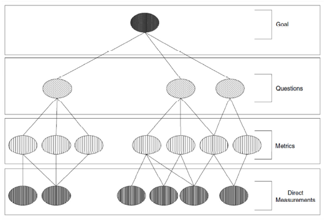
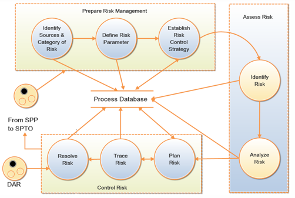
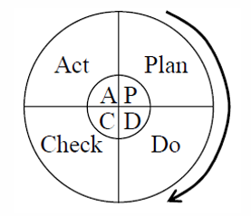
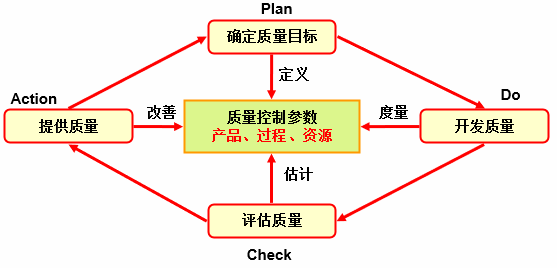

---
title: 软件质量控制与软件质量保证
date: 2021-03-22 01:31:04
summary: 本文分享软件质量控制SQC与软件质量保证SQA的相关内容。
tags:
- 软件质量
- 软件测试
- 软件工程
categories:
- 软件工程
---

# 软件质量控制SQC

质量控制为保证行动提供了一种手段，以控制和衡量项目、过程或设施的特征，以满足既定的要求。

维持产品或服务质量以满足特定需求的操作技术和活动，也使用这些技术和活动。

质量控制活动是以工作产品为导向的。
质量控制人员测量产品，发现不足之处，并提出改进建议。这些活动的直接结果是对产品的更改。这种更改，可以是单行代码的改变，也可以是产品从设计到重新设计。
质量控制人员将评估产品，发现弱点并提出改进建议。

测试和评审是QC活动的例子，因为它们通常导致对产品的更改，而不是过程。

QC活动通常是QA活动的起点。

SQC模型和技术主要包括：
- GQM

- RM

- PDCA

- TSQC

- ……

# 软件质量保证SQA

质量保证为使项目或项目符合既定的技术要求提供充分的信心所必需的所有行动的计划和系统模式。

出于法律责任、成本效益、客户需求，我们需要关注质量保证。

质量保证活动是面向工作过程的。
质量保证人员测量过程，发现不足之处，并提出改进建议。这些活动的直接结果是对过程的更改，这些更改的范围从更好地遵从流程到全新的流程。
质量控制活动的输出通常是质量保证活动的输入。

SQA包括：
- 审查和审计软件产品和活动，以验证它们是否符合适用的程序和标准。
- 向经理和软件项目团队成员提供这些审查和审核的结果。

SQA活动主要包含：
- Verification(验证) & Validation(确认)
- Test(测试)
- Review(审查)
- Audit(审计)
- Inspection(检查)

SQA的积极影响：
- 提高客户满意度
- 降低开发成本
- 降低维护成本

# SQC和SQA的对比

简而言之，QA相当于管理部门做的事情，QC相当于检测部门做的事情，QA抓的是整个过程，QC抓的是最后的结果。

QA是主动的，QC是被动的。

QA是策略级的，QC是战术级的甚至是操作级的。
