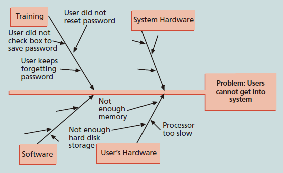
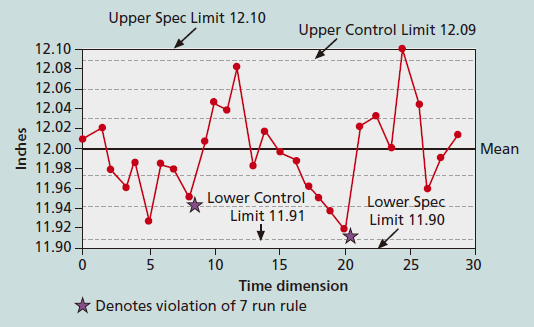
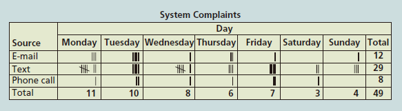
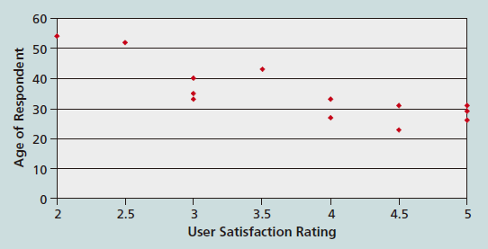
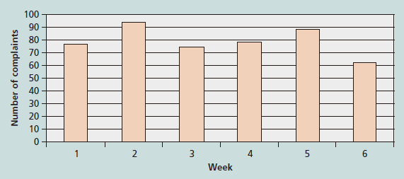
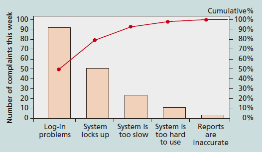
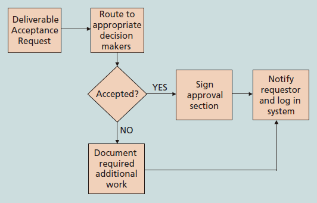

---
title: 软件质量控制的工具和技术
date: 2022-03-12 02:06:43
summary: 本文分享几种软件质量控制的工具和技术。
tags:
- 软件质量
- 软件工程
categories:
- 软件工程
---

# 质量控制

[质量控制](https://blankspace.blog.csdn.net/article/details/115059962)(QC)为保证行动提供了一种手段，以控制和衡量项目、过程或设施的特征，以满足既定的要求。

质量控制的一个主要目标是提高质量，但这个过程的主要输出是验收决策、返工和过程调整。

验收决策是指确定作为项目的一部分而生产的产品或服务是否通过验收的决策。

返工是指为使拒收的项目达到和满足产品需求、规范和干系人的其他期望而采取的行动。

过程调整是指根据质量控制的度量结果，纠正或防止进一步的质量问题而做的调整。

# 质量控制的工具

- 因果图(鱼骨图/石川图)：将关于质量问题而抱怨追溯至负有责任的生产运营环节的图。

- 控制图：表示一个过程随时间变化的结果的图。

- 检查表：用于收集和分析数据。

- 散点图：用来显示两个变量的相关性。

- 直方图：变量分布的条形图。

- 帕累托图：描述的变量按发生的频度排列的柱状图，可以帮助识别问题领域并进行排序。

- [流程图](https://blankspace.blog.csdn.net/article/details/123133432)：显示过程逻辑和流程的图形，帮助分析问题如何发生以及如何改善。

# 质量控制的技术

- [统计抽样](https://blankspace.blog.csdn.net/article/details/114263947)：选择感兴趣总体中的部分进行检查，$样本大小=\frac{(\frac{可信度因子}{可接受误差})^{2}}{4}$。
- 六西格玛
    - DMAIC改进过程
        - 界定Define：界定问题、机会、流程和客户需求。
        - 度量Measure：界定度量范围，然后收集、汇编和呈现数据。
        - 分析Analyse：仔细观察流程细节来发现改进机会。
        - 改进Improve：产生改善问题的解决方案和思路。
        - 控制Control：跟踪和检验所做的改进和可预测性解决方案的稳定性。
    - 六σ法则
        - 全组织参与。
        - 遵循“带”级制度（参考跆拳道）。
        - 有能力和意愿同时采纳两个表面上看似相反的目标。
        - 是一门以客户为中心，为消除浪费、提高质量水平、改善各个层次上的财务状况而努力的哲学。
    - 遵循正态分布，合格率99.9999998%。
- [软件测试](https://blog.csdn.net/weixin_43896318/category_9747018.html)
