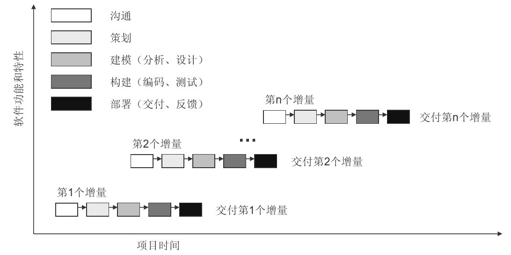

# 软件工程

## 软件

你知道什么是软件吗？

**软件（IEEE）**：计算机程序、规程，以及与运行计算机系统可能需要的相关文档和数据。

- **计算机程序**：计算机设备可接受的一系列指令和说明，它用 来让计算机执行一个运算或操作。
- **计算机数据**：事实、概念或指令的一种结构化表示，能够被计算机设备所接受、理解或处理。数据可以是外部的（以计算机可读形式存在）或内置在计算机设备中。
- **计算机程序文档**：包括计算机程序列表和可读的打印输出物 ，包括需求、设计、和其他有关的计算机程序细节，以及使用和维护程序的说明。

## 软件的特点

- 软件是**设计开发**的，而不是传统意义上生产制造的。
- 软件不会磨损，而会**退化**。
- 软件是根据实际的客户**需求**定制的。

## 软件分类

- **系统软件**：一套服务于其他程序的程序。
- **应用软件**：一些可以满足特定业务需要的独立应用程序。
- **工程/科学软件**：聚焦在科学和工程领域的应用软件。
- **嵌入式软件**：存在于某个产品或者系统中，可实现和控制面向最终使用者 和系统本身的特性和功能。
- **产品线软件**：为多个不同用户的使用提供特定功能，关注有限的特定市场 或者大众消费品市场。
- **Web应用软件**：基于Web应用的应用软件。
- **人工智能软件**：利用非数值算法解决计算和直接分析无法解决的复杂问题。

## 软件工程

### 软件过程

**软件过程 (IEEE）**：将系统化、规范的、可量化的方法应用于软件的开发、运行和维护，即将工程化方法应用于软件。

### 软件工程是一种层次化技术

- **质量关注点**：软件工程的**根基**，任何工程方法必须以组织对质量的承诺为基础。
- **过程**：软件工程的**基础**，定义了一个框架，将各个技术层次结合在一起，并实施合理地、及时地开发计算机软件，建立了一个环境以便于技术方法的采用、工作产品的产生、里程碑的建立、质量的保证等。
- **方法**：为建造软件提供**技术上的解决方法**。
- **工具**：为过程和方法提供自动化和半自动化的支持，即软件开发的**支撑系统**。

# 过程综述

## 过程和软件过程

### 过程和软件过程

**过程**：过程是一组为达成某一确定目标而执行的一系列活动、包 括工具、方法、资源和人。
**软件过程**：软件开发中所遵循的过程称为软件过程。

### 过程与质量

- 过程是质量三角的一个顶点，通常也被看作是其他两个方面的“粘合剂 ” 。
- 产品的高质量依赖于过程的高质量，过程、人、技术是产品的成本、进度、质量的决定性因素。

**85%的问题源于系统而非人！**

## 过程框架

### 过程框架

过程框架定义了若干小的框架活动，为完整的软件开发过程建立了基础。过程框架还包含一些适用于各个软件过程的普适性活动。
框架中每一个活动都是由一组软件工程动作组成的，每一个软件工程动作都由若干个任务集构成。

普适性活动贯穿整个软件过程，主要关注于项目管理、跟踪和控制，包括：
- 软件项目跟踪和协调
- 风险管理
- 技术评审
- 度量
- 软件配置管理
- 可复用管理
- 工作产品的准备和生产

对软件过程的适应性调整，是软件项目成功的关键。

### 通用过程框架

五个基本框架活动：
- 沟通：包含了与客户（共利益者）之间大量的交流和协作，还包括需求获 取以及其他相关活动。
- 策划：为后续的软件工程工作制定计划，描述了需要执行的技术任务，可 能的风险，资源需求，工作产品和工作进度计划。
- 建模：包括创建模型和设计两方面，创建模型有助于客户和开发人员更好 地理解软件需求；设计可以实现需求。
- 构建：包括编码和测试。
- 部署：软件交付到用户，用户对其进行评测并给出反馈意见。

### 任务集

任务集由**工作任务**、**工作产品**、**质量保证点**、**项目里程碑**组成。
- 小型项目[获取需求]： 
  1. 制定一个项目的共利益者列表
  2. 邀请所有共利益者参加一个非正式会议
  3. 咨询所有共利益者对于软件特征和功能的需求
  4. 讨论需求，并确定最终的需求列表
  5. 划定需求优先级
  6. 把不确定的地方标出来
- 大型项目[获取需求]：
  1. 制定一个项目的共利益者列表
  2. 和共利益者每个成员分别单独讨论，获取所有的要求
  3. 建立初步的软件特征和功能的需求
  4. 安排一系列促进需求获取的会议
  5. 举行一系列会议
  6. 在每次会议上建立非正式的用户场景
  7. 根据共利益者的反馈，进一步细化用户场景
  8. 建立一个修正的需求列表
  9. 使用质量功能部署技术将需求划分优先级
  10. 讨论系统的验证方法

## 过程模式

### 过程模式

- **模式名称**：该模式在软件过程中的功能
- **目的**：模式的目的
- **类型**：
  - **任务模式**：定义过程中软件工程动作或工作任务，以保证成功执行软件工程实践
  - **步骤模式**：定义过程的框架活动，包含很多任务
  - **阶段模式**：定义在过程中发生的框架活动序列
- **启动条件**：模式应用的前提条件
- **问题**：模式将要解决的问题
- **解决办法**：模式的实现
- **结束条件**：模式成功执行之后的结果
- **相关模式**：该模式相关的其他模式
- **已知应用实例**：该模式应用的具体实例

### 过程模式举例

当利益共同体对工作成果有大致的想法，但对具体的软件需求不确认时，下述简化的过程模 式描述了可采用的方法。

- **模式名称**：原型开发
- **目的**：构造一个便于利益共同体反复评估的模型（原型），以便识别和确定软件需求。
- **类型**：阶段模式
- **启动条件**：在模式启动之前必须满足以下四个条件
（1）确定共利益者；
（2）已经建立起共利益者和软件开发队伍之间的沟通方式；
（3）共利益者确定了需要解决的主要问题；
（4）对项目范围、基本业务需求和项目约束条件有了初步了解。
- **问题**：需求模糊或者不存在，但都清楚地认识到项目存在的问题，且该问题必须通过软件解决。共利益者不确认他们想要什么，即他们无法详细描述软件需求。
- **解决办法**：描述了原型开发过程。
**结束条件**：共利益者已经开发了一个软件原型，识别了基本的需求。随后，可能有两种结果 
（1）原型系统可以通过一系列的增量开发成为软件产品
（2）原型系统被抛弃，采用其他过程模式建立了软件产品。
- **相关模式**：客户沟通、迭代设计、迭代开发、客户评估、需求抽取。
- **已知应用实例**：当需求不确定时，推荐原型开发方法。

## 过程评估

### 过程评估方法

- 用于过程改进的标准CMMI评估方法：提供了五步的过程评估模型，包括启动、诊断、建立、执行和学习 。
- 软件ISO 9001：2000：这是一个通用标准，任何开发组织如果希望提高所提供的产品、系统或服务的整体质量，都可采用这个标准。因此，该标准可直接应用于软件组织和公司。
- SPICE(ISO/IEC 15504)：该标准定义了软件过程评估计的一系列要求。该标准的目的是帮助软件开发组织建立客观的评价体系，以评估定义的软件过程的有效性。

### ISO 9001:2000 

采用“**计划-实施-检查-行动**”循环，将其应用于软件项目的质量管理环节。

### PDCA模型（阶段性、持续性）

### CMMI

是一个全面的过程模型，描述了成熟软件过程应该具备的特定目标、实践和能力，并根据能力水平评定为以下几级：

|Category |Process Areas|
|--|--|
|过程管理类|组织过程聚焦、组织过程定义、组织培训、 组织过程性能、组织革新和部署|
|项目管理类|项目策划、项目监督和控制、供方协定管理、 集成项目管理、风险管理、定量项目管理|
|工程化类|需求管理、需求开发、技术解决、产品集成、 验证、确认|
|支持类|配置管理、过程和产品质量保证、测量与分析、 原因分析和决定、决策分析和决定|

## CMMI与ISO9001的不同点

ISO9001和CMMI的共同点是二者都强调了软件产品的质量。所不同的是，ISO9001强调的是衡量的准则，例如应该做什么、什么算好、什么算不好，却没有告诉软件开发人员如何达到好的目标，如何避免差错。
CMMI则提供了一整套较为完善的软件研发项目管理的方法。

### CMMI优劣评估

主旨普遍接受，但当构建大型系统时（几百人参加需要几年 完成），部分详细需求应慎重考虑。

# 过程模型

## 瀑布模型

瀑布模型又称为**经典生命周期**。 
它提供了一个系统的、顺序的线性软件开发方法。从用户需求规格说明开始，通过策划、建模、构建和部署的过程，最终提供一个完整的软件并提供持续的技术支持。

**应用实践**： 
- 对一个已有系统进行明确定义的适应性调整或增强
- 需求准确定义和相对稳定的新的开发项目；

**优势**： 项目管理线性，相对简单
**不足**：
- 实际项目很少遵守瀑布模型，随着项目的进度，变更可能带来混乱
- 客户难以清楚地描述所有的需求，而瀑布模型却要求明确需求，因此，很难适应许多项目的不确定性
- 项目接近尾声才能拿到可执行程序，客户需要耐心，如果有重大缺陷没有发现，损失惨重。

## 增量过程模型

增量模型是以增量的形式生产软件产品的过程模型。

应用实践： 在许多情况下，初始的软件需求有明确的定义，但是整个开发过程却不宜单纯运用线性模型。同时，可能迫切需要为用户迅速提供一套功能有限的软件产品，然后在后续版本中再细化和拓展功能。

分类：
- 增量模型
- RAD模型

### 增量模型

增量模型发布一系列称为增量的版本，随着每个版本交付，逐步为 用户提供更多的功能。以迭代的方式运用瀑布模型。

应用实践：
- 初始阶段需求很明确，同时，迫切需要为用户提供一套功能有限的软件产品，然后在后续版本中再细化和拓展功能。
- 客户要求在一个不可能完成的时间提交产品。
- 在项目既定的商业要求期限之前不可能找到足够的开发人员。

优点：
- 规避人员和技术风险。
- 每个增量版本为用户评价提供了一个平台，有利于满足客户需求。

### RAD模型

快速应用程序开发模型（Rapid Application Development）是一 种侧重于短暂的开发周期的增量软件过程模型。

应用实践： 每个主要功能都能在3个月内完成，适合采用RAD模型。

优点： 可以使开发团队在一段非常短的时间内创造出 “全功能系统”。

不足：
- 对于大型可伸缩项目，需要大量的人力资源来构建多个相对独立的 RAD团队。
- 如果开发者和客户没有为短时间内急速完成整个系统作好准备，RAD 项目将会失败。
- 如果一个系统不能合理模块化，RAD组件建立会有问题。

## 演化过程模型 

演化模型是迭代的过程模型。

应用实践： 在开发过程中，业务和产品需求经常发生变化，同时严格的交付时间使得开发团队不可能圆满完成软件产品，但是必须交付功能有限的版本以应对竞争或商业压力；很好的理解了核心产品和系统需求，但是产品或者系统扩展的细节问题却没有定义。

分类： 
- 原型开发
- 螺旋开发

### 原型开发

原型开发提供了定义软件需求的一种机制。

应用场景：当需求很模糊的时候，原型开发帮助软件工程师和客户更好的理解究竟需求是什么。

不足：
- 客户看到了产品，容易希望在这个原型上完善。
- 含有很多不合适的技术和方法。

### 螺旋开发

螺旋模型结合了原型的迭代性质和瀑布模型的系统性和可控性。具有快速开发越来越完善软件版本的潜力 。第一圈开发出产品的规格说明、开发原型系统，并在每次迭代时，逐步完善，开发出不同的版本。

应用场景：
- 能应用到开发的整个生命周期，从 概念开发到维护
- 开发大型系统和软件的方法

不足： 很难说服客户演化的方法是可控的

## 专用过程模型

专用过程模型应用面较窄，只适用于某些特定的软件工程方法：
- **基于组件的开发（复用）**：强调组件复用和组装。由厂家作为产品供应，提供软件组件，在构建软件时使用。这些组件通过良好定义的接口提供特定的功能，能够集成到软件中。
- **形式化方法模型**：提倡采用数学的方法进行软件开发和验证。主要活动是生成计算机软件形式化的数学规格说明。形式化方法使软件工程师可以应用严格的数学符号说明、开发和验证基于计算机的系统。
- **面向方面的软件开发**：解决跨整个软件体系架构的横切关注点。方面包括：用户接口、协同工作、发布、持续性、存储器管理、事物处理、安全、完整性等。

## 统一过程模型

统一过程模型（Unified Process Model）是一种“以用例驱动，以体系结构为核心，迭代和增量”的软件过程框架，由UML(Unified Modeling Language)方法和工具支持。应用在面象对象项目中。
这是一种增量模型，定义了五个阶段：
1. 起始阶段：包括用户沟通和计划，强调定义和细化用例，并将其作为 主要模型。
2. 细化阶段：包括用户沟通和建模活动，重点是创建分析和设计模型， 强调类的定义和体系结构的表示。
3. 构建阶段：细化设计模型，并将设计模型转化为软件组件实现。
4. 转化阶段：将软件从开发人员传递给最终用户，并由用户完成测试和 验收测试。
5. 生产阶段：持续地监控软件的运行、并提供技术支持。

## 极限编程模型

极限编程(XP)是在一种颇有争议的软件开发方法。其第一步是软件开发小组确定客户希望产品支持的各种特性。对于每个特性，开发小组向客户通报实现这个特性所需要的时间和花费。

客户使用成本-效益分析法选择每个后续的组件所包含的特性，根据开发小组提供的时间、成本估算和该特性给客户带来的潜在收益来进行选择。提议的组件分成更小的部分，称为任务。

一个程序员首先制定出任务的测试用例，采用TDD，然后两个程序员在一台计算机前工作（结对编程），实现任务，确保全部测试用例正确工作。两个程序员每15\~20分钟交替操作键盘，不进行键盘操作的程序员仔细检查同伴的代码。完成以上操作后，将这个任务集成到产品的当前版本中。

理想情况下，实现和集成一个任务只需要几个小时。通常结对的程序员并行地实现任务，以便集成可以连续地进行。如果可能，每天更换小组成员的编码同伴。从其他组员处的学习会提高每人的技能水平。各任务所使用的的TDD测试用例保留下来并应用到所有进一步的集成测试中。

结对编程的特点：
- 要避免编写测试用例的程序员继续完成编码实现
- 当开发者离开一个项目，其积累的所有知识也离开了
- 经验不丰富的开发者可以从经验丰富的一方学习经验
- 强调无我小组

结对编程的弊端：
- 要求大块的不被打断的时间
- 不适用于害羞或专横的个人
- 不适用于两个没经验的程序员

XP的特性：
- XP小组的计算机设在一个大房间的中心，大房间中有许多彼此相连的小隔间
- 一个客户代表一直与XP小组一起工作
- 没有一个人能连续两周超时工作
- 没有规格说明，而是XP小组的所有成员一同完成规格说明、分析、设计、编码、测试
- 在建造出各组件前没有概要设计，建造产品的过程中设计在不断调整(refactoring)

# 敏捷视角下的过程

## 敏捷

2001年，Kent Beck和其他16位知名软件开发者、工程作家、咨询师共同签署了“敏捷软件开发宣言”：
我们正在通过亲身实践以及帮助他人实践的方式来揭示更好的软件开发之路，通过这项工作，我们认为： 
- 个体和交互胜过过程和工具
- 可工作软件胜过宽泛的文档
- 客户合作胜过合同谈判
- 响应变化胜过遵循计划

敏捷方法是为了克服传统软件工程中**认识和实践的弱点**开发而成的。

## 敏捷过程

敏捷过程是增量的适应。必须在很短的时间间隔内交付软件 增量来适应变化的步伐。

敏捷可应用于任何软件过程，敏捷过程有如下特点：
- 允许项目团队调整并合理安排任务，理解敏捷开发方法的 易变性并指定计划。
- 精简并维持最基本的工作产品。
- 强调增量交付策略，快速向客户提供适应产品类型和运行 环境的可运行软件。

敏捷过程关注个人的才智和技巧，根据特定人员和团对来塑造过程。
基本能力、共同目标、决策能力、模糊问题解决能力、相互信任和尊重、自我组织。

## 敏捷过程模型

### 极限编程

极限编程（eXtreme Programming XP）是应用最广泛的敏捷过程,按照策划、设计、编码、测试4个框架活动组织，建议一系列新颖和有力的技术，保证创建能体现客户指定优先级特征和功能的频繁软件发布。

策划：开始于建立一系列描述待开发软件必要特征与功能。 
**客户写在索引卡上->团队成员确认开发时间->长的话进一步细分->达成承诺实现**

设计：严格遵循KIS(keep it simple)原则。

编码：先设计单元测试内容，结对编程（一个负责实现设计，一个负责单元测试并检查是否符合编码规范）。

测试：单元测试纳入到通用测试集，每天进行系统的集成和确认测试。一旦发现问题，立刻修改。

### 自适应软件开发

自适应软件开发（ASD）强调人的合作和团队的组织，按思考、协作和学习三个框架活动组织。

思考：启动项目并完成自适应循环策划。通过项目启动信息和基本需求来确定项目所需的一系列软件增量发布循环。(沟通、策划)

协作：团队个人的聪明才智凝聚成团队的力量。（沟通、建模）

学习：当ASD团队成员开始开发作为自适应循环一部分的组件时，其重点是朝着完成循环的方向完成尽可能多的东西。（构建）

### 动态系统开发方法

动态系统开发方法（DSDM）定义了三种不同的迭代循环：功能模型迭代、设计和构建迭代、实现迭代，前边还增加了可行研究和业务研究两个传统的生命周期活动。

可行性研究：建立业务需求，并评估采用DSDM是否可行。

业务研究：建立所需要功能需求，确定基本的系统架构。

功能模型迭代/设计和构建迭代：为客户开发一系列功能的增量原型，通过反馈获取额外需求。

实现迭代：将最终软件增量置于可操作环境。
