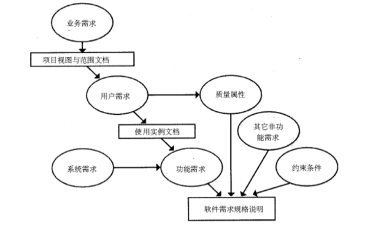

---
title: 软件需求工程
date: 2021-02-25 17:04:52
summary: 本文分享需求工程的基础知识。
tags:
- 软件需求
- 软件工程
categories:
- 软件工程
---

# 需求

**需求**是问题信息和系统行为、特性、设计及制造约束的描述的集合，即应该做什么的规格说明。

一条需求的格式：**谁**(需求主体) 需要 **什么样的**(需求形式) **什么东西**(需求内容)。

需求并未包括设计细节、实现细节、项目计划信息或测试信息，它关注的只是充分说明究竟想开发什么。

开发软件系统最为困难的部分就是准确说明开发什么。最为困难的概念性工作便是编写出详细技术需求，这包括所有面向用户、面向机器和其它软件系统的接口。同时这也是一旦做错将最终会给系统带来极大损害的部分，并且以后再对它进行修改也极为困难。 

需求工程是指应用已证实有效的技术、方法进行需求分析，确定客户需求，帮助分析人员理解问题并定义目标系统的所有外部特征的一门学科。 

# 需求的层次

业务需求：反映了组织机构或客户对系统、产品高层次的目标要求。

用户需求：描述了用户使用产品必须要完成的任务。

功能需求：定义了开发人员必须实现的软件功能，使得用户能完成他们的任务，从而满足了业务需求。

功能需求包含了功能性需求和非功能性需求。

功能性需求，即系统应该做什么。
1）ATM系统应该验证插入的ATM卡的有效性。
2）ATM系统应该验证客户输入的个人身份号的有效性。
3）ATM系统应该对于任何ATM卡在任意24小时内只能取款不超过$250进行限制。

功能性需求需要从客户处获得，这是由业务分析人员完成的需求引导活动。

收集到的功能性需求必须进行仔细的分析以消除矛盾和重叠，这个过程宗会导致需求评审和与客户的再一次协商。对于已经达成一致的功能性需求，可以利用图形表示法进行建模，并在文本中进一步定义。

非功能性需求，即系统的特定特性或者约束，也就是为如何实现这些功能需求设定约束。
1）ATM系统应该采用C++编写。
2）ATM系统和银行通信应该采用256位加密。
3）ATM系统应该在3秒内验证ATM卡。
4）ATM系统应该在3秒内验证个人身份号的有效性。

非功能性需求可以分为以下几种：
- 可用性：定义了使用系统的容易程度。
- 可复用性：定义了在新系统开发过程中重复使用以前已实现的软件构件的容易程度。
- 可靠性：与系统失效的频率和严重性以及系统从失败中恢复的程度相关。
- 性能：通过系统响应时间、事务处理时间、资源开销、可能的并发用户数量等的期望来确定。
- 效率：与取得软件成果或达到软件目标的成本和时间相关，包括性能的期望程度。
- 适应性：定义了系统被理解、修改、完善和扩展的容易程度。
- 其他约束：覆盖了系统中所有的其他非功能性需求，例如和项目基础设施相关的政策制定、影响项目的法律问题、软件可携带型的需求程度、系统交互操作性的需求以及产品交付的时间。

# 需求工程过程

需求工程过程是用来导出、确认和维护系统需求文档的一组结构化活动，分为以下过程：
- 需求获取
- 需求建模与需求分析
- 需求规格说明
- 需求验证与确认
- 需求管理

# 需求应用域理解

为了启发出客户的要求，需求小组的成员必须熟悉该应用域，即目标软件产品通常在哪些领域使用。

需求分析小组最初的任务就是获得对应用领域的熟悉，除非已经有该领域的知识积累。

当与客户和目标软件潜在用户交流时，特别重要的一点是使用正确的术语。采访者使用适用于特定领域的术语，更容易引起重视。而使用不合适的术语会导致曲解，甚至造成交付一个有错误的软件产品的结果。

解决术语问题的一个方法是建立术语表，记录在该领域应用的技术词汇列表和对应的解释。当小组成员正忙于尽可能学习应用领域的相关知识时，就将初始的词条插入术语表中。而后，需求小组成员一遇到新的术语就将该术语表更新。

# 需求分析的5W1H8C1D方法

需求分析的5W1H8C1D方法：
- 5W：属于功能属性
    - When：时间相关的环境信息
        - 季节信息：春、夏、秋、冬
        - 日期信息：节日、假日、……
        - 作息信息：白天、晚上、凌晨、早晨、上午、中午、下午、晚上、深夜、……
        - ……
    - Where：地点相关的环境信息
        - 国家、地区：不同的国家和地区有不同的文化、风俗、制度
        - 室内、室外、街道
        - 建筑物
        - ……
    - Who：参与者相关的信息，参与者不一定是人
        - 投资者、管理者
        - 使用者、维护者
        - 监督者、评估者
        - ……
    - What：最终产生的输出
        - 文档、报告、图片、系统……
    - Why：客户遇到的问题、困难、阻碍，客户提出需求的驱动力
- 1H：属于功能属性
    - How：关注需求本身的流程，而非需求如何实现
        - 复杂需求需要将需求流程描述清楚，这部分是需求分析工作量最大的部分，分析结果是需求分析的主要输出，结果质量直接影响到需求实现的质量
        - 有成熟的方法，即用例方法
           - Normal：通过和客户沟，分析需求的正常流程
           - Exception：在正常处理流程的步骤上，分析每一步的各种异常情况和对应的处理
           - Alternative：在正常处理流程的步骤上，分析每一步是否有其他替代方法，以及替代方法应该如何做
- 8C：八条约束和限制Constraint，属于质量属性
    - Performance：性能是指系统提供相应服务的效率，一般包括响应时间、吞吐量等
    - Cost：成本是指为实现系统而需要付出的代价
    - Time：时间是指客户要求系统什么时候交付
    - Reliability：可靠性是指系统长时间正常运行的能力
    - Security：安全性是指对信息安全的保护能力
    - Compliance：合规性是指满足各种行业标准、法律法规、规范等
    - Technology：技术性是指客户要求采用某些技术开发
    - Compatibility：兼容性是指产品或系统与客户已有产品或系统的兼容能力
- 1D
    - Data：数据，指业务上线之后的效果，包括业务效果和系统效果
