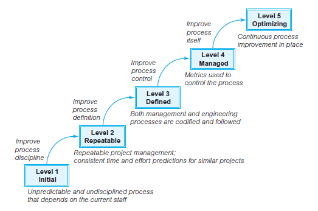

---
title: CMM能力成熟度模型
date: 2021-02-18 23:00:23
summary: 本文分享CMM能力成熟度模型。
tags:
- 软件项目管理
categories:
- 软件工程
---

# 成熟的组织

不成熟的组织的五大弊病：
- 过程临时拼凑、不能严格遵守。
- 制定进度和预算不是基于估计，经常超出进度和预算。
- 产品质量难以预测，没有判断质量的客观基础。
- 为满足进度，常在产品功能和质量上作出让步。
- 过程是反应式的，解决即时危机。

成熟组织的六大优点：
- 在全组织范围内具有一致定义的过程。
- 过程被严格的遵守，过程的执行符合度被评价和加强。
- 产品和过程的度量被有效的使用。
- 进度和预算是基于以前的性能数据预测的，是现实的。
- 通常都能达到产品的成本、进度、功能和质量的预测结果。
- 过程是前瞻性的，注重对缺陷的预防。

# CMM

本质上讲，CMM是一个由IT组织填写的问卷调查表。问卷随后进行核查和认证，并将组织分配到CMM五个级别中的一个。级别越高，组织的软件过程越成熟。

下图定义了CMM五个级别，给出了每个级别主要特征的简短描述，并指明了组织为了达到更高级别，而需要进行过程改进的主要领域。

1. 初始级(Initial)：工作无序，项目进行过程中常放弃当初的计划。管理无章法，缺乏健全的管理制度。开发项目成效不稳定，项目成功主要依靠项目负责人的经验和能力，他一但离去，工作秩序面目全非。
2. 可重复级(Repeatable)：管理制度化，建立了基本的管理制度和规程，管理工作有章可循。 初步实现标准化，开发工作比较好地按标准实施。 变更依法进行，做到基线化，稳定可跟踪，新项目的计划和管理基于过去的实践经验，具有重复以前成功项目的环境和条件。
3. 已定义级(Defined)：开发过程，包括技术工作和管理工作，均已实现标准化、文档化。建立了完善的培训制度和专家评审制度，全部技术活动和管理活动均可控制，对项目进行中的过程、岗位和职责均有共同的理解 。
4. 已管理级(Managed)：产品和过程已建立了定量的质量目标。开发活动中的生产率和质量是可量度的。已建立过程数据库。已实现项目产品和过程的控制。可预测过程和产品质量趋势，如预测偏差，实现及时纠正。
5. 优化级(Optimizing)：可集中精力改进过程，采用新技术、新方法。拥有防止出现缺陷、识别薄弱环节以及加以改进的手段。可取得过程有效性的统计数据，并可据进行分析，从而得出最佳方法。

真实情况是，大部分组织位于第一级，某些组织位于第二级，真正的第五级寥寥无几。

# CMM的应用

CMM有很多应用：
- 软件过程改进
    - 组织策划、设计和实施对其软件过程的更改
- 软件过程评估
    - 关注组织自身的软件过程改善• 过程在开放与合作的环境中进行
    - 目的暴露软件过程中存在的问题，帮助组织实施过程的改善
- 软件能力评价
    - 关注软件承包商的过程成熟度
    - 过程在面向审计的环境中进行
    - 目的选择合格的承包商，降低由于承包商选择不当而引发的风险

# 提升CMM等级带来的收益

提升CMM等级带来的收益如下：
- 提高进度和预算的可预计性
- 缩短生命周期时间
- 提高生产力
- 提高质量
- 改善客户满意度
- 提高员工士气
- 增加利润
- 降低质量成本
