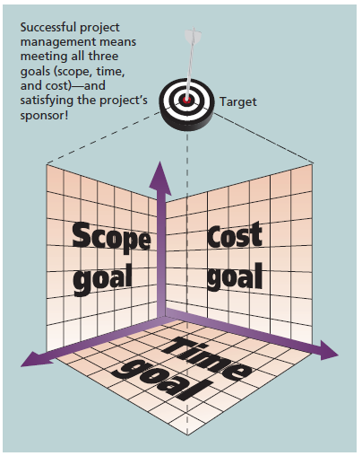
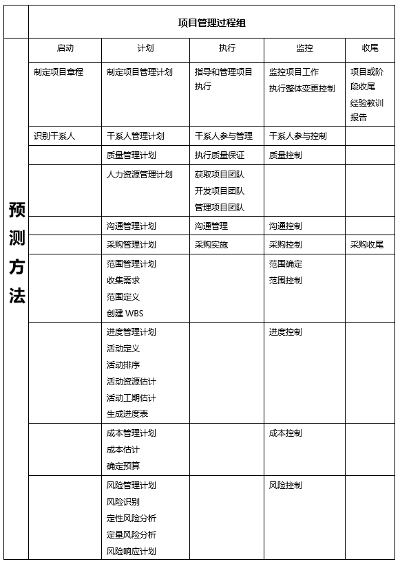
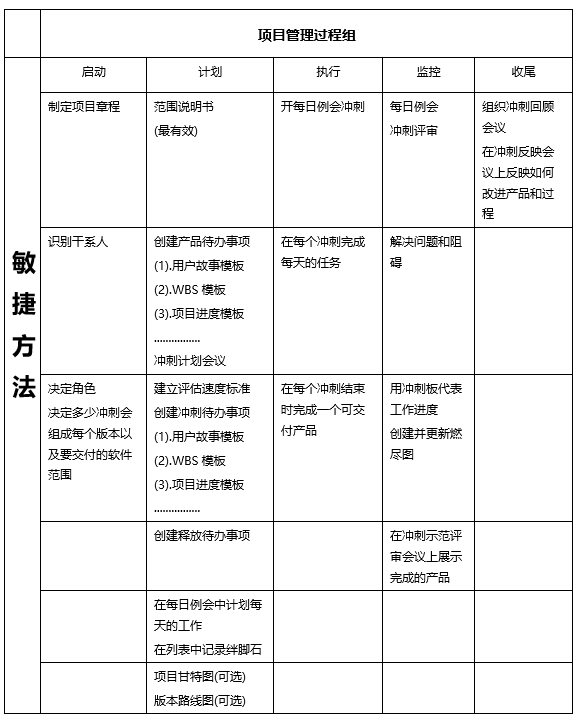
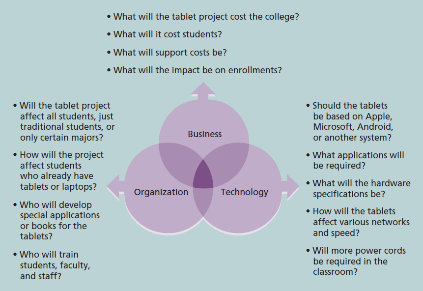
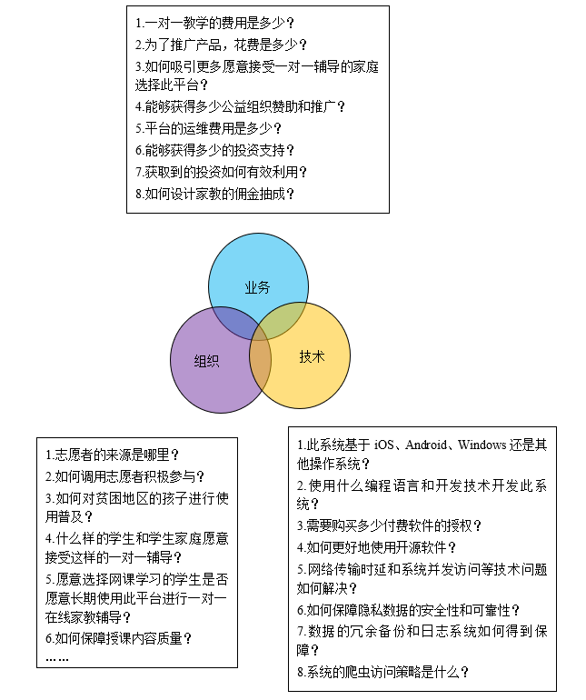

---
title: IT项目管理
date: 2022-03-04 21:24:45
summary: 本文分享IT项目管理的基础知识。
tags:
- 软件项目管理
categories:
- 软件工程
---

# IT项目

**项目**是为创造一个特定的产品、服务或成果而采取的临时性的努力。**运营**是组织为了维持业务而进行的工作。项目与运营的区别是，当项目的预期已经达到或项目被终止时项目就结束了。

项目的属性：
- 项目有一个特定的目的
- 项目是临时性的
- 项目是通过不断完善细节而逐步开展的
- 项目通常需要来自不同领域的资源
- 项目应有一个主要的客户或发起人
- 项目含有不确定性

每个项目都会在不同程度上受到范围目标、时间目标和成本目标的约束，这些限制条件在项目管理中被称为三项约束。

如上图所示，建立了一个坐标轴为范围目标、成本目标和时间目标的空间直角坐标系，项目的目标在空间中有对应的范围目标、成本目标和时间目标映射。

成功的项目管理意味着约束条件应该得到满足。

项目经理必须综合考虑三项约束，事实上这三项约束往往还存在冲突，需要取舍和权衡。
有经验的项目经理往往会判断出当前项目中三项约束中更为重要的是什么，并做好取舍和权衡。

项目的约束不仅仅是范围、时间和成本，质量、资源、风险等因素也在项目管理中发挥着重要的作用。

**项目生命周期**是一系列**项目阶段**的集合，项目的不同阶段以**可交付成果**来划分。

# IT项目管理

**项目管理**是在项目活动中运用专门的知识、技能、工具和技术以满足项目需求。IT项目具有**多样性**和应用领域的**新颖性**，所以在管理各种不同项目的时候，获得和遵循最好的项目管理实践非常重要。

项目管理存在**十大知识域**：范围管理、时间管理、成本管理、质量管理、人力资源管理、沟通管理、风险管理、采购管理、干系人管理、综合管理。

项目管理存在五个过程组：启动、计划、执行、监控、收尾。
过程组不同于项目阶段，过程组并非是线性的，而后者只是依据生命周期的里程碑划分。

项目管理给组织带来的好处：
- 更好的控制财力、物力和人力资源
- 改进客户关系
- 缩短开发时间
- 降低成本和提高生产率
- 提高质量和可靠性
- 更大的边际利润空间
- 更好的内部协调
- 积极影响实现战略目标
- 更高的员工士气

IT项目管理的趋势：全球化、外包、虚拟团队、敏捷。
- IT正是**全球化**的关键推动者，过程中项目经理要关注沟通、信任、工作方式、工具等方面
- **外包**是一个组织从外部寻找来源以获取所需要的产品和服务，可以降低成本并提高组织的竞争力
- **虚拟团队**是通过通信技术来实现跨时间和跨地域工作的个人组成的团队
- **敏捷**拥抱变化，强调个体和交互而不是过程和工具，强调可运行的软件而不是全面的文档，清掉客户的协作而不是合同谈判，强调对变化的响应而不是遵循计划

## 系统管理

**系统**是未达到某些目的而在一个环境中运行的、由相互作用的要素组成的集合。

**系统思维**描述了在组织的背景中执行项目的整体观点。

**系统方法**是采用整体的和分析的方法来解决复杂问题，包括使用系统哲学、系统分析和系统管理等方法。

**系统哲学**是一整套系统地思考事物的思维模式。

**系统分析**是解决问题的一种方法，需要定义所研究系统的范围，然后将它分解成各个部分来确认与评估相应的问题、机会、约束和需求。

**系统管理**包括处理与系统的创建、维护和改变相关的业务、技术和组织问题。

系统管理的三球模型可以用业务、组织和技术三个概念来概括。项目必须解决系统管理模型中三个圆球里的所有问题。

应该注意的是，三球模型的核心内容是找出一些关于业务、组织和技术的问题，非常重要的一点是具体情况具体分析。

下面是一个例子：

最后是自己写过的一个例子：

# IT项目成功

衡量一个项目是否成功的通常标准：
- 项目达到了范围、时间和成本目标
- 项目使客户/发起者感到满意
- 项目的结果达到了主要目标

促成项目成功的关键因素：
- 用户参与
- 管理层支持
- 明确的业务目标
- 情绪成熟
- 优化范围
- 敏捷过程
- 项目管理专业知识
- 技术资源
- 执行
- 工具和基础设施

不应过度在意某一个项目的成功率，而应该注意企业如何从整体上提高项目的运作水准。

项目成功交付的企业具有以下实践要素：
- 使用一个包括项目管理工具、方法和技术的集成“工具箱”
- 培养优秀的项目领导者
- 开发一个流线型的项目交付过程
- 对项目的健康度进行量化

# 避免采用LoC衡量程序员的工作效率

由于编码是脑力劳动，是创造性工作，所以尽管程序员的工作量和工作效率不是那么容易度量，但用LoC衡量程序员的工作效率显然是不科学的。

不合理的理由：
- 想改进代码，资深程序员更倾向于删代码而不是加代码。代码清晰度和代码行数是部分关联的，因此，在不影响清晰度和功能的前提下删除代码，是一件划算的事。
- 显而易见的是，添加冗余代码的更可能是不合格的程序员。
- 作为衡量标准，代码行数太容易人为造假。如果程序员知道仅以代码行数作为工作量和工作效率的衡量指标，他就会想办法在增加代码行数上做文章。
- 代码行数和难度并没有直接关联，代码甚至不一定是人工编写的。

代码行数代表的是数量，而非质量。因此，把它当做衡量程序员效率的标准并不合适。通过计算代码行数，得不出有意义的结论。

# 面对技术债务

很多人误以为技术债务指的是不良代码，其实根据[这篇博客](http://wiki.c2.com/?WardExplainsDebtMetaphor)，应该是目标理解错误而导致生成错位代码，即团队代码的组织方式与商业目标的实现方法之间存在不一致性。

作者从来不赞成编写代码很差，但是他表示赞成编写代码以反映程序员当前对问题的理解，即使这种理解是局部的。
如果程序员希望通过开发他不完全理解的软件来承担这种债务，那么明智的做法是使该软件尽可能最好地反映他的理解，以备不时之需。重构时，由于很清楚他在编写时的想法，从而可以更轻松地将其重构为当前的想法。

偿还债务并使技术债务为你所用的能力取决于你编写的代码是否足够干净，以便能够在你理解问题时进行重构。

当然，最好是在技术债务积累前偿还技术债务，即重新理解程序目标然后调整代码，而不是继续向错位代码中添加功能。
