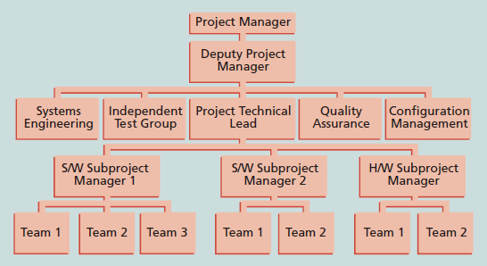

# 虚拟团队

虚拟团队是指运用通信技术实现跨时间和跨地域工作的个人组成的团队。团队成员可能同时为同一国家的同一公司工作，也可能是独立咨询师、供应商，甚至是遍布全球的为项目提供专门技术支持的志愿者。

虚拟团队的优点主要有：
- 很多虚拟团队的成员在家工作，不需要除了家庭办公室以外的办公场地和支持，因而成本得以节省。
- 提供更多的专业知识和灵活性，或通过团队成员在全球各地日夜不停地工作来增加竞争力和响应能力。
- 不用再花费固定的工作时间和上下班时间，团队成员的工作和生活更加和谐。

虚拟团队的缺点主要有：
- 那些不适应在虚拟环境中工作的团队成员可能会受到孤立。
- 因为团队成员不能够运用身体语言和其他沟通方式来彼此理解，建立关系和信任，所以沟通更容易出现问题。
- 减少了团队成员以非正式的工作方式沟通和传递信息的能力。
- 增加了完成工作所需技术的依赖性。

影响虚拟团队成功的因素主要有：
- 团队过程：规定虚拟团队以何种方式运行十分重要。
- 领导方式：项目经理的领导方式会影响所有团队成员，特别是是一个虚拟团队时更是如此。
- 信任和关系：很多虚拟团队失败的原因就是缺乏信任，要远距离建立关系和信任的确困难。
- 团队成员的选择和角色偏好：是否仔细挑选团队成员，建立团队时是否包含了所有角色，这些因素对团队的成功非常重要。
- 任务与技术相适应：如果信息技术能够与使用者要执行的任务相匹配，那么技术对于个人业绩会有更积极的影响。
- 文化差异：处理文化差异非常重要，包括权威人士如何看待、如何做出决定、如何沟通要求或问题以及人工希望如何操作（合作或独立）。
- 计算机协调沟通：需要为虚拟团队成员提供可靠且适合的计算机协调沟通，确保员工确实在工作，否则就会增大那些本来就存在于虚拟边界上的距离风险。
- 团队生命周期：项目经理应该处理好团队生命周期问题，特别是在安排团队成员和决定交付程度时更应如此。
- 鼓励：虚拟团队需要不同方式的鼓励，以保证及时、高效地完成工作。
- 冲突管理：虽然虚拟团队的成员可能不会在现实中碰面，但冲突仍然存在，冲突管理十分重要。

# α项目经理的时间投入启示

项目经理应该具备的基本技能：
- 项目管理知识体系
- 应用领域的知识、标准和规则
- 项目环境知识
- 普通管理知识和技能
- 软技能或人际关系能力

依据《阿尔法项目经理：什么是2%的顶尖人才知道，而其他人不知道的》一书的说法，下图是每个过程组中所用的时间占比，包含了普通项目经理和阿尔法项目经理的统计情况。

下面浅谈对此图的解读。

首先，直观地可见，在执行过程中需要投入最多的时间，其次是计划过程。

通过比对阿尔法项目经理和普通项目经理的时间投入占比，可以发现阿尔法项目经理在计划过程上投入的时间占比是其他项目经理的2倍左右，而在计划过程上投入更多的时间有助于缩短执行时间。

其实，投入的时间未必是绝对的2倍。一方面是因为具体的项目是不同的，不可一概而论，且这只是作者的统计结果；另一方面是投入更多的时间在计划过程上，其实大大降低了其他过程的时间投入，进而降低了其他过程在项目中的时间占比，特别是执行过程，由此导致了阿尔法项目经理的启动、收尾、监控过程也显得时间占比略高。

需要强调的是，项目组≠阶段。
阶段依据项目的生命周期划分，而阶段中过程组是不断迭代的。

有效的项目管理工具和技术对项目管理是有帮助的，不同工具在不同环境中发挥的有效性不同，项目经理以及项目团队成员应该判断何种工具对自己的项目是最有用的。

# 组织结构

不同视角下的组织框架：
- **结构框架**涉及组织是如何创建的，关注不同团队的角色和责任，以满足高层管理所设定的目标和政策。
- **人力资源框架**聚焦于提供组织需求和人员需求之间的协调。
- **政治框架**解决组织和个人政治的问题。
- **符号框架**着重于符号及含义。

组织结构的不同类型：
1. 职能型组织结构 
2. 项目型组织结构 
3. 矩阵型组织结构 
   
组织文化关注的重点：成员认同度、团队专注度、人员聚集度、单元集成度、控制力、抗风险能力、奖励标准、抗冲突能力、结果导向度、开放系统聚集度。

高等管理承诺的重要性体现在：
- 项目经理需要足够的资源
- 项目经理经常需要及时得到关于特定项目需求的认可
- 项目经理必须与组织内其他部门的人进行合作
- 项目经理经常需要在领导力方面获得指导和帮助

# 人力资源计划

- 项目组织结构图  
- 责任分配矩阵：将WBS中描述的项目工作与OBS中负责实施的人员相匹配的矩阵。 
- RACI表：表示[项目干系人](https://blankspace.blog.csdn.net/article/details/123515599)的四种角色。 
- 人员配置管理计划：描述人员何时以及如何加入和调离项目团队，通常包括资源直方图。 

# 组建项目团队

- 人力资源分配
- 资源负荷：在特定时段内，既定进度计划所需的个体资源的数量。 
- 资源平衡：通过任务延迟来解决资源冲突，以期建立更平稳的资源分配使用。资源分配的目的就是在允许的时差范围内移动任务，从而使各个时段的资源负荷变化达到最小。
    - 例子： 
    - 优点：
        - 当资源的管理比较稳定时，它们需要的管理就较少。
        - 资源平衡可使项目经理通过分包或其他昂贵的资源而使用零库存策略。
        - 资源平衡可以减少财务部与项目人员方面的一些问题。
        - 资源平衡还可以提高人气。
