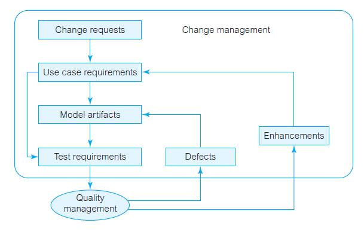
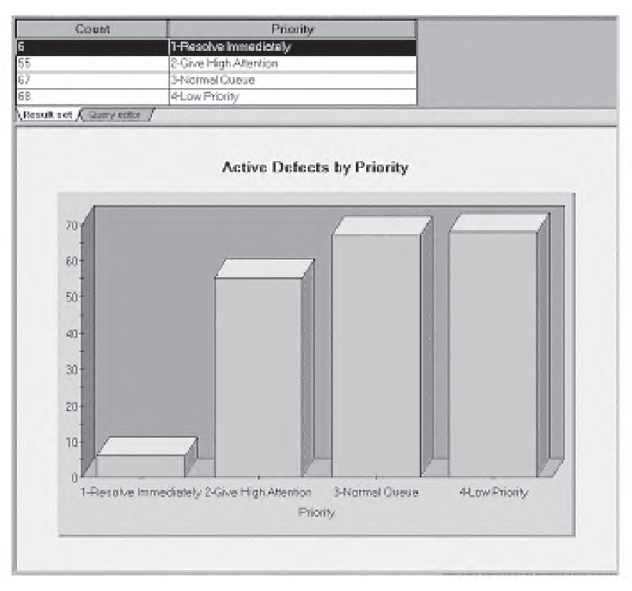
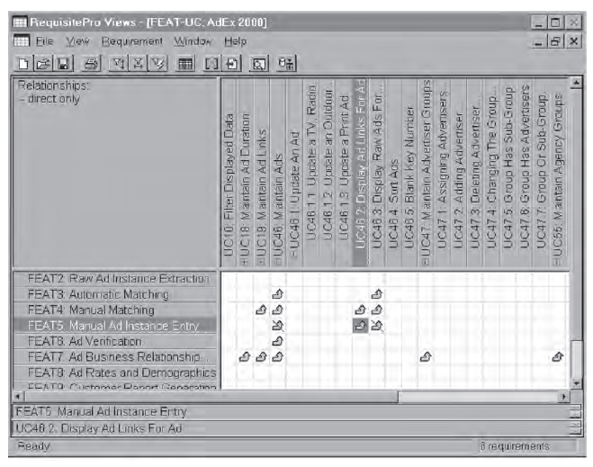
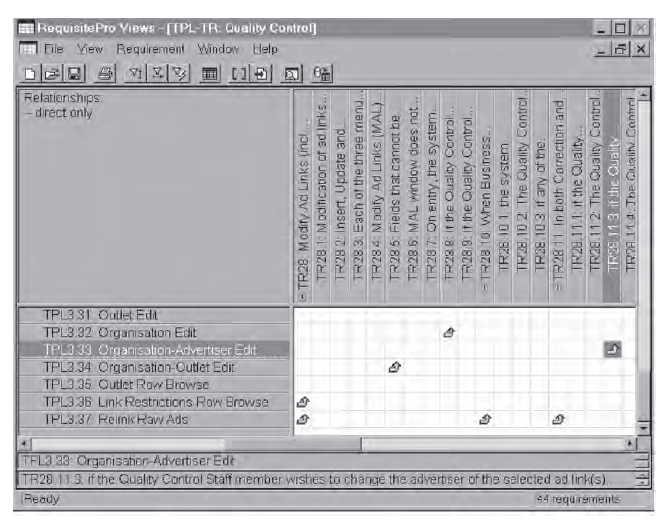
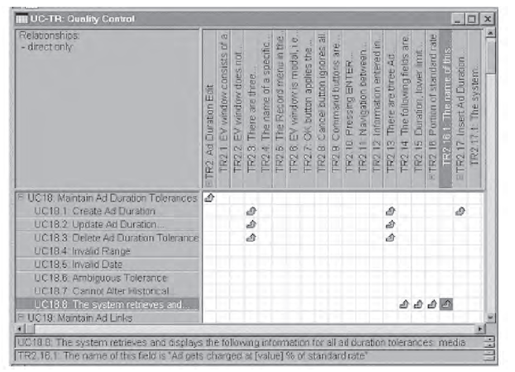

---
title: 变更管理与过程改进
date: 2021-02-22 23:32:54
summary: 本文分享现代软件开发迭代和增量的周期。
tags:
- 软件项目管理
categories:
- 软件工程
---

# 变更管理

对变更管理的理解存在业务维度和系统维度两个维度：
- 业务维度：采用系统业务指来阐述变更管理，强调与新信息系统相关的关联行为和组织影响，主要处理人员管理问题。
- 系统维度：以系统合理性为目的，是软件产品和过程以及管理软件系统演化过程中的团队活动的过程，本质上与质量管理相关。

质量控制可以找出需要进行修正的故障。为了得到修正，必须将这些故障提交为变更请求，然后分配给开发人员。有些变更请求可能是改进而不是故障。故障和改进都要经历状态变化，都可能要进行排序，都有所有者，都需要追踪到它们在测试文档和用例文档中的起源。

# 变更请求管理工具

要管理变更，就需要一个变更请求管理工具，此工具允许联机管理变更并且能够保证所有的开发人员拥有最新的文档。一个项目成员修改了文档，同组的开发人员可以立即得到。潜在的冲突可以通过锁定或版本控制机制来解决。若采用锁定机制，则被锁定的文档暂时对其他开发人员无效；若采用版本控制机制，则同一个文档可以有多个版本，但这些版本之间的冲突在后来可以通过协商解决。

变更请求要么是修正一个故障，要么是进行一次改进。应该将变量请求输入到项目资源库中，输入到项目资源后，开发人员就可以监控该变量请求的进展情况，观察它的状态并对它进行操作。对变更请求可以实施的行动取决于它当前所处的状态。

提交变更请求的行动会自动向每一个团队成员发送Email通告，然后变更请求的状态就会变为Submitted。项目管理可以定制这个工具以预先为每一个状态定义行动。
当处于Submitted状态时，可采取的行动有：分配给某个团队成员、修改请求的一些信息、关闭可能需要修正的请求、发现以前曾用不同ID报告过的重复请求、退后不必当前担心的请求、删除不需要修正的请求、继续处理请求。

每个变更请求会被分配给一个团队成员，成员可以打开变更请求。当请求处于打开状态时，其他团队成员不能修改这个请求的状态。
完成这个变更请求的相关工作后，开发人员可以对它执行解决行动，输入解决方案的而细节，并向项目经理和测试人员发送Email通告，测试人员可能需要对这个已解决的变更请求执行验证活动。
每一阶段，变更请求管理工具都可以追踪这个请求并生成意义理解的图表和项目度量报告，从这些图表和报告中可以评估出未分配的故障数量，显示出每个团队成员的工作量，列出还有多少个故障没有解决。

# 可追踪性

可追踪性是测试与变更管理的基础，其目的是捕获、链接和追踪每一个重要的开发制品，包括需求。其最终目的是保证整个文档集中各种文档和模型的正确性和一致性，如从需求文档到技术文档再到用户文档。

追踪的条目可以是文本描述或图形模型，可追踪性在这些条目之间建立了外部连接，这些连接可以是直接的或间接的。如果修改了追踪路径上的任何条目，那就可以对连接进行影响分析。

可追踪性、测试和变更管理常常与用例需求中列出的系统服务相关，系统约束的实施也必须进行测试和管理。可追踪性、测试和变更管理本身并不是目的，开发人员应该将主要精力集中在开发上，而不是在追踪、测试或变更管理上，这些问题会显著增加项目的成本，但不管理更会显著的增加项目的长期成本。

由于可追踪性是质量与变更管理的基础，所以应该采用成本-效益分析来确定项目追踪的范围和深度，至少应该保持用例需求与故障之间的可追踪性。在较为精细的模型中，可以在用例需求和故障之间的路径上加入测试需求；在更复杂的模型中，可追踪性的条目可以包括系统特征、测试用例、改进、测试验证点以及其他软件开发制品。

## 从系统特征到用例和用例需求

系统特征是系统中将要实现功能的通用项，是能够表现出系统主要优势的业务过程。一般来说，系统特征对应于业务用例模型中的业务用例。如果没有正式开发业务用例模型，则系统特征表现为前景文档。

可以通过一个或多个用例中的一组用例需求来实现每一个系统特征。从用例反向追踪到利益相关者的要求有助于验证用例模型的正确性。这个策略限定了需求捕获的范围，有利于完成需求阶段，还能辅助增量开发和产品交付。

追踪矩阵不仅要能够从特征直接追踪到用例，而且要能够从特征直接追踪到用例需求。如果将每个用例本身看作是最高级的用例需求，而且在它之下有具体的用例需求层次，做到这一点是有可能的。

下表表示的是从特征到用例和用例需求的可追踪性，可以展开或收缩用例需求的层次显示。
列中显示了各个用例及其用例需求。
矩阵中的箭头表示从左边的特征到上面的用例及用例需求的追踪。
箭头上划线的是可以追踪，当改变了追踪的起始或目标需求时，它就变成了可疑追踪。
开发者在清楚这些可疑连接之前要对它们进行检测。

## 从测试计划到测试用例和测试需求

测试计划文档对应测试用例，而业务用例文档则对应用例。

测试计划确定了高层项目信息以及应该进行测试的软件构件（即测试用例），测试计划还描述了项目采用的测试策略、所需要的测试资源、工作量和成本。

要为测试计划中确定的每一个测试用例编写测试用例文档。
将测试需求映射为测试用例和测试计划可以限定测试捕捉的范围、可伸缩性等。这点与特征、用例和用例需求之间的追踪类似。

下表显示了从测试计划到测试用例及其测试需求的追踪矩阵，可以收缩或展开测试需求的层次显示。

## 从UML图到文档和需求

可追踪性和变更不仅仅适用于适用于CASE资源库中的叙述性文档和需求文本，资源库中还存储了UML模型，而UML图中的图形对象可以超链接到这些文档和需求。

UML可视化制品与其他任何资源库记录尤其是文档和需求之间建立的可追踪性可以与不同的UML图标对应，也许这些图标中最重要的就是用例图中的用例。

## 从用例需求到测试需求

用例需求与测试需求之间的可追踪性对评估应用是否满足所建立的业务需求是非常关键的，通过这两个需求之间的连接，用户可以从测试需求返回到用例需求和系统特征以追踪故障。

下图显示了用例需求和测试需求之间的追踪矩阵，值得注意的是，用例需求和测试需求都是层次结构，所以可以预先设定追踪所处的层次。

## 从测试需求到故障

测试用例文档采用脚本形式编写，其中包含了测试时要验证的测试需求。这些脚本可用于人工测试，但是，大部分脚本可以在捕获和回放测试工具中自动进行编码测试。因此，测试文档中的测试需求可以用来建立自动化测试中的验证点。

验证点是脚本中的需求，在回归测试中用来确认一个测试对象在被测试应用不同版本中的状态。
验证点有很多种，可以设置一个验证点来检查一段正文是否被修改、数据是否精确、两个文件是否一样、某个文件是否存在、菜单项是否未改变、计算结果是否符合期望值等类似的条目。

自动化测试需要两个数据文件：一个基准数据文件和一个实际数据文件。
在捕获阶段，验证点记录基准数据文件中的对象信息，这些信息又作为随后的测试中进行比较的基准。
比较的结果存储在实际数据文件中。
对每个失败的验证点需要进一步研究，如果有必要可以将它们输入到变更管理工具中作为故障。

无论是在自动化测试中发现的故障，还是在人工测试中发现的故障，所有故障最后都必须与测试需求建立连接。

## 从用例需求到改进

故障必须能够直接追踪到测试需求。
在用例需求中必须说明改进，这在下次交付产品时需要实现。

# 综合变更控制

综合变更控制涉及在项目的生命周期中识别、评估和管理变更。

综合变更控制有三个主要目标：
- 影响那些产生变更的因素以确保变更都是有利的
- 确定一个变更已经出现过
- 及时地管理真正的变更

管理综合变更控制的建议：
- 将项目管理视为一个不断的沟通和协商谈判的过程
- 为变更编制计划
- 建立一套正式的变更控制系统，包括变更控制委员会CCB
- 运用有效的配置管理
- 制定一定的管理程序以实现小变更的快速决策
- 通过书面和口头的绩效报告识别并管理变更
- 运用项目管理软件和其他软件协助进行变更管理与沟通
- 集中精力领导项目团队并且实现所有的项目目标和期望
