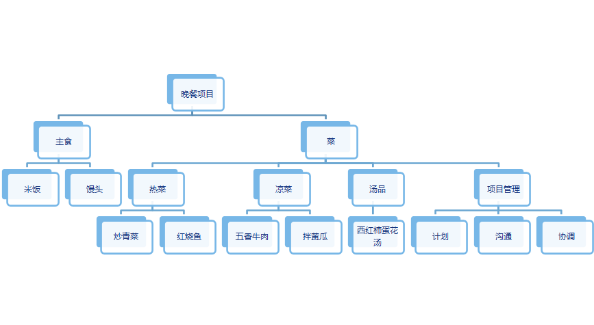

---
title: 迭代和增量的开发周期
date: 2021-03-26 16:21:50
summary: 本文分享用于项目范围管理应用到的工作分解结构(WBS)。
tags:
- 软件项目管理
categories:
- 软件工程
---

# WBS

**工作分解结构**(Work Breakdown Structure, WBS)是一种为了便于管理和控制而将项目工作任务分解的技术。工作分解结构面向可交付物的项目元素进行层次分解，详细描述了项目所要完成的工作。WBS的最低层次元素是能够被评估的、安排进度的和被跟踪的。它是组织管理工作的主要依据。

# WBS用途

WBS确定了项目整个范围，并将其有条理地、分层次地组织在一起。通过WBS，项目工作被分解为较小和更加容易管理的多项工作，而每下降一个层次意味着对其进行了更详尽地说明。
属于工作分解结构底层组成部分的计划工作叫做“工作细目”，可以安排在进度表中，用来估算费用，进行监视和控制。WBS是当前批准的项目范围说明书规定的工作。

# WBS构造方法

构造WBS的方法主要有下面几种：
- 参照使用指南法：参照所在组织的既有WBS指南和模板构造当前项目的WBS。
- 类比法：类比一个相似项目的WBS构造当前项目的WBS。
- 自顶向下法：从项目最大的条目开始，将它们分解为次一级的条目。
- 自底向上法：识别尽可能多的与项目有关的具体任务，再将这些具体任务集中并组织成概要任务或WBS中的较高层次。
- 思维导图法：从核心思想向外辐射出分支，将思想和想法结构化，非线性，直观。

# WBS步骤

下面给出的是自顶向下地构造WBS的方法：
1. 识别可交付成果和工作。
2. 确定分解结构。
3. 将上层分解为下层。
4. 分配标识号。
5. 核实工作的分解的程度是否必要而又足够。

不能分解的是很远的将来要完成的成果。

# WBS要点

1. 在各层次上保持项目的完整性，避免遗漏必要的组成部分。
2. 一个工作单元只能从属于某个上层单元，避免交叉从属。
3. 相同层次的工作单元应有相同性质。
4. 工作单元应能分开不同的责任者和不同工作内容。
5. 便于项目管理进行计划和控制的管理需要。
6. 最低层工作应该具有可比性，是可管理的，可定量检查的。
7. 应包括项目管理工作和分包出去的工作。
8. WBS的最低层次的工作单元是工作包。

# WBS特点

- 面向可交付成果
- 只表示范围
- 不均等分层

# WBS原则

- 100%原则：下层加起来100%等于上层
- 不可再分原则：相对独立，不可再分
- 信息透明原则：可充分估算时间、成本为止
- 独立责任原则：可安排一个责任者

# WBS示例

## 示例1

## 示例2

Project Name: xxx

1 Main category
		1.1 Subcategory
		1.2 Subcategory
				1.2.1 Sub-subcategory
				1.2.2 Sub-subcategory 
		1.3 Subcategory
		1.4 Subcategory
2 Main category
		2.1 Subcategory
		2.2 Subcategory
				2.2.1 Sub-subcategory
				2.2.2 Sub-subcategory 
		2.3 Subcategory
		2.4 Subcategory
3 Main category
		3.1 Subcategory
		3.2 Subcategory
				3.2.1 Sub-subcategory
				3.2.2 Sub-subcategory 
		3.3 Subcategory
		3.4 Subcategory
4 Main category
		4.1 Subcategory
		4.2 Subcategory
				4.2.1 Sub-subcategory
				4.2.2 Sub-subcategory 
		4.3 Subcategory
		4.4 Subcategory

# WBS建议

以下内容是构造WBS的一些原则和建议：
- 每个单元的工作应该在WBS中只能出现一次。
- 每个WBS条目中的工作内容是该条目以下所有条目之和。
- 每个WBS条目都只对应一个负责人，虽然很多人可能都在做这项工作。
- WBS和工作时间如何执行必须保持一致，首先是服务于团队项目，实用的前提下考虑其他目的。
- 项目团队成员应该全身心投入WBS的创建中去从而确保连贯性和大宗买进。
- 每个WBS条目都必须记录在WBS字典中，确保精确理解条款包括或不包括的工作范围。
- WBS必须对不可避免的变更能够更柔性适应，同时要按照范围说明书的内容保持对工作内容的控制。
