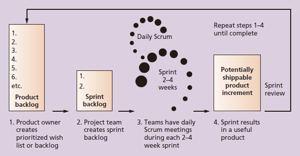

---
title: 敏捷与Scrum
date: 2022-03-05 01:31:55
summary: 本文分享软件工程的敏捷方法和Scrum方法。
tags:
- 软件项目管理
categories:
- 软件工程
---

# 敏捷

敏捷方法意味着使用基于迭代和增量开发的方法，通过合作解决需求和方案。

敏捷方法可以用于软件开发或用于任何需求未知或者变化很快环境中。

敏捷方法设置时间和成本目标，但没有设置范围目标，从而使其具有灵活性，因此项目发起人或者产品负责人能够对想要做的工作设定或者重新设定优先级。

敏捷方法对一些项目是有意义的，但不是对所有项目都是有意义的。

敏捷软件开发宣言：
- 强调个体和交互，而不是过程和工具。
- 强调可运行的软件，而不是全面的文档。
- 强调客户的协作，而不是合同谈判。
- 强调对变化的响应，而不是遵循计划。

敏捷和计划驱动项目的特征对比：

| 敏捷 | 计划驱动 |
|:----:|:----:|
| 项目小（5\~10人） | 项目大（超过10人） |
| 有经验的团队，具有各种能力和技术 | 团队包括不同的能力和技术 |
| 团队成员是自我驱动的、独立的领导者及其他自己知道方向的人 | 团队是地理上分散或外包的 |
| 项目是内部项目，团队在相同的地理位置 | 项目具有战略重要性（例如，是某个企业首创的），范围跨越整个组织结构 |
| 系统是新的，充满了未知数 | 系统已经充分理解，具有熟悉的范围和功能 |
| 需求必须是已被发现的 | 需求相当稳定（变化的可能性小），能够事先确定 |
| 需求和环境是易变的，变化的可能性很大 | 系统大而复杂，具有关键安全需求或高可靠性需求 |
| 最终用户的环境是灵活的 | 项目涉众与开发团队间的关系一般 |
| 与客户的关系密切，有很好的合作 | 存在外部合法性考虑（如合约、义务、针对具体行业标准的正式认证） |
| 客户随时可以找到，全职投入且在同一地理位置 | 重点是强大的、量化的过程改进 |
| 在开发团队内部、开发团队之间、开发团队和顾客之间存在高度信任的环境 | 重视过程的定义和管理 |
| 需要快速价值和快速响应 | 重视过程的可预测性和稳定性 |

# 敏捷团队协议

下面提供一则敏捷团队协议实例：
1. 行为准则
    1. 工作主动，预见到潜在的问题并采取行动去避免它。
    2. 随时通知其他团队成员与项目相关的信息。
    3. 关注什么是对项目组最有利的。
2. 参与	
    1. 在所有的项目活动中表现诚实和开放。
    2. 鼓励多样化的团队合作。
    3. 提供公平参与的机会。
    4. 公开新方法和讨论新观点
    5. 每日参加一次站立的每日例会
    6. 如果一个团队成员无法参与一次会议，或者在最终期限前无法完成给定任务，应该让项目经理事先知情。
3. 沟通
    1. 团队以最好的沟通方式做出决定。因为一些团队成员可能不能经常面对面开会，我们可以使用项目群聊、电子邮件、项目管理主页、在线视频会议等技术来帮助沟通。
    2. 项目经理来主持所有的会议，如果有需要可以安排电话和视频会议。
    3. 团队协作完成各自的任务，在冲刺回顾中将实际执行情况输入项目管理系统中。
    4. 清晰明确的表达意见。
    5. 讨论围绕主题展开，不偏题，不跑题。
4. 解决问题的方式
    1. 鼓励每个人都参与解决问题。
    2. 只是用建设性的批评，精力集中在解决问题上，而不是责备人。
    3. 努力听取其他人的意见。
5. 会议指南
    1. 每天早晨举行15分钟的站立会议。
    2. 每次冲刺前进行计划会议，筛选出冲刺待办事项。
    3. 每次冲刺后进行冲刺评审会和冲刺回顾会。
    4. 对于除了每日站立会议以外的会议，要进行必要的会议纪要记录，并在24小时内将它们用电子邮件发出去。
    5. 如果有必要，可考虑临时召开其他会议。
    6. 如果有必要，可以为与会人员安排电话会议或视频会议。

# Scrum

Scrum是为了完成具有复杂的、创新的工作范围项目的、一种先进的敏捷开发方法。

Scrum框架的核心要点如下：
- 产品负责人创建一个优先级排序愿望列表，称为产品待办事项。
- 在冲刺计划中，团队把产品待办事项愿望列表顶端的一小块提取出来称作一个冲刺待办事项，并决定如何实施。
- 团队用确定的时间冲刺完成他们的工作，通常为2\~4周，但每天见面评估其进展（每日例会）。
- 在这个过程中，敏捷教练使团队专注于目标。
- 在冲刺结束时，工作应该是可以交付的，如准备递交给客户，放到货架上或者展示给项目干系人。
- 冲刺结尾有冲刺评审和冲刺回顾。
- 作为下一个冲刺的开始，团队选择另一块产品待办事项列表并开始再次工作。

循环往复流程步骤直到产品待办事项上的条目已经完成、预算用完或截止期限到来。这些标志性工作结束的里程碑完全取决于项目本身。无论哪种原因停止工作，Scrum确保在项目结束时最有价值的工作已经完成。

Scrum框架存在三个角色：
- Product Owner：负责项目的商业价值，决定做什么工作以及什么顺序记录在产品待办事项列表中。
- Scrum Master：确保团队的生产力，促进每日例会，使所有角色和只能密切合作，并且移除阻碍团队发挥的障碍。敏捷教练管理的是过程而不是团队的人，他们必须对产品负责人和团队放心地放弃控制权。
- Scrum Team / Development Team：由5\~9人自发组织的跨职能团队，其工作是用来产生每个冲刺所需要的结果。一个sprint通常持续2\~4周，在这期间必须完成特定的工作并可以进行审查。

Scrum框架存在四个会议：
- 冲刺计划会议：在一个冲刺内团队从产品待办事项中选择一系列工作去交付的会议，这次会议需要4小时到一整天。
- 每日例会：开发团队分享进展、挑战和计划一天工作的简单会议。在理想情况下，团队成员位于同一地点的会议通常不会超过15分钟，这是每天在相同时间和地点举行的。如果这是不可能的，那么团队可以使用视频会议来开一个短的虚拟会议。敏捷教练问从昨天起有什么工作已经完成，今天计划做什么工作，以及可能阻碍谈对的障碍或绊脚石。敏捷教练记录这些绊脚石并和关键项目干系人在每日例会后一起工作来解决它们。许多团队使用术语“问题”来表示这些不需要在未来24小时内解决的条目，用“阻碍”来表示需要立即解决的条目。这允许敏捷教练首先保持专注优先级条目（阻碍），然后在接下来的一天左右解决其他问题。
- 冲刺回顾会议：团队向产品负责人展示在一个冲刺内已经完成的会议。
- 冲刺评审会议：基于对开发团队实际绩效的问题，帮助团队寻找提高产品和过程方法的会议。

Scrum框架创建的三个artifact：
- 产品待办事项：按照商业价值进行优先级排序的特定列表。最高优先级的条目应该被分解成较多的细节以便于团队估计开发的工作量。一些专家建议安排10个工作日，工作量的大小和工作的复杂性决定了估计。
- 冲刺待办事项：在产品待办事项中的一个冲刺内完成的优先级最高的项目集合。Scrum团队把最高优先级的条目分解成可以花12\~16小时完成的小任务。
- 让毛孔媒体：显示了按天计算在一个冲刺中累计工作的剩余量。

Scrum框架的关键词：
- 最大交付
- 拥抱变化
- 频繁发布
- 降低耦合

过程组独特的Scrum活动：
- 启动
    - 决定角色
    - 决定多少冲次会议组成每个版本以及要交付的软件范围
- 计划
    - 创建产品待办事项
    - 创建冲刺待办事项
    - 创建释放待办事项
    - 在每日例会中计划每天的工作
    - 在列表中记录绊脚石
- 执行
    - 在每个冲刺完成每天的任务
    - 在每个冲刺结束时完成一个可交付产品
- 监控
    - 解决问题和阻碍
    - 创建并更新燃尽图
    - 在冲刺回顾会议上展示完成的产品
- 收尾
    - 在冲刺反映会议上反映如何改进产品和过程
