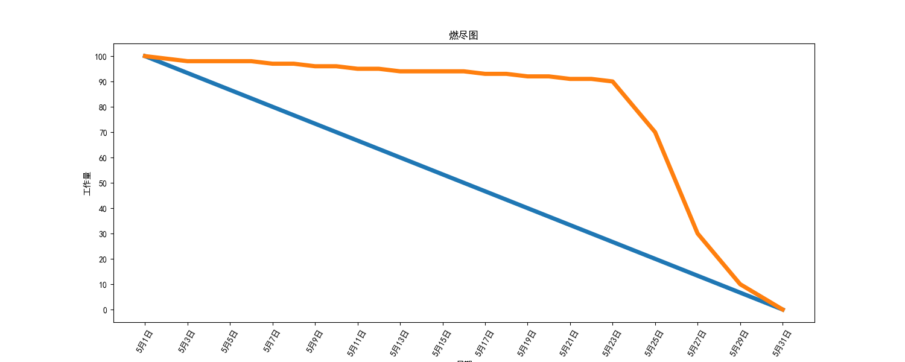

# Scrum

Scrum是为了完成具有复杂的、创新的工作范围项目的、一种先进的敏捷开发方法。

推荐阅读：[敏捷和Scrum](https://blankspace.blog.csdn.net/article/details/123287693)

Scrum框架的核心要点如下：
- 产品负责人创建一个优先级排序愿望列表，称为产品待办事项。
- 在冲刺计划中，团队把产品待办事项愿望列表顶端的一小块提取出来称作一个冲刺待办事项，并决定如何实施。
- 团队用确定的时间冲刺完成他们的工作，通常为2\~4周，但每天见面评估其进展（每日例会）。
- 在这个过程中，敏捷教练使团队专注于目标。
- 在冲刺结束时，工作应该是可以交付的，如准备递交给客户，放到货架上或者展示给项目干系人。
- 冲刺结尾有冲刺评审和冲刺回顾。
- 作为下一个冲刺的开始，团队选择另一块产品待办事项列表并开始再次工作。

# 燃尽图

燃尽图是Scrum非常重要的工件，用于在每次冲刺中以图形化的方式来显示进度。

用户故事是客户简短地描述他们需要系统为他们做什么，每个用户故事应该被分解为具体的任务，团队应该估计需要花费多少时间来完成每个用户故事的具体任务。一个任务应该适合在一天内完成，并且每个团队成员在每日例会上要求的工作也适合一天内完成。

团队每天应该估计每个任务的剩余时间。有些任务可能增加，有些任务可能减少。花费多少小时不是最重要的，重要的是那个冲刺完成后用户还剩下多少小时的工作。

燃尽图绘制每天的估计时间或剩余点的总和，其中有两条线，一条是理想化的燃尽线，另一条是实际的燃尽线。

燃尽图直观清楚地展示了团队是否在某个冲刺中做的是否足够好，就好像一个指示器，与预期不符的原因应该进行必要的分析。

一个经典的燃尽图如下所示：


很多项目管理软件工具支持随着项目的推进自动生成燃尽图。

# Excel绘制燃尽图

Excel燃尽图绘制步骤：
1. 输入数据
2. 创建数据透视图
3. 勾选数据透视图字段
4. 修改图像格式为第一个折线图
5. 选中左边纵坐标栏右键修改上限为100.0


# Matplotlib绘制燃尽图



实现代码：
```python
# -*- coding: utf-8 -*-

import matplotlib.pyplot as plt
import numpy as np
import matplotlib

matplotlib.rcParams['font.sans-serif'] = ['SimHei']
matplotlib.rcParams['axes.unicode_minus'] = False

x = ["5月1日", "5月2日", "5月3日", "5月4日", "5月5日", "5月6日", "5月7日", "5月8日",
     "5月9日", "5月10日", "5月11日", "5月12日", "5月13日", "5月14日", "5月15日", "5月16日",
     "5月17日", "5月18日", "5月19日", "5月20日", "5月21日", "5月22日", "5月23日",
     "5月24日", "5月25日", "5月26日", "5月27日", "5月28日", "5月29日", "5月30日", "5月31日"]
y1 = np.arange(100, -1, -100. / (len(x) - 1))
y2 = [100, 99, 98, 98, 98, 98, 97, 97, 96, 96, 95, 95, 94, 94, 94,
      94, 93, 93, 92, 92, 91, 91, 90, 80, 70, 50, 30, 20, 10, 5, 0]

x_ticks = ["5月1日", "5月3日", "5月5日", "5月7日", "5月9日", "5月11日", "5月13日", "5月15日",
           "5月17日", "5月19日", "5月21日", "5月23日", "5月25日", "5月27日", "5月29日", "5月31日"]
y_ticks = np.arange(0, 101, 10)

plt.figure(figsize=(15, 6), dpi=100)

plt.title('燃尽图')

plt.xlabel('日期')
plt.ylabel('工作量')

plt.plot(x, y1, linewidth=5)
plt.plot(x, y2, linewidth=5)

plt.yticks(y_ticks)
plt.xticks(x_ticks, rotation=60)

plt.savefig("../images/line.png", dpi=100)
plt.show()
```
