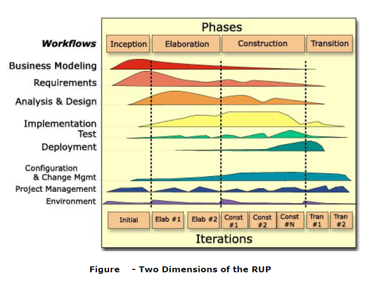

---
title: 统一软件开发过程
date: 2021-02-13 12:32:26
summary: 本文分享对统一软件开发过程RUP的几点深入思考。
tags:
- 软件项目管理
categories:
- 软件工程
---

# RUP

RUP，Rational Unified Process，统一软件开发过程，统一软件过程是一个面向对象且基于网络的程序开发方法论。

RUP是Rational软件公司创造的软件工程方法。RUP描述了如何有效地利用商业的可靠的方法开发和部署软件，是一种重量级过程，因此特别适用于大型软件团队开发大型项目。

# RUP相关问题

RUP的经典图解如下所示，大致上不懂的地方可以查[百度百科](https://baike.baidu.com/item/RUP)，下面介绍几个关于RUP的细节问题（答案在后面）：
1. RUP为何划分为Inception、Elaboration、Construction、Transition四个过程？
2. 图底部，Elaboration和Transition的迭代次数就是2次（Elab#1、Elab#2）吗？
3. 迭代过程中一个阶段的工作流是不是线性的？
4. 图中的波峰波谷代表了什么？
5. 一个迭代过程中的不同颜色面积代表了什么？

参考答案：
1. 这个问题我查了很多比较老的资料，比较合理的解释是：根据不同的**里程碑**划分成了这四个阶段。
    - 目标里程碑
    - (可执行)架构里程碑
    - 性能里程碑
    - 交付产品里程碑
2. 不是的，2个左右代表不多也不少，N个代表很多。这些数值不管是多少，都是虚的数而不是真实的数。
3. 不是的，RUP也是迭代增量的模型而不是线性的模型。迭代过程中的阶段是完全不同的，这些工作流在整个生命周期中一次又一次被访问。9个核心工作流在项目中轮流被使用，在每一次迭代中以不同的重点和强度重复。需要强调的是，活动是贯穿软件开发全过程的。
4. 波峰表示此时工作量极大，波谷表示此时工作量极小（可以想想高等数学中对极大极小和最大最小的区分）。
5. 工作量的大小。

# 统一过程的类抽取

统一过程是用例驱动的。在需求分析阶段，用例以软件产品的类描述。

统一过程有三种类：
- 实体类：实体类为长期存在的信息建模
- 边界类：边界类为软件产品和它的参与者之间的交互行为建模，通常与输入和输出相关
- 控制类：控制类为复杂的计算和算法建模

实体类抽取包括三个迭代和递增地完成的步骤：
- 功能建模：提出所有用例的场景
- 实体类建模：确定实体类和它们的属性，然后确定实体类之间的交互关系和交互行为，以类图的形式提供这个信息
- 动态建模：确定每个实体类或子类执行的操作或对它们的操作，以状态表的形式提供这个信息

然而，对于所有迭代和递增的处理，这三个步骤不总是以这个顺序进行，一个模型中的变化通常引发其他两个模型对应的更改。

与实体类不同，边界类通常容易被抽取。控制类通常和边界类一样易于抽取，通常情况下，每个重要的计算由控制类进行建模。
