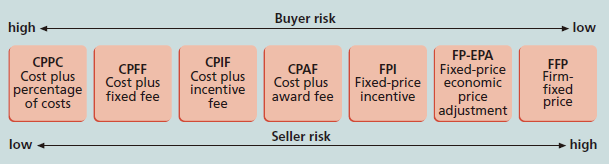

---
title: 采购、外包、合同
date: 2022-03-16 14:57:10
summary: 本文分享IT项目管理中采购、外包、合同的相关内容。
tags:
- 软件项目管理
categories:
- 软件工程
---

# 采购

采购是指从外部资源获得商品和服务，也称购买或外包。采购、购买或外包是从外部渠道来获得货物和服务的。

# 外包

外包是一个组织从外部寻找来源以获取需要的产品和服务。

海外外包有时用来描述安排在另一个国家的外包，即跨国完成的外包工作。
海外外包是全球化发展的必然结果，无论是在境内还是境外，IT项目正越来越多地依靠外包实现。

外包的优势：
- 降低固定的和周期性的成本
- 关注自身核心业务
- 利用外部的经验和技术
- 提供灵活性
- 提高可追责性

外包的威胁：
- 不便控制供应商所开展的项目的细节
- 可能会对某个供应商过度依赖
- 必须小心保护供应商手中会变得易受攻击的战略信息
- 潜在的安全性问题，比如知识产权保护、数据完整性、境外站点基础设施的可靠性

由于外包业务被越来越多的IT项目所使用，因此项目经理应该更熟悉全球化和采购问题。

运作全球化项目的时候，以下关键问题比较重要：
- 沟通
- 信任：通过识别和尊重他人各自所长并重视他们对项目的贡献，立即开始在团队中建立信任是非常重要的。
- 共同的工作方式：使工作过程相一致，与预先商定的工作方式相符合，让每个参与其中的人都感到舒适是非常重要的。
- 工具：沟通工具、协作工具等对工作有积极影响，选择合适的工具非常重要，安全性是选择工具的重要考虑因素。

管理国际项目团队的建议：
- 对国际项目采用更优的项目规范，否则那些在传统项目规范中显现出的问题会在国际项目中因为地理位置的差异而更加严重。
- 全球化思考，本地化行动，目的是在所有项目级别上与项目干系人取得一致。
- 在标准化的基础上考虑合作，以实现目标和项目方法的平衡。
- 确保项目保持冲力，并且能够持续较长时间。
- 考虑使用较新的、可能更有创新性的工具和技术。

# 合同

主要的合同类型：
- 总价合同：对明确定义的产品或服务规定固定总价的合同。由于价格已经确定，买方在此形式下承受的风险最少；买方经常需要进行估算以降低风险，从而使得价格仍具有竞争力。
    - 固定总价合同FFP
    - 总价加经济价格调整合同FP-EPA
    - 总价加激励费用合同FPIF
- 成本补偿合同：包含向供应商支付直接与间接实际成本的合同。
    - 成本加奖励费用合同CPAF：买方付给供应商正常的绩效成本加上基于主观绩效条件的满意程度的奖金。
    - 成本加激励费用合同CPIF：买方付给供应商正常的绩效成本、预订费和激励金。
    - 成本加固定费用合同CPFF：买方付给供应商正常的绩效成本加上一笔固定费用，该费用通常是估计成本的一个百分比。
    - 成本加成本百分比合同CPPC：买方付给供应商正常的绩效成本加上基于总成本的一个预定百分比。
- 时间与材料合同：总价合同和成本补偿合同的混合。

