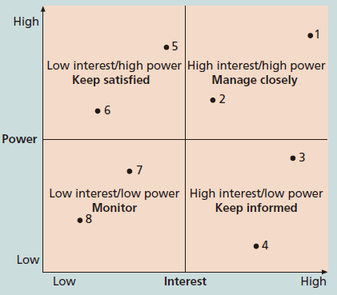

---
title: 项目干系人
date: 2022-03-15 23:58:25
summary: 本文分享项目干系人的相关内容。
tags:
- 软件项目管理
categories:
- 软件工程
---

# 项目干系人

项目干系人是指项目活动所涉及的或者受影响的人，可以来自组织内部，也可以来自组织外部，可能直接参与到项目当中，也可能只受其影响。

内部的项目干系人通常包括项目发起人、项目团队、辅助人员和内部用户。
其他的项目干系人包括高层管理人员、其他职能经理和项目经理等。
因为组织资源是有限的，所以在使用这些有限资源时，项目会影响高层管理人员、其他职能经理和项目经理。这些次要的内部干系人可能并不直接参与项目，但是他们仍然是干系人，因为项目会以某种方式影响他们。

外部的项目干系人包括项目的客户（组织外部）、竞争对手、供应商和别的参与项目或者为项目所影响的外部团体，如政府官员和相关民众。

项目潜在的干系人如下：
- 项目群主管
- 项目群经理
- 项目经理
- 项目经理的家庭
- 发起人
- 客户
- 执行组织
- 组织的其他员工
- 工会
- 项目团队成员
- 项目管理办公室
- 治理委员会
- 供应商
- 政府监管机构
- 竞争对手
- 对项目感兴趣的潜在客户
- 代表消费者、环境或其他利益的组织
- 竞争有限资源的团队或个人
- 追求的目标与本项目不同的团队或个人

干系人可以对项目提出要求、批准项目、拒绝项目、支持项目和反对项目。

项目管理存在**十大知识域**：范围管理、时间管理、成本管理、质量管理、人力资源管理、沟通管理、风险管理、采购管理、干系人管理、综合管理。由于干系人在项目管理的重要性，干系人管理属于项目管理十大知识域之一。
干系人管理的目的是识别项目中所有的人员和组织、分析干系人的期望，并在项目整个生命周期的项目决策内有效地吸引项目干系人的参与。
由于项目管理的目的是达到项目的要求和使干系人满意，所以就需要项目经理花足够的时间来识别、了解和管理与所有干系人的关系，这是非常重要的。
项目经理和他的团队需要和干系人有良好的沟通，用干系人满意的方法解决问题。
任何情况下，项目经理都必须学会识别、理解各种干系人，并和他们一同工作。

项目干系人管理的四个过程：
- 识别干系人
- 干系人管理计划
- 参与干系人管理
- 参与干系人控制

干系人分析的权力/兴趣网络：

# 利益相关者

利益相关者是在软件项目中存在利害关系的人，任何受到系统影响或对系统开发产生影响的人，都是利益相关者。

一般存在两组主要的利益相关者：
- 客户（用户或系统所有者）
- 开发者（分析员、设计员、程序员）

客户是为开发付款并负责决策的人。
即使客户并不总是正确的，开发者也不能随意改变或拒绝客户的需求，任何冲突的、不可行的或非法的需求都必须与客户再次协商。

客户导致项目失败的可能是：
- 客户的需求被误解了，或者没有被完全捕获
- 客户的需求变更的过于频繁
- 客户没有准备为项目提供足够的资源
- 客户不想与开发者合作
- 客户怀有不切实际的期望
- 系统对客户不再有利

随着软件复杂性的增加，人们越来越认识到，开发者的技能和知识是至关重要的。良好的开发者能够交付一个可接受的解决方案；卓越的开发者能够交付一个更优秀的解决方案。

为了确保开发者的杰出和投入，应该做到：
- 雇佣最好的开发者
- 为现有的开发者提供持续的培训和教育
- 鼓励开发者之间进行信息交流和互动，使他们互相促进
- 通过排除阻力以及将他们的精力引导到生产性工作中，来激励开发人员
- 提供一个令人振奋的工作环境
- 将个人目标同组织策略和目标统一起来
- 强调团队工作

# 系统相关人员

说明：**利益相关者≠系统相关人员**！

相关人员是指那些直接或间接从开发的系统中受益的人。

进行相关人员分析有助于发现所有可能的需求源。

识别系统相关人员的方法：
- 发掘系统潜在的最终用户
- 发掘系统打算支持的业务过程描述以及与这些过程相关的人
- 与管理部门讨论，询问谁会受到系统引入的影响
- 考虑使用系统的组织的客户
- 开发人员和运维人员原则上不是系统相关人员，不应写进系统相关人员列表中
- 考虑可能希望给系统添加需求的监管机构和认证机构
