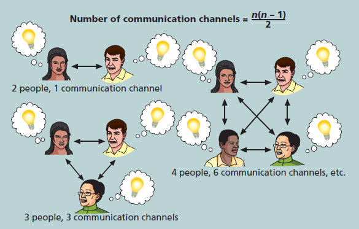

---
title: 项目沟通管理
date: 2022-03-16 01:58:18
summary: 本文分享项目沟通管理的相关内容。
mathjax: true
tags:
- 软件项目管理
categories:
- 软件工程
---

# 项目沟通

许多专家都认为，任何项目（尤其是 IT 项目）成功的最大威胁是沟通失败。 其他知识领域的许多问题，例如范围不明确或时间表不切实际，都表明存在沟通问题。 对于项目经理及其团队来说，将良好的沟通作为优先事项至关重要，尤其是与高层管理人员和其他主要利益相关者的沟通。

IT 领域在不断变化，这些变化伴随着大量的技术术语。当计算机专业人员与不精通或不了解计算机的人（包括许多业务专业人员和高级管理人员的群体）交流时，技术术语通常会使事情复杂化并造成混乱。 尽管当今大多数人都使用计算机，但随着技术的进步，用户和开发人员之间的差距越来越大。 这种知识和经验上的差距导致了技术专业人员和他们的业务同事之间的一些沟通问题。当然，并不是每个计算机专业人士都是沟通不善的人，但任何领域的大多数人都可以提高他们的沟通技巧。

# 形成良好沟通

形成良好沟通的关键要素：
- 关注于个人和团体的沟通需求
    - 意识到自己的沟通风格。
    - 要站在别人的位置上，才能进行真正的沟通。
    - 信息的接收者很难按照发送者希望的那样解释信息。
    - 项目经理和团队必须要有耐心和灵活性，确保人们理解他们的消息，不能沟通过度。、
    - 地理位置和文化背景也影响了项目的沟通复杂性。
- 正规和非正规的沟通方法
    - 提交报告属于正规的沟通方法，但很多人偏爱非正式的沟通，建立互信关系对此有帮助。
    - 口头沟通有助于项目人员和项目干系人之间建立更加紧密的关系，人们喜欢通过互动得到一个关于项目进展程度的真实感受。
    - 有效的创造和分配信息依赖于项目经理和项目团队成员具有良好的沟通技巧。
- 以有效和及时的方式提供重要信息
    - 沟通内容要包括详细的技术信息，这些信息将影响项目开发的产品或服务的重要性能特点。
    - 会议和非正式会谈的口头沟通有助于把重要的积极或消极的信息公开化。
- 为传达坏消息设置阶段
    - 将坏消息放到消息的上下文的合适位置中。
    - 遇到坏消息，要评估情况的影响，考虑替代方案，并根据专业知识给出一些建议。
    - 项目经理应该知道一个主要问题将如何影响组织的底线，并能够利用他们的领导能力来处理挑战。
- 确定沟通渠道的数目
    - 随着人数的增多，人们有更多的渠道或途径去交流，沟通的复杂度就会随之增大，沟通渠道数$=C_{n}^{2}=\frac{n(n-1)}{2}$。
    - 分发信息前，要考虑很多因素，比如组的大小、信息的类型、合适的沟通媒介。

# 管理沟通

- 用技术手段加强信息的创建和分配
    - 如果使用得当，技术可以促进创建和分发信息的过程。
    - 电子邮件、即时通信、网站、电话、手机、短信和其他技术都可以帮助到沟通。
- 选择适当的沟通方法和媒介
    - 沟通方法分为三类：
        - 互助沟通
        - 推送沟通：不管是否需要，都将信息发送或推送给接收者。
        - 拉式沟通：信息应要求发送给接收者。
- 报告绩效
    - 绩效报告使干系人了解资源是如何用于实现项目目标的。
    - 绩效报告的分类：
        - 状态报告：描述在一个特定时间点项目所处的位置。
        - 进度报告：描述在一定时间内项目团队所完成的工作。

# 改进沟通的建议

- 培养更好的沟通技能
    - 沟通技能天赋不同，也可以后天培养。
    - 积极参与公司沟通培训。
    - 领导层要帮助改善沟通。
    - 面对全球化，要尊重不同文化、不同观念的人，学会与之沟通的方法。
- 召开有效的会议
    - 终止不必开的会议。
    - 明确会议的目的和预期的结果。
    - 确定谁应该参加会议。
    - 在开会之前向参加者提供议程。
    - 事先准备分发的印刷品、多媒体辅助设施和后勤安排。
    - 会议专业化。
    - 设置会议的基本原则。
    - 建立关系。
- 有效使用电子邮件、即时信息、文本和协作工具
    - 确定发送电子邮件给恰当的人。
    - 使用有意义的主题从而令读者可以很快地明白邮件包含哪些信息。
    - 每封邮件的内容应该只包含一个主题。
    - 邮件内容应该尽可能清晰和简洁。
    - 发送电子邮件前应该再阅读确认一下，并借助拼音检查功能来检查邮件的拼写是否有误。
    - 尽量减少邮件附件的数目和大小。
    - 删除那些不需要保存和回复的邮件。
    - 确保病毒防护软件是最新的，不打开来源不可靠的垃圾邮件。
    - 尽快回复邮件。
    - 对邮件进行归档分类以便保存查阅。
    - 授权合适的人来分享文档。
    - 确保合适的人可以授权更改共享文档，确保文件已备份。
    - 为组织和归档共享文档开发一个逻辑架构，使用好的文件命名规定为文件夹和文件命名。
- 使用项目沟通模板
