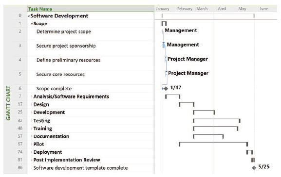

# 甘特图

甘特图提供了一种显示项目进度信息的标准格式，通过以日历的模式列出项目活动及其对应的起止日期。
活动是工作的组成要素，通常出现在[WBS](https://blankspace.blog.csdn.net/article/details/115221806)中，有预计的工期、成本和资源要求。

甘特图上的活动应当与WBS上的活动相一致，应当与活动清单和里程碑清单一致。

软件发行项目的甘特图包含里程碑、概要任务、每人任务的工期和表示任务间依赖关系的箭线。

甘特图上的符号说明：
- 里程碑：用黑色菱形表示，是项目中一个通常没有工期的重要事件，工期包括活动上花费的实际时间和占用时间。
- 概要任务：用头尾都有箭头的粗黑条表示，被进一步分解的子任务。
- 每个单独任务的工期：浅灰色横条表示。
- 任务之间的关系或依赖：连接各符号之间的箭线。

工期和人工量不同：
- 工期包括活动上花费的实际时间和占用时间。
- 人工量是完成任务所需要的工作天数或者工作小时数。

里程碑的指导原则被称为SMART原则：special、measurable、assignable、realistic、time-framed。

# 网络图

网络图是项目活动之间的逻辑关系或者顺序的示意性表示。

下图的字母A到J表示为了完成项目而开展的具有依赖关系的活动，这些活动来自于WBS和前面定义的活动定义过程。

网络图的格式使用的是双代号网络图AOA或者箭线图法ADM。在该图中活动用箭头表示，并将节点连接起来，表示活动的序列。节点表示一个活动的开始和结束，第一个节点表示项目的开始，最后一个节点表示项目的结束。

网络图表示的是那些完成项目所必须执行的活动，只有与活动有关的依赖项需要显示。

构建AOA网络图的流程：
1. 找出从节点1开始的所有的活动，把节点1和每个结束节点之间用箭线连接起来。
2. 按照从左到右的顺序绘制网络图，注意分叉和合并。
3. 继续画AOA网络图直到所有的活动都被包含在图上。
4. 调整AOA图的格式。

任务依赖：两个链接任务之间的关系本质，即通过定义任务完成和开始日期时间的依赖关系来连接它们。

依赖或关系与项目活动或任务的排序相关。

为项目活动之间创建依赖有三个基本原因：
- 强制依赖：项目工作中内在的一种关系，某些时候被称为硬逻辑。
- 自由依赖：项目团队定义的项目活动之间的关系。
- 外部依赖：涉及项目和非项目活动之间的关系。

| 任务依赖 | 示例 | 描述 |
|:----:|:----:|:----:|
| 完成-开始(FS) |  | 任务A完成前任务B不能开始 |
| 开始-开始(SS) |  | 任务A开始前任务B不能开始 |
| 完成-完成(FF) |  | 任务A完成前任务B不能完成 |
| 开始-完成(SF) |  | 任务A开始前任务B不能完成 |

前导图比箭线图的优势在于：
- 多数项目管理软件使用前导图。
- 前导图法避免了虚活动的需要。虚活动没有工期而且没有资源，但是有时需要在AOA网络图上用虚活动表示活动之间的逻辑关系，它们是用虚的箭线表示的，工期估算为零。
- 前导图法表示了任务间的不同依赖，而AOA网络图只使用了FS依赖。

前导图的规则要求：
1. 前导图必须正确表达项目中活动之间的逻辑关系。
2. 在图中不能够出现循环回路。
3. 在图中不能出现双向箭头或无箭头的连线。
4. 图中不能出现无箭尾节点的箭线或无箭头节点的箭线。
5. 图中只能有一个起始节点和一个终止节点。 

# 关键路径法

**关键路径法**CPM是一种网络图技术，用来预测整个项目的工期，可用于防止项目超期。

项目的关键路径决定了项目最早完成时间的活动序列，是网络图的最长路径，其时差或者浮动时间最少。

**时差**或**浮动时间**指的是在不延误后继活动或者项目完成时间的情况下，任务可以推后的时间。

在项目中通常有多个任务同时进行，而且多数项目都有多条通过网络图的路径，最长路径或者包含关键人物的路径决定着项目的完成日期，知道完成了所有的任务，才能完成项目。

为了寻找关键路径，必须先开发一个符合标准的网络图，它需要基于WBS的符合标准的活动清单。
创建网络图后，估计每个活动的工期可以确定关键路径。
计算关键路径包括在每个通过网络图的路径上将工期累加起来，最长的路径就是关键路径。

即使关键路径是最长的路径，它也表示完成项目的最短时间。如果关键路径上的一个或者多个活动比计划的长，那么整个项目进度将延后，除非项目经理采取正确的行动。

关键路径仅仅与项目的时间维有关，“关键”并不意味着它所包含的所有的关键活动。

项目的关键路径并不唯一，可能有多条关键路径。
项目经理理应监控关键路径上活动的执行情况以避免项目完工的延误，如果有多个关键路径，项目经理必须保证关注所有的关键路径。

一个项目的关键路径可以随着项目的进展而改变。

了解关键路径如何贯穿项目生命周期是非常重要的，这样项目经理可以进行进度平衡。
如果项目经理知道关键路径上的一个任务是落后于进度的，那么项目经理需要知道如何去处理。

能够帮助项目经理进行**进度平衡**的一个技术是确定自由时差和每个项目活动的总的时差。

**自由时差**或**自由浮动时间**是一个活动在不延误紧接活动的最早开始时间的情况下可以被拖延的时间。

一个活动的最早开始时间是基于项目网络逻辑可以开始的最早的可能时间。

**总时差**或**总浮动时间**是一个活动从它最早时间起，在没有拖延计划项目完成日期的情况下被耽搁的时间。

项目经理通过在网络上正推和逆推来计算自由时差和总时差。
**正推法**用来确定每个活动的最早开始时间和最早完成时间。
一个活动的最早完成时间是基于项目网络逻辑最早可能完成的时间。
项目开始的时间就是第一个网络图活动的**最早开始时间**。
最早开始时间加上第一个活动的工期就等于第一个活动的**最早完成时间**。
当一个活动有几个前导活动的时候，它的最早开始时间是这些前导活动最晚的哪项活动最早完成时间。
**逆推法**可用来确定最晚开始时间和最晚完成时间。
一个活动的**最晚开始时间**是一个活动在不延迟项目完成时间的最晚可能开始时间。
一个活动的**最晚完成时间**是一个活动在不延迟项目完成时间的最晚可能完成的时间。

项目经理可以手工决定每个活动的最早和最晚的开始和完成时间。

干系人通常想缩短项目进度估算。项目经理可以通过定义活动、确定排序和估算每个任务的资源和工期，来尽可能好地制定项目进度。

通过识别出关键路径，项目经理及其团队可以使用工期压缩技术来缩短项目的进度，该技术用来减少关键路径上的活动工期。项目经理通过给这些活动分配更多的资源或者改变它们的范围，来缩短关键路径上的活动工期。

**赶工**是一种为了以最少的成本最大限度地压缩工期，而在成本与进度之间进行均衡的技术。
赶工的优点是缩短完成项目的时间。
赶工的主要缺点是通常提高项目的成本。

**快速跟进**是另一种缩短项目进度的方法。
快速跟进包括并行执行那些通常顺序执行的活动。
快速跟进的主要优点像赶工一样，可以缩短时间来完成项目。
快速跟进的的主要缺点是可能最后延误项目的进度，因为太早开始一些任务通常会增加项目的风险，并且导致返工。

除了在项目的开始找出关键路径外，重要的是实际的数据来更新进度。项目团队完成活动后，项目经理应该记录下这些活动的实际工期，他也应当记录下正在进行或者将要开展的活动的修订估算，这些修订通常会造成项目的关键路径的改变，导致产生一个新的项目完成工期。积极主动的项目经理和他的团队紧紧把握变更，从而能够做出决定，并且让干系人知道和参与主要的项目决定。

# 三点估算

三点估算

最可能持续时间：最可能持续时间是在为计划活动分派的资源、资源生产率、可供该计划活动使用的现实可能性，对于其他参与者的依赖性，以及可能的中断都已给定时，该计划活动的持续时间。

乐观持续时间：当估算最可能持续时间依据的条件形成最有利的组合时，估算出来的持续时间就是活动的乐观持续时间。

悲观持续时间：当估算最可能持续时间依据的条件形成最不利的组合时，估算出来的持续时间就是活动的悲观持续时间。

$活动时间期望值=\frac{乐观持续时间+4\times最可能持续时间+悲观持续时间}{6}$

$活动时间方差=(\frac{悲观持续时间-乐观持续时间}{6})^{2}$
