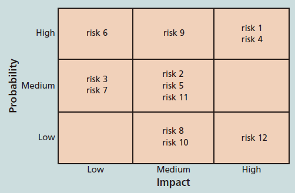
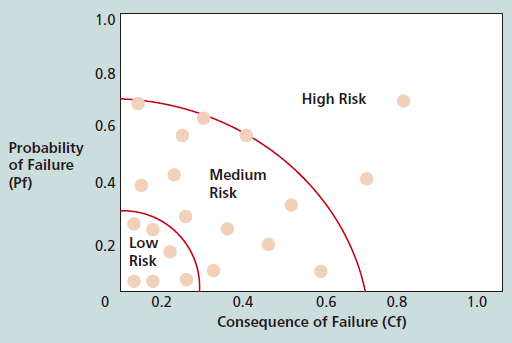
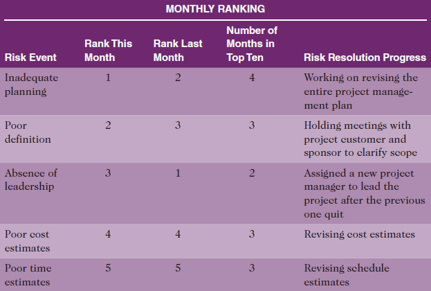
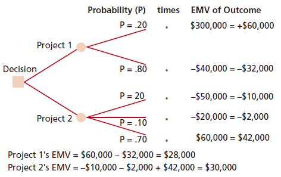
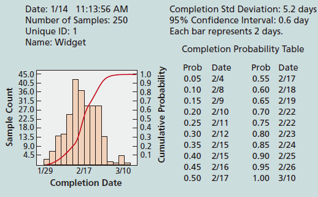

---
title: 项目风险分析
date: 2022-03-17 17:29:51
summary: 本文分享项目风险分析的相关内容。
tags:
- 软件项目管理
categories:
- 软件工程
---

# 风险定性分析

风险定性分析包括评估已识别风险的可能性和概率，确定其大小和优先级。

定性风险分析的主要输出是更新风险记录表。风险记录表的次序栏应该填入数值或者高、中、低等级来表征风险事件的影响度和概率值。通常为风险事件添加额外的信息，比如需要更多关注近期或那些可以放置在观察名单中的风险的识别。观察名单是那些优先级低、仍被认为是有潜在风险的风险列表。

## 概率/影响矩阵

概率/影响矩阵在矩阵的一边或图表的一个轴列出风险发生的相对概率，另一边或另一个轴列出风险发生的相对影响。

一些常见的风险可以合并，再决定这些风险在矩阵和图表上的位置。

应该为[负面和正面的风险](https://blankspace.blog.csdn.net/article/details/123516705)各创建一个概率/影响矩阵，保证两种类型的风险都能被充分分析。

团队要重视落在较高发生概率和较高影响区域内的风险。

基于具体事件的发生概率和事件发生时对项目的影响，可以得到表征特定事件总体风险的数值，被称为风险因子。

风险因子利用了表示风险发生概率和风险影响或后果的概率/影响矩阵。

由于风险发生的概率是由每个项目特有的性质所决定，所以基于几个因素可以进行估计。例如，用来估计硬件或软件的潜在风险的因素包括不成熟的技术、过于复杂的技术和开发技术的支撑基础不够充分。风险发生的影响包括退路解决方案的可获得性，或无法满足绩效、成本和进度估计所带来的后果。

## 风险事项跟踪

风险事项跟踪一般需要确定TopN的N是多少，除了可以识别风险之外，还能够通过监控风险在整个项目生命周期内保持风险意识。

管理部门或客户据此定期审查项目最重大的风险事项，对项目N大风险来源进行汇总，从而开始审查。这种汇总包括各风险事项目前的级别、以前的级别、在一段时间内出现在列表上的次数以及从上次审查以来解决这一风险事项所取得的进展。

风险审查的目的：
- 使管理层和客户意识到妨碍或帮助项目成功的主要影响因素。
- 通过客户参与，项目团队也许能够考虑一些减轻风险的备选方案。
- 作为一种增加管理团队信心的手段。

# 风险定量分析

风险定量分析通常是在风险定性分析之后进行的，可以一同或分开进行。

风险定量分析的主要技术包括数据收集、风险定量分析、建模技术、专家判定。

量化风险分析的主要成果是更新风险登记表，例如修正风险级别或者隐藏在这些风险级别后更为详细的信息。量化分析也可以根据达到某个项目目标的概率提供相应的高层信息。这个信息可以使项目经理在应急储备金中做出一定的修改。一些情况下，根据量化分析，一些项目可能被改变方向或者取消，或者创建新的项目以帮助当前的项目。

## 决策树

决策树是一种图形方法，可以帮助在未来结果不确定的情况下选择最好的行动路径。

决策树分析的一种较为常用常用的应用是计算预期货币值。
预期货币值是风险事件概率和风险事件货币值的乘积。

为了建立决策树，计算预期货币值，必须估计某种事件发生的概率或机会，概率通常由专家评估决定。

为了计算各项目的预期货币值，可以将各项目的各种可能结果与概率相乘再求和，所谓加权求和。

## 模拟

模拟是指用系统的模型或表示法来分析系统的预期行为或绩效。

大多数模拟都以某些形式的蒙特卡洛分析为基础。
蒙特卡洛分析通过多次模拟一个模型的结果，来提供结果的统计分布。

项目风险分析的量化应用蒙特卡洛模拟能够预测在某个日期前完成的概率，或成本小于等于某个值的概率。

基本步骤如下：
1. 评估所考虑变量的范围收集最可能的、乐观的、悲观的估计值。
2. 决定每个变量的概率分布。
3. 为每个变量根据概率分布选择一个随机值。
4. 利用为每个变量选定的数值组合进行确定性分析，或一次通过模型。
5. 多次重复3.和4.，获得个模型的概率分布。重复次数取决于变量的个数，一般在100\~1000之间。

## 灵敏度分析
灵敏度分析，是研究与分析一个系统（或模型）的状态或输出变化对系统参数或周围条件变化的敏感程度的方法。

灵敏度分析通过改变一个或多个变量观察其对结果的影响。如果改变了系统参数后，引起这个模型（公式）输出的变化的程度不大，则说明模型稳定性较强（即灵敏性较差），反之则相反！

# 风险管理计划

Project Name: 
1. Methodology
2. Roles and Responsibilities
3. Budget and Schedule
4. Risk Categories
5. Risk Probability and Impact
6. Risk Documentation
