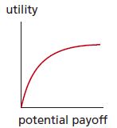
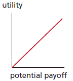
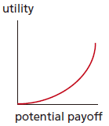
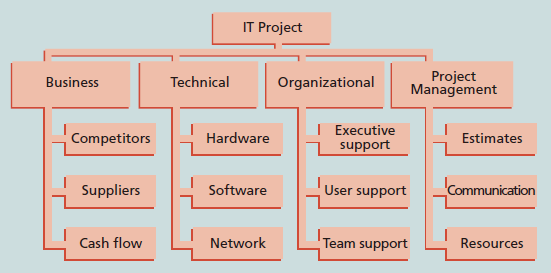

---
title: 项目风险管理
date: 2022-03-16 03:07:50
summary: 本文分享IT项目风险和风险管理的基本内容。
tags:
- 软件项目管理
categories:
- 软件工程
---

# 项目风险

IT项目风险是可能对项目产生负面或正面影响的不确定性。

项目风险可能是已知的，也可能是未知的。
已知风险描述了项目团队已经识别和分析的风险，对于已知风险可以主动地开展管理。未知风险描述了项目团队未曾识别和分析的风险，不好管理。

项目风险未必都是消极的，也可能是积极的。
消极风险管理包含一系列行动，项目经理在项目中尽量避免、减少、改变或接受风险的潜在影响。积极风险管理像在投资机会。

组织和个人都应该在项目的各个方面以及个人生活中寻求风险和机会的平衡。

不同的组织和个人对风险有不同的承受力。
- 风险偏好：实体为了获得期望的回报意愿承担的不确定性程度。
- 风险承受力：在项目或业务目标的潜在影响中实体能够接受的最大的偏差。

如果项目风险在可接受范围，且承担这种风险与项目最终回报能够打成平衡，这个项目才会被接受。

风险效用：从潜在回报中得到的满意度。

| 风险效用类型 | 风险效用函数 | 说明 |
|:----:|:----:|:----:|
| 风险厌恶型 |  | 从风险活动中获得的满意会越来越少 |
| 风险中性型 |  | 
| 风险喜好型 |  | 对风险有很高的承受力，而且当更多的回报处于风险中时，其满意度会增加 |

# 项目风险管理

风险管理是一种投资，会产生相关的投资。
一个组织愿意在风险管理活动中进行投资，取决于项目的本质、项目团队的经验，及两者之上的约束条件。

项目风险管理是关于识别、分析、响应项目全生命周期内的风险，并最好地满足项目目标的科学与艺术，对选择项目、确定项目范围和编制现实的进度计划和成本估算有着积极的影响。
项目风险管理的目标可以被视为使潜在的负面风险最小化的同时又要使潜在的正面风险最大化。

项目风险管理涉及的主要过程：
- 计划风险管理
- 识别风险
- 实施定性风险分析
- 实施定量风险分析
- 计划风险响应
- 控制风险

IT项目成功潜在要素：
- 用户参与
- 行政管理支持
- 清晰的需求说明书
- 合适的计划
- 现实的期望
- 相对小的项目里程碑
- 合适的队伍
- 所有权
- 清晰的视角和目标
- 努力工作、专心的队伍

# 识别风险

各个知识域的潜在负面风险条件如下：
- 综合
    - 不充分的计划
    - 较少的资源
    - 较差的综合管理
    - 缺乏后续审查
- 范围
    - 对于范围和工作任务的界定不明确
    - 不完全的界定
- 时间
    - 对可用资源或时间的错误评估
    - 对关键路径的决策错误
    - 对周转资金分配和管理的不力
    - 较早发布的竞争产品
- 成本
    - 错误估计
    - 不够充足的生产力、成本、变更或紧急事件
- 质量
    - 对待质量的态度不够
    - 不合乎标准的设计/材料/工艺
    - 质量保证程序不足
- 人力资源
    - 冲突管理不力
    - 交叉的项目组织和责任界定
    - 领导力的缺乏
- 沟通
    - 对于计划或沟通的忽视
- 风险
    - 忽视风险
    - 风险分析不清楚
    - 缺乏管理保证程序
- 采购
    - 无法执行的条件或合同条款
    - 对抗关系
- 干系人
    - 与关键干系人缺乏协商

识别风险的方法：
- 头脑风暴：团队通过本能地、不加判断地汇集一些想法，产生新的观点或找出解决某一特定问题的方案。
- 访谈：通过面对面、电话、电子邮件、即时通信讨论，收集信息、寻求事实。
- SWOT分析
- 检查表：基于以前项目中所遇到的风险，给出了解当前项目风险的模板。
- 分析项目的假设以确保它们的有效性。
- 图表手段：因果图、流程图、影响图。

识别风险的成果：风险等级表
- 每个风险事件的标号
- 风险事件的级别
- 风险事件的名称
- 风险事件的描述
- 风险事件的分类
- 风险根源
- 每个风险的触发器
- 每个风险的潜在响应
- 风险责任人
- 风险发生概率
- 风险影响
- 风险状态

## 风险分解结构

风险分解结构是分析潜在风险来源的有效工具，和WBS的结构类似。

除了依据项目或产品的特性识别风险外，同样需要根据项目管理知识域，如范围、时间、成本和质量，来识别潜在的风险。

# 响应风险

应对负面风险的基本措施：
- 风险规避：消除某一具体威胁，采用消除其原因的方法进行。
- 风险承担：当风险发生时接受其带来的后果。
- 风险转移：将风险的结果及其管理责任转移到第三方。
- 风险缓解：通过减少风险事件发生的概率来环节风险事件的影响。

应对正面风险的基本措施：
- 风险开发：采取措施确保积极的风险发生。
- 风险共享：把风险所有权分配给另外一方。
- 风险增强：通过识别和最大化正面风险的关键驱动因素来增大机会。
- 风险承担：当项目团队不能活选择不去采取任何行动时可用。

缓解项目技术、成本和进度风险的一般策略：
- 技术风险
    - 强调团队支持，避免独立的项目结构
    - 增加项目经理的权限
    - 改善问题处理和沟通
    - 提高项目监控的频率
    - 使用WBS和CPM
- 成本风险
    - 提高项目监控的频率
    - 使用WBS和CPM
    - 改善沟通，理解项目目标，团队支持
    - 增加项目经理权限
- 进度风险
    - 提高项目监控的频率
    - 使用WBS和CPM
    - 选择最有经验的项目经理

# 风险计划

风险计划中着重强调的主题：
- 方法论
- 角色和责任
- 预算和进度
- 风险种类
- 风险概率和影响
- 改进干系人承受力
- 追踪
- 风险文档

应急计划：如果所识别的风险事件发生，项目团队会才去的预先规定的措施。

退路计划：对项目目标的完成具有很大影响的风险编制计划，如果降低风险的措施无效将实施这个计划。

应急储备金/应急津贴：由项目发起人或组织所提供的储备，用于将项目成本或进度超出预期的风险降低到可接受的程度。

管理储备金：为了管理控制未知风险而设立，不是成本基线的一部分，但它们是项目预算和资金需求的一部分。
