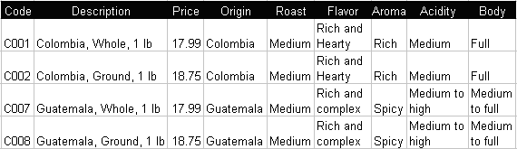
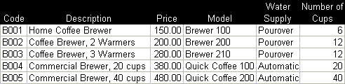
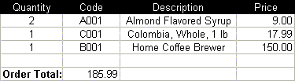
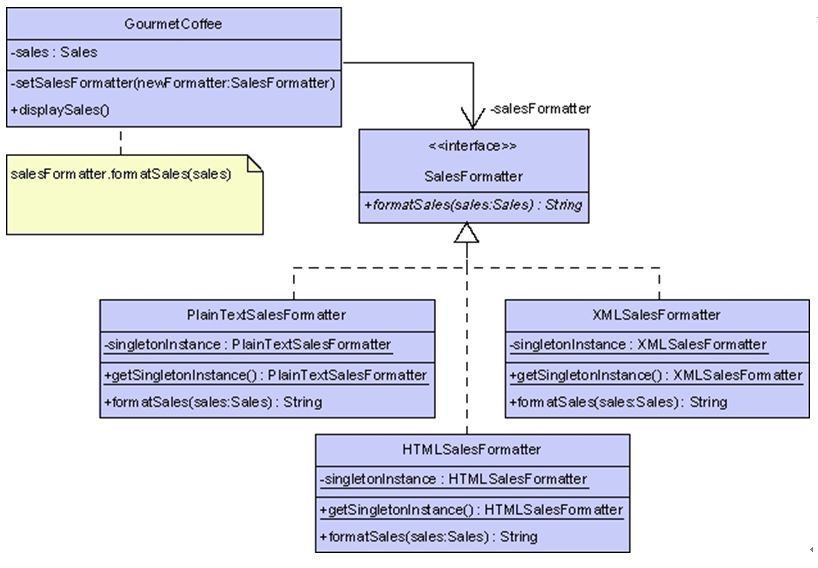
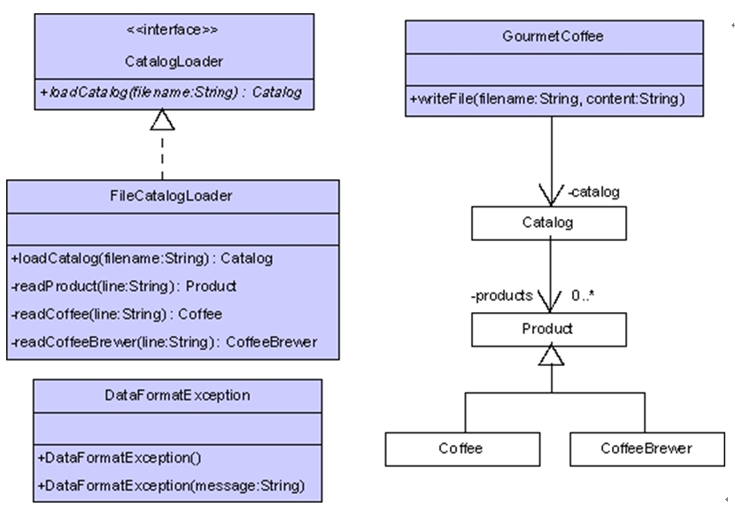

---
title: Gourmet咖啡系统建模与实现
date: 2021-03-11 21:09:21
summary: 本文分享Gourmet咖啡系统建模与实现。
tags:
- 面向对象
- 软件工程
categories:
- 软件工程
---

# Modeling the Gourmet Coffee System

## Prerequisites, Goals, and Outcomes

***Prerequisites***: Before you begin this exercise, you need mastery of the following: 
- UML
  - Knowledge of class diagram notation 
- Object-Oriented Design
  - Knowledge of modeling concepts: 
    - Identifying classes 
    - Identifying relationships between classes 
    - Identifying class attributes 
    - Identifying class methods 

***Goals***: Reinforce your object-oriented design skills 

***Outcomes***: You will master the following skills: 
- Produce a UML class diagram, from a specification, that shows: 
  - classes 
  - attributes 
  - methods 
  - relationships 
 
 
***Background*** 
This assignment asks you to model a coffee store application. 

***Description***
Gourmet Coffee is a store that sells coffee from countries around the globe. It also sells coffee brewing machines（咖啡冲泡机） and other accessories for coffee consumption（咖啡消费配件）. The Gourmet Coffee System maintains a product catalog, processes orders, and tracks the store's sales. 

The catalog maintains the following information about the store's products:

- Coffee 
  - Code 
  - Description  
  - Price  
  - Country of origin 
  - Type of roast  
  - Flavor 
  - Aroma 
  - Acidity 
  - Body  

- Coffee brewer  
  - Code 
  - Description 
  - Price 
  - Model of the brewer  
  - Type of the water supply: Pour-over or Automatic 
  - Capacity: number of cups 
- Coffee accessory  
  - Code 
  - Description 
  - Price 

The following tables show some of the products sold by Gourmet Coffee. 


*Figure 1 Coffee* 


*Figure 2 Coffee brewers*


*Figure 3 Coffee accessories*

The Gourmet Coffee System processes orders. An order contains a list of products, their quantities, and the total cost. The following is an example of an order:


*Figure 4 Order*

In the Gourmet Coffee System, the user can:
- Display the catalog: lists the code and description of each product 
- Display a product 
- Display the current order: lists quantity, code, and price of each product in the current order, and the total of the order. 
- Add a product to the current order—if the specified product is already part of the order, this command will modify the quantity of that product 
- Remove a product from the current order 
- Register the sale of the current order—this command adds the order to the store's sales and empties the current order 
- Display the sales: lists all the orders that have been sold 

Run the sample executable that is provided to learn more about the Gourmet Coffee System.

***Files***
Following is a sample executable of the Gourmet Coffee System.
- gourmet-coffee-sample-executable.jar — Download this file now. It is a sample executable. 

***Tasks*** 
These steps will guide you for completing this assignment:
- First, run the sample executable by issuing the following command at the command prompt: 
C:\>java -jar gourmet-coffee-sample-executable.jar
- Then, follow the technique described in page 1.2.5 Modeling Classes to model the Gourmet Coffee System. 
  - Identify the following:
      - The classes 
      - The association relationships (include direction, multiplicity, and association attribute) 
      - The specialization/generalization relationships 
      - The attributes of each class 
      - The methods of each class 
  - Your class diagram should include:
    - The class of the gourmet coffee application 
    - The accessor methods 
    - The mutator methods if are needed 
    - For the collections: 
      - The methods to add and access elements 
      - The methods to remove elements if are needed 
    - The methods that compute other values not included in the attributes. 
Use Sun's coding conventions when naming classes, methods, and attributes.
- Use Eclipse, Violet, PowerPoint, or another tool of your choosing to draw a UML class diagram. 
- Save the UML class diagram in a SVG, GIF, or JPG format in a file named uml-gou-cof. 

***Submission***
Upon completion, submit only the SVG, GIF, or JPG file uml-gou-cof. The extension of this file will depend on the tool used to create the diagram. 

## Product类

```java
/**
 * Product is created to be used as the super class.
 * @author BlankSpace
 * @version 2.0
 */
public class Product {

    private String code;
    private String description;
    private double price;

    public Product(String code, String description, double price) {
        this.code = code;
        this.description = description;
        this.price = price;
    }

    public String getCode() {
        return this.code;
    }

    public String getDescription() {
        return this.description;
    }

    public double getPrice() {
        return this.price;
    }

    //Identifying whether objects are equal by code.
    @Override
    public boolean equals(Object product) {
        return (product instanceof Product) && (this.getCode().equals(((Product)product).getCode()));
    }

    @Override
    public String toString() {
        return this.getCode() + "," + this.getDescription() + "," + this.getPrice();
    }

}
```

## Coffee类

```java
/**
 * Coffee is Product's subclass. It represents a type of Products which is something special.
 * @author BlankSpace
 * @version 2.0
 */
public class Coffee extends Product {

    private String countryOfOrigin;
    private String typeOfRoast;
    private String flavor;
    private String aroma;
    private String acidity;
    private String body;

    public Coffee(String code, String description, double price, String countryOfOrigin, 
            String typeOfRoast, String flavor, String aroma, String acidity, String body) {
        super(code, description, price);
        this.countryOfOrigin = countryOfOrigin;
        this.typeOfRoast = typeOfRoast;
        this.flavor = flavor;
        this.aroma = aroma;
        this.acidity = acidity;
        this.body = body;
    }

    public String getCountryOfOrigin() {
        return this.countryOfOrigin;
    }

    public String getTypeOfRoast() {
        return this.typeOfRoast;
    }

    public String getFlavor() {
        return this.flavor;
    }

    public String getAroma() {
        return this.aroma;
    }

    public String getAcidity() {
        return this.acidity;
    }

    public String getBody() {
        return this.body;
    }

}
```

## CoffeeBrewer类

```java
/**
 * CoffeeBrewer is Product's subclass. It represents a type of Products which is something special.
 * @author BlankSpace
 * @version 2.0
 */
public class CoffeeBrewer extends Product {

    private String modelOfTheBrewer;
    private String typeOfTheWaterSupply;
    private int    numberOfCups;

    public CoffeeBrewer(String code, String description, double price, 
            String modelOfTheBrewer, String typeOfTheWaterSupply, int numberOfCups) {
        super(code, description, price);
        this.modelOfTheBrewer = modelOfTheBrewer;
        this.typeOfTheWaterSupply = typeOfTheWaterSupply;
        this.numberOfCups = numberOfCups;
    }

    public String getModelOfTheBrewer() {
        return this.modelOfTheBrewer;
    }

    public String getTypeOfTheWaterSupply() {
        return this.typeOfTheWaterSupply;
    }

    public int getNumberOfCups() {
        return this.numberOfCups;
    }

}
```

## OrderItem类

```java
/**
 * An orderItem contains one certain type of product and the quantity of user needs.
 * The class's objects will be added into an order's item list.
 * @author BlankSpace
 * @version 2.0
 */
public class OrderItem {

    private Product product;
    private int     quantity;

    public OrderItem(Product product, int quantity) {
        this.product = product;
        this.quantity = quantity;
    }

    public Product getProduct() {
        return this.product;
    }

    public void setQuantity(int quantity) {
        this.quantity = quantity;
    }

    public int getQuantity() {
        return this.quantity;
    }

    /**
     * to calculate the cost of purchasing the product
     * @return the result
     */
    public double getValue() {
        return this.getProduct().getPrice() * this.getQuantity();
    }

    @Override
    public String toString() {
        return this.getQuantity() + "," + this.getProduct().getCode() + "," + this.getProduct().getPrice();
    }

}
```
## Order类

```java
import java.util.ArrayList;

/**
 * the class which saves a certain order's all orderItems
 * @author BlankSpace
 * @version 2.0
 */
public class Order {

    // to save all orderItems.
    private ArrayList<OrderItem> orderItemList = new ArrayList<>();

    /**
     * to add the orderItem to the list.
     * @param orderItem
     */
    public void addOrderItem(OrderItem orderItem) {
        this.orderItemList.add(orderItem);
    }

    /**
     * to delete the orderItem which user wants to delete.
     * @param orderItem
     */
    public void removeOrderItem(OrderItem orderItem) {
        this.orderItemList.remove(orderItem);
    }

    /**
     * @return the list which saves all orderItems
     */
    public ArrayList<OrderItem> getAllOrderItem(){
        return this.orderItemList;
    }

    /**
     * to search the orderItem which user wants to find in the list.
     * @param product
     * @return the orderItem which user wants to find
     */
    public OrderItem getOrderItem(Product product) {
        for (OrderItem orderItem : orderItemList) {
            if (orderItem.getProduct().equals(product)) {
                return orderItem;
            }
        }
        return null;
    }

    /**    
     * @return the number of orderItems which are saved in the list.
     */     
    public int getNumberOfOrderItems() {
        return this.orderItemList.size();
    }

    /**
     * to sum all the orderItems' value in the list.
     * @return the sum of all the orderItems' value.
     */
    public double getValue() {
        double value = 0.0;
        for (OrderItem orderItem : orderItemList) {
            value += orderItem.getValue();
        }
        return value;
    }

}
```

## Catalog类

```java
import java.util.ArrayList;

/**
 * Catalog is created to save all the product's item.
 * @author BlankSpace
 * @version 2.0
 */
public class Catalog {

    private ArrayList<Product> products;
    
    public Catalog() {
        products = new ArrayList<>();
    }

    /**
     * to add the type of products to the list.
     * @param product
     */
    public void addProduct(Product product) {
        this.products.add(product);
    }

    /**
     * to search the product which user wants to find in the list.
     * @param code
     * @return the product which user wants to find.
     */
    public Product getProduct(String code) {
        for (Product product : products) {
            if (product.getCode().equals(code)) {
                return product;
            }
        }
        return null;
    }

    /**
     * @return the list which saves all kinds of products.
     */
    public ArrayList<Product> getAllProduct() {
        return this.products;
    }

    /**
     * @return the number of product categories which are saved in the list.
     */
    public int getNumberOfProducts() {
        return this.products.size();
    }

}
```

## Sales类

```java
import java.util.ArrayList;

/**
 * the class which can save all orders.
 * @author BlankSpace
 * @version 2.0
 */
public class Sales {

    //to save all orders.
    private ArrayList<Order> orders = new ArrayList<>();

    /**
     * to add the order to the list.
     * @param order
     */
    public void addOrder(Order order) {
        this.orders.add(order);
    }

    /**
     * @return the list which saves all orders
     */
    public ArrayList<Order> getAllOrder(){
        return this.orders;
    }
    
    /**
     * @return the number of orders which are saved in the list.
     */
    public int getNumberOfOrders() {
        return this.orders.size();
    }

}
```

## GourmetCoffeeSystem类

```java
import java.io.IOException;
import java.text.NumberFormat;
import java.util.Scanner;

/**
 * 程序包的可运行部分
 * 使用了单例模式
 * 实际上唯一存在的实例有catalog、currentOrder、sales三个属性
 * @author BlankSpace
 * @version 2.0 
 */
public class GourmetCoffee {

    //静态初始化块
    static {
        CURRENCY = NumberFormat.getCurrencyInstance();
    }
    
    //用于后面格式化字符串
    private static final NumberFormat CURRENCY;
    //用于表示唯一的实例(实现单例模式)
    private static GourmetCoffee coffeeSystem = new GourmetCoffee(load());
    //用于获取整个程序体的输入
    private static Scanner scanner = new Scanner(System.in);
    //GourmetCoffeeSystem的三个属性:catalog、currentOrder、sales
    private Catalog catalog;
    private Order   currentOrder;
    private Sales   sales;
    
    //private修饰的构造器
    private GourmetCoffee(Catalog catalog) {
        this.catalog = catalog;
        this.currentOrder = new Order();
        this.sales = new Sales();
    }

    //main方法，程序的入口
    public static void main(String[] args) throws IOException {
        coffeeSystem.run();
    }

    /**
     * 执行初始化，把信息存入Catalog的实例中
     * @return 所有的产品信息
     */
    private static Catalog load() {
        Catalog catalog = new Catalog();
        
        //这里利用了OOP中的多态：相当于Product product = new Coffee(......);......
        catalog.addProduct(new Coffee("C001", "Colombia, Whole, 1 lb",         17.99, "Colombia",             
                "Medium", "Rich and Hearty", "Rich", "Medium", "Full"));
        catalog.addProduct(new Coffee("C002", "Colombia, Ground, 1 lb",        18.75, "Colombia",             
                "Medium", "Rich and Hearty", "Rich", "Medium", "Full"));
        catalog.addProduct(new Coffee("C003", "Italian Roasts, Whole, 1 lb",   16.80, "Latin American Blend", 
                "Italian Roast", "Dark and heavy", "Intense", "Low", "Medium"));
        catalog.addProduct(new Coffee("C004", "Italian Roasts, Ground, 1 lb",  17.55, "Latin American Blend", 
                "Italian Roast", "Dark and heavy", "Intense", "Low", "Medium"));
        catalog.addProduct(new Coffee("C005", "French Roasts, Whole, 1 lb",    16.80, "Latin American Blend", 
                "French Roast", "Bittersweet, full intense", "Intense, full", "None", "Medium"));
        catalog.addProduct(new Coffee("C006", "French Roasts, Ground, 1 lb",   17.55, "Latin American Blend", 
                "French Roast", "Bittersweet, full intense", "Intense, full", "None", "Medium"));
        catalog.addProduct(new Coffee("C007", "Guatemala, Ground, 1 lb",       17.99, "Guatemala",            
                "Medium",  "Rich and complex", "Spicy", "Medium to high", "Medium to full"));
        catalog.addProduct(new Coffee("C008", "Guatemala, Ground, 1 lb",       18.75, "Guatemala",            
                "Medium",  "Rich and complex", "Spicy", "Medium to high", "Medium to full"));
        catalog.addProduct(new Coffee("C009", "Guatemala, Whole, 1 lb",        19.99, "Sumatra",              
                "Medium", "Vibrant and powdery", "Like dark chocolate", "Gentle", "Rich and full"));
        catalog.addProduct(new Coffee("C010", "Guatemala, Ground, 1 lb",       20.50, "Sumatra",              
                "Medium", "Vibrant and powdery", "Like dark chocolate", "Gentle", "Rich and full"));
        catalog.addProduct(new Coffee("C011", "Special Blend, Whole, 1 lb",    16.80, "Latin American Blend", 
                "Dark roast", "Full, roasted flavor", "Hearty", "Bold and rich", "Full"));
        catalog.addProduct(new Coffee("C012", "Special Blend, Ground, 1 lb",   17.55, "Latin American Blend", 
                "Dark roast", "Full, roasted flavor", "Hearty", "Bold and rich", "Full"));
        
        catalog.addProduct(new CoffeeBrewer("B001", "Home Coffee Brewer",          150.0,
                "Brewer 100", "Pourover", 6));
        catalog.addProduct(new CoffeeBrewer("B002", "Coffee Brewer, 2 Warmers",    200.0, 
                "Brewer 200", "Pourover", 12));
        catalog.addProduct(new CoffeeBrewer("B003", "Coffee Brewer, 3 Warmers",    280.0, 
                "Brewer 210", "Pourover", 12));
        catalog.addProduct(new CoffeeBrewer("B004", "Commercial Brewer, 20 cups",  380.0, 
                "Quick Coffee 100", "Automatic", 20));
        catalog.addProduct(new CoffeeBrewer("B005", "Commercial Brewer, 40 cups",  480.0, 
                "Quick Coffee 200", "Automatic", 40));
        
        catalog.addProduct(new Product("A001", "Almond Flavored Syrup",            9.0));
        catalog.addProduct(new Product("A002", "Irish Creme Flavored Syrup",       9.0));
        catalog.addProduct(new Product("A003", "Mint Flavored syrup",              9.0));
        catalog.addProduct(new Product("A004", "Caramel Flavored Syrup",           9.0));
        catalog.addProduct(new Product("A005", "Gourmet Coffee Cookies",           12.0));
        catalog.addProduct(new Product("A006", "Gourmet Coffee Travel Thermo",     18.0));
        catalog.addProduct(new Product("A007", "Gourmet Coffee Ceramic Mug",       8.0));
        catalog.addProduct(new Product("A008", "Gourmet Coffee 12 Cup Filters",    15.0));
        catalog.addProduct(new Product("A009", "Gourmet Coffee 36 Cup Filters",    45.0));
        
        return catalog;
    }

    private void run() throws IOException {
        //对传统印象中的for循环语句加以改造，使之更灵活
        for(int choice = this.getChoice(); choice != 0; choice = this.getChoice()) {
            //不需要default语句，因为在获取输入的时候就稳妥的处理了数据
            switch (choice) {
                case 1:
                    this.displayCatalog();
                    break;
                case 2:
                    this.displayProductInformation();
                    break;
                case 3:
                    this.displayOrder();
                    break;
                case 4:
                    this.addOrModifyProduct();
                    break;
                case 5:
                    this.removeProduct();
                    break;
                case 6:
                    this.saleOrder();
                    break;
                case 7:
                    this.displayOrdersSold();
                    break;
            }
        }
    }
    
    /**
     * 打印主菜单的方法
     */
    private static void printMainMenu() {
        System.out.println(
                 //退出系统
                 "[0]  Quit\n"
                 //显示目录：列出每个产品的代码和描述
                 + "[1]  Display catalog\n"
                 //显示产品
                 + "[2]  Display product\n"
                 //显示当前订单：列出当前订单中每个产品的数量、代码和价格，以及订单总价格。
                 + "[3]  Display current order\n"
                 //将产品添加到当前订单,如果指定的产品已经是订单的一部分，此命令将修改该产品的数量
                 + "[4]  Add|modify product to|in current order\n"
                 //从当前订单中删除产品
                 + "[5]  Remove product from current order\n"
                 //注册当前订单的销售此命令将订单添加到商店的销售中并清空当前订单
                 + "[6]  Register sale of current order\n"
                 //显示销售：列出所有已售出的订单
                 + "[7]  Display sales");
    }

    /**
     * 读取、处理选择值的方法
     * 与用户交互，读取选择的数据加以处理
     * @return 选择
     * @throws IOException
     */
    private int getChoice() throws IOException {
        //不满足条件，循环会一直持续下去
        while(true) {
            try {
                System.out.println();
                printMainMenu();
                int choice = Integer.parseInt(scanner.next());
                System.out.println();
                //提前处理数据，只有输入0到7的整数才是合法的
                if (0 <= choice && choice <= 7) {
                    return choice;
                }
                //提示用户输入错误
                System.out.println("Invalid choice:  " + choice);
            } catch (NumberFormatException numberFormatException) {
                //打印异常
                System.out.println(numberFormatException);
            }
        }
    }

    /**
     * 打印所有产品信息的方法
     */
    private void displayCatalog() {
        int numberOfProducts = this.catalog.getNumberOfProducts();
        if (numberOfProducts == 0) {
            System.out.println("The catalog is empty");
        } else {
            for (Product product : this.catalog.getAllProduct()) {
                System.out.println(product.getCode() + " " + product.getDescription());
            }
        }
    }

    /**
     * 打印所选产品信息的方法
     * 利用instance of来分析判断前面的对象是否是后面的类或其子类、实现类的实例，使代码更加健壮
     * @throws IOException
     */
    private void displayProductInformation() throws IOException {
        Product product = this.readProduct();
        if (product != null) {
            System.out.println("  Description: " + product.getDescription());
            System.out.println("  Price: " + product.getPrice());
            if (product instanceof Coffee) {
                //进行强制类型转换
                Coffee coffee = (Coffee)product;
                //输出咖啡产品信息
                System.out.println("  Origin: " + coffee.getCountryOfOrigin());
                System.out.println("  Roast: " + coffee.getTypeOfRoast());
                System.out.println("  Flavor: " + coffee.getFlavor());
                System.out.println("  Aroma: " + coffee.getAroma());
                System.out.println("  Acidity: " + coffee.getAcidity());
                System.out.println("  Body: " + coffee.getBody());
            } else if (product instanceof CoffeeBrewer) {
                CoffeeBrewer coffeeBrewer = (CoffeeBrewer)product;
                System.out.println("  Model: " + coffeeBrewer.getModelOfTheBrewer());
                System.out.println("  Water Supply: " + coffeeBrewer.getTypeOfTheWaterSupply());
                System.out.println("  Number of Cups: " + coffeeBrewer.getNumberOfCups());
            }
        } else {
            System.out.println("There are no products with that code");
        }
    }

    /**
     * 打印订单信息的方法
     */
    private void displayOrder() {
        int numberOfOrderItems = this.currentOrder.getNumberOfOrderItems();
        if (numberOfOrderItems == 0) {
            System.out.println("The current order is empty");
        } else {
            for (OrderItem orderItem : this.currentOrder.getAllOrderItem()) {
                System.out.println(orderItem.toString());
            }
            System.out.println("Total: " + CURRENCY.format(this.currentOrder.getValue()));
        }
    }

    /**
     * 添加或修改订单中产品信息的方法
     * @throws IOException
     */
    private void addOrModifyProduct() throws IOException {
        Product product = this.readProduct();
        if (product != null) {
            int quantity = this.readQuantity();
            OrderItem orderItem = this.currentOrder.getOrderItem(product);
            if (orderItem == null) {
                this.currentOrder.addOrderItem(new OrderItem(product, quantity));
                System.out.println("The product " + product.getCode() + " has been added");
            } else {
                orderItem.setQuantity(quantity);
                System.out.println("The quantity of the product " + product.getCode() + " has been modified");
            }
        } else {
            System.out.println("There are no products with that code");
        }
    }

    /**
     * 清除订单信息中某一产品信息的方法
     * @throws IOException
     */
    private void removeProduct() throws IOException {
        Product product = this.readProduct();
        if (product != null) {
            OrderItem orderItem = this.currentOrder.getOrderItem(product);
            if (orderItem != null) {
                this.currentOrder.removeOrderItem(orderItem);
                System.out.println("The product " + product.getCode() + " has been removed from the current order");
            } else {
                System.out.println("There are no products in the current order with that code");
            }
        } else {
            System.out.println("There are no products with that code");
        }
    }

    /**
     * 交易当前订单的方法
     */
    private void saleOrder() {
        if (this.currentOrder.getNumberOfOrderItems() > 0) {
            this.sales.addOrder(this.currentOrder);
            this.currentOrder = new Order();
            System.out.println("The sale of the order has been registered");
        } else {
            System.out.println("The current order is empty");
        }
    }

    /**
     * 展示交易过的订单的方法
     */
    private void displayOrdersSold() {
        //获取交易过的订单数
        int numberOfOrders = this.sales.getNumberOfOrders();
        if (numberOfOrders != 0) {
            int count = 1;
            for (Order order : this.sales.getAllOrder()) {
                System.out.println("Order " + count++);
                for (OrderItem orderItem : this.currentOrder.getAllOrderItem()) {
                    System.out.println("   " + orderItem.toString());
                }
                System.out.println("   Total: " + CURRENCY.format(order.getValue()));
            }
        } else {
            System.out.println("There are no sales");
        }
    }

    /**
     * 读取要检索的产品的方法
     * @return 要检索的产品
     * @throws IOException
     */
    private Product readProduct() throws IOException {
        System.out.print("Product code> ");
        return this.catalog.getProduct(scanner.next());
    }

    /**
     * 读取购买数的方法
     * @return 购买数
     * @throws IOException
     */
    private int readQuantity() throws IOException {
        while(true) {
            try {
                System.out.print("Quantity> ");
                int quantity = Integer.parseInt(scanner.next());
                if (quantity > 0) {
                    return quantity;
                }

                System.out.println("Invalid input. Please enter a positive integer");
            } catch (NumberFormatException e) {
                System.out.println(e);
            }
        }
    }

}
```

## 类图


# Using Design Patterns in the Gourmet Coffee System

## Prerequisites, Goals, and Outcomes

***Prerequisites***
Before you begin this exercise, you need mastery of the following: 
- Object-oriented Programming
  - How to define interfaces 
  - How to implement interfaces 
- Design Patterns: 
  - Knowledge of the singleton pattern 
  - Knowledge of the strategy pattern 

***Goals***
Reinforce your ability to use the singleton and strategy patterns 

***Outcomes***
You will demonstrate mastery in the following: 
- Producing applications that use the singleton pattern 
- Producing applications that use the strategy pattern 

***Background*** 
In this assignment, you will create another version of the Gourmet Coffee System. This version will present the user with four choices:

```java
[0] Quit
[1] Display sales (Plain Text)
[2] Display sales (HTML)
[3] Display sales (XML)
choice>
```

The user will be able to display the sales information in three formats: plain text, HTML, or XML. Part of the work has been done for you and is provided in the student archive. You will implement the code that formats the sales information. This code will use the singleton and strategy patterns. 

***Description***
The following class diagram shows how the singleton and strategy pattern will be used in your implementation:
 


*Figure 1 Portion of Gourmet Coffee System class diagram*

- Interface **SalesFormatter** declares a method called formatSales that produces a string representation of the sales information. 
- Class **PlainTextSalesFormatter** implements formatSales. Its version returns the sales information in a plain-text format. 
- Class **HTMLSalesFormatter** implements formatSales. Its version returns the sales information in an HTML format. 
- Class **XMLSalesFormatter** implements formatSales. Its version returns the sales information in an XML format. 
- Class **GourmetCoffee** is the context class. It also contains client code. The client code calls: 
  - Method GourmetCoffee.setSalesFormatter to change the current formatter 
  - Method GourmetCoffee.displaySales to display the sales information using the current formatter 

In this assignment, you should implement the following interface and classes:
- **SalesFormatter**
- **PlainTextSalesFormatter**
- **HTMLSalesFormatter**
- **XMLSalesFormatter**
- **GourmetCoffee** *(a partial implementation is provided in the student archive)* 

Complete implementations of the following classes are provided in the student archive:
- **Coffee**
- **CoffeeBrewer**
- **Product**
- **Catalog**
- **OrderItem**
- **Order**
- **Sales**

## Interface SalesFormatter

Interface SalesFormatter declares the method that every "Formatter" class will implement.

***Method:***
- ***public String formatSales(Sales sales):*** Produces a string representation of the sales information. 

## Class PlainTextSalesFormatter

Class PlainTextSalesFormatter implements the interface SalesFormatter. This class is implemented as a singleton so a new object will not be created every time the plain-text format is used.

***Static variable:***
- ***singletonInstance:*** The single instance of class PlainTextSalesFormatter. 

***Constructor and methods:***
- ***static public PlainTextSalesFormatter getSingletonInstance():*** Static method that obtains the single instance of class PlainTextsalesFormatter. 
- ***private PlainTextSalesFormatter():*** Constructor that is declared private so it is inaccessible to other classes. A private constructor makes it impossible for any other class to create an instance of class PlainTextSalesFormatter. 
- ***public String formatSales(Sales sales):*** Produces a string that contains the specified sales information in a plain-text format. Each order in the sales information has the following format: 

```java
------------------------
Order number

quantity1code1price1
quantity2code2price2
...
quantityNcodeNpriceN

Total = totalCost
```
***where*** 
- **number** is the order number. 
- **quantityX** is the quantity of the product. 
- **codeX** is the code of the product. 
- **priceX** is the price of the product. 
- **totalCost** is the total cost of the order. 

Each order should begin with a dashed line. The first order in the sales information should be given an order number of 1, the second should be given an order number of 2, and so on.

## Class HTMLSalesFormatter

Class HTMLSalesFormatter implements the interface SalesFormatter. This class is implemented as a singleton so a new object will not be created every time the HTML format is used.

***Static variable:***
- ***singletonInstance:*** The single instance of class HTMLSalesFormatter. 

***Constructor and methods:***
- ***static public HTMLSalesFormatter getSingletonInstance():*** Static method that obtains the single instance of class HTMLSalesFormatter. 
- ***private HTMLSalesFormatter():*** Constructor that is declared private so it is inaccessible to other classes. A private constructor makes it impossible for any other class to create an instance of class HTMLSalesFormatter. 
- ***public String formatSales(Sales sales):*** Produces a string that contains the specified sales information in an HTML format. 

The string should begin with the following HTML: 

```html
<html>
<body>
<center><h2>Orders</h2></center>
```

Each order in the sales information should begin with horizontal line, that is, an **\<hr>** tag. 

Each order in the sales information should have the following format: 

```html
<hr>
<h4>Total = totalCost</h4>
<p>
<b>code:</b>code1<br>
<b>quantity:</b>quantity1<br>
<b>price:</b>price1
</p>
	  ...
<p>
<b>code:</b>codeN<br>
<b>quantity:</b>quantityN<br>
<b>price:</b>priceN
</p>
```

where:
- **quantityX** is the quantity of the product. 
- **codeX** is the code of the product. 
- **priceX** is the price of the product. 
- **totalCost** is the total cost of the order. 

The string should end with the following HTML: 

```html
</body>
</html>
```

## Class XMLSalesFormatter

Class XMLSalesFormatter implements the interface SalesFormatter. This class is implemented as a singleton so a new object will not be created every time the XML format is used.

***Static variable:***
- ***singletonInstance:*** The single instance of class XMLSalesFormatter. 

***Constructor and methods:***
- ***static public XMLSalesFormatter getSingletonInstance():*** Static method that obtains the single instance of class XMLSalesFormatter. 
- ***private XMLSalesFormatter():*** Constructor that is declared private so it is inaccessible to other classes. A private constructor makes it impossible for any other class to create an instance of class XMLSalesFormatter. 
- ***public String formatSales(Sales sales):*** Produces a string that contains the specified sales information in an XML format. 

The string should begin with the following XML: 

```html
<Sales>
```

Each order in the sales information should have the following format: 

```xml
<Order total="totalCost">
<OrderItem quantity="quantity1" price="price1">code1</OrderItem>
    ...
<OrderItem quantity="quantityN" price="priceN">codeN</OrderItem>
</Order>
```

***where:***
- **quantityX** is the quantity of the product. 
- **codeX** is the code of the product. 
- **priceX** is the price of the product. 
- **totalCost** is the total cost of the order. 

The string should end with the following XML: 

```html
</Sales>
```

## Class GourmetCoffee

Class GourmetCoffee lets the user display the sales information in one of three formats: **plain text**, **HTML**, or **XML**. A partial implementation of this class is provided in the student archive. 

***Instance variables:***
- ***private Sales sales:*** A list of the orders that have been paid for. 
- ***private SalesFormatter salesFormatter:*** A reference variable that refers to the current formatter: a PlainTextSalesFormatter, HTMLSalesFormatter, or XMLSalesFormatter object. 

***Constructor and methods:***
The following methods and constructor are complete and require no modification:
- ***public static void main(String[] args) throws IOException:*** Starts the application. 
- ***private GourmetCoffee():*** Initialize instance variables sales and salesFormatter. 
- ***private Catalog loadCatalog():*** Populates the product catalog. 
- ***private void loadSales(Catalog catalog):*** Populates the sales object. 
- ***private int getChoice() throws IOException:*** Displays a menu of options and verifies the user's choice. 

***The following methods should be completed:***
- ***private void setSalesFormatter(SalesFormatter newFormatter):*** Changes the current formatter by updating the instance variable salesFormatter with the object specified in the parameter newFormatter. 
- ***private void displaySales():*** Displays the sales information in the standard output using the method salesFormatter.formatSales to obtain the sales information in the current format. 
- ***private void run() throws IOException:*** Presents the user with a menu of options and executes the selected task 
  - If the user chooses **option 1**, run calls method setSalesFormatter with the singleton instance of class PlainTextSalesFormatter, and calls method displaySales to display the sales information in the standard output. 
  - If the user chooses **option 2**, run calls method setSalesFormatter with the singleton instance of class HTMLSalesFormatter, and calls method displaySales to display the sales information in the standard output. 
  - If the user chooses **option 3**, run calls method setSalesFormatter with the singleton instance of class XMLTextSalesFormatter, and calls method displaySales to display the sales information in the standard output. 

***Files***
The following files are needed to complete this assignment: 
- ***student-files.zip*** — Download this file. This archive contains the following: 
- ***Class files*** 
  - ***Coffee.class***
  - ***CoffeeBrewer.class***
  - ***Product.class***
  - ***Catalog.class***
  - ***OrderItem.class***
  - ***Order.class***
  - ***Sales.class***
- ***Documentation*** 
  - ***Coffee.html***
  - ***CoffeeBrewer.html***
  - ***Product.html*** 
  - ***Catalog.html***
  - ***OrderItem.html***
  - ***Order.html***
  - ***Sales.html***
- ***GourmetCoffee.java***. A partial implementation of the class **GourmetCoffee**. 

***Tasks*** 
Implement the interface **SalesFormatter** and the classes **PlainTextSalesFormatter**, **HTMLSalesFormatter**, **XMLSalesFormatter**. Finish the implementation of class **GourmetCoffee**. Document using Javadoc and follow Sun's code conventions. The following steps will guide you through this assignment. Work incrementally and test each increment. Save often.

1.	Extract the files by issuing the following command at the command prompt: 
**C:\>unzip student-files.zip**
2.	Then, implement interface **SalesFormatter** from scratch. 
3.	Next, implement class **PlainTextSalesFormatter** from scratch. 
4.	Then, implement class **HTMLSalesFormatter** from scratch. 
5.	Next, implement class **XMLSalesFormatter** from scratch. 
6.	Then, complete the method **GourmetCoffee.setSalesFormatter**. 
7.	Next, complete the method **GourmetCoffee.displaySales**. 
8.	Then, complete the method **GourmetCoffee.run**. 
9.	Finally, compile and execute the class **GourmetCoffee**. Sales information has been hard-coded in the GourmetCoffee template provided by **iCarnegie**. 

- If the user chooses to display the sales information in plain text, the output should be: 

```java
------------------------
Order 1

5 C001 17.99

Total = 89.94999999999999
------------------------
Order 2

2 C002 18.75
2 A001 9.0

Total = 55.5
------------------------
Order 3

1 B002 200.0

Total = 200.0
```
- If the user chooses to display the sales information in HTML, the output should be: 
```html
<html>
<body>
<center><h2>Orders</h2></center>
<hr>
<h4>Total = 89.94999999999999</h4>
<p>
<b>code:</b> C001<br>
<b>quantity:</b> 5<br>
<b>price:</b> 17.99
</p>
<hr>
<h4>Total = 55.5</h4>
<p>
<b>code:</b> C002<br>
<b>quantity:</b> 2<br>
<b>price:</b> 18.75
</p>
<p>
<b>code:</b> A001<br>
<b>quantity:</b> 2<br>
<b>price:</b> 9.0
</p>
<hr>
<h4>Total = 200.0</h4>
<p>
<b>code:</b> B002<br>
<b>quantity:</b> 1<br>
<b>price:</b> 200.0
</p>
</body>
</html>
```
- If the user chooses to display the sales information in XML, the output should be: 
```xml
<Sales>
<Order total="89.94999999999999">
<OrderItem quantity="5" price="17.99">C001</OrderItem>
</Order>
<Order total="55.5">
<OrderItem quantity="2" price="18.75">C002</OrderItem>
<OrderItem quantity="2" price="9.0">A001</OrderItem>
</Order>
<Order total="200.0">
<OrderItem quantity="1" price="200.0">B002</OrderItem>
</Order>
</Sales>
```

***Submission***
Upon completion, submit **only** the following:
1.	SalesFormatter.java
2.	PlainTextSalesFormatter.java
3.	HTMLSalesFormatter.java
4.	XMLSalesFormatter.java
5.	GourmetCoffee.java

## SalesFormatter类

```java
public interface SalesFormatter {
    
    //Produces a string representation of the sales information.
    public abstract String formatSales(Sales sales);

}
```

## PlainTextSalesFormatter类

```java
import java.util.Iterator;

public class PlainTextSalesFormatter implements SalesFormatter {
    
    private static PlainTextSalesFormatter singletonInstance;   
    
    private PlainTextSalesFormatter() {   
    }   
       
    public static synchronized PlainTextSalesFormatter getSingletonInstance() {   
        if (singletonInstance == null)   
            singletonInstance = new PlainTextSalesFormatter();   
        return singletonInstance;   
    }   
       
    public String formatSales(Sales sales) {   
        String string = "";   
        int i = 1;
        Iterator<Order> iterator1 = sales.iterator();
        while(iterator1.hasNext()) {
            Order order = iterator1.next();
            string +="---------------------\r\n";   
            string += "Order " + i + "\r\n\r\n"; 
            Iterator<OrderItem> iterator2 = order.iterator();
            while(iterator2.hasNext()) {
                OrderItem orderItem = iterator2.next();
                string += orderItem.getQuantity() + " " + orderItem.getProduct().getCode() + " " +orderItem.getProduct().getPrice() + "\r\n";
            }
            i++;   
            string += "\r\n" + "Total = " + order.getTotalCost() + "\r\n"; 
        }  
        return string;   
    }

}
```

## HTMLSalesFormatter类

```java
import java.util.Iterator;

public class HTMLSalesFormatter implements SalesFormatter {
    
    private static HTMLSalesFormatter singletonInstance;   
    
    private HTMLSalesFormatter() {   
    }   
        
    public static synchronized HTMLSalesFormatter getSingletonInstance() {   
        if (singletonInstance == null)   
            singletonInstance = new HTMLSalesFormatter();   
        return singletonInstance;   
    }   
       
    public String formatSales(Sales sales) {   
        String string = "";   
        string +="<html>\r\n  <body>\r\n    <center><h2>Orders</h2></center>\r\n";
        Iterator<Order> iterator1 = sales.iterator();
        while(iterator1.hasNext()) {
            Order order = iterator1.next();
            string += "    <hr>\r\n    <h4>Total = " + order.getTotalCost() + "</h4>\r\n      <p>\r\n";  
            Iterator<OrderItem> iterator2 = order.iterator();
            while(iterator2.hasNext()) {
                OrderItem orderItem = iterator2.next();
                string += "        <b>code:</b> "+orderItem.getProduct().getCode()+"<br>\r\n" + "        <b>quantity:</b> "+orderItem.getQuantity()+"<br>\r\n"+"        <b>price:</b> "+orderItem.getProduct().getPrice()+"\r\n";
            }  
            string += "      </p>\r\n";
        }  
        string += "  </body>\r\n</html>\r\n";
        return string;  
    }

}
```

## XMLSalesFormatter类

```java
import java.util.Iterator;

public class XMLSalesFormatter implements SalesFormatter {
    
    private static XMLSalesFormatter singletonInstance;   
    
    private XMLSalesFormatter() {   
    }   
       
    public static synchronized XMLSalesFormatter getSingletonInstance() {   
        if (singletonInstance == null)   
            singletonInstance = new XMLSalesFormatter();   
        return singletonInstance;   
    }   
       
    public String formatSales(Sales sales) {   
        String string = "";   
        string +="<Sales>\r\n"; 
        Iterator<Order> iterator1 = sales.iterator();
        while(iterator1.hasNext()) {
            Order order = iterator1.next();
            string += "  <Order total=\""+order.getTotalCost()+"\">\r\n";  
            Iterator<OrderItem> iterator2 = order.iterator();
            while(iterator2.hasNext()) {
                OrderItem orderItem = iterator2.next();
                string += "    <OrderItem quantity=\""+orderItem.getQuantity()+"\" price=\""+orderItem.getProduct().getPrice()+"\">"+orderItem.getProduct().getCode()+"</OrderItem>\r\n";
            }  
            string += "  </Order>\r\n";
        }  
        string += "</Sales>\r\n";
        return string;     
    }   

}
```

## GourmetCoffee类

```java
import java.io.*;
import java.util.*;
import java.text.*;

/**
 * This class implements a gourmet coffee system.
 *
 * @author BlankSpace
 * @version 1.1.0
 * @see Product
 * @see Coffee
 * @see CoffeeBrewer
 * @see Catalog
 * @see OrderItem
 * @see Order
 * @see SalesFormatter
 * @see PlainTextSalesFormatter
 * @see HTMLSalesFormatter
 * @see XMLSalesFormatter
 */
public class GourmetCoffee  {

	private static BufferedReader  stdIn = new  BufferedReader(new  InputStreamReader(System.in));
	private static PrintWriter  stdOut = new  PrintWriter(System.out, true);
	private static PrintWriter  stdErr = new  PrintWriter(System.err, true);

	private Sales  sales;

	private SalesFormatter  salesFormatter;

	/**
	 * Loads data into the catalog and starts the application.
	 *
	 * @param args  String arguments.  Not used.
	 * @throws IOException if there are errors in the input.
	 */
	public static void  main(String[]  args) throws IOException  {
		GourmetCoffee  application = new  GourmetCoffee();
		application.run();
	}

	/**
	 * Constructs a <code>GourmetCoffee</code> object and
	 * initializes the catalog and sales data.
	 *
	 * @param initialCatalog a product catalog
	 */
	private GourmetCoffee() {
		this.sales = new Sales();
		this.salesFormatter = PlainTextSalesFormatter.getSingletonInstance();
		loadSales(loadCatalog());
	}

	/**
	 * Creates an empty catalog and then add products to it.
	 *
	 * @return a product catalog
	 */
	private Catalog loadCatalog() {
		Catalog catalog = new Catalog();
		catalog.addProduct(
			new Coffee("C001", "Colombia, Whole, 1 lb", 17.99,
				"Colombia", "Medium", "Rich and Hearty", "Rich",
				"Medium", "Full"));
		catalog.addProduct(
			new Coffee("C002", "Colombia, Ground, 1 lb", 18.75,
				"Colombia", "Medium", "Rich and Hearty", "Rich",
				"Medium","Full"));
		catalog.addProduct(
			new Coffee("C003", "Italian Roasts, Whole, 1 lb",
				16.80, "Latin American Blend", "Italian Roast",
				"Dark and heavy", "Intense", "Low", "Medium"));
		catalog.addProduct(
			new Coffee("C004", "Italian Roasts, Ground, 1 lb",
				17.55, "Latin American Blend", "Italian Roast",
				"Dark and heavy", "Intense", "Low", "Medium"));
		catalog.addProduct(
			new Coffee("C005", "French Roasts, Whole, 1 lb",
				16.80, "Latin American Blend", "French Roast",
				"Bittersweet, full intense", "Intense, full", "None", "Medium"));
		catalog.addProduct(
			new Coffee("C006", "French Roasts, Ground, 1 lb",
				17.55, "Latin American Blend", "French Roast",
				"Bittersweet, full intense", "Intense, full", "None", "Medium"));
		catalog.addProduct(
			new Coffee("C007", "Guatemala, Ground, 1 lb", 17.99,
				"Guatemala", "Medium", "Rich and complex", "Spicy",
				"Medium to high", "Medium to full"));
		catalog.addProduct(
			new Coffee("C008", "Guatemala, Ground, 1 lb", 18.75,
				"Guatemala", "Medium", "Rich and complex", "Spicy",
				"Medium to high", "Medium to full"));
		catalog.addProduct(
			new Coffee("C009", "Guatemala, Whole, 1 lb", 19.99,
				"Sumatra", "Medium", "Vibrant and powdery",
				"Like dark chocolate", "Gentle", "Rich and full"));
		catalog.addProduct(
			new Coffee("C010", "Guatemala, Ground, 1 lb", 20.50,
				"Sumatra", "Medium", "Vibrant and powdery",
				"Like dark chocolate", "Gentle", "Rich and full"));
		catalog.addProduct(
			new Coffee("C011", "Special Blend, Whole, 1 lb",
				16.80, "Latin American Blend", "Dark roast",
				"Full, roasted flavor", "Hearty", "Bold and rich", "Full"));
		catalog.addProduct(
			new Coffee("C012", "Special Blend, Ground, 1 lb",
				17.55, "Latin American Blend", "Dark roast",
				"Full, roasted flavor", "Hearty", "Bold and rich", "Full"));
		catalog.addProduct(
			new CoffeeBrewer("B001", "Home Coffee Brewer",
				150.00, "Brewer 100", "Pourover", 6));
		catalog.addProduct(
			new CoffeeBrewer("B002", "Coffee Brewer, 2 Warmers",
				200.00, "Brewer 200", "Pourover", 12));
		catalog.addProduct(
			new CoffeeBrewer("B003", "Coffee Brewer, 3 Warmers",
				280.00, "Brewer 210", "Pourover", 12));
		catalog.addProduct(
			new CoffeeBrewer("B004", "Commercial Brewer, 20 cups",
				380.00, "Quick Coffee 100", "Automatic", 20));
		catalog.addProduct(
			new CoffeeBrewer("B005", "Commercial Brewer, 40 cups",
				480.00, "Quick Coffee 200", "Automatic", 40));
		catalog.addProduct(
			new Product("A001", "Almond Flavored Syrup", 9.00));
		catalog.addProduct(
			new Product("A002", "Irish Creme Flavored Syrup", 9.00));
		catalog.addProduct(
			new Product("A003", "Mint Flavored syrup", 9.00));
		catalog.addProduct(
			new Product("A004", "Caramel Flavored Syrup", 9.00));
		catalog.addProduct(
			new Product("A005", "Gourmet Coffee Cookies", 12.00));
		catalog.addProduct(
			new Product("A006", "Gourmet Coffee Travel Thermo", 18.00));
		catalog.addProduct(
			new Product("A007", "Gourmet Coffee Ceramic Mug", 8.00));
		catalog.addProduct(
			new Product("A008", "Gourmet Coffee 12 Filters", 15.00));
		catalog.addProduct(
			new Product("A009", "Gourmet Coffee 36 Filters", 45.00));
		return catalog;
	}

	/**
	 * Initializes the sales object.
	 */
	private void loadSales(Catalog catalog) {
		Order orderOne = new Order();
		orderOne.addItem(new OrderItem(catalog.getProduct("C001"), 5));
		this.sales.addOrder(orderOne);
		Order orderTwo = new Order();
		orderTwo.addItem(new OrderItem(catalog.getProduct("C002"), 2));
		orderTwo.addItem(new OrderItem(catalog.getProduct("A001"), 2));
		this.sales.addOrder(orderTwo);
		Order orderThree = new Order();
		orderThree.addItem(new OrderItem(catalog.getProduct("B002"), 1));
		this.sales.addOrder(orderThree);
	}

	/**
	 * Displays a menu of options and verifies the user's choice.
	 *
	 * @return an integer in the range [0,3]
	 */
	private int  getChoice() throws IOException  {
		int  input;
		do  {
			try  {
				stdErr.println();
				stdErr.print("[0]  Quit\n"
				             + "[1]  Display sales (Plain Text)\n"
				             + "[2]  Display sales (HTML)\n"
				             + "[3]  Display sales (XML)\n"
				             + "choice> ");
				stdErr.flush();
				input = Integer.parseInt(stdIn.readLine());
				stdErr.println();
				if (0 <= input && 3 >= input)  {
					break;
				} else {
					stdErr.println("Invalid choice:  " + input);
				}
			} catch (NumberFormatException  nfe)  {
				stdErr.println(nfe);
			}
		}  while (true);
		return  input;
	}

	/**
	 * Changes the sales .
	 *
	 * @param newFormatter a sales formatter
	 */
	private void setSalesFormatter(SalesFormatter newFormatter){
	    if (newFormatter instanceof PlainTextSalesFormatter) {
	        this.salesFormatter = newFormatter;
	    } else if (newFormatter instanceof HTMLSalesFormatter) {
	        this.salesFormatter = newFormatter;
	    } else if (newFormatter instanceof XMLSalesFormatter) {
	        this.salesFormatter = newFormatter;
	    }
		/* PLACE YOUR CODE HERE */
	}

	/**
	 * Displays the sales information in the current format.
	 */
	private void displaySales() {
        int size = this.sales.getNumberOfOrders();   
        if (size == 0) {   
            stdErr.println("The catalog is empty");   
        } else {   
            stdOut.println(salesFormatter.formatSales(sales));   
        }   
		/* PLACE YOUR CODE HERE */
	}

	/**
	 * Presents the user with a menu of options and executes the
	 * selected task.
	 */
	private void run() throws IOException  {
		int  choice = getChoice();
		while (choice != 0)  {
			if (choice == 1)  {
                setSalesFormatter(PlainTextSalesFormatter.getSingletonInstance());
                displaySales();
				/* PLACE YOUR CODE HERE */
			} else if (choice == 2)  {
			    setSalesFormatter(HTMLSalesFormatter.getSingletonInstance());
			    displaySales();
				/* PLACE YOUR CODE HERE */
			} else if (choice == 3)  {
			    setSalesFormatter(XMLSalesFormatter.getSingletonInstance());
			    displaySales();
				/* PLACE YOUR CODE HERE */
			}
			choice = getChoice();
		}
	}
}
```

# Using File I/O in the Gourmet Coffee System

## Prerequisites, Goals, and Outcomes

**Prerequisites**
Before you begin this exercise, you need mastery of the following: 
- Java API
  - Knowledge of the class StringTokenizer
- File I/O
  - Knowledge of file I/O 
    - How to read data from a file 
    - How to write data to a file 

***Goals***
Reinforce your ability to use file I/O 

***Outcomes***
You will master the following skills: 
- Produce applications that read data from a file and parse it 
- Produce applications that write data to a file 

**Background**
In this assignment, you will create another version of the Gourmet Coffee System. In previous versions, the data for the product catalog was hard-coded in the application. In this version, the data will be loaded from a file. Also, the user will be able to write the sales information to a file in one of three formats: plain text, HTML, or XML. Part of the work has been done for you and is provided in the student archive. You will implement the code that loads the product catalog and persists the sales information. 

**Description**
The Gourmet Coffee System sells three types of products: coffee, coffee brewers, and accessories for coffee consumption. A file called catalog.dat stores the product data:
- catalog.dat. File with product data 

Every line in catalog.dat contains exactly one product. 
A line for a coffee product has the following format:
<code>Coffee_code_description_price_origin_roast_flavor_aroma_acidity_body</code>

**where:**
- "**Coffee**" is a prefix that indicates the line type. 
- **code** is a string that represents the code of the coffee. 
- **description** is a string that represents the description of the coffee. 
- **price** is a double that represents the price of the coffee. 
- **origin** is a string that represents the origin of the coffee. 
- **roast** is a string that represents the roast of the coffee. 
- **flavor** is a string that represents the flavor of the coffee. 
- **aroma** is a string that represents the aroma of the coffee. 
- **acidity** is a string that represents the acidity of the coffee. 
- **body** is a string that represents the body of the coffee. 

The fields are delimited by an underscore ( _ ). You can assume that the fields themselves do not contain any underscores.
A line for a coffee brewer has the following format:
<code>Brewer_code_description_price_model_waterSupply_numberOfCups</code>

**where:**
- "**Brewer**" is a prefix that indicates the line type. 
- **code** is a string that represents the code of the brewer. 
- **description** is a string that represents the description of the brewer. 
- **price** is a double that represents the price of the brewer. 
- **model** is a string that represents the model of the coffee brewer. 
- **waterSupply** is a string that represents the water supply of the coffee brewer. 
- **numberOfCups** is an integer that represents the capacity of the coffee brewer in number of cups. 

The fields are delimited by an underscore ( _ ). You can assume that the fields themselves do not contain any underscores.
A line for a coffee accessory has the following format:
<code>Product_code_description_price</code>

**where:**
- "**Product**" is a prefix that indicates the line type. 
- **code** is a string that represents the code of the product. 
- **description** is a string that represents the description of the product. 
- **price** is a double that represents the price of the product. 

The fields are delimited by an underscore ( _ ). You can assume that the fields themselves do not contain any underscores.
The following class diagram highlights the elements you will use to load the product catalog and persist the sales information:
 


*Figure 1 Portion of Gourmet Coffee System class diagram*

In this assignment, you will implement FileCatalogloader and complete the implementation of GourmetCoffee.

## Interface CatalogLoader

The interface CatalogLoader declares a method for producing a product catalog. A complete implementation of this interface is provided in the student archive.

**Method:**
- **Catalog loadCatalog(String fileName) throws FileNotFoundException, IOException, DataFormatException**

Loads the information in the specified file into a product catalog and returns the catalog. 

## Class DataFormatException

This exception is thrown when a line in the file being parsed has errors:
- **The line does not have the expected number of tokens.** 
- **The tokens that should contain numbers do not.** 

A complete implementation of this class is provided in the student archive.

## Class FileCatalogLoader

The class FileCatalogLoader implements interface CatalogLoader. It is used to obtain a product catalog from a file. You should implement this class from scratch:

**Methods:**
- **private Product readProduct(String line) throws DataFormatException**
This method reads a line of coffee-accessory data. It uses the class StringTokenizer to extract the accessory data in the specified line. If the line is error free, this method returns a Product object that encapsulates the accessory data. If the line has errors, that is, if it does not have the expected number of tokens or the token that should contain a double does not; this method throws a DataFormatException that contains the line of malformed data. 
- **private Coffee readCoffee(String line) throws DataFormatException**
This method reads a line of coffee data. It uses the class StringTokenizer to extract the coffee data in the specified line. If the line is error free, this method returns a Coffee object that encapsulates the coffee data. If the line has errors, that is, if it does not have the expected number of tokens or the token that should contain a double does not; this method throws a DataFormatException that contains the line of malformed data. 
- **private CoffeeBrewer readCoffeeBrewer(String line) throws DataFormatException**
This method reads a line of coffee-brewer data. It uses the class StringTokenizer to extract the brewer data in the specified line. If the line is error free, this method returns a CoffeeBrewer object that encapsulates the brewer data. If the line has errors, that is, if it does not have the expected number of tokens or the tokens that should contain a number do not; this method throws a DataFormatException that contains the line of malformed data. 
- **public Catalog loadCatalog(String filename) throws FileNotFoundException, IOException, DataFormatException**
This method loads the information in the specified file into a product catalog and returns the catalog. It begins by opening the file for reading. It then proceeds to read and process each line in the file. The method String.startsWith is used to determine the line type: 
  - If the line type is "**Product**", the method readProduct is invoked. 
  - If the line type is "**Coffee**", the method readCoffee is invoked. 
  - If the line type is "**Brewer**", the method readCoffeeBrewer is invoked. 

  After the line is processed, loadCatalog adds the product (accessory, coffee, or brewer) to the product catalog. When all the lines in the file have been processed, load returns the product catalog to the calling method. 
This method can throw the following exceptions: 
  - **FileNotFoundException** — if the specified file does not exist. 
  - **IOException** — if there is an error reading the information in the specified file. 
  - **DataFormatException** — if a line in the file has errors (the exception should contain the line of malformed data). 

## Class GourmetCoffee

A partial implementation of class GourmetCoffee is provided in the student archive. You should implement writeFile, a method that writes sales information to a file:
- **private void writeFile(String fileName, String content) throws IOException**

This method creates a new file with the specified name, writes the specified string to the file, and then closes the file.

## Class TestFileCatalogLoader

This class is a test driver for FileCatalogLoader. A complete implementation is included in the student archive student-files.zip. You should use this class to test your implementation of FileCatalogLoader. 

**Files**
The following files are needed to complete this assignment: 
- **student-files.zip** — Download this file. This archive contains the following: 
  - **Class files** 
    - **Coffee.class**
    - **CoffeeBrewer.class**
    - **Product.class**
    - **Catalog.class**
    - **OrderItem.class**
    - **Order.class**
    - **Sales.class**
    - **SalesFormatter.class**
    - **PlainTextSalesFormatter.class**
    - **HTMLSalesFormatter.class**
    - **XMLSalesFormatter.class**
  - **Documentation** 
    - **Coffee.html**
    - **CoffeeBrewer.html**
    - **Product.html**
    - **Catalog.html**
    - **OrderItem.html**
    - **Order.html**
    - **Sales.html**
    - **SalesFormatter.html**
    - **PlainTextSalesFormatter.html**
    - **HTMLSalesFormatter.html**
    - **XMLSalesFormatter.html**
  - **Java files** 
    - **CatalogLoader.java:** A complete implementation 
    - **DataFormatException.java:** A complete implementation 
    - **TestFileCatalogLoader.java:** A complete implementation 
    - **GourmetCoffee.java:** Use this template to complete your implementation. 
  - **Data files for the test driver** 
    - **catalog.dat:** A file with product information 
    - **empty.dat:** An empty file 

**Tasks**
Implement the class FileCatalogLoader and the method GourmetCoffee.writeFile. Document using Javadoc and follow Sun's code conventions. The following steps will guide you through this assignment. Work incrementally and test each increment. Save often.
- Extract the files by issuing the following command at the command prompt: 
C:\>unzip student-files.zip
- Then, implement class FileCatalogLoader from scratch. Use the TestFileCatalogLoader driver to test your implementation. 
-    Next, implement the method GourmetCoffee.writeFile. 
-    Finally, compile the class GourmetCoffee, and execute the class GourmetCoffee by issuing the following command at the command prompt: 
C:\>java GourmetCoffee catalog.dat
Sales information has been hard-coded in the GourmetCoffee template provided by iCarnegie.


- If the user displays the catalog, the output should be: 
C001 Colombia, Whole, 1 lb
C002 Colombia, Ground, 1 lb
C003 Italian Roast, Whole, 1 lb
C004 Italian Roast, Ground, 1 lb
C005 French Roast, Whole, 1 lb
C006 French Roast, Ground, 1 lb
C007 Guatemala, Whole, 1 lb
C008 Guatemala, Ground, 1 lb
C009 Sumatra, Whole, 1 lb
C010 Sumatra, Ground, 1 lb
C011 Decaf Blend, Whole, 1 lb
C012 Decaf Blend, Ground, 1 lb
B001 Home Coffee Brewer
B002 Coffee Brewer, 2 Warmers
B003 Coffee Brewer, 3 Warmers
B004 Commercial Coffee, 20 Cups
B005 Commercial Coffee, 40 Cups
A001 Almond Flavored Syrup
A002 Irish Creme Flavored Syrup
A003 Mint Flavored syrup
A004 Caramel Flavored Syrup
A005 Gourmet Coffee Cookies
A006 Gourmet Coffee Travel Thermo
A007 Gourmet Coffee Ceramic Mug
A008 Gourmet Coffee 12 Cup Filters
A009 Gourmet Coffee 36 Cup Filters

- If the user saves the sales information in plain text, a file with the following content should be created: 
```java
------------------------
Order 1

5 C001 17.99

Total = 89.94999999999999
------------------------
Order 2

2 C002 18.75
2 A001 9.0

Total = 55.5
------------------------
Order 3

1 B002 200.0

Total = 200.0
```
- If the user saves the sales information in HTML, a file with the following content should be created: 
```html
<html>
<body>
<center><h2>Orders</h2></center>
<hr>
<h4>Total = 89.94999999999999</h4>
<p>
<b>code:</b> C001<br>
<b>quantity:</b> 5<br>
<b>price:</b> 17.99
</p>
<hr>
<h4>Total = 55.5</h4>
<p>
<b>code:</b> C002<br>
<b>quantity:</b> 2<br>
<b>price:</b> 18.75
</p>
<p>
<b>code:</b> A001<br>
<b>quantity:</b> 2<br>
<b>price:</b> 9.0
</p>
<hr>
<h4>Total = 200.0</h4>
<p>
<b>code:</b> B002<br>
<b>quantity:</b> 1<br>
<b>price:</b> 200.0
</p>
</body>
</html>
```
- If the user saves the sales information in XML, a file with the following content should be created: 

```xml
<Sales>
<Order total="89.94999999999999">
<OrderItem quantity="5" price="17.99">C001</OrderItem>
</Order>
<Order total="55.5">
<OrderItem quantity="2" price="18.75">C002</OrderItem>
<OrderItem quantity="2" price="9.0">A001</OrderItem>
</Order>
<Order total="200.0">
<OrderItem quantity="1" price="200.0">B002</OrderItem>
</Order>
</Sales>
```

***Submission***
Upon completion, submit only the following:
1.    FileCatalogLoader.java
2.    GourmetCoffee.java

## DataFormatException类

```java
public class DataFormatException extends Exception  {
    
    //序列化
    private static final long serialVersionUID = 1L;

    /**
     * Constructs a <code>DataFormatException</code> with no detail
     * message.
     */
    public DataFormatException() {

    }

    /**
     * Constructs a <code>DataFormatException</code> with the
     * specified detail message.
     *
     * @param message  the malformed data
     */
    public DataFormatException(String message) {

        super(message);
    }

}
```

## CatalogLoader类

```java
import java.io.*;

/**
 * This interface declares a method for obtaining a products catalog.
 *
 * @author BlankSpace
 * @version 1.1.0
 * @see Catalog
 */
public interface CatalogLoader  {

    /*
     * Loads the product catalog with the data in the specified file.
     *
     * @param filename  The name of a file that contains catalog
     *                  information.
     * @return the product catalog.
     * @throws FileNotFoundException  if the specified file does not
     *                                exist.
     * @throws IOException  if there is an error reading the
     *                     information in the specified file.
     * @throws DataFormatException  if the file contains
     *                                     badly-formed data.
     */
    Catalog loadCatalog(String fileName)
        throws FileNotFoundException, IOException, DataFormatException;

}
```

## FileCatalogLoader类

```java
import java.util.StringTokenizer; 
import java.io.*;

/**
 * This class implements interface CatalogLoader. It is used to obtain a product catalog from a file.
 * 
 * @author BlankSpace
 * @version 1.0.0
 * @see DataFormatException
 */
public class FileCatalogLoader implements CatalogLoader {

    private final String split = "_";

    /**
     * This method reads a line of coffee-accessory data.
     * It uses the class StringTokenizer to extract the accessory data in the specified line.
     * If the line is error free, this method returns a Product object that encapsulates the accessory data.
     * If the line has errors, that is, if it does not have the expected number of tokens or the token that should contain a double does not.
     * This method throws a DataFormatException that contains the line of malformed data. 
     * @param line
     * @return an new object of Coffee
     * @throws DataFormatException, which contains the line of malformed data
     */
    private Product readProduct(String line) throws DataFormatException {   
        String code = null;   
        String description = null;   
        double price = 0.0;   
        StringTokenizer token = new StringTokenizer(line, split);   
        while (token.hasMoreTokens()) {   
            token.nextToken();   
            code = token.nextToken();   
            description = token.nextToken();   
            price = Double.parseDouble(token.nextToken());   
        }   
        return new Product(code, description, price);   
    }   
    
    /**
     * This method reads a line of coffee data. It uses the class StringTokenizer to extract the coffee data in the specified line.
     * If the line is error free, this method returns a Coffee object that encapsulates the coffee data.
     * If the line has errors, that is, if it does not have the expected number of tokens or the token that should contain a double does not.
     * This method throws a DataFormatException that contains the line of malformed data. 
     * @param line
     * @return an new object of Coffee
     * @throws DataFormatException, which contains the line of malformed data
     */
    private Coffee readCoffee(String line) throws DataFormatException {   
        String code = null;
        String description = null;
        double price = 0.0;
        String origin = null;
        String roast = null;
        String flavor = null;
        String aroma = null;
        String acidity = null;
        String body = null;
        StringTokenizer token = new StringTokenizer(line, split);
        while (token.hasMoreTokens()) {
            token.nextToken();
            code = token.nextToken();
            description = token.nextToken();
            price = Double.parseDouble(token.nextToken());
            origin = token.nextToken();
            roast = token.nextToken();
            flavor = token.nextToken();
            aroma = token.nextToken();
            acidity = token.nextToken();
            body = token.nextToken();
        }   
        return new Coffee(code, description, price, origin, roast, flavor, aroma, acidity, body);   
    }
    
   /**
    * This method reads a line of coffee-brewer data.
    * It uses the class StringTokenizer to extract the brewer data in the specified line. 
    * If the line is error free, this method returns a CoffeeBrewer object that encapsulates the brewer data.
    * If the line has errors, that is, if it does not have the expected number of tokens or the tokens that should contain a number do not.
    * This method throws a DataFormatException that contains the line of malformed data. 
    * @param line
    * @return an new object of Coffee
    * @throws DataFormatException, which contains the line of malformed data
    */
    private CoffeeBrewer readCoffeeBrewer(String line) throws DataFormatException {   
        String code = null;   
        String description = null;   
        double price = 0.0;   
        String model = null;   
        String waterSupply = null;   
        int numberOfCups = 0;   
        StringTokenizer token = new StringTokenizer(line, split);   
        while (token.hasMoreTokens()) {   
            token.nextToken();   
            code = token.nextToken();   
            description = token.nextToken();   
            price = Double.parseDouble(token.nextToken());   
            model = token.nextToken();   
            waterSupply = token.nextToken();   
            numberOfCups = Integer.parseInt(token.nextToken());               
        }   
        return new CoffeeBrewer(code, description, price, model, waterSupply, numberOfCups);   
    }   
    
    @Override
    public Catalog loadCatalog(String filename) throws FileNotFoundException, IOException, DataFormatException {   
        Catalog catalog = new Catalog();   
        BufferedReader buffer = new BufferedReader(new FileReader(filename));    
        String line = buffer.readLine();
        
        while (line != null) {   
            if (line.startsWith("Product")) {   
                catalog.addProduct(readProduct(line));   
            } else if(line.startsWith("Coffee")) {   
                catalog.addProduct(readCoffee(line));   
            } else if(line.startsWith("Brewer")) {   
                catalog.addProduct(readCoffeeBrewer(line));   
            }   
            line = buffer.readLine();   
        }   
        buffer.close();   
        return catalog;   
    }   

}
```

## TestFileCatalogLoader类

```java
import java.io.*;
import java.util.*;

/**
 * Tests the class <code>FileCatalogLoader</code>
 *
 * @author BlankSpace
 * @version 1.0.0
 * @see FileCatalogLoader
 */
public class  TestFileCatalogLoader  {

    /* Standard output stream */
    private static PrintWriter  stdOut = new  PrintWriter(System.out, true);

    /* Standard error stream */
    private static PrintWriter  stdErr = new  PrintWriter(System.err, true);

    /**
     * Tests methods of class {@link FileCatalogLoader}
     *
     * @param args  not used.
     * @throws IOException  if an I/O error occurs.
     */
    public static void main (String args[]) throws IOException {
        stdOut.println("");
        stdOut.println("Testing class FileCatalogLoader...");
        TestFileCatalogLoader tester = new TestFileCatalogLoader();
        tester.testLoadCatalog();
        stdOut.println("All tests passed");
        stdOut.println("");
    }

    /**
     * Displays a message in the standard error stream if the value specified
     * by parameter <code>condition<code> is <code>false</code>.
     *
     * @param message  the error message.
     * @param condition  the test condition.
     * @return the value of <code>condition</code>
     */
    public static void assertTrue(String message, boolean condition) {
        if (!condition) {
            stdErr.print("** Test failure ");
            stdErr.println(message);
            System.exit(1);
        }
    }
    
    /**
     * Displays a message in the standard error stream.
     *
     * @param message  the error message.
     * @return <code>false</code>;
     */
    public static void fail(String message) {
        stdErr.print("** Test failure ");
        stdErr.println(message);
        System.exit(1);
    }

    /**
     * Tests the method <code>loadCatalog</code>.
     *
     * @return <code>true</code> if all test passed; otherwise returns
     *         <code>false</code>.
     * @throws IOException  if an I/O error occurs.
     */
    public void testLoadCatalog() throws IOException {
        CatalogLoader loader = new FileCatalogLoader();
        try {
            // Testing an empty file
            Catalog emptyCatalog = loader.loadCatalog("empty.dat");
            assertTrue("1, testing method read with an empty file",
                emptyCatalog instanceof Catalog);
            assertTrue("2, testing method read with an empty file"
                + emptyCatalog.getNumberOfProducts() + " products loaded",
                emptyCatalog.getNumberOfProducts() == 0);
            // Testing a not empty file
            Catalog catalog = loader.loadCatalog("catalog.dat");
            assertTrue("3, testing method loadCatalog",
                catalog instanceof Catalog);
            assertTrue("4, testing method loadCatalog: "
                + catalog.getNumberOfProducts() + " products loaded",
                catalog.getNumberOfProducts() == 26);
            // Testing product C001
            Product product = catalog.getProduct("C001");
            assertTrue("5, testing method loadCatalog" + product.toString(),
                product instanceof Coffee);
            Coffee coffeeC001 = (Coffee) product;
            assertTrue("6, testing method loadCatalog: " + 
                coffeeC001.toString(),
                coffeeC001.getCode().equals("C001") &&
                coffeeC001.getDescription().equals("Colombia, Whole, 1 lb") &&
                coffeeC001.getPrice() == 17.99 &&
                coffeeC001.getOrigin().equals("Colombia") &&
                coffeeC001.getRoast().equals("Medium") &&
                coffeeC001.getFlavor().equals("Rich and Hearty")  &&
                coffeeC001.getAroma().equals("Rich") &&
                coffeeC001.getAcidity().equals("Medium") &&
                coffeeC001.getBody().equals("Full"));
            // Testing product C002
            product = catalog.getProduct("C002");
            assertTrue("7, testing method loadCatalog: " + product.toString(),
                product instanceof Coffee);
            Coffee coffeeC002 = (Coffee) product;
            assertTrue("8, testing method loadCatalog: " + 
                coffeeC002.toString(),
                coffeeC002.getCode().equals("C002") &&
                coffeeC002.getDescription().equals("Colombia, Ground, 1 lb") &&
                coffeeC002.getPrice() == 18.75 &&
                coffeeC002.getOrigin().equals("Colombia") &&
                coffeeC002.getRoast().equals("Medium") &&
                coffeeC002.getFlavor().equals("Rich and Hearty")  &&
                coffeeC002.getAroma().equals("Rich") &&
                coffeeC002.getAcidity().equals("Medium") &&
                coffeeC002.getBody().equals("Full"));
            // Testing product A001
            product = catalog.getProduct("A001");
            assertTrue("9, testing method loadCatalog: " + product.toString(),
                product instanceof Product);
            assertTrue("10, testing method loadCatalog: " + 
                product.toString(),
                product.getCode().equals("A001") &&
                product.getDescription().equals("Almond Flavored Syrup") &&
                product.getPrice() == 9.0);
            // Testing product B002
            product = catalog.getProduct("B002");
            assertTrue("11, testing method loadCatalog: " + product.toString(),
                product instanceof CoffeeBrewer);
            CoffeeBrewer brewerB002 = (CoffeeBrewer) product;
            assertTrue("12, testing method loadCatalog: " + 
                brewerB002.toString(),
                brewerB002.getCode().equals("B002") &&
                brewerB002.getDescription().equals("Coffee Brewer, 2 Warmers") &&
                brewerB002.getPrice() == 200.0 &&
                brewerB002.getModel().equals("Brewer 200") &&
                brewerB002.getWaterSupply().equals("Pourover") &&
                brewerB002.getNumberOfCups() == 12);
        } catch (Exception e) {
            fail("13, testing method loadCatalog: " + e.getMessage());
        }
    }

}
```

## GourmetCoffeeSystem类

```java
import java.io.*;
import java.util.*;
import java.text.*;

/**
 * This class implements a gourmet coffee system.
 *
 * @author BlankSpace
 * @version 1.1.0
 * @see Product
 * @see Coffee
 * @see CoffeeBrewer
 * @see Catalog
 * @see OrderItem
 * @see Order
 * @see SalesFormatter
 * @see PlainTextSalesFormatter
 * @see HTMLSalesFormatter
 * @see XMLSalesFormatter
 * @see CatalogLoader
 * @see FileCatalogLoader
 */
public class GourmetCoffee  {

    private static BufferedReader  stdIn = new  BufferedReader(new  InputStreamReader(System.in));
    private static PrintWriter  stdOut = new  PrintWriter(System.out, true);
    private static PrintWriter  stdErr = new  PrintWriter(System.err, true);
    private Catalog  catalog;
    private Sales  sales;
    private SalesFormatter salesFormatter;

    /**
     * Loads catalog data from a file and starts the application.
     * <p>
     * The name of the file is specified in the command arguments.
     * </p>
     *
     * @param args  String arguments.
     * @throws IOException if there are errors in the input.
     */
    public static void  main(String[]  args) throws IOException  {
        Catalog catalog = null;
        if (args.length != 1) {
            stdErr.println("Usage: java GourmetCoffee filename");
        } else {
            try {
                catalog = (new FileCatalogLoader()).loadCatalog(args[0]);
            } catch (FileNotFoundException fnfe) {
                stdErr.println("The file does not exist");
                System.exit(1);
            } catch (DataFormatException dfe) {
                stdErr.println("The file contains malformed data: "
                               + dfe.getMessage());
                System.exit(1);
            }
            GourmetCoffee application = new GourmetCoffee(catalog);
            application.run();
        }
    }

    /**
     * Constructs a <code>GourmetCoffee</code> object.
     * Initializes the catalog data with the value specified
     * in the parameter.
     *
     * @param initialCatalog a product catalog
     */
    private GourmetCoffee(Catalog initialCatalog) {
        this.catalog = initialCatalog;
        this.sales = new Sales();
        this.salesFormatter = PlainTextSalesFormatter.getSingletonInstance();
        loadSales();
    }

    /**
     * Initializes the sales object.
     */
    private void loadSales() {
        Order orderOne = new Order();
        Product productOne = this.catalog.getProduct("C001");
        if (productOne != null) {
            orderOne.addItem(new OrderItem(productOne, 5));
            this.sales.addOrder(orderOne);
        }
        Order orderTwo = new Order();
        Product productTwo = this.catalog.getProduct("C002");
        Product productThree = this.catalog.getProduct("A001");
        if ((productTwo != null) && (productThree != null)) {
            orderTwo.addItem(new OrderItem(productTwo, 2));
            orderTwo.addItem(new OrderItem(productThree, 2));
            this.sales.addOrder(orderTwo);
        }
        Order orderThree = new Order();
        Product productFour = this.catalog.getProduct("B002");
        if (productFour != null) {
            orderThree.addItem(new OrderItem(productFour, 1));
            this.sales.addOrder(orderThree);
        }
    }

    /**
     * Presents the user with a menu of options and executes the
     * selected task.
     */
    private void run() throws IOException  {
        int  choice = getChoice();
        while (choice != 0)  {
            if (choice == 1)  {
                displayCatalog();
            } else if (choice == 2)  {
                this.salesFormatter =
                    PlainTextSalesFormatter.getSingletonInstance();
                writeFile(
                    readFilename(),
                    this.salesFormatter.formatSales(this.sales));
            } else if (choice == 3)  {
                this.salesFormatter =
                    HTMLSalesFormatter.getSingletonInstance();
                writeFile(
                    readFilename(),
                    this.salesFormatter.formatSales(this.sales));
            } else if (choice == 4)  {
                this.salesFormatter =
                    XMLSalesFormatter.getSingletonInstance();
                writeFile(
                    readFilename(),
                    this.salesFormatter.formatSales(this.sales));
            }
            choice = getChoice();
        }
    }

    /**
     * Displays a menu of options and verifies the user's choice.
     *
     * @return an integer in the range [0,7]
     */
    private int  getChoice() throws IOException  {
        int  input;
        do  {
            try  {
                stdErr.println();
                stdErr.print("[0]  Quit\n"
                             + "[1]  Display Catalog\n"
                             + "[2]  Save sales (Plain Text)\n"
                             + "[3]  Save sales (HTML)\n"
                             + "[4]  Save sales (XML)\n"
                             + "choice> ");
                stdErr.flush();
                input = Integer.parseInt(stdIn.readLine());
                stdErr.println();
                if (0 <= input && 4 >= input)  {
                    break;
                } else {
                    stdErr.println("Invalid choice:  " + input);
                }
            } catch (NumberFormatException  nfe)  {
                stdErr.println(nfe);
            }
        }  while (true);
        return  input;
    }

    /**
     * Displays the catalog.
     */
    private void displayCatalog() {
        int size = this.catalog.getNumberOfProducts();
        if (size == 0) {
            stdErr.println("The catalog is empty");
        } else {
            for (Product product : this.catalog) {
                stdOut.println(product.getCode() + " "
                               + product.getDescription());
            }
        }
    }

    /**
     * Creates a new file (which has the specified name) and writes
     * the specified string to the new file.
     *
     * @param filename name of the file that will store the data
     * @param content data to be stored
     */
    private void writeFile(String filename, String content)
        throws IOException {
        /* PLACE YOUR CODE HERE */
        BufferedWriter buffer = new BufferedWriter(new FileWriter(filename));   
        buffer.write(content);   
        buffer.close();
    }

    /**
     * Prompts the user for a filename (the name of the file that
     * will store the sales information) and returns the user's
     * response.
     *
     * @return name of a file
     */
    private  String readFilename() throws IOException  {
        stdErr.print("Filename> ");
        stdErr.flush();
        return stdIn.readLine();
    }

}
```
