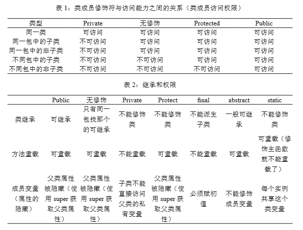

---
title: Java面向对象编程的三大特性
date: 2020-04-03 01:33:43
summary: 本文分享阅读"Java面向对象编程的三大特性"的阅读笔记。
tags:
- 面向对象
- 软件工程
categories:
- 软件工程
---

# 前言

偶然读到这篇文章（《Java面向对象编程的三大特性》），想来这也算论文？这种还不满网络都是？读罢觉得写得还真不错，这里以我愚见，简单点评一二，不足之处还望指教。

# 阅读笔记

## 笔记1

文中有一句是这样说的：“**将属性进行私有化操作，对每个属性创建 set 和 get 方法，如果这里存在一个带参数的构造函数，以此同时就必须存在一个不带参数的构造函数。**”
>评注1：其实未必总要开set和get方法。
>初学者可能刚接触的时候被告知写set和get，但其实set的存在可能破坏封装。
>举个简单的例子，比如每个学生Student类都有一个s_id，这个属性在数据库表中对应着主键，应该是唯一且不可变的。如果我们简单地开一个public的set和一个public的get，就可能导致外部随意修改本不可变的s_id属性。

>评注2：其实未必存在一个不带参数的构造函数。
>有一说一，真的不必。只是，为了简便起见，可以都自动生成的。
>另说，如果没指定构造器，默认有一个无参数构造器；如果存在了带参数的构造函数，就没有默认的这个无参数构造器了。
>再说，如果注意构造器参数不全甚至没有，就导致我们想初始化某些属性就必须再指定set方法。

## 笔记2

- 封装的优点
（1）提高了安全性，防止一些误操作。 
（2）提高了复用性，封装之后便于调用。 
（3）信息隐藏，隐藏了实现细节。
- 继承的优点
（1）继承可提高代码的复用性。 
（2）继承可提高代码的稳定性。 
（3）继承让类与类之间产生关系，是多态的前提。
- 多态性优点
（1）提高了代码的维护性（继承保证）。 
（2）提高了代码的扩展性（由多态保证）。

 封装 -> 继承 -> 多态这不单单是三个名词的简单罗列，更是一步步递进的关系。对于面 向对象的程序设计，封装是基础，继承是多态 的前提条件，三者逻辑顺序不可颠倒。

>评注：封装、继承、多态，看似朴实的三个名词，想要理解透很难。甚至很多人在学完一两轮OOP相关之后还不能真正理解继承和多态。
>这里的优点说的还很不错，给点个赞！

## 笔记3

Java如果想实现多态必须存在以下几个条件才可以成功实现：
- 继承：在多态的管理网中必须要有存在继承关系的子类和父类。 
- 重写：子类会针对父类中的一些特点方法进行自定义，后续在使用这些方法时会调用子类中重写的方法。 
- 向上转型：在多态当中需要把子类引用的对象赋值给到父类，只有这样做才能达到可以调用父类、子类方法的目的。

满足了以上的几个条件，我们可以在同一个继承的结构中使用统一逻辑代码，进而去处理不同类别的对象，进而达到执行不同方法的目的。

>评注：没有继承哪有多态？确实要先理解继承才能理解多态。重写和向上转型确实也是很重要的环节。你直接定义SubClass obj = new SubClass();这样有什么意义呢？
>另说，很多新手写Java代码的时候不习惯写List\<String> list = new ArrayList<>();，而是只习惯写ArrayList\<String> list = new ArrayList<>();，我这里不讨论具体在这个例子的问题，只据此说说继承与多态。
>其实上面的ArrayList实现了List接口，这种implement也算一种接口继承（毕竟Java通过接口的实现和继承实现了更靠谱的多继承），根据《疯狂Java讲义》的说法，李刚老师称呼左边类型为“编译时类型”而右边类型为“运行时类型”，也蛮有趣的。
>接着说下去，左边的编译时类型至少要是在继承树里不能低于右边类型的，这也体现了继承（甚至可能是“隔代继承”）和向上转型。
>既然是继承，左边类型的方法可能被右边类型重写某些可重写（@Override）的方法，你不重写的话表示子类和父类在这种“行为”上时一致的，那要多态干啥？
>根据上面的三点，基本可以实现简单的多态了，子类对象能体现出不同于父类的特点。编译时的类型是左边的，你要是调用某个左边不存在的方法还会编译错误，但你调用左边的一个方法，做的是右边的事。
>再回到上面关于List的问题，我建议还是把接口类型放在左边，对于初学者来说这是一种好习惯，也能逐渐帮你理解继承和多态（前提是你用心啊）。
>再就是，尝试多态最好还是多尝试接口多态而不是普通的继承多态，你慢慢体会就知道了。

# 文中的图

下面是文中的一个图，鉴于知网版权保护不能贴文章，但图表可下载所以跟大家分享一下：

# 原文免费阅读地址

[《Java面向对象编程的三大特性》](http://kns.cnki.net/KXReader/Detail?TIMESTAMP=637214716324185000&DBCODE=CJFQ&TABLEName=CJFDLAST2020&FileName=DZRU201924147&RESULT=1&SIGN=2m2px4lZAtjI8NcGBc8QFMX920A=)

# 参考文献

[1]岳青玲.Java面向对象编程的三大特性[J].电子技术与软件工程,2019(24):239-240.
