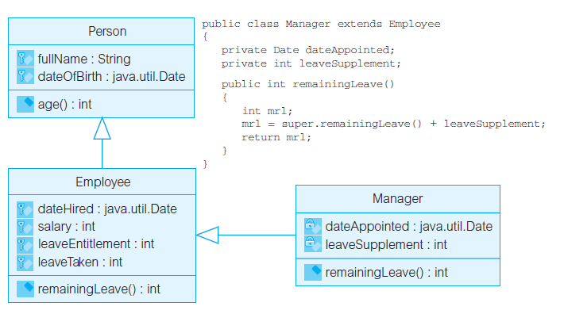

# 封装

封装要求只能通过对象接口中的操作才能访问到对象的状态。如果强迫封装，它将带来高度的数据独立性，这样所封装的数据结构将来的变化就不会导致一定要修改已有的程序。

关于继承与封装，尽管它们同为面向对象的三大特性，但现实情况是，封装与继承和查询能力是正交的，它不见得与这两个特性一起折中考虑。
事实上，将所有的数据声明为private也是不现实的。

继承允许子类直接访问protected属性，它削弱了封装。当计算涉及不同类的对象时，可能要求这些不同的类彼此是friend的或者让元素具有包可见性，这就进一步破坏了封装。

封装是针对类的概念，不针对于对象。
事实上，大多数的OO程序设计环境中，一个对象不能对同一个类的另一个对象隐藏任何东西。

用户基于SQL访问数据库中的数据，期望在查询时直接查询属性，而不是被迫使用某些数据访问方法，否则会导致查询的表达更困难、更易出错。

设计应用时，应该使它们达到期望的封装水平，但还要与继承、数据库查询以及计算需求相权衡。

封装的优点：
- 提高了安全性，防止一些误操作。 
- 提高了复用性，封装之后便于调用。 
- 信息隐藏，隐藏了实现细节。

# 继承

实现继承也称子类化、代码继承或类继承，要求在子类中组合父类的特性，必要时允许新的实现来重载它们。

实现继承允许共享特性描述、代码复用以及多态性。

当使用泛化来建模时，必须清楚其中隐含了哪种继承。
接口继承的使用是安全的，因为它只涉及契约部分的继承即操作型构。

实现继承涉及代码的继承，即实现部分的继承。

继承的优点：
- 继承可提高代码的复用性。 
- 继承可提高代码的稳定性。 
- 继承让类与类之间产生关系，是多态的前提。

继承可能存在的弊端有：
- 脆弱的基类问题：对基类的修改会影响到它所有的子孙类。
- 臃肿的子类问题：如果“尽可能地继承”而非“适时地继承”，子类可能会越来越臃肿庞大。
- 可能由不恰当使用带来不必要的复杂性：面向对象的语言支持各种构造，使用不当会引入许多不必要的复杂性。

如果不注意控制和限制，实现继承将会弊大于利。

## 扩展继承[√]

继承的唯一恰当使用就是将继承作为类的增量式定义。
子类具有比父类更多的特性（属性和/或方法），子类是父类的一种，这就是扩展继承。

在扩展继承中，特性的重写要谨慎使用，应该只允许使特性更特殊化（如限制值的范围或使操作的实现更高效），而不改变特性的含义。如果重写改变了特性的含义，则子类对象就不能再替换父类对象了。

## 限制继承[×]

在扩展继承中，用新的特性扩展子类的定义。
然而，有一些继承来的特性在子类中被禁止（被重写），因此使用继承作为一种限制机制也是可能的，这样的继承被称为限制继承。

限制继承是有问题的。
从泛化的观点看，子类没有包括父类的所有特性。倘若使用对象的人知道被重写（禁止）的特性的话，父类对象仍然能够被子类对象所替换。

在限制继承中，一个类的特性通过继承被用于实现另一个类。如果重写未做扩展，限制继承能够带来益处。但一般来说，限制继承会带来维护上的问题。通过将继承来的方法实现为空，即什么也不做，限制继承将可能完全禁止继承来的问题。

## 方便继承[×]

在系统建模中，既不是扩展继承也不是限制继承的继承是不好的。
当两个或多个类具有相似的实现，但在这些类所表示的概念之间没有分类关系的时候，会出现这种继承。
任意选择一个类作为其他类的父类，这样的继承被称为方便继承。

方便继承是不恰当的，它在语义上不正确，导致了扩展式重写。
由于对象不再属于相似的类型，可替换性原则就无效了。

# 多态

封装 → 继承 → 多态这不单单是三个名词的简单罗列，更是一步步递进的关系。对于面 向对象的程序设计，封装是基础，继承是多态 的前提条件，三者逻辑顺序不可颠倒。

Java如果想实现多态必须存在以下几个条件才可以成功实现：
- 继承：在多态的管理网中必须要有存在继承关系的子类和父类。 
- 重写：子类会针对父类中的一些特点方法进行自定义，后续在使用这些方法时会调用子类中重写的方法。 
- 向上转型：在多态当中需要把子类引用的对象赋值给到父类，只有这样做才能达到可以调用父类、子类方法的目的。

满足了以上的几个条件，我们可以在同一个继承的结构中使用统一逻辑代码，进而去处理不同类别的对象，进而达到执行不同方法的目的。

多态的优点：
- 提高了代码的维护性（继承保证）。 
- 提高了代码的扩展性（由多态保证）。

多态和动态绑定可能存在的弊端有：
- 通常不太可能在编译时确定运行时调用哪种具体的多态方法，因而很难确定引起故障的原因。
- 多态和动态绑定会对维护产生负面的影响，维护人员必须考虑可能调用的所有可能的方法，耗时耗力。
