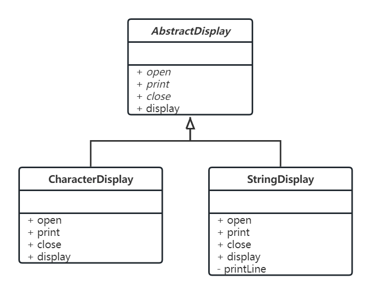

---
title: 抽象类与模板模式
date: 2022-02-27 23:45:35
summary: 本文深入剖析抽象类，并探讨与之相关的模板模式。
tags:
- 面向对象
- 软件工程
categories:
- 软件工程
---

# 抽象类

抽象类是一种特殊的类，其特殊性在于抽象类只能用于继承，不能被实例化为具体的对象。

抽象类存在的合理性在于某些场景下普通类不够用。

从设计的角度来看，抽象类是更高层次的抽象；从实现的角度来看，抽象类有的存在抽象方法（方法只有声明没有实现），子类必须自己实现这些抽象方法。

抽象类与接口有一定的区别。
抽象类本质还是类，强调一组事物的相似性，包括属性和方法的相似性；而接口只强调方法的相似性，并且仅仅体现在方法声明上的相似性，而没有方法定义上的相似性。

抽象类是一个介于类和接口之间的概念，同时具备类和接口的部分特性。

# Java抽象类

Java的抽象类和抽象方法必须用abstract定义，有抽象方法的类只能被定义成抽象类，抽象类里也可以没有抽象方法。

抽象类必须使用abstract来修饰，抽象方法也必须使用abstract来修饰，抽象方法不能有方法体。

抽象类不能被实例化，无法使用new关键词来调用抽象类的构造方法创建抽象类的实例。即时抽象类里没有抽象方法，这个抽象类也不能创建实例。

抽象类可以包含成员变量、方法、构造方法、初始化块、内部类。抽象类的构造方法不能用于创建实例，主要用于被其子类调用。

含有抽象方法的类不一定是抽象类，也可能是接口。抽象类可能是新定义抽象方法的类，可能是未完全实现其父抽象类或父接口的子类。

抽象方法不存在方法体，和空方法体`{}`不一样。

```java
public abstract class Shape {
    public abstract int getPerimeter();
}
```

# C++抽象类

纯虚函数是一个在父类中声明的虚函数，它在该基类中没有定义具体的函数体，要求派生类根据实际需要定义自己的实现。

纯虚函数的标准格式：
```cpp
virtual <returnType> <functionName>(<paramList...>)=0；
```

C++抽象类中至少存在一个纯虚函数。与Java不同的是，存在纯虚函数的类一定是抽象类，存在纯虚函数是成为抽象类的充要条件。

```cpp
class Shape {
public:
    virtual int get_perimeter() = 0;
};

class Square: Shape {
protected:
    int a;
public:
    explicit Square(int a) {
        this->a = a;
    }
    int get_perimeter() override {
        return 4 * a;
    }
};
```

# 模板模式

抽象类体现了模板模式的设计思想，抽象类作为子类的通用抽象模板，子类在抽象父类的基础上进行扩展，大致保留父类的行为方式。模板模式正是一种在父类中定义处理流程的框架，在子类中实现具体处理的设计模式。

模板模式支持父类提供方法复用。子类中可以使用父类中定义的方法，通过在子类中增加方法可以引入新的功能，在子类中重写父类的方法可以改变程序的行为。虽然具体的处理策略是由子类决定的，但在抽象类阶段确定处理的流程非常重要。

子类实现父类声明的抽象方法时，必须理解这些抽象方法调用的时机，需要了解父类机制甚至阅读父类源码。

参考案例类图：



参考案例实现代码：

`AbstractDisplay.java`

```java
public abstract class AbstractDisplay {

    public abstract void open();

    public abstract void print();

    public abstract void close();

    public final void display() {
        open();
        for (int i = 0; i < 3; i++) {
            print();
        }
        close();
    }

}
```

`CharacterDisplay.java`

```java
public class CharacterDisplay extends AbstractDisplay {

    private char character;

    public CharacterDisplay(char character) {
        this.character = character;
    }

    @Override
    public void open() {
        System.out.print("<<");
    }

    @Override
    public void print() {
        System.out.print(this.character);
    }

    @Override
    public void close() {
        System.out.println(">>");
    }

}
```

`StringDisplay.java`

```java
public class StringDisplay extends AbstractDisplay {

    private String string;

    public StringDisplay(String string) {
        this.string = string;
    }

    @Override
    public void open() {
        printLine();
    }

    @Override
    public void print() {
        System.out.println("|" + this.string + "|");
    }

    @Override
    public void close() {
        printLine();
    }

    private void printLine() {
        System.out.print("+");
        for (int i = 0; i < this.string.length(); i++) {
            System.out.print("-");
        }
        System.out.println("+");
    }

}
```

执行程序：
```java
AbstractDisplay characterDisplay = new CharacterDisplay('H');
AbstractDisplay stringDisplay = new StringDisplay("Hello, World");
characterDisplay.display();
stringDisplay.display();
```
