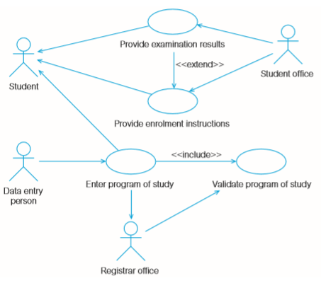
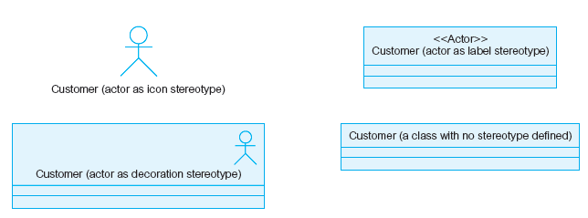
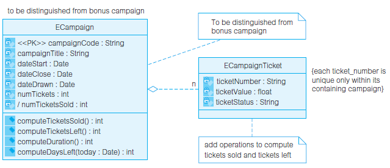
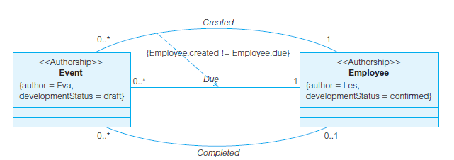
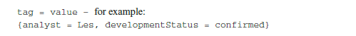

---
title: 用例
date: 2021-03-11 13:38:54
summary: 用例驱动整个软件开发的生命周期，本文分享用例的相关内容。
tags:
- 面向对象
- 软件工程
categories:
- 软件工程
---

# 用例

用例驱动整个软件开发的生命周期，从需求分析道测试和维护，它是大多数开发活动的焦点和参照。

用例表示参与者从外部可以看到的业务功能，并且可以在以后的开发过程中单独测试。

参与者是主题外部的人或事物针对用例所扮演的角色。
参与者与用例交互是为了收到有用的结果。
参与者和用例应该从功能性需求的分析来确定。

一个用户表示：
- 一个完整的功能。
- 一个外部可见的功能。
- 一个正交的功能（虽然用例执行期间可以共享对象，但是每个用例的执行独立于其他用例）。
- 由一个参与者启动的一个功能（一旦被启动，则这个用例可以与其他参与者交互）。
- 给参与者传递确切值的一个功能（并且这个值是在一个用例中获得）。

用例是对参与者有价值的功能单元，并不一定与参与者直接关联。

每个用例都需要明确规定某种行为，也许包括变体，这样主题就可以与一个或多个参与者协作。用例定义主题所提供的行为，而不需要引用主题的内部结构。

用例可以从参与者任务的标识中导出，也可以通过对功能性需求的直接分析来确定。

可以从主题或参与者的角度对用例命名，但一般不建议从参与者的角度来命名用例，因为有可能引起争议。

用例图是参与者与用例的可视化表示，伴随有附加的定义和说明，此处不细说。

# 用例间的关系

用例间的关系主要包含以下四种：
- 关联
- 包含
- 扩展
- 泛化

关联建立起参与者和用例之间的通信渠道。

包含关系和扩展关系由\<\<include\>\>和\<\<extend\>\>来构造表示。

[泛化](https://blankspace.blog.csdn.net/article/details/114665438)关系允许一个特殊化的用例来改变基础用例的任何方面。

事实上，如果花费太多的工作量来发现用例间的关系，以及确定哪些关系适用于一对特定用例的话，项目将会很容易陷入困境。
另外，高层用例往往紧密地交织在一起，以至于关系链接占图的主要部分，使图难以理解，从而注意力从正确地标识用例转移到用例关系上。

## 包含和扩展关系

*\<\<include>>* 关系允许将被包含用例中的公共行为分解出来。

*\<\<extend>>* 关系通过在特定的扩展点激活另一个用例来扩展一个用例的行为，从而提供了一种可控的扩展形式。

*\<\<include>>* 与 *\<\<extend>>* 关系的不同点在于“被包含”用例对“激活”用例的完成来说是必需的。

上图是一个大学注册系统的高层用例图，该模型包含了**4个参与者**和**4个用例**。每一个用例由一个参与者启动，是一个**完整**的、**外部可见**的和**正交**的功能。除了 *Student* 以外，所有的参与者都是启动者。*Student* 首先获取考试结果和注册指导，然后才能输入和验证下学期的学习计划。
用例 *Provide examination results* 可以 *\<\<extend>>* 用例 *Provide enrolment instructions*，但前者并不总是扩展后者。例如，对新生来说，考试结果还是未知的。这就是用 *\<\<extend>>* 构建扩展型，而不是用 *\<\<include>>* 来为这个关系建模的原因。
从用例 *Enter program of study* 到用例 *Validate program of study* 建立了 *\<\<include>>* 关系，这个 *\<\<include>>* 关系表明前者总是包含后者，每当输入学习计划时，都要验证是否存在时间冲突和特殊的批准等。

## UML扩展的建模概念

- 构造型
    - 构造型对现有的UML建模元素进行扩展，使现有元素的语义多样化。
    - 构造型本身不是一个新的模型元素，没有改变UML的结构，只是扩展了现有表示法的语义。
    - 表示方法：双尖括号括住的一个名字，如\<\<global\>\>、\<\<PK\>\>、\<\<include\>\>。
    - 
- 注释
    - 注释是从属于一组元素的文本解释，提供给元素添加各种解释的能力。
    - 在UML的任何位置都能插入注释。
    - 注释是对建模决策的附加说明，对模型语义没有任何影响。
    - 表示方法：右上角卷起的矩形。
    - 
- 约束
    - 约束是指条件或限制，是对一个元素某些语义的声明，可以用自然语言文本或机器可读语言来表达。
    - 约束表示附加给被约束元素的额外语义，并且用形式化的约束语言来描述。
    - 约束是一个断言，表示正确的系统设计所满足的一个限制。
    - 表示方法：大括号{ }中的文本字符串。
    - 注释和约束的区别不在于表示法，而在于语义结果：注释对模型语义没有作用，它只是对模型决策的附加说明；约束对模型具有语义含义，并且在理论上应该用形式化的约束语言来描述。
    - 

- 标签
    - 标签定义是构造型的一个特性，显示为含有构造型声明的类矩形中的一个属性。
    - 标签值是一个K-V对，附属于一个使用了包含标签定义的构造型的模型元素，该模型使用了包含标签定义的构造型。
    - 标签的典型应用是提供项目管理信息。
    - 标签与约束相似，表示模型中的任意文本信息，写在大括号中。
    - 由于标签只能表示成一个定义在构造型上的属性，所以在将标签值应用到模型元素的特定实例前，模型元素必须定义一个带有标签定义的构造型。
    - 同构造型和约束一样，几乎没有标签在UML中预定义。
    - 
