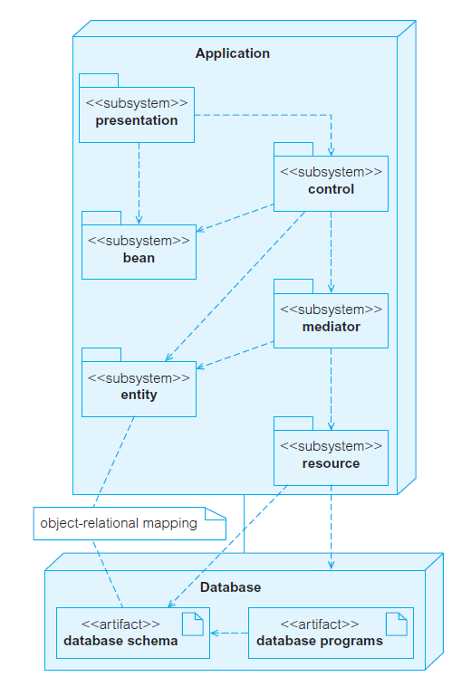

---
title: 类的本质
date: 2021-03-11 22:06:44
summary: 本文探讨类与对象的相关内容。
tags:
- 面向对象
- 软件工程
categories:
- 软件工程
---

# 类和对象

类的概念和对象的概念是紧密交织在一起的，因为我们在谈论一个类对象时不得不提到它的类，但是类和对象偏偏又有着重要差别。

对象是存在于时间和空间中存在的具体实体，而类仅仅代表一种抽象，即一个对象的本质。

> 类是一组对象，它们拥有共同的结构，共同的行为和共同的语义。

没有共同的结构、共同的行为、共同的语义的对象不能被划分为一个类。

一个对象，不是一个类，是对应类的一个实例。

一个单独的对象是一个具体实体，在整个系统中扮演着某个角色，而类则记录了所有相关对象之间的共同结构和行为。由此得出，类在一种抽象上和它所有的客户建立起来一种协议，类的接口中记录了这些内容。
协议就好比一种契约，可以区分一个类的外部视图和内部视图。
类的外部视图通过对外暴露的接口体现，强调了抽象，隐藏了它的结构和行为的private信息，这个接口主要由所有的操作声明构成，这些操作适用于这个类的所有对象，也可能包括其他类、常量、变量和异常的声明。
类的内部接口则是它的内部实现，包含了类行为的private信息。
一个类的实现主要由类接口的定义域所有操作的实现组成。

对象的状态必须在它对应的类中有某种表现形式，所以通常会表示为常量或变量声明，作为类接口的protected或private部分。通过这种方式，一个类的所有实例的共同表示形式被封装起来，对这种修改的封装不会在功能上影响任何外部客户。

# 实体类

实体类表示**应用程序**中的持久数据库对象。它不是数据库中的持久类。

称它们持久的原因是在应用程序终止之前，实体对象的最新映射会持久保存在数据库中。
如此，同一个应用程序或者其他应用程序的后续活动就可以再次获取这些实体对象，且只需要从数据库中重新装载实体对象到程序内存中即可。

## 应用程序与持久数据库模型的关联

下图表示了PCBMER体系结构框架中的向下依赖原则(DDP)扩展了应用程序与持久数据库之间的通信。

资源子系统专门负责与数据库通信。所有来自应用程序的SQL查询和对存储过程的调用由资源类产生并传递给数据库服务器，数据库服务器返回所有的数据和结果在传递到实体子系统之前首先要传递到资源类。

实体子系统表示应用程序内存中的业务对象，必须仔细定义业务对象与对应数据库表记录之间的映射规则。

映射规则由中介者子系统使用，中介者负责管理应用程序的内存以及对象在内存与数据库之间的人和移动。也就是说，当控制类需要访问一个业务对象而事先没有该对象的句柄（引用）时，中介者子系统就是调用的第一个端口。这也意味着中介者子系统必须管理执行数据库访问和修改的业务事务。

## O-R映射的困难性

应用程序与数据库之间的映射是复杂的，主要有两方面的原因。

原因一是数据库的存储结构处理不了面向对象泛型，实际上是非面向对象结构（通常是关系表）到实体子系统类的转换。即使目标数据库就是一个对象数据库，数据库的特性也使得这个转换需要经过仔细的考虑。

原因二是数据库几乎都不是为单个应用程序设计的，需要能满足所有应用程序的最优数据库设计而不仅仅是只针对所考虑的应用程序。所有与该数据库相关的应用程序具有与它们一致的数据库结构。数据库设计人员应该考虑到未来，预测将来的应用程序对数据库的需求，并设计出满足这些需求的数据库。

# 可变对象和不可变对象

在面向对象的系统中，存在**可变对象**（mutable）和**不可变对象**（immutable）两种对象，本文基于**Java**语言进行对比分析。

顾名思义，可变对象是**创建之后状态可以改变**的对象，不可变对象则是**创建之后状态不可改变**的对象。

一个对象包含的内部使用的属性改变了，但从外部看对象的状态并没有改变，例如一个使用Memoization来缓存复杂计算结果的对象仍然被看作是不可变对象。

不可变对象有几个优点：
- 线程安全
- 易于理解
- 比可变对象有更高的安全性

在面向对象编程中，String以及其他的具体对象都被看作是不可变对象，以提高可读性和运行效率。
尽管String类声明中没有提供让它成为不可变对象的语法，但是String类没有提供方法去改变一个String包含的数据，而是返回一个新的对象，这就使得它是不可变的。

Java中关键字final用于声明原始数据类型和对象引用为不可变对象，但是它不能使对象本身变为不可变对象。
- 原始数据类型变量（int, long, short等）定义之后还可以再重新赋值，可以使用final阻止这样的赋值。
- 仅仅使用final关键字还不能让引用类型（reference types）成为不可变对象，final只能阻止重新赋值。

原始类型包装类（Integer、Long、Short、Double、Float、Character、Byte、Boolean）也都是不可变的。

在Python中，strings、tuples、numbers是不可更改的对象，而list、dict等则是可以修改的对象。
