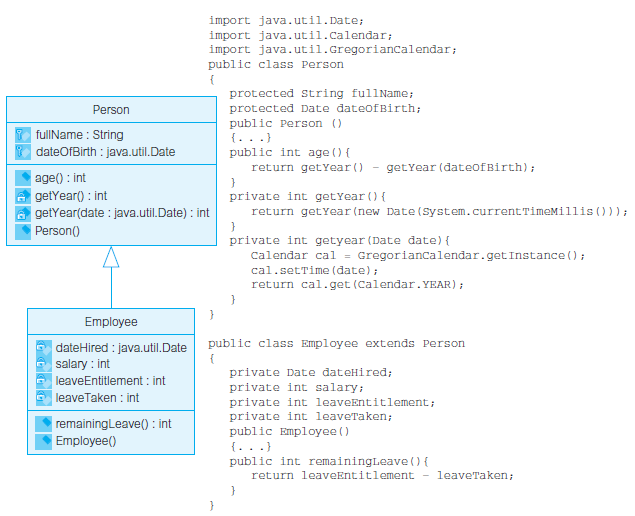
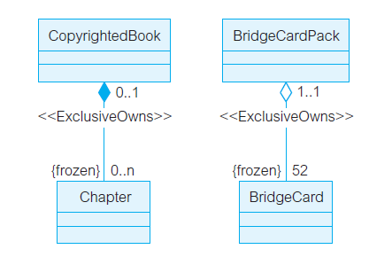
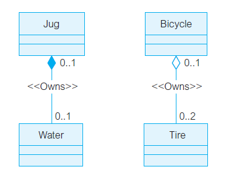
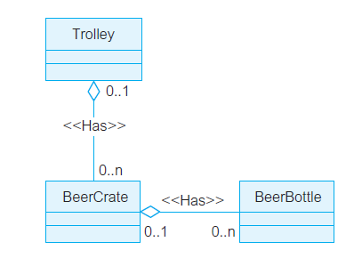
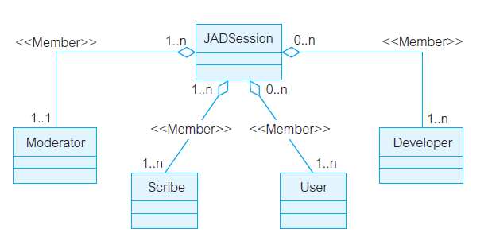

---
title: 类间关系
date: 2021-03-11 21:09:21
summary: 本文分享一些类间关系，例如泛化、聚合。
tags:
- 面向对象
- 软件工程
categories:
- 软件工程
---

# 泛化

泛化是通过通用类（超类或父类）与专用类（子类）之间的一种语义关系，子类是父类的一种，子类是父类的特殊化，子类对象可以用在允许使用父类的场合，任何子类实例是父类的非直接实例。
通过泛化，可以不必陈述已经定义的属性，父类中定义的属性和方法可以在子类中复用，我们称子类继承了父类的属性和方法。
泛化是很强大的软件复用技术，极大地简化了模型的语义和图形表示。
泛化有助于增加规格说明、类之间公共属性的利用以及更好地确认变更的位置。

泛化关系在UML中用指向其父类的空心三角表示。

泛化是一个强有力的实用概念，但由于复杂的继承机制，它也可能带来很多问题，特别是在大型软件项目中。

必须明确的是，继承$≠$泛化。

继承只用于类而非对象，只用于类型而非值。
泛化是一种类之间的语义关系，说明子类接口必须包含父类的所有特性；继承是一种机制，通过这种机制，较特殊的元素可以合并较一般的元素中定义的结构和行为。

# 聚合

下面分享聚合的四种语义。

## ExclusiveOwns语义

- 构件类对复合类存在依赖性。删除一个复合对象时将会向下扩散，相关的构件对象也会被删除。
- 聚合是[传递](https://blankspace.blog.csdn.net/article/details/113789378)的。
- 聚合是非[对称](https://blankspace.blog.csdn.net/article/details/113789378)的。
- 聚合是固定的。如果$B_{1}$是$A_{1}$的一部分，则它绝不是$A_{i}(i\neq{1})$的一部分。

## Owns语义

- 构件类对复合类存在依赖性。
- 聚合是传递的。
- 聚合是非对称的。

## Has语义

- 聚合是传递的。
- 聚合是非对称的。

## Member语义

- 有目的地组合独立对象的特性，这个对象并不假定具有存在依赖性、传递性、非对称性或固定性。
- 是一个抽象，其中一组构件被看作为一个高层复合对象来考虑。
- 一个构件对象可以同时属于一个以上的复合对象，支持多对多的关系。

