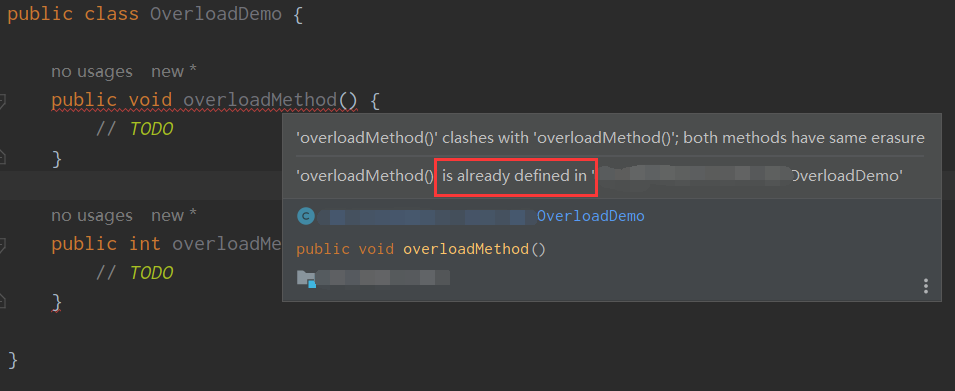
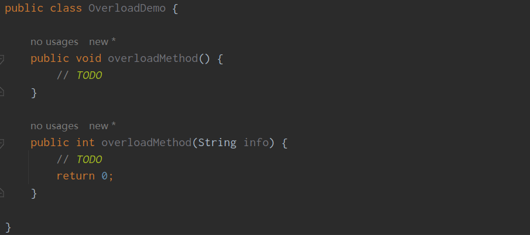

---
title: 重载与重写
date: 2023-02-04 15:43:32
summary: 本文深入浅出地对比了重载（Overload）和重写（Override）。
tags:
- 面向对象
- 软件工程
categories:
- 软件工程
---

# 重载

## 方法重载

Java确定一个方法需要三个要素：所有权、方法名、形参列表。Java允许同一个类里定义多个形参不同的同名方法，这被称为方法重载(Overload)。返回值类型、访问权限类型不在此讨论范畴。

推荐阅读：[可见性](https://blankspace.blog.csdn.net/article/details/114701507)

推荐阅读：[函数和方法](https://blankspace.blog.csdn.net/article/details/123169198)

同名、同参、不同返回值的方法间是重复的，而不是Overload的：



同名、不同参、不同返回值的方法是Overload的：



对于Overload遇到可变参数的情况：

```java
public class OverloadDemo {

    public void overloadMethod() {
        // TODO
    }

    public String overloadMethod(String info) {
        // TODO
        return "";
    }

    public String overloadMethod(String ... infos) {
        // TODO
        return "";
    }

}
```

传入单字符串实参调用overloadMethod()，实际运行的是方法2，而不是方法3。只有传入超过一个字符串实参的时候，调用overloadMethod()才会运行方法3。尽管这种规则是应该掌握的，但实际操作中并不推荐这样做。

## 构造方法重载

构造方法虽然也称“方法”，但与方法不同。尽管不同，但构造方法也可以重载。

同一个类中具有多个构造方法，多个构造方法的形参列表不同，这被称为构造方法重载(Overload)。构造方法重载的Java类可以提供多种初始化逻辑，允许通过不同的构造方法来初始化该类。

构造方法的名称必须与类名相同。为了能识别出不同的构造方法，形参列表必须不同。

```java
public class OverloadDemo {
    
    public OverloadDemo() {
        // TODO
    }
    
    public OverloadDemo(String info) {
        // TODO
    }

    public void overloadMethod() {
        // TODO
    }

    public String overloadMethod(String info) {
        // TODO
        return "";
    }

    public String overloadMethod(String ... infos) {
        // TODO
        return "";
    }

}
```

构造方法1和构造方法2就是Overload的。

# 重写

重写与继承相关，有继承才有重写。尽管Java不直接支持多继承，而是通过实现多个接口实现多继承，但是implements接口不过是extends基类的一种变体。

推荐阅读：[面向对象中的继承](https://blankspace.blog.csdn.net/article/details/114697596)

派生类(子类)继承基类(父类)后，可以扩展基类，也可以部分重写(Override)基类方法。

Override可以称为方法重写，也可以称为方法覆盖。派生类Override方法的返回值类型不能比基类该方法的返回值类型更大，派生类Override方法声明抛出(throws)的异常不能比基类该方法声明抛出的异常更大，派生类Override方法的访问权限(可见性)不能比基类该方法的访问权限更小。

推荐阅读：[程序错误与异常处理](https://blankspace.blog.csdn.net/article/details/123164216)

派生类Override基类方法后，可以通过super关键词调用基类该方法。父类的private方法子类不能通过super调用，因为对子类没有可见性，此时子类定义相同方法不是Override。

继承关系下，Override对实现多态非常重要。想要同基类的不同派生类实例调用同一方法表现出不同的特征，必须要有Override的支持。

推荐阅读：[面向对象中的封装、继承和多态](https://blankspace.blog.csdn.net/article/details/114697596)

对于Java，基本注解(Annotation)支持@Override，该注解强制一个派生类必须重写基类的方法。被Override标记的派生类方法必须与基类被重写方法匹配，否则编译错误。

IntelliJ IDEA在非抽象类implements接口后会帮助用@Override标记所有接口方法，这是一个非常好的规范。

请看如下案例：

```java
class OverrideBaseClass {

    public void overrideMethod() {
        System.out.println("OverrideBaseClass's overrideMethod ");
    }

}

class OverrideSubClass1 extends OverrideBaseClass {

    @Override
    public void overrideMethod() {
        System.out.println("OverrideSubClass1's overrideMethod ");
    }

}

class OverrideSubClass2 extends OverrideBaseClass {

    @Override
    public void overrideMethod() {
        System.out.println("OverrideSubClass2's overrideMethod ");
    }

}

public class OverrideDemo {

    public static void main(String[] args) {
        OverrideBaseClass object1 = new OverrideSubClass1();
        OverrideBaseClass object2 = new OverrideSubClass2();
        object1.overrideMethod();
        object2.overrideMethod();
    }

}
```

输出结果：

```
OverrideSubClass1's overrideMethod 
OverrideSubClass2's overrideMethod 
```

该段代码印证了extends、override、polymorphism的关系。

# 总结

重载和重写根本就没什么关系，之所以被拉出来讨论，不过是因为二者的中文翻译看起来比较相似，初学者容易弄混。重载发生于同一个类的多个同名不同参方法间，而重写发生在具有继承关系的类的同名方法间。

| 区别 | 重载方法 | 重写方法 |
|:----:|:----:|:----:|
| 发生范围 | 同一个类 | 子类 |
| 参数列表 | 必须修改 | 不能修改 |
| 返回类型 | 可修改子类方法返回值 | 类型不能比父类方法返回值类型更高 |
| 异常类型 | 可修改子类方法声明抛出的异常类 | 类型不能比父类方法声明抛出的异常类型更高 |
| 访问修饰符 | 可修改 | 不能比原方法限制更大 |
| 发生阶段 | 编译期 | 运行期 |
