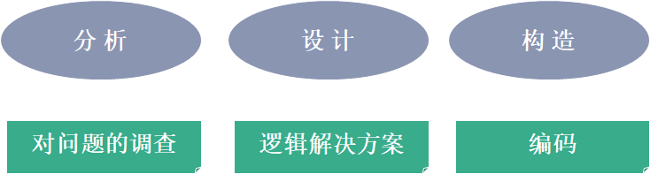

---
title: 面向对象的分析、设计与编程
date: 2021-02-25 10:28:02
summary: 本文介绍面向对象的分析、设计与编程。
tags:
- 面向对象
- 软件工程
categories:
- 软件工程
---

# 分析与设计

分析强调对问题的调查 而不是如何确定解决方案。

设计强调的是问题的逻辑解决方案 。

# 结构化方法与面向对象方法

结构化方法也称功能分解法，总的指导思想是：自顶向下、逐步求精、单入口、单出口，基本原则是抽象和功能分解。
- 结构化分析
- 结构化设计
    - 结构化设计的两个基本原则：高内聚、低耦合。
    - 结构化设计技术只是帮助系统设计者完成部分而不是全部系统设计生命周期阶段。
- 结构化编程：结构化程序具有一个开始和一个结束的程序或程序模块，并且在程序执行中的每一步都由“顺序、选择和循环”之一组成。

面向对象方法着重描述现实世界，其出发点和基本原则是尽可能模拟人类习惯的思维方式，使开发软件的方法有过程尽可能接近人类认识世界的方法与过程。
- 面向对象分析：定义在系统中工作的所有类型的对象，并显示这些对象如何通过相互作用来完成任务。
- 面向对象设计：定义在系统中人机进行通讯所必须的所有类型的对象，并对每一种类型的对象进行细化。
- 面向对象编程：定义各类对象的行为，包括对象间的消息传递。

# 面向对象分析与设计

面向对象的分析与设计的精髓是按照对象（事物、概念、或实体）的观点考虑问题域和逻辑解决方案。

下面分别介绍面向对象分析(OOA)、面向对象设计(OOD)、面向对象编程(OOP)。OOA的结果可以作为OOD的模型，OOD的结果可作为OOP的蓝图，OOP依据OOD提供的蓝图实现一个系统。

## 面向对象分析

> **面向对象分析**是一种分析方法，这种方法利用从问题域的词汇表中找到的类和对象来分析需求。

传统的结构化分析方法注重系统中的数据流，而面向对象分析方法从面向对象的观点看待世界。

面向对象分析(OOA)的重点在于发现并描述问题域中的对象或概念。OOA的常用工件是“域模型”，并可以用UML的类图来可视化表示域模型。

## 面向对象设计

> **面向对象设计**是一种设计方法，包括面向对象分解的过程和一种表示法，这种表示法用于展现被设计系统的逻辑模型和物理模型、静态模型和动态模型。

关键点：
1. 面向对象设计导致了面向对象的分解。
2. 面向对象设计使用了不同的表示法来表达系统逻辑设计（类和对象）和物理设计（模块和处理架构）的不同模型，以及系统的静态和动态特征。

面向对象设计(OOD)的重点在于定义那些能最终用面向对象程序设计语言实现的逻辑软件对象。OOD常用的工件是“设计模型”，可以用UML的包图、类图和交互图来可视化表示设计模型。

成功运用OOA/OOD重点不在表示符号（如UML）上而在于如何用对象来思考，也就是要掌握对象设计时要应用的原则和模式。

OOA/OOD不适合瀑布式的开发流程，而应在迭代过程里应用OOA/OOD，如RUP或XP。

## 面向对象编程

> **面向对象编程**是一种实现的方法，在这种方法中，程序被组织成许多互相协作的对象，每个对象代表某个类的一个实例，而类则属于一个通过继承关系形成的层次结构。

关键点：
1. 利用对象作为面向对象编程的基本逻辑构建块，而不是利用算法。
2. 每个对象都是某个类的一个实例。
3. 类和类之间可以通过继承关系联系起来。

事实上，当且仅当一种语言满足下列需求时，它才是面向对象的：
1. 支持对象，这些对象是具有命名的操作接口和隐藏的内部状态的数据抽象。
2. 对象具有相关的类型。
3. 类型可以从超类型中继承属性。

# 概念模型、逻辑模型、物理模型

随着系统开发的推进与成熟，系统模式可能代表了不同的细节层次。

系统的模式包含概念模型、逻辑模型、物理模型。
这部分不难令我想到[数据库系统的模式分层与数据独立性](https://blankspace.blog.csdn.net/article/details/104487978)涉及到的子模式、逻辑模式、物理模式。

概念模型记录了系统中存在或将存在的领域实体以及它们与系统中其他领域实体的关系。
概念建模是利用业务领域的术语完成的，应该是技术无关的。

逻辑模型利用了概念模型中提出的概念，建立起关键抽象和机制的意义，并确定系统的架构和整体设计。

物理模型描述了系统实现的具体软件和硬件的构成。
物理模型显然是技术相关的。

对于一个项目来说，随着时间的推移，系统的设计将会从概念成熟发展到逻辑成熟，最后物理成熟。
对于某个具体的项目而言，分析和设计的产物是通过这些模型表示的。总得来说，这些不同的模型的语义是丰富的：它们的表达能力足够强，让开发者能够记录系统分析和架构阐述时所有感兴趣的战略和战术决策；它们也足够完整，可以作为大多数面向对象语言实现的蓝图。

另外，概念、逻辑、物理三个层面再一次印证了计算机科学或软件工程的许多理论是相通的、相似的。
