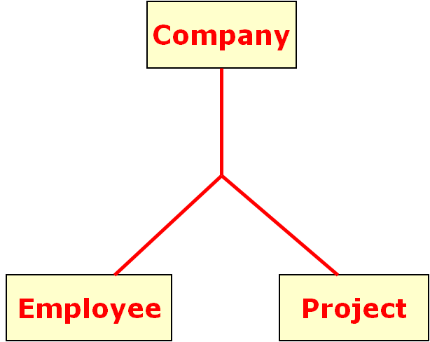
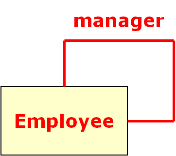

# Quiz1：Java语言的发展与特性测试题

问题 1
Java 是由 Sun Microsystems 公司于 1995 年推出的一门面向对象程序设计语言。
答案： 	
对

问题 2
自2010年Oracle公司收购 Sun Microsystems起，Java的维护和版本升级由 Oracle 公司负责。
答案：	
 对

问题 3
Java 是一个平台，由 Java 虚拟机（Java Virtual Machine，JVM）和 Java 应用编程接口（Application Programming Interface，API）构成。
答案： 	
对

问题 4
在硬件或操作系统平台上安装一个 Java 平台之后，Java 应用程序就可运行。
答案： 	
对

问题 5
Java 平台已经嵌入了几乎所有的操作系统，因此，Java 程序只编译一次，就可以在各种系统中运行。
答案： 	
对

问题 6
Java 平台已经嵌入了几乎所有的操作系统，因此，Java 程序只编译一次，就可以在各种系统中运行。
答案： 	
对

问题 7
Java SE（Java Platform Standard Edition，Java 平台标准版）以前称为 J2SE，它允许开发和部署在桌面、服务器、嵌入式环境和实时环境中使用的 Java 应用程序。Java SE 包含了支持 Java Web 服务开发的类，并为 Java EE 提供基础，如 Java 语言基础、JDBC 操作、I/O 操作、网络通信以及多线程等技术。
答案： 	
对

问题 8
Java EE（Java Platform Enterprise Edition，Java 平台企业版）以前称为 J2EE。企业版本帮助开发和部署可移植、健壮、可伸缩且安全的服务器端 Java 应用程序。Java EE 是在 Java SE 基础上构建的，它提供 Web 服务、组件模型、管理和通信 API，可以用来实现企业级的面向服务体系结构（Service Oriented Architecture，SOA）和 Web 2.0 应用程序。
答案： 	
对

问题 9
Java ME（Java Platform Micro Edition，Java 平台微型版）以前称为 J2ME，也叫 K-JAVA。 Java ME 为在移动设备和嵌入式设备（比如手机、PDA、电视机顶盒和打印机）上运行的应用程序提供一个健壮且灵活的环境。
答案： 	
对

问题 10
Java 语言是一种分布式的面向对象语言，具有面向对象、平台无关性、简单性、解释执行、多线程、安全性等很多特点。
答案： 	
对

问题 11
Java 的虚拟机机制保证了Java的平台无关性，使得Java程序可以“一次编写，到处运行（Write Once，Run any Where）”，具有良好的移植性。
答案： 	
对

问题 12
Java 程序在 Java 平台运行时会被编译成字节码文件，然后可以在有 Java 环境的操作系统上运行。在运行文件时，Java 的解释器对这些字节码进行解释执行。
答案： 	
对

问题 13
Java 语言是多线程的，这也是 Java 语言的一大特性。Java 支持多个线程同时执行，并提供多线程之间的同步机制。
答案： 	
对

问题 14
Java 语言支持 Internet 应用的开发，在 Java 的基本应用编程接口中就有一个网络应用编程接口，它提供了网络应用编程的类库。
答案： 	
对

问题 15
Java 的强类型机制、异常处理、垃圾回收机制等都是 Java 健壮性的重要保证。
答案： 	
对

问题 16
为了搭建编写Java程序所需的开发环境，首先需要下载和安装JDK（Java Development Kit）。
答案： 	
对

问题 17
编写 Java 程序必须使用 JDK，它提供了编译和运行 Java 程序的环境。
答案： 	
正确 对

问题 18
JDK 安装和配置完成后，可以在DOS 环境下输入并执行 java -version 命令查看JDK是否配置成功。
答案： 	
对

问题 19
如果输入并执行 java -version 命令并未出现JDK的版本信息，说明JDK没有安装成功，可能需要配置环境变量。
答案： 	
对

问题 20
编译 Java 源程序需要使用JDK 中的 javac 命令, 让 Java 编译器获取 Java 应用程序xxx.java 的源代码，把它编译成符合 Java 虚拟机规范的字节码文件，即xxx.class。
答案： 	
对

问题 21
xxx.class文件是JVM上的可执行文件。使用JDK中的java命令就可以运行Java程序。
答案： 	
对

# Quiz2：Java基本语法测试题

问题 1
赋值运算符是指为变量或常量指定数值的符号。赋值运算符的符号为“=”，也可以与其他运算符一起使用，表达多种赋值运算的变异效果。例如
|运算符 	|含义 	|实例 |	结果|
|--|--|--|--|
| += 	|将该运算符左边的数值加上右边的数值， 其结果赋值给左边变量本身| 	int a=5; a+=2; 	|a=7|
| -= 	|将该运算符左边的数值减去右边的数值， 其结果赋值给左边变量本身 |	int a=5; a-=2; 	|a=3|
|  \*= 	|将该运算符左边的数值乘以右边的数值， 其结果赋值给左边变量本身| 	int a=5; a\*=2; 	|a=10|
| /= 	|将该运算符左边的数值整除右边的数值， 其结果赋值给左边变量本身 |	int a=5; a/=2; 	|a=2|
| %= 	|将该运算符左边的数值除以右边的数值后取余，其结果赋值给左边变量本身 |	int a=5;a%=2; |	a=1|

答案： 	
对

问题 2
选择结构（也叫分支结构）解决了顺序结构不能判断的缺点，可以根据一个条件判断执行哪些语句块。if 语句是使用最多的条件分支结构，它属于选择语句，也可以称为条件语句。Java支持的if语句形式包括
A.嵌套 if 语句：在 if 语句里嵌套另一个 if 语句。同样，if…else 语句和 if…else if 语句中也可以嵌套另一个 if 结构的语句，以完成更深层次的判断。
B.单分支if语句，if 语句的最简语法格式，表示“如果满足某种条件，就进行某种处理”。
if ( 条件表达式)  {      语句块;  }
C.多分支if语句：if…else if 语句，表现为“如果满足某种条件，就进行某种处理，否则如果满足另一种条件才执行另一种处理……，这些条件都不满足则执行最后一种条件”。
if(表达式1)  {      语句块1;  }  else if(表达式2)  {      语句块2;  }  ...  else if(表达式n)  {      语句块n;  }  else  {      语句块n+1;  }
D.双分支if语句：if…else 语句表示“如果条件正确则执行一个操作，否则执行另一个操作”。
if ( 表达式)  {      语句块1;  }  else  {      语句块2;  }
答案：
ABCD

问题 3
Java 语言的数据类型分为两种：基本数据类型和引用数据类型。其中，基本数据类型包括
A.布尔类型（boolean），用于对两个数值通过逻辑运算，判断结果是“真”还是“假”，在Java中分别用true和false关键字表示。
B.浮点类型，包括单精度浮点型（float）和双精度浮点型（double）。
C.字符类型（char），使用单引号字符或者整数对其赋值。
D.字符串类型（String），使用双引号括起来的字符串对其赋值。
E.整数类型，包括字节型（byte）、短整型（short）、整型（int）和长整型（long）
答案： 	
ABCE

问题 4
常量不同于常量值，它可以在程序中用符号来代替常量值使用，因此在使用前必须先定义。
Java 语言使用 final 关键字来定义一个常量，其语法如下所示：
其中，final 是定义常量的关键字，dataType 指明常量的数据类型，variableName 是变量的名称。
答案： 	
对

问题 5
按照语句的组成部分，可以将顺序结构中的语句包括	
A.表达式语句，即能够完成某个操作的语句
B.空语句，即在程序中什么都不做，也不包含具体实际性的语句
C.复合语句，即用{}括起来很多个语句的组合，从而可以将多个语句看作单个语句
D.调用语句，即调用某个函数的语句。
答案：
ABC 	

问题 6
在 Java 中，break 语句可以在 switch 语句中终止一个语句序列，也可以使用 break 语句强行退出循环，忽略循环体中的任何其他语句和循环的条件判断。
答案： 	
对

问题 7
Java 语言中算术运算符的功能是进行算术运算，包括加（+）、减（-）、乘（*）、除（\）和取模运算（％）。
答案： 	
对

问题 8
在对一个变量做加 1 或减 1 处理时，可以使用自增运算符 ++ 或自减运算 --。++ 或 -- 是单目运算符，放在操作数的前面或后面都是允许的，其作用是使变量的值增 1 或减 1。操作数必须是一个整型或浮点型变量。
答案： 	
对

问题 9
多个同类型的变量可以同时定义或者初始化，但是多个变量中间要使用逗号分隔，声明结束时用分号分隔。
```java
String username, address, phone, tel;   // 声明多个变量
int num1 = 12, num2 = 23, result = 35;  // 声明并初始化多个变量
```
答案： 	
对

问题 10
初始化变量是指为变量指定一个明确的初始值。初始化变量有两种方式：一种是声明时直接赋值，一种是先声明、后赋值。例如：
```java
char usersex = '女';  // 直接赋值
```
或者
```java
String username;    // 先声明
username = "琪琪";  // 后赋值
```
答案： 	
对
    	
问题 11
以下语句在编译时会出错么？
```java
final int AGE = 10;
AGE = 11;
```
答案： 	
对

问题 12
在Java的类中，除了我们已经用过的main方法，也可以放置其他方法，我们可以暂且将其视为函数，其语法格式为：

```java
[public|private|protected][static]<void|return_type>>([paramList])
{
    //方法体
}
```

例如，一个计算两个数之和的方法可以被定义为

```java
public static double sum(double i,double j) 
{
    double sum=i+j;
    return sum;
}
```

答案： 	
对

问题 13
return 语句用于终止函数的执行或退出类的方法，并把控制权返回该方法的调用者。如果这个方法带有返回类型，return 语句就必须返回这个类型的值；如果这个方法没有返回值，可以使用没有表达式的 return 语句。其一般格式为：
```java
return 与方法相同类型的变量;
```
答案： 	
对

问题 14
continue 语句是跳过循环体中剩余的语句而强制执行下一次循环，其作用为结束本次循环，即跳过循环体中下面尚未执行的语句，接着进行下一次是否执行循环的判定。
答案： 	
对
    	
问题 15
关于if 语句和 switch 语句的比较，以下说法正确的是
A.从语句的实用性角度区分，switch 语句不如 if 条件语句，if 语句是应用最广泛和最实用的语句。
B.所有语言都有if语句和switch语句
C.从使用效率上区分，在对同一个变量的不同值作条件判断时，既可以使用 switch 语句，也可以使用 if 语句。使用 switch 语句的效率更高一些，尤其是判断的分支越多，越明显。
D.在程序开发的过程中，何时使用 if 语句和 switch 语句，需要根据实际情况而定，应尽量做到物尽其用。
答案： 	
ACD

问题 16
continue 语句只能用在 while 语句、for 语句或者 foreach 语句的循环体之中，在这之外的任何地方使用它都会引起语法错误。
答案： 	
对
    	
问题 17
switch 语句能解决 if 分支过多的情况，提供一种简洁的方法来处理对应给定表达式的多种情况。

```java
switch(表达式)  {
      case 值1:
          语句块1;
          break;
      case 值2:
          语句块2;
          break;
      …
      case 值n:
          语句块n;
          break;
      default:
          语句块n+1;
      break;
}
```

其中，switch、case、default、break 都是 Java 的关键字。
- switch：表示“开关”，这个开关就是 switch 关键字后面小括号里的值，小括号里要放一个整型变量或字符型变量。

- case：表示“情况，情形”，case 后必须是一个整型和字符型的常量表达式，通常是一个固定的字符、数字，例如 10、'a'。case 块可以有多个，顺序可以改变，但是每个 case 后的常量值必须各不相同。

- default：表示“默认”，即其他情况都不满足。default 后要紧跟冒号，default 块和case 块的先后顺序可以变动，不会影响程序执行结果。通常，default 块放在末尾，也可以省略不写。

- break：表示“停止”，即跳出当前结构。switch 语句在其开始处使用一个简单的表达式。表达式的结果将与结构中每个 case 子句的值进行比较。如果匹配，则执行与该 case 关联的语句块。语句块以 case 语句开头，以 break 语句结尾，然后执行 switch 语句后面的语句。如果结果与所有 case 子句均不匹配，则执行 default 后的语句

答案： 	
对

问题 18
在变量和方法前面可以使用各种访问控制修饰符，例如public、private、protected、final、abstract、static、transient 和 volatile，我们会在后续课程里面给大家一一介绍。现在大家只需要在声明变量或方法时简单地加上public修饰符即可。
答案： 	
对
    	
问题 19
变量是用来描述一条信息的别名，可以在程序代码中使用一个或多个变量。
在 java 中用户可以通过指定数据类型和标识符来声明变量，其基本语法如下所示：
```java
DataType identifier;
```
或者
```java
DataType identifier = value;
```
上述语法代码中涉及 3 个内容：DataType、 identifier 和 value，其具体说明如下：

- DataType：变量类型，如 int、string、 char 和 double 等。

- identifier：标识符，也叫变量名称。

- value：声明变量时的值。

答案： 	
对

问题 20
以下关于while循环和do...while循环的说法正确的是：
A.都是循环结构，使用 while(循环条件) 表示循环条件，使用大括号将循环操作括起来
B.一开始循环条件就不满足的情况下，while 循环一次都不会执行，do…while 循环则不管什么情况下都至少执行一次。
C.执行次序不同：while 循环先判断，再执行。do…while 循环先执行，再判断。
D.语法不同：与 while 循环相比，do…while 循环将 while 关键字和循环条件放在后面，而且前面多了 do 关键字，后面多了一个分号
答案： 	
ABCD

问题 21
常量值又称为字面常量，它是通过数据直接表示的，因此有很多种数据类型。Java语言常用的常量类型包括：
A.实型常量
B.整型常量
C.字符型和字符串常量
D.布尔型常量
答案： 	
ABCD

问题 22
逻辑运算符把各个运算的关系表达式连接起来组成一个复杂的逻辑表达式，以判断程序中的表达式是否成立，判断的结果是 true 或 false。
Java的逻辑运算符包括 &&、||、！。其中 && 和 || 是双目运算符，实现逻辑与、逻辑或；！是单目运算符，实现逻辑非。
答案： 	
对
    	
问题 23
当两种数据类型不兼容，或目标类型的取值范围小于源类型时，自动转换将无法进行，这时就需要进行强制类型转换。其语法格式如下：
```java
(type)variableName;
```
例如
```java
int a = 3;
double b = 5.0;
a = (int)b;
```
上述代码中首先将 double 类型变量 b 的值强制转换成 int 类型，然后将值赋给 a，但是变量 b 本身的值是没有发生变化的。
答案： 	
对
    	
问题 24
数据类型的转换可以分为隐式转换（自动类型转换）和显式转换（强制类型转换）两种。其中，隐式转换需要同时满足两个条件：①两种数据类型彼此兼容，②目标类型的取值范围大于源数据类型（低级类型数据转换成高级类型数据）。
答案： 	
对
    	
问题 25
循环也是程序中的重要流程结构之一，适用于需要重复一段代码直到满足特定条件为止的情况。Java中主要有以下哪些循环语句
A.foreach语句，是 for 语句的特殊简化版本，主要用于执行遍历数组、集合功能的循环。

```java
for(类型 变量名:集合)  {
      语句块;  
}
```

其中，“类型”为集合元素的类型，“变量名”表示集合中的每一个元素，“集合”是被遍历的集合对象或数组。每执行一次循环语句，循环变量就读取集合中的一个元素。
B.do…while 语句：先执行循环体，然后判断循环条件是否成立。

```java
do  {
      语句块;  
}while(条件表达式);
```

C.while 语句，在一定条件下重复执行一段代码。该语句需要判断一个测试条件，如果该条件为真，则执行循环语句（循环语句可以是一条或多条），否则跳出循环。

```java
while(条件表达式)  {
      语句块;  
}
```

D.for 语句是一种在程序执行前就要先判断条件表达式是否为真的循环语句。假如条件表达式的结果为假，那么它的循环语句根本不会执行。for 语句通常使用在知道循环次数的循环中。

```java
for(条件表达式1;条件表达式2;条件表达式3)  {
  语句块;  
}
```

for 循环语句执行的过程为：首先执行条件表达式 1 进行初始化，然后判断条件表达式 2 的值是否为 true，如果为 true，则执行循环体语句块；否则直接退出循环。最后执行表达式 3，改变循环变量的值，至此完成一次循环。接下来进行下一次循环，直到条件表达式 2 的值为 false，才结束循环。
答案： 	
ABCD

# Quiz4：Java中的类和对象测试题

问题 1
What happens when you try to compile and run the following program?

```java
class Mystery {
    String s;
    public static void main(String[] args){
        Mystery m = new Mystery();
        m.go();
    }
    void Mystery(){
        s = "constructor";
    }
    void go(){
        System.out.println(s);
    }
}
```

Select the one right answer
A. this code runs and "constructor" in the standard output
B. this code runs but nothing appears in the standard output
C. this code compiles but throws an exception at runtime
D. this code runs and writes "null" in the standard output
E. this code will not compile
答案：
D

问题 2
在Java语言中，类属性的数据类型，哪一种说法是正确的？
A.只能是基本数据类型。
B.可以是任意一种数据类型。
C.不能包含它自身定义的类。
D.以上全不对。
答案：
B

问题 3
以下哪行语句是创建一个对象实例？
A.Student s;
B.Student s = new Student[];
C.Student s= new Student();
D.以上都不是
答案：
C

问题 4
Which of the following statements about constructors in Java is true?
A. A constructor must be defined as static.
B. A constructor must be defined as public.
C.  A class can define more than one constructor.
D. A class must define at least one constructor.
答案：
C

问题 5
Which of the following statements is correct for a method which is overriding the following method?

```java
public void add(int a) {
    ...
}
```

A. the overriding method must return void
B.  the overriding method must return object
C. the overriding method can return whatever it likes
D. the overriding method must return int
答案：
A

问题 6
What will happen if you compile/run the following code?

```java
public class Q11
{
    static String str1="main method with String[] args";
    static String str2="main method with int[] args";
    public static void main (String[] args)
    {
        System.out.println(str1);
    }
    public static void main(int[] args)
    {
        System.out.println(str2);
    }
}
```

Select the one right answer.
A.  Prints "main method with main String[] args".
B. Duplicate method main(),compilation error at line 11.
C. Prints "main method with main int[] args".
D. Duplicate method main(),compilation error at line 6.
答案：
A

问题 7
Consider the following Java program segment.

```java
import java.io.*; 

public class Test {  
    public Test( ) {     
        System.out.println("default");  
    }        
    public Test( int i ) {             
         System.out.println("non-default");     
    }        
    public static void main(String[] args) {    
         Test t = new Test(2);   
     } 
}

```

Which of the following will be output during execution of the program segment?
A. The line of text "non-default" followed by the line of text "default"
B. The line of text "default" followed by the line of text "non-default"
C. The line of text "non-default"
D. The line of text "default"
答案：
C

问题 8
阅读以下代码，请选出正确的答案。

```java
public Class Teacher{
    public String name; 
    private double salary;
    protected int age;
    public Teacher(String iniName, double iniSalary, int iniAge){
        name = iniName;
        salary = iniSalary;
        age = iniAge;
    }
}

```

```java
public Class TestTeacher{
    public void main(String[] args){
        Teacher tom = new Teacher("Tom", 8000, 32);
        //请选择哪些代码可放置在此？
    }
}

```

(i) tom.name = "tom";
(ii) tom.salary = 10000;
(iii) tom.age = 33;

A.(i) (ii) (iii)
B.(i) (ii)
C.(ii)(iii)
D.(i)
答案：
D

问题 9
在 Java 中定义一个类，必须使用访问控制符public和Class关键字，包含有一个自定义的类名和一对大括号。
答案： 	
错
    
问题 10
If the method int sum(int a, int b) is defined in a Java class C, which of the following methods cannot coexist as a different method in class C?
所选答案： 	
A. int sum(float a, int b)
B.  int sum(int x, float y)
C. int sum(int x, int y)
D. float sum(int x, float y)
答案：
C
    
问题 11
类是Java语言中的一种复合数据类型。
答案： 	
对

问题 12
How can you implement encapsulation?
答案： 	
A.Making all methods and variables as protected.
B.By making methods private and variable private
C. Make all variable are public and access them using methods
D.By making methods are public and variables as private.
答案：
D
    
问题 13
What is the output of the following code?


```java
class Test
{
    Test(int i)
    {
        System.out.println("Test("+i+")");
    }
}

public class Q12
{
    static Test t1 = new Test(1);
    Test t2 = new Test(2);
    static Test t3 = new Test(3);
    public static void main(String[] args)
    {
        Q12 Q = new Q12();
    }
}
```

Select the one right answer.
A.
Test(1)
Test(3)
Test(2)
B.
Test(1)
Test(2)
Test(3)
C.
Test(2)
Test(1)
Test(3)
D.
Test(3)
Test(2)
Test(1)
答案：
A
    
问题 14
What will appear in the standard output when you run the Tester class?

```java
class Tester {
    int var;
    Tester(double var){
        this.var = (int)var;
    }
    Tester(int var){
        this("hello");
    }
    Tester(String s){
        this();
        System.out.println(s);
    }
    Tester(){
        System.out.println("good-bye");
    }
    public static void main(String[] args){
        Tester t = new Tester(5);
    }
}
```

 	
A."hello"
B. 5
C. nothing
D.  "good-bye" followed by "hello"
E. "hello" followed by "good-bye"
答案：
D
    
问题 15
阅读下列代码：

```java
public class Teacher {
    private String name;
    private double salary;
    private int age;
    public Teacher(String name, double salary, int age) {
        name = name ;
        salary = salary;
        age = age;
    }
    public void main(String[] args){
        Teacher tom = new Teacher("Tom", 8000, 32);
        System.out.println("新教师的薪水是：");     
        System.out.println("The salary is " + salary);
    }
}

```

A.8000
B.0
C.null
D.以上都不是
答案：
B
    
问题 16
在Java语言中,定义类的时候类名的首字母必须是大写的字母?
答案： 	
错
    
问题 17
Java语言中，一个类定义完毕后，可以创建多个对象，以下哪些说法是正确的？
(i) 每个对象实例在内容中占据同样大小的内存空间。
(ii) 每个对象实例中都有一份属性和方法的拷贝。
(iii) 每个类的对象实例和对象引用在内存中占据同样大小的内存。
(iv) 每个对象实例中都有一份类中定义的非静态属性的拷贝，多有对象共享所有的方法。
A.(i) (ii)
B.(ii) (iii)
C.(iii) (iv)
D.(i) (iv)
答案：
D
    
问题 18
以下关于类中定义的属性的描述是正确的是？
A.类中定义的属性在类的定义域范围是可见的，在类的作用域外部不可见。
B.类中定义的属性在任何地方都可见。
C.类中定义的private属性在类的定义域范围可见，在其他地方不可见。
D.以上描述都不正确
答案：
C

问题 19
Which best describes the requirements of a fully encapsulated class?
A. the class must be marked final
B. Modification of the objects state is only possible using method calls
C. Variables must not be public
D. Methods must not be private
E. Public methods are all marked final
答案：
B

问题 20
What is used to indicate that a method does not return a value?
A. the keyword static
B. the keyword void
C. the name of the class to which it belongs
D.  the omission of the return type
答案：
B

问题 21
在Java语言中,定义类的时候类名不能包含任何空格、标点符号和其他特殊符号，除了_以外。
答案： 	
对

问题 22
以下关于Java语言中的访问控制符描述正确的是？
A.访问控制符来保护对类、属性和方法的访问。
B.访问控制符来保护对类、变量和构造方法的访问。
C.访问控制符来保护对类、属性和对象的访问。
D.访问控制符来保护对类、子类的访问。
答案：A

问题 23
Java语言中的访问控制符有
A.public
B.default
C.private
D.以上全是
答案：
D

问题 24
Java语言中，在类的内部定义的变量叫做类的属性。
答案： 	
错

问题 25  	
If a class contains a constructor, that constructor will be invoked
A. each time an object of that class is instantiated
B. each time an object of that class goes out of scope
C. once the first time an object of that class is instantiated
D. once at the beginning of any program that uses that class
答案：
A

# Quiz5：Java中的对象交互测试题

问题 1
Look the inheritance relation:
In a source of java have the following line:

```java
woman w = new man();
```

What statement are corrected?
A. The expresion is legal	
B. Compile corrected but running wrong	
C.Will construct a woman's object
D. the expression is illegal
答案： 	
D
    
问题 2
请阅读以下代码，请选择输出正确的结果：


```java
class Person{
    private String name ;
    private int age ;
    public Person(String name, int age){ 
        this. name = this.name ;
        this. age = this.age ;
    }
    public void setName(String name){
        this.name = this.name;
    }
    public String getInfo(){
        return "Name：" + name + "，Age：" + age ;
    }
}
    
public class ThisDemo01{
    public static void main(String args[]){
        Person per1 = new Person( "Mary" , 23 ) ; 
        System.out.println(per1.getInfo()) ; 
        per1.setName("Ann");
        System.out.println(per1.getInfo()) ; 
    }
}
```

A.
Name: Mary, Age: 23
Name: Ann, Age: 23
B.
Name: Mary, Age: 23
Name: Mary, Age: 23
C.
Name: Ann, Age: 23
Name: Ann, Age: 23
D.以上都不是。
答案： 
D	
    
问题 3
If the method int sum(int a, int b) is defined in a Java class C, which of the following methods cannot coexist as a different method in class C?
A. int sum(int x, int y)
B. float sum(int x, float y)
C.  int sum(int x, float y)
D. int sum(float a, int b)
答案： 	
A 
   
问题 4
What will appear in the standard output when you run the Tester class?

```java
class Tester {
    int var;
    Tester(double var){
        this.var = (int)var;
    }
    Tester(int var){
        this("hello");
    }
    Tester(String s){
        this();
        System.out.println(s);
    }
    Tester(){
        System.out.println("good-bye");
    }
    public static void main(String[] args){
        Tester t = new Tester(5);
    }
}

```

A. "hello" followed by "good-bye"
B.  "good-bye" followed by "hello"
C. nothing
D."hello"
E. 5
答案： 	
B
    
问题 5
在Java语言中，对象之间传递的消息包含的要素是？
答案： 	C
A.对象名、方法名、实参列表和返回值
B.对象名、点运算法、方法名和返回值
C.对象名、点运算符、方法名和实参列表
D.以上都不是
    
问题 6
If a class contains a constructor, that constructor will be invoked
A. each time an object of that class goes out of scope
B. once at the beginning of any program that uses that class
C. each time an object of that class is instantiated
D. once the first time an object of that class is instantiated
答案： 	
C
    
问题 7
What will be the result of compiling the following code?

```java
public class Test {
    static int age;
    public static void main (String args[]) {
    age = age+1;
    System.out.println("The age is "+age);
    }
}

```

Select the most appropriate answer.
A. Compiles but generates a runtime error
B. Compiles and runs printing out The age is 1
C. Compiles but generates a compile time error
D. Does not compile
E. Compiles and runs with no output
答案： 	
B
    
问题 8
Which best describes the requirements of a fully encapsulated class?
A. Variables must not be public
B. Methods must not be private
C. Modification of the objects state is only possible using method calls
D. the class must be marked final
E. Public methods are all marked final
答案： 	
C
    
问题 9
请阅读以下代码，请选择输出正确的结果：
    

```java
class Person{
    private String name ;
    private int age ;
    public Person(String name, int age){ 
        name = name ;
        age = age ;
    }
    public void setName(String name){
        name = name;
    }
    public String getInfo(){
        return "Name：" + name + "，Age：" + age ;
    }
}

public class ThisDemo01{
    public static void main(String args[]){
        Person per1 = new Person( "Mary" , 23 ) ; 
        System.out.println(per1.getInfo()) ; 
        per1.setName("Ann");
        System.out.println(per1.getInfo()) ; 
    }
}
```

A.
Name: Mary, Age: 23
Name: Ann, Age: 23 	
B.
Name: Ann, Age: 23
Name: Ann, Age: 23  	
C.
Name: Mary, Age: 23
Name: Mary, Age: 23
D.以上都不对。
答案： 	
D
   
问题 10
以下关于类中定义的方法说法正确是？
A.类中定义的方法必须都是public的。
B.类中定义的方法可随意访问类中定义的属性。
C.类中定义的方法只能访问类中定义的属性。
D.类里定义的属性只能被类中定义的方法访问。
答案： 	
B

问题 11
Which of the following statements about constructors in Java is true?
A. A class must define at least one constructor. 	
B.  A class can define more than one constructor.
C. A constructor must be defined as public.
D. A constructor must be defined as static.
答案： 	
B
    
问题 12
Java语言中，构造方法的主要作用是？
A.初始化类的属性。
B.给类中定义的属性分配内存空间。
C.在类的对象实例化时给对象分配空间。
D.以上全对。
答案： 	
D
    
问题 13
Which of the following statements is correct for a method which is overriding the following method?

```java
public void add(int a) {
    ...
}
```

A.  the overriding method must return object
B. the overriding method can return whatever it likes
C. the overriding method must return void
D. the overriding method must return int
答案： 	
C    

问题 14
在Java语言中，要向另一个对象发送一条消息时，首先需要知道要发送的消息给哪一个对象，请问可以通过哪些方式获得这些对象的句柄？
A.在要发送消息的对象内部维护一个对另一个对象的引用。
B.通过向第三个对象发送一个请求获取那个对象引用。
C.该对象作为一个全局对象，让所有其他对象都可见。
D.以上全都是
答案： 	
D
    
问题 15
What will happen if you compile/run the following code?

```java
public class Q11
{
    static String str1="main method with String[] args";
    static String str2="main method with int[] args";
    public static void main (String[] args)
    {
        System.out.println(str1);
    }
    public static void main(int[] args)
    {
        System.out.println(str2);
    }
}

```

Select the one right answer.
A.  Prints "main method with main String[] args".
B. Duplicate method main(),compilation error at line 6.
C. Duuplicate method main(),compilation error at line 11.
D. Prints "main method with main int[] args".
答案： 	
A
    
问题 16
What is the output of the following code?


```java
class Test
{
    Test(int i)
    {
        System.out.println("Test("+i+")");
    }
}

public class Q12
{
    static Test t1 = new Test(1);
    Test t2 = new Test(2);
    static Test t3 = new Test(3);
    public static void main(String[] args)
    {
        Q12 Q = new Q12();
    }
}

```

Select the one right answer.
A.
Test(1)
Test(3)
Test(2)
B.
Test(1)
Test(2)
Test(3)
C.
Test(2)
Test(1)
Test(3)
D.
Test(3)
Test(2)
Test(1)
答案： 	
A
    
问题 17
What happens when you try to compile and run the following program?

```java
class Mystery {
    String s;
    public static void main(String[] args){
        Mystery m = new Mystery();
        m.go();
    }
    void Mystery(){
         s = "constructor";
    }
    void go(){
          System.out.println(s);
    }
}

```

Select the one right answer
A. this code runs and "constructor" in the standard output
B. this code will not compile
C. this code runs but nothing appears in the standard output
D. this code runs and writes "null" in the standard output
E. this code compiles but throws an exception at runtime
答案： 	
D
    
问题 18
下列关于方法调用说法正确的是？
A.Java语言中，方法调用就是消息传递。
B.Java语言中，方法调用时，参数传递都是值传递。
C.Java语言中，方法调用时，实参在方法体内是可见的。
D.在Java语言中，方法调用时，需要把方法中实参 传递 给形参。
答案： 	
A
   
问题 19
How can you implement encapsulation?
A.By making methods private and variable private
B.Making all methods and variables as protected.
C.By making methods are public and variables as private.
D. Make all variable are public and access them using methods
答案： 	
C
    
问题 20
What is used to indicate that a method does not return a value?
A. the name of the class to which it belongs
B. the keyword void
C. the keyword static
D.  the omission of the return type
答案： 	
B
    
问题 21
在Java语言中，关于类中的方法说法正确的是？
A.每个类定义时必须定义自己的构造方法。
B.Java语言中，所有对象实例里都有一份方法定义。
C.在Java语言中，一个类的所有对象实例共享一份方法定义。
D.在Java语言中，一个类内部定义的方法不可以互相调用。
答案： 	
C
    
问题 22
请阅读以下代码，请选择输出正确的结果：


```java
class Person{
    private String name ;
    private int age ;
    public Person(String name, int age){ 
        this. name = name ;
        this. age = age ;
    }
    public void setName(String name){
        this.name = name;
    }
    public String getInfo(){
        return "Name：" + name + "，Age：" + age ;
    }
}

public class ThisDemo01{
    public static void main(String args[]){
        Person per1 = new Person( "Mary" , 23 ) ; 
        System.out.println(per1.getInfo()) ; 
        per1.setName("Ann");
        System.out.println(per1.getInfo()) ; 
    }
}
```

A.
Name: Mary, Age: 23
Name: Ann, Age: 23	
B.
Name: Mary, Age: 23
Name: Mary, Age: 23
C.
Name: Ann, Age: 23
Name: Ann, Age: 23
D.以上都不是。
答案： 	
A
    
问题 23
在Java语言中，关于方法的说法正确的是？
A.在Java语言中， 方法定义必须包括方法名、访问控制属性、实参列表、返回值。
 B.在Java语言中， 方法定义必须包括方法名、方法体、实参列表、返回值。
C.在Java语言中， 方法定义必须包括方法名、方法体、形参列表、返回值。
D.在Java语言中， 方法定义必须包括方法名、方法体、形参列表、访问控制属性。
答案： 	
C
    
问题 24
以下关于构造方法正确的是？
A.在Java语言中，每个类要定义自己的构造方法。
B.在对象实例化的过程中，由Java虚拟机自动调用构造方法。
C.构造方法可在任意位置被调用。
D.构造方法必须是public的。
答案： 	
B
    
问题 25
Consider the following Java program segment.

```java

import java.io.*; 

public class Test {  
    public Test( ) {     
        System.out.println("default");  
    }        
    public Test( int i ) {             
        System.out.println("non-default");     
    }        
    public static void main(String[] args) {    
         Test t = new Test(2);   
    } 
}
```

Which of the following will be output during execution of the program segment?
A. The line of text "default"
B. The line of text "non-default"
C. The line of text "non-default" followed by the line of text "default"
D. The line of text "default" followed by the line of text "non-default"
答案： 	
B

# Quiz6：Java对象之间的交互强化测试题

问题 1
假如有一个Student类，其定义如下：

```java
public Class Student{
    private int ID;
    private String name;
    public String answerQuestion(String question){
        return "Sorry, I don't know.";
    }
}
```

```java
public Class TestStudent{
    public static void main(String[ ] args){
    Student adam = new Student();
    Student mary = new Student();
    //  请在此补充完整
    }
}
```

问题：请mary回答一下“在Java语言中定义一个类所用的关键字是什么？”，这个消息该如何发送？
A.mary.answerQuestion();
B.mary.answerQuestion(" 在Java语言中定义一个类所用的关键字是什么？ ");
C.answerQuestion(" 在Java语言中定义一个类所用的关键字是什么？ ");
D.mary->answerQuestion(" 在Java语言中定义一个类所用的关键字是什么？ ");
答案：
B
    
问题 2
在面向对象的思想中，消息的组成部分有：
A.对象、对象的属性数据、对象的方法
B.对象的服务、服务所需的参数	
C.对象、对象的服务、服务所需的信息、服务的返回报告
D.对象、对象的服务、对象的属性信息、服务的返回报告
答案：
C
    
问题 3
当你去美团上订购一份外卖时,你需要发消息给美团外卖,请问你的消息中包含了哪些元素?
(i) 餐馆名
(ii) 菜单名
(iii) 菜单原料名
(iv) 菜品出品过程
(v) 收货地址

A.(i)(ii)(iii)
B.(ii) (iii) (iv)
C.(i) (ii) (v)
D.(ii) (iii) (v)
答案：
C
    
问题 4
在面向对象的思想中，对象与对象之间通过消息交互，交互的基础是什么？
A.特定的语言
B.具体的对象
C.消息的内容
D.以上都不是
答案：
A
    
问题 5
当你向一个对象发送消息时,需要获取这个对象的什么信息?
A.整个对象的所有信息
B.对象的句柄
C.对象的实例
D.对象的服务
答案：
B
    
问题 6
在面向对象的思想中，当某一个对象想与另外一个对象进行交互时，他需要知道另外一个对象的哪些信息才能进行交互？
A.对象的具体服务名、所需的参数、返回值
B.具体的对象实例、对象提供的服务、服务执行过程。
C.对象提供的某一个服务名、该服务执行过程、执行该服务所需的信息、服务结束后返回的结果。
D.对象实例、对象的某一个具体服务名、执行该服务所需的信息、服务结束后返回的结果。
答案：
D
    
问题 7
当你向一个对象发送消息时,你有几种方式获取到对象的引用?
A.找其他对象要
B.到维护对象的信息库里去找
C.自己跟这个对象有联系
D.以上全对
答案：
D
    
问题 8
什么是对象的服务？
A.对象的行为
B.对象的方法
C.对象对外提供的接口
D.以上都是
答案：
D
    
问题 9
类的方法的作用是为了定义它所对应的对象对外提供的服务。
答案： 	
对

问题 10
假如有一个Student类，每个学生对象都需要具备“回答问题”这个服务，请问该服务在面向对象程序语言中应该如何描述？
A.在Student类中定义一个方法，方法名是answerQuestion()。
B.在Student类中定义一个属性和方法，分别为Question q和方法answerQuestion()。
C.在Student类中定义一个方法，方法头部为 Answer answerQuestion(Question q)。（假设问题和回答都是特定的对象）
D.以上都不是
答案：
C

# Quiz7：对象之间的has-a/many关系测试题

问题 1
下图表达的含义是什么?

A.公司里的员工参与项目。
B.公司里的项目由员工完成。
C.员工完成公司里的项目。
D.以上都对。
答案：
D

问题 2
Multiplicity in essence defines how many links of a certain association type can originate from a given object.
答案： 	
对

问题 3
A unary, or reflexive, association is between two instances of the same class.
答案： 	
对

问题 4

以下描述哪一个是正确的？
A.每个Student类的对象都必须有一个Transcript对象
B.每个Student类都有一个Transcript类
C.每个Transcript类都有一个Student类
D.每个Student类对象也许会有一个Transcript对象。
答案：
D

问题 5
以下类图表达的信息，描述正确的是？

A.这是一个与自身相关的关系。
B.这是自反的关系。
C.这个关系说明了每个雇员类都有一个管理者类，而这个管理者类又是一个雇员类。
D.以上全对。
答案：
D

问题 6
Association is has a/has many relationship between the classes.
答案： 	
对

问题 7
Links between two objects must satisfy the multiplicity between the two classes .
答案： 	
错

问题 8
An association is a potential relationship between objects of a certain type/class.
答案： 	
对

问题 9
根据类的多值性定义，可以把类和类之间在数量上的关系分为：
A.一对一
B.一对多
C.多对多	
D.以上全是
答案：
D

问题 10
以下哪个说法是正确的？

A.Client和BankAccount是两个不同的类。
B.Client和BankAccount这两个类的对象之间有关联。
C.这是一个二元关系。	
D.以上全对。
答案：
D

问题 11
association  is a structural relationship that exists between objects.
答案： 	
错

问题 12
link is used to refer to a structural relationship that exists between two specific objects.
答案： 	
对

问题 13
以下图中，哪一个说法是正确的？

A.一个Client对象有可能有一到多个BankAccount对象。
B.一个BankAccount对象只能属于一个Client对象
C.Client类的对象与BankAccount类的对象之间存在潜在的一对多的关联	
D.以上全对
答案：
D

问题 14
Multiplicity is an actual numbers between two objects.
答案： 	
错

问题 15
A ternary association involves three classes.
答案： 	
对


问题 16
The term multiplicity refers to the number of objects of type A that may be associated with a given instance of type B.
答案： 	
对

问题 17
The concept of multiplicity pertains to links.
答案： 	
错

问题 18
Aggregation and Composition describe the associations between the classes in enssence.
答案： 	
对

问题 19
以下类图表述的信息哪一个是正确的？

A.每个公司必须有多个项目
B.每个项目必须由多个公司完成
正确C.每个项目可以由多个公司完成
D.以上全对
答案：
C

问题 20
A link is an actual relationship between objects of those particular types.
答案： 	
对

# Quiz8：对象之间one-to-many关系测试题

问题 1
A collection typically models a _____ relationship.
A. many-to-many	
B. zero-to-one	
C. one-to-many	
D. one-to-one
答案：
C

问题 2
Consider the following method call, where c is an instance of the class java.util.ArrayList.

```java
c.size();  
```

This method call returns the number of
A. times that the method c.add has been called	
B. elements in the ArrayList represented by c	
C. ArrayList objects that have been instantiated	
D. bytes used by c
答案：
B

问题 3
请看下图：

请问与该类图相应的代码哪一个选项是正确的？
A.

```java
public Class Professor{
    private Department chairman;
}
```

```java
public Class Department{
    private Professor[] professors;
}
```

B.

```java
public Class Professor{
    private Department[ ] chairman;
}
```

```java
public Class Department{}
```

C.

```java
public Class Professor{}
```

```java
public Class Department{
    private Professor[] professor;
}
```

D.以上都不对。
答案：
A

问题 4
Which of the following is true about association and aggregation in UML class diagrams?
A. Association and aggregation have no meaningful relationship.	
B. Aggregation is a special form of association.	
C. Association is the opposite of aggregation.	
D. Association is a special form of aggregation.
答案：
B

问题 5
In an object model, the data that an object is responsible for maintaining are represented by
A. generalizations	
B. specializations	
C. methods	
D. attributes
答案：
D

问题 6
Which of the following methods is (are) provided by java.util.Iterator?
I. next, which causes an iterator to return the next item in its iteration
II. remove, which can remove an item from a collection associated with an iterator 
A. II only	
B. None	
C. I only	
D. I and II
答案：
D

问题 7
请看下图:


与该图一致的代码是哪一个选项?
A.
```java
public Class Professor{
    private Department chairman;
}
```

```java
public Class Department{
    private Professor professor;
}
```
	
B.
```java
public Class Professor{
    private Department chairman;
}
```

```java

public Class Department{}
```
	
C.
```java
public Class Professor{}
```

```java
public Class Department{
    private Professor professor;
}
```
D.以上都不对。
答案：
A

问题 8
If the length of a particular array is the value of LIMIT, what is the index of the last item in that array?
A. 0	
B. LIMIT - 1	
C. LIMIT	
D. LIMIT / 2
答案：
B

问题 9
请看下图：（本题图遗失，无效）
请问与该类图相关的代码是哪一个选项？
A.
```java
public Class Project {
    private ArrayList<Employee> employees;
}
```

```java
public Class Employee {
    private ArrayList<Project> projects;
}
```
	
B.
```java
public Class Project {}
```

```java
public Class Employee {
    private ArrayList<Project> projects;
}
```
	
C.
```java
public Class Project {
    private ArrayList<Employee> employees;
}
```

```java
public Class Employee {}
```

D.以上都不对。
答案：
A

问题 10
请看下图：


A.

```java
public Class Department {
    private ArrayList<Professor> professors;
} 
```

```java
public Class Professor {
   private Department department;
}
```
	
B.

```java
public Class Department {
    private ArrayList<Professor> professors;
} 
```

```java
public Class Professor {}
```

C.

```java
public Class Department {
    private ArrayList<Professor> professors;
}
```

 

```java
public Class Professor {
   private ArrayList<Department> department;
}
```

D.以上都不对。
答案：
B

问题 11
请阅读以下代码, 请问该段代码对应的类图哪一个表达是正确的：
```java
public Class Department {
    private String department _name;
    private ArrayList<Employee> employees;
    public Department(String iniName){
        department_name = iniName;
        employees = new ArrayList<Employee>();
    }
    public void addEmployee(Employee newEmployee){
        employees.add(newEmployee);
    } 
    public void removeEmployee(Employee newEmployee){     
        employees.remove(newEmployee);
    }
}
```

```java

public Class Employee {
    private String id;
    private String name;
    public Employee(String iniID, String iniName){ 
        id = iniID;
        name = iniName;
    }
    public String getID(){
        return id;
    }
}

```
A.Empployee类和Department类是一个多对多的关系。
B.Empployee类和Department类是一个多对一的关系。
C.Empployee类和Department类没有关系。
D.以上都不对。
答案：
B

问题 12
If a class has an association with itself, then the class contains
A. its own superclass	
B. an attribute that references an object of the same class	
C. a method that calls itself	
D. a method that calls another method within the same class
答案：
B

问题 13
The multiplicity of an association between two classes indicates the number of
A. times that one class's methods are called by the other class	
B. instances of one class that can be associated with an instance of the other class	
C. methods of one class that are called by the other class	
D. methods and variables common to both classes
答案：
B

问题 14
请看下图：


A.
```java
public Class Professor{}
```

```java
public Class Department{
    private Professor professor;
}
```

B.
```java
public Class Professor{
    private Department department;
}

```

```java
public Class Department{
    private Professor professor;
}
```

C.
```java
public Class Professor{
    private Department department;
}
```

```java
public Class Department{
    private Professor professor;
}
```

D.以上都不对。
答案：
A

问题 15
If a class contains a constructor, that constructor will be invoked
A. each time an object of that class is instantiated	
B. once at the beginning of any program that uses that class	
C. each time an object of that class goes out of scope	
D. once the first time an object of that class is instantiated
答案：
A

问题 16
Which best describes the requirements of a fully encapsulated class?
A. Variables must not be public	
B. Modification of the objects state is only possible using method calls	
C. the class must be marked final	
D. Methods must not be private	
E. Public methods are all marked final
答案：
B

问题 17
The class java.util.ArrayList implements a collection that
A. can only store instances of the class java.lang.String	
B. can grow to accommodate new items	
C. cannot be accessed using an integer index	
D. can only store primitive variables such as int or boolean
答案：
B

问题 18
What is used to indicate that a method does not return a value?
A. the name of the class to which it belongs	
B. the keyword static	
C. the keyword void	
D.  the omission of the return type
答案：
C

问题 19
An object that contains methods that traverse a collection linearly from start to finish is known as a(n)
A. int	
B. iterator	
C. Exception	
D. loop
答案：
B

问题 20
Which of the following statements is not true of the class java.util.ArrayList?
A. The constructor of the ArrayList class, when called with no arguments, causes an empty ArrayList to be constructed.
B. Items stored by an instance of ArrayList can be accessed using integer indexes.	
C. Once an object is inserted into an instance of ArrayList, it can never be removed.
答案：
C

# Quiz9：对象之间的继承关系测试题

问题 1
What will happen if you attempt to compile and run the following code?


```java
class Base{}

class Sub extends Base{}

class Sub2 extends Base{}

public class CEx {
    public static void main(String[] args) {
        Base b = new Base();
        Sub s= (Sub)b;
    }
}
```

Select the one right answer
A.Runtime Exception	
B.Compile and run without error
C.Compile time Exception
答案：
A

问题 2
When a subclass defines an instance method with the same return type and signature as a method in its parent, the parent's method is said to be
A. overridden	
B. overloaded	
C. private	
D. hidden
答案：
A

问题 3
Which of the following most closely describes the process of overriding?
A. A method with the same name but different parameters gives multiple uses for the same method name	
B.A method with the same name completely replaces the functionality of a method earlier in the hierarchy
C. A class with the same name replaces the functionality of a class defined earlier in the hierarchy
D. A class is prevented from accessing methods in its immediatte ancestor
答案：
B

问题 4
Look the inheritance relation:
In a source of java have the following line:

```java
woman w = new man();
```

What statement are corrected?
A.Will construct a woman's object
B. Compile corrected but running wrong	
C. The expresion is legal	
D. the expression is illegal
答案：
D

问题 5
Given the following code.


```java
class Happy{
    public int getLength(){
        System.out.println("int version");
    }
}

class Life extends Happy {
    public long getLength(){
        System.out.println("long version");
    }
    public static void main(String args[]){
        Happy e = new Life();
        e.getLength();
    }
}
```

Which method gets executed?
A.run time exception
B.clean compile but no output
C.compile time error
D.int version
E.long version
答案：
C

问题 6
在Java语言中，比较两个对象是否是同一个对象实例，使用的是哪个方法或运算符？
A.=
B.==
C.equals方法
D.自定义的类需重写equals()方法，才能做两个对象实例的比较。
答案：
D

问题 7
Which of the following statements are true?
A. An overridden method must have the same name , parameter names and parameter types
B.A method cannot be overloaded to be less public in a child class
C. To be overridden a method must have the same name , parameter and return types
D. To be overridden a method must have the same name and parameter types
答案：
C

问题 8
Which of the following statements is correct for a method which is overriding the following method?

```java
public void add(int a) {
    ...
}
```

A. the overriding method must return void	
B. the overriding method must return int	
C. the overriding method can return whatever it likes	
D.  the overriding method must return object
答案：
A

问题 9
What will happen if you try to compile and execute B's main() method?


```java
class A{
    int i;
    A(int i){
        this.i = i*2;
    }
}

public class B extends A{
    public static void main(String[] args) {
        B b = new B(2);
    }
    B(int i){
        System.out.println(i);
    }
}
```

Select the one right answer
A.The instance variable i is set to 4
B.The instance variable i is set to 2
C.The instance variable i is set to 0
D.This code will not compile
答案：
D

问题 10
Which of the following statements are truw?
A. An overloaded method cannot throw exceptions not checked in the base class	
B. Static methods cannot be overloaded	
C. Private methods cannot be overloaded	
D. Methods cannot be overriden to be more private
答案：
D

问题 11
Given the following code:

```java
class Example {
    String str;
    public Example(){
        str = "example";
    }
    public Example(String s){
        str = s;
    }
}
class Demo extends Example{
}
public class Test{
    public void f(){
        Example ex = new Example("Good");
        Demo d = new Demo("Good");
    }
}
```

Which line will cause an error?
A.line 14
B.line 6
C.line 15
D.line 10	
E.line 3
答案：
C

问题 12
What will happen when you attempt to compile and run the following code?


```java
class Base{
    private void amethod(int iBase){
        System.out.println("Base.amethod");
    }
}

class Over extends Base{
    public static void main(String argv[]){
        Over o=new Over();
        int iBase=0;
        o.amethod(iBase);
    }
   public void amethod(int iOver)
       System.out.println("over.amethod");
    }
}

```

所选答案： 	
A. Output of "Over.amethod"
B. Runtime error complaining that Base.amethod is private	
C. Output of "Base.amethod"	
D. Compile time error complaining that Base.amethod is private
答案：
A

问题 13
From within a child class, its parent class is referred to via the keyword
A. this	
B. base	
C. super	
D. parent
答案：
C

问题 14
Consider the following Java class definitions.


```java
public class Object1 {       
    protected String d(){  
        return "Hi";    
    } 
}   

public class Object2 extends Object1{        
    protected String d() {       
        return super.d(); 
    }  
}
```

Which of the following statements is (are) true regarding the definitions?

I. Class Object2 inherits from class Object1.
II. Class Object2 overrides method d.
III. Method d returns equivalent results when executed from either class.

A.  I and II only	
B. I and III only	
C. I, II, and III	
D. III only
答案：
C

问题 15
The following  is a program:


```java
class Exsuper{
    String name;
    String nick_name;
    public Exsuper(String s,String t){
        name = s;
        nick_name = t;
    }
    public String toString(){
        return name;
    }
}

public class Example extends Exsuper {
    public Example(String s,String t){
        super(s,t);
    }
    public String toString(){
        return name+" a.k.a "+nick_name;
    }
    public static void main(String[] args) {
        Exsuper a = new Exsuper("First","1");
        Example b = new Example("Second","2");
        System.out.println("a is "+a.toString());
        System.out.println("b is "+b.toString());
    }
}

```

A.An object of type ClassCastException is thrown at line 27
B.output:
a is First a.k.a 1
b is Second a.k.a 2
C.output:
a is First
b is Second
D.output:
a is First
b is Second a.k.a 2
E.A Compiler error occurs at Line 21
答案：
D

问题 16
The instanceof operator:   object instanceof ClassX
该操作符的主要作用是？
A.在做两个对象之间进行强制类型转换时，是否可以强制转换。
B.判断object是否是ClassX的对象。
C.判断object是否是ClassX子类的对象。
D.判断object是否是ClassX父类的对象。
答案：
A

问题 17
Which of the following statements are ture?
A.constructors cannot be overridden	
B. a constructor can return a primitive or an ovject reference	
C.  constructor code executes from the current class up the hierarchy to the ancestor class	
D. constructors cannot be overloaded
答案：
A

问题 18
When a subclass defines an instance method with the same return type and signature as a method in its parent, the parent's method is said to be
A. overridden	
B. overloaded	
C. private	
D. hidden
答案：
A

问题 19
Which of the following statements are true?
A. Constructors can be marked public and protected, but not private	
B. Constructors can only have a primitive return type	
C. Constructors cannot have a visibility modifier	
D. Constructors are not inherited
答案：
D

问题 20
Given the following code how could you invoke the Base constructor that will print out the string "base constructor":


```java
class Base{
    Base(int i){
        System.out.println("base constructor");
    }
    Base(){
    }
}


public class Sup extends Base {
    public static void main(String[] args) {
        Sup s = new Sup();
       //One
    }
    Sup(){
        //Two
    }
    public void derived(){
        //Three
    }
}

```

Select the one right answer
A.After //Two put super(10)
B.After //One put Base(10)	
C.After //Three put super(10)
D.After // One put super(10)
答案：A

# Quiz10：类的设计测试题

问题 1
类图中需要包括对象实例的定义。
答案： 	
错

问题 2
In a UML class diagram's representation of a class, the top, middle, and lower rectangular compartments respectively describe the _____ of the class.
A. attributes, methods, and constants	
B. name, methods, and constants	
C. attributes, methods, and name	
D. name, attributes, and methods
答案：
D

问题 3
在类图中，在每个类的属性区域需要定义出关联属性。
答案： 	
错

问题 4
在类设计的过程中，如何定义各类的方法？
所选答案： 	
A.找动词
B.根据类的属性定义相应的方法
C.根据与其它类的关联定义相应的方法
D.以上全是。
答案：
D

问题 5
Which of the following is true about association and aggregation in UML class diagrams?
A. Aggregation is a special form of association.	
B. Association is the opposite of aggregation.	
C. Association is a special form of aggregation.	
D. Association and aggregation have no meaningful relationship.
答案：
A

问题 6
The static model of a software system typically includes which of the following?

I. Attributes of classes
II. Actions that occur between classes
III. Structural relationships between classes 

A. I, II, and III	
B. I and II only
C. I and III only
D. II and III only
答案：
C

问题 7
UML class diagrams can describe which of the following?

I. The internal structure of classes
II. Relationships between classes 

A. I only	
B. I and II	
C. II only	
D. None
答案：
B

问题 8
A collection typically models a _____ relationship.
A. many-to-many	
B. zero-to-one	
C. one-to-many	
D. one-to-one
答案：
C

问题 9
在类图中需要描述消息和消息的传递过程。
答案： 	
错

问题 10
A binary association is said to exist between two classes when
A. one class belongs to the same package as the other class	
B. an object of one class is instantiated in the same method as an object of the other class	
C. one class is a subtype of the other class	
D. an object of one class requires an object of the other class
答案：
D

问题 11
An object that contains methods that traverse a collection linearly from start to finish is known as a(n)
A. int	
B. iterator	
C. Exception	
D. loop
答案：
B

问题 12
From within a child class, its parent class is referred to via the keyword
A. this	
B. base	
C. super	
D. parent
答案：
C

问题 13
Which of the following statements are true?
A. Constructors cannot have a visibility modifier	
B. Constructors can only have a primitive return type	
C. Constructors can be marked public and protected, but not private	
D. Constructors are not inherited
答案：
D

问题 14
Which is a Java access modifier used to designate that a particular data field will not be inherited by a subclass?
A. final	
B. private	
C. protected	
D. default
答案：
B

问题 15
Which best describes the requirements of a fully encapsulated class?
A. Public methods are all marked final	
B. Modification of the objects state is only possible using method calls	
C. Variables must not be public	
D. Methods must not be private	
E. the class must be marked final
答案：
B

问题 16
在类图中表达的类和类之间的关系包括：
A.依赖
B.关联	
C.继承	
D.以上全是
答案：
D

问题 17
Consider the following method call, where c is an instance of the class java.util.ArrayList.

```java
c.size();  
```

This method call returns the number of
A. elements in the ArrayList represented by c	
B. bytes used by c	
C. ArrayList objects that have been instantiated	
D. times that the method c.add has been called
答案：
A

问题 18
在类图中，一般的关联关系都使用单向关系表达。
答案： 	
对

问题 19
How can you implement encapsulation?
A.By making methods are public and variables as private.	
B.By making methods private and variable private	
C. Make all variable are public and access them using methods	
D.Making all methods and variables as protected.
答案：
A

问题 20
If a class has an association with itself, then the class contains
A. its own superclass	
B. an attribute that references an object of the same class	
C. a method that calls itself	
D. a method that calls another method within the same class
答案：
B

问题 21
The multiplicity of an association between two classes indicates the number of
A. times that one class's methods are called by the other class	
B. methods and variables common to both classes	
C. instances of one class that can be associated with an instance of the other class	
D. methods of one class that are called by the other class
答案：
C

问题 22
When using noun-phrase analysis to model a software system, which of the following should typically be eliminated from the list of potential classes?

I. References to the software system itself
II. Nouns that imply roles between objects
III. Synonyms to other nouns in the list 

A. I and III only	
B. III only	
C.  I, II, and III	
D. II and III only
答案：
C

问题 23
请问在进行类设计的过程中，如何找类的属性？
A.找名词
B.找名词短语	
C.找由...组成等意思的名词短语
D.根据经验
答案：
C

问题 24
If a class contains a constructor, that constructor will be invoked
A. once the first time an object of that class is instantiated	
B. each time an object of that class is instantiated	
C. once at the beginning of any program that uses that class	
D. each time an object of that class goes out of scope
答案：
B

问题 25
In an object model, the data that an object is responsible for maintaining are represented by
A. specializations	
B. methods	
C. attributes	
D. generalizations
答案：
C

# Quiz11：类的高级特性测试题

问题 1
Which of the following statements is (are) true in Java?

I. All of the methods in an abstract class must be abstract.
II. All of the methods in an interface must be abstract.

A. I and II
B.  I only	
C. None
D. II only
答案：
D

问题 2
Which of the following statements about Java classes is (are) accurate?

I. A class may have only one parent.
II. Two or more classes may share a parent.

A. II only
B. I and II
C. I only	
D. None
答案：
B

问题 3
Which of the following statements is (are) true in Java?

I. Classes that contain abstract methods must be declared abstract.
II. Classes that contain protected methods must be declared abstract. 

A.  None
B. I only
C. I and II	
D.  II only
答案：
B

问题 4
Which of the following statements is (are) true about interfaces in Java?

I. Interfaces can extend other interfaces.
II. Interfaces can contain data fields.

A.  I and II	
B. I only	
C. II only	
D. None
答案：
A

问题 5
The subclass of an abstract class must
A. be abstract and implement all of the parent's abstract methods
B. be abstract
C.  be abstract or implement all of the parent's abstract methods	
D. implement all of the parent's abstract methods
答案：
C

问题 6
Which of the following categorizations can be applied to both the data fields and the methods in a Java class?
A.  abstract and non-abstract	
B. native and non-native	
C. static and non-static
D. default and non-default
答案：
C

问题 7
Which of the following statements about class variables in Java is not true?
A.  Non-static methods in a class can access the class variable defined in the same class.	
B. Class variables require the modifier static in the declarations.	
C. All objects have their own copy of the class variable defined in the instantiated class.	
D. Class variables do not need the reference to the object of the instantiated class to access them.
答案：
C

问题 8
Which of the following statements is (are) true about any abstract method in Java?

I. It contains no definition.
II. It cannot be declared public.

A.  I and II
B. I only	
C. None	
D. II only
答案：
B
问题 9
Which of the following statements is (are) true in Java?

I. An abstract class may contain data fields.
II. Interfaces may contain data fields.

A. II only	
B.  I only	
C. I and II	
D. None
答案：
C

问题 10
Consider the following Java program fragment.

```java
public void drive(Vehicle v) {
    ...  
}  
...  
drive(obj);
```

The method call drive(obj) is valid if obj is which of the following?

I. A descendent of class Vehicle
II. An ancestor of class Vehicle
III. An object of class Vehicle

A. III only	
B.  I, II, and III	
C. II and III only	
D. I and III only
答案：
D

# Quiz12：设计模式测试题

问题 1
The constructor of a class that adheres to the Singleton design pattern must have _____ visibility.
A. public
B. protected	
C. private	
D. package
答案：
C

问题 2
下面哪一个模式与策略模式是一类的？
A.Factory Method
B.Adapter
C.Iterator
D.Decorator
答案：
C

问题 3
What is design pattern?
A.describe practical solutions to common design problems that occur repeatedly in software development.
B.A description of the solution that includes the class structures that solve the problem
C.A description of the problem that the pattern addresses
D.A name that identifies the pattern
答案：
A

问题 4
The Strategy design pattern is likely to be useful when implementing which of the following?

I. An application that offers several alternate sorting algorithms
II. A simple class to store the address of an organization of which only one instance can be instantiated 

所选答案： 	
A. None	
B. I and II	
C. I only	
D. II only
答案：
C

问题 5
Singleton pattern is a 
A.Structural Patterns
B.Creational Patterns
C.Behavioral Patterns
D.Object Patterns
答案：
B

问题 6
A design pattern is typically used to
A. reduce the number of classes in the design of a program	
B. describe a practical solution to a common design problem	
C. ensure that code executes at optimal speed during runtime	
D. allow the use of object-orientated concepts in a language that is not object-oriented
答案：
B

问题 7
Where will be a ' is a ' relationship will occur select one?
A.

```java
interface Shape
interface Rectangle extends Shape
```

B. 

```java
interface Componet
class Object implements Component	
```

C.

```java
interface Component
class Objects implement Component{
    Component [] Component;
}	
```

D. 

```java
interface Person
class Employee implements Person
```

答案：
A

问题 8	
The term class variable is a synonym for
A. a private data field	
B. a read-only variable	
C. a static data field	
D. an instance variable
答案：
C

问题 9
实现Singleton模式的关键元素有：
A.一个私有的静态属性
B.一个公有的静态方法
C.所有的构造方法都必须是私有的。
D.全部需要。
答案：
D

问题 10
实现策略模式的关键要素是：
A.必须在一个继承关系中。
B.子类重写父类的方法。
C.必须有一个父类对象引用。
D.全都是。
答案：
D

# Quiz13：Java异常处理测试题

问题 1
If a file opened for reading does not exist, which of the following events will occur in Java? 	
A. A new file will be created.	
B. A run-time error will occur.	
C. A FileNotFoundException will be raised.	
D. A NullPointerException will be raised.
答案： 	
C

问题 2
Java语言中抛出一个异常用哪一个关键字？
A.throw
B.throws
C.try
D.catch
答案： 
A

问题 3
在Java语言中，自定义异常需要继承自哪个类？
答案： 	
A.Exception
B.Error
C.Thorwable
D.都不是
答案： 
A

问题 4
Java 中的异常（Exception）又称为例外，是一个在程序执行期间发生的事件，它中断正在执行的程序的正常指令流。
答案： 	
对

问题 5
下面哪一类异常是程序员不能处理的异常？
A.ClassCastException
B.NumberFormatException
C.IOException
D.ClassNotFoundException
答案： 
C

问题 6
阅读下面语句：

```java
String filename = . . .;
FileReader reader = new FileReader(filename);
Scanner in = new Scanner(reader);
```

它会抛出哪类异常？
A.FileNotFoundException
B.NullPointerException
C.EOFException
D.RuntimeException
答案： 
A

问题 7
下面哪一个异常是运行时异常？
A.NullPointerException
B.ClassNotFoundException
C.CloneNotSupportedException
D.FileNotFoundException
答案： 
A

问题 8
Java中的异常类的父类是下列中的哪一个？
A.Exception
B.Error
C.Throwable
D.都不是
答案： 
C

问题 9
throws关键字的作用是？
A.用于异常规范说明。
B.抛出一个异常。
C.处理一个异常。
D.进行异常定义。
答案： 
A

问题 10
阅读下列代码：

```java
ArrayList a;
a.add("Hello");
```

在运行时，它将抛出什么类型的异常？
A.ClassNotFoundException
B.NullPointerException
C.ClassCastException
D.都不是
答案： 
B

# Quiz14：Java文件测试题

问题 1
What happens if the file "Ran.test" does not yet exist and you attempt to compile and run the following code?


```java
import java.io.*;

class Test{
    public static void main(String[] args) throws IOException{
        RandomAccessFile out = new RandomAccessFile("Ran.test","rw");
        out.writeBytes("Ninotchka");
    }
}
```

Select the one right answer.
A.The code compiles and runs and "Ninotchka" appears in the file "Ran.test" that is creates.
B. The code does not compile because RandomAccessFile does not implement the writeBytes()  method.
C. The code does not compile because RandomAccessFile is not created correctly.
D. The code compiles and runs but nothing appears in the file  "Ran.test" that is creates.
E. The code compiles and runs but throws an IOException because "Ran.test" does not yet exist.
答案：
A

问题 2
What is the class that has "mode" argument such as "r" or "rw" is required in the constructor?	
A. File
B. DataInputStream
C. RandomAccessFile
D. InputStream
答案：
C
    
问题 3
Which of the following is the correct form of constructor for PrintWriter?
A. new PrintWriter(new OutputStream());
B. new PrintWriter(new OutputStreamReader(new File(".\hai.txt")));
C. None of above
D. new PrintWriter(new File(".\hai.txt"));
答案：
A
    
问题 4
Assuming any exception handling has been set up, which of the following will create an instance of the RandomAccessFile class?
A. RandomAccessFile raf = new RandomAccessFile("myfile.txt","rw");
B. RandomAccessFile raf = new RandomAccessFile(new DataInputStream());
C. RandomAccessFile raf = new RandomAccessFile("myfile.txt");
D. RandomAccessFile raf = new RandomAccessFile(new File("myfile.txt"));
答案：
A
    
问题 5
Which class should be used in situations that require writing characters rather than bytes?
A. PrintOutputReader
B. PrintStream
C. PrintWriter
D. LineNumberWriter
答案：
C
    
问题 6
Given this code :
        
```java
import java.io.*;
class Write{
    public static void main(String[] args) throws Exception{
        File file = new File("temp.test");
        FileOutputStream stream = new FileOutputStream(file);
        // write integers here.....
    }
}
```

How cant your replace the comment at the end of main() with code that will write the integers 0 through 9?
A. 

```java
DataOutputStream filter = new DataOutputStream(stream);
for (int i =0;i<10;i++)
    filter.writeInt(i);
```

B.

```java
for (int i =0;i<10;i++)
    filter.writeInt(i);
```

C.

```java
for (int i =0;i<10;i++)
    stream.writeInt(i);
```

D. 

```java
DataOutputStream filter = new DataOutputStream(stream);
for (int i =0;i<10;i++)
    filter.write(i);
```

E.

```java
for (int i =0;i<10;i++)
    stream.write(i);
```

答案：
A
    
问题 7
What will be output if you try to compile and run the following code, but there is no file called Hello.txt in the current directory?
         

```java
import java.io.*;

public class Test{
    public static void main(String argv[]){
        Test m = new Test();
        System.out.println(m.amethod());
    }
    public int amethod(){
        try{
            FileInputStream dis= new FileInputStream("Hello.txt");
        }catch(FileNotFoundException fne){
             System.out.println("No such file found");
             return -1;
        }catch(IOException ioe){
        }finally{
             System.out.println("Doing finally");
        }
        return 0;
    }
}
```
	
A. No such file found
B. No such file found, -1
C. No such file found, Doing finally, -1
D. 0
答案：
C
    
问题 8
If a file opened for reading does not exist, which of the following events will occur in Java?
A. A FileNotFoundException will be raised.
B. A run-time error will occur.
C. A new file will be created.
D. A NullPointerException will be raised.
答案：
A
    
问题 9
You need to read in the lines of a large text file containing tens of megabytes of data. which of the following would be most suitable for reading in such a file?
A. new RandomAccessFile raf = new RandomAccessFile("myfile.txt","+rw");
B. new BufferedReader(new InputStreamReader(new FileInputSream("file.name")))
C. new InputStreamReader(new FileInputStream("file.name"))
D. new FileInputStream("file.name")
答案：
B
    
问题 10
What does the following code do?

```java
File f = new File("hello.test");
FileOutputStream out = new FileOutputStream(f);
```

Select the one right answer.
A. Open a file named "hello.text" so that you can write to it but cannot read from it.
B. Create a new file named "hello.test" if it does not yet exist . The file is not opened.
C. Create an object that you can now use to create and open the file named "hello.test", and write to and read from the file.
D. Open a file named "hello.text" so that you can write to it and read from it,but does not create the file if it does not yet exist.
E.Create a new file named "hello.test" if it does not yet exist . It also opens the file so you can write to it and read from it.
答案：
E
