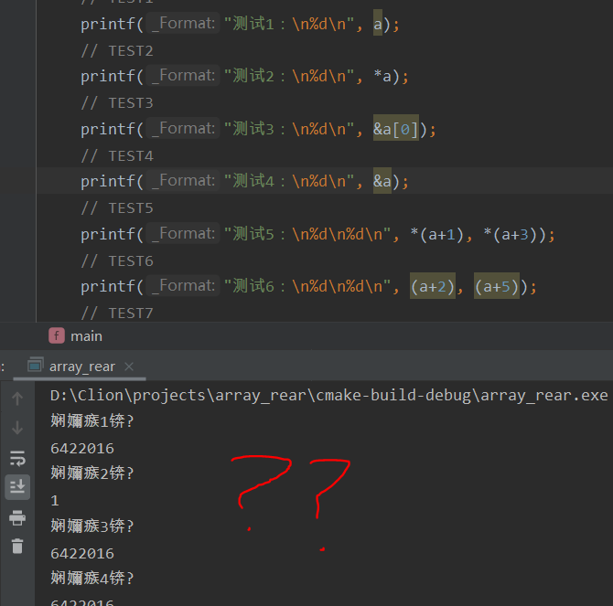
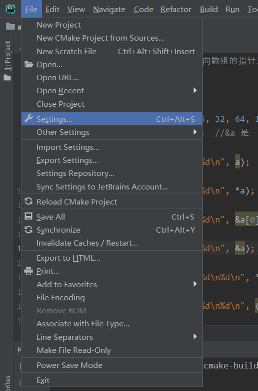
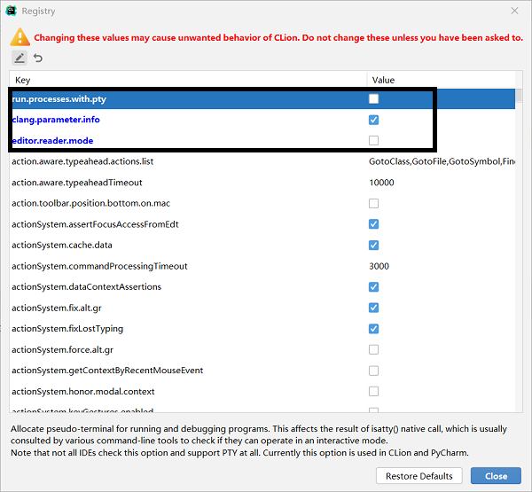

---
title: CLion中文乱码问题的解决方案
date: 2020-03-06 17:26:50
summary: CLion是JetBrains提供的、主要开发C/C++的IDE产品，但运行可能出现中文乱码问题，本文提供一种解决方案。
tags:
- C语言
- C++
- CLion
categories:
- 开发技术
---

# CLion乱码问题

# 方法一

打开 File → Settings...：

选择 Editor，再选中 File Encodings：

调一下UTF-8，完成设置，然后点OK：

底部还有UTF-8：

改成GBK：

还有个弹窗，点Convert即可完成设置。

重新运行：

# 方法二
评论区有读者提到，每个文件都改是不是不好，所以本文于2022.04.21更新方法二，不需要改文件GBK。

文件是UTF-8格式，对于CLion命令行输出中文乱码的问题，解决方法是输入`Ctrl+Shift+Alt+/`：

修改后即可在命令行看到正确不乱码的输出！
