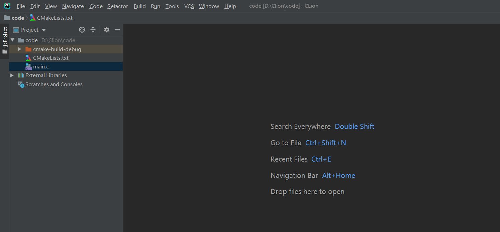
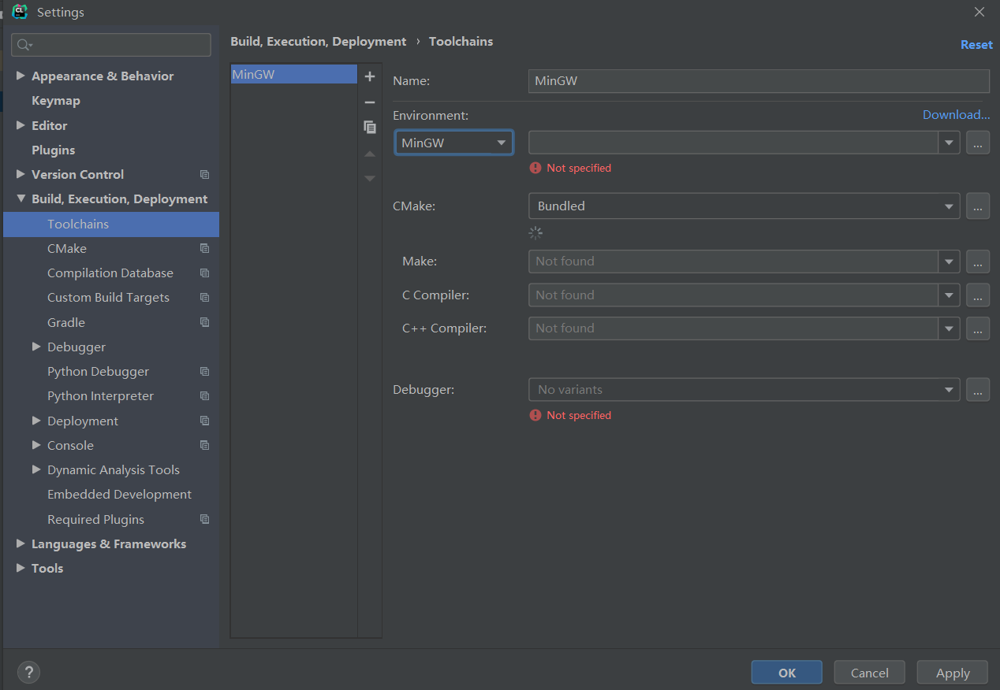
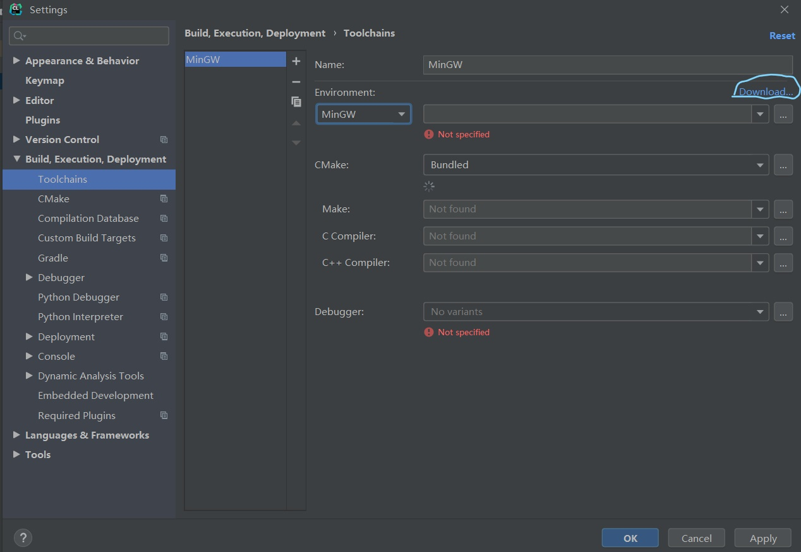
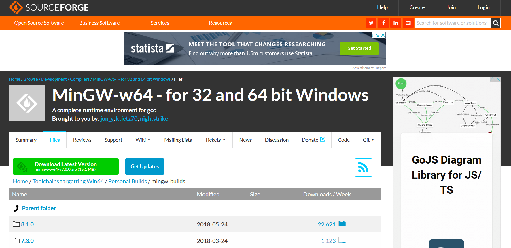
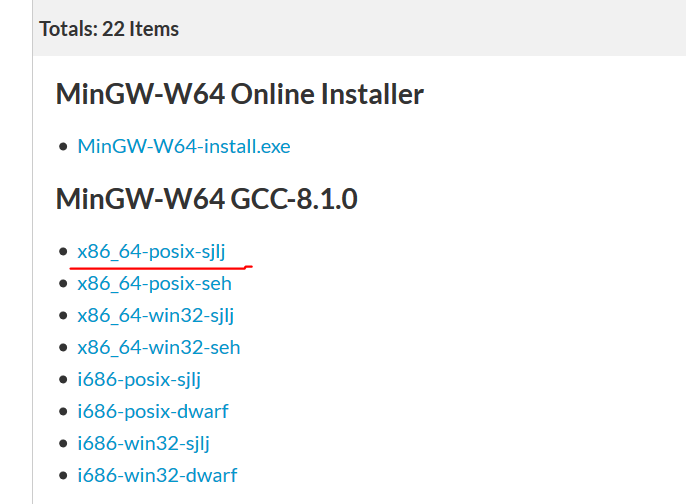
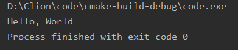
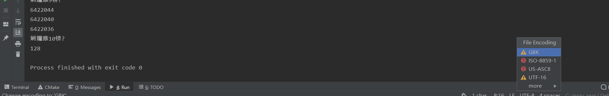
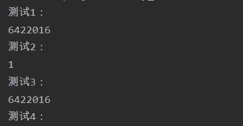

---
title: CLion用法总结
date: 2019-11-28 18:53:55
summary: 本文总结使用CLion的经验。
tags:
- C语言
- C++
- CLion
categories:
- 开发技术
---

# CLion开发环境搭建





建议从[官网](https://www.jetbrains.com/clion/)下载程序，或者通过ToolBox安装。

刚刚安装的CLion需要配置后才能Run程序：


我们可以下载并安装MinGW编译器：


如上图，点击download，会跳转网页，这里推荐另一个网页可[下载MinGW](https://sourceforge.net/projects/mingw-w64/)：


不要直接点击绿色的Download，而是往下找：


选上图这个版本即可。

然后开始下载：


然后找到需要的位置，解压：


此时需要找到文件路径添加到CLion的Settings里（注意：路径要写到mingw64，建议直接复制粘贴）：


稍作等待，待全部出现上图的绿色对勾就OK了，点击“OK”这个Button:


等配置完成，Run一下HelloWorld试试吧：


# CLion文本编辑乱码


## 解决方法1

打开 File → Settings...：


选择 Editor，再选中 File Encodings：


调一下UTF-8，完成设置，然后点OK：


底部还有UTF-8：


改成GBK：


还有个弹窗，点Convert即可完成设置。

重新运行：


## 解决方法2

文件是UTF-8格式，对于CLion命令行输出中文乱码的问题，解决方法是输入`Ctrl+Shift+Alt+/`：


修改后即可在命令行看到正确不乱码的输出！

# CLion开发运行错误

Linux开发C语言应用程序，编译出现以下四条warning：

```
warning: implicit declaration of function ‘strcmp’ [-Wimplicit-function-declaration]
    17 |     if (argc != 3 || strcmp(argv[1], "--help") \=\= 0) {
         |                      \^\~\~\~\~\~
warning: implicit declaration of function ‘read’; did you mean ‘fread’? [-Wimplicit-function-declaration]
    33 |     while ((numRead = read(inputFd, buf, BUF_SIZE)) > 0) {
         |                       \^\~\~\~
         |                       fread
warning: implicit declaration of function ‘write’; did you mean ‘fwrite’? [-Wimplicit-function-declaration]
    34 |         if (write(outputFd, buf, numRead) !\= numRead) {
         |             \^\~\~\~\~
         |             fwrite
warning: implicit declaration of function ‘close’; did you mean ‘pclose’? [-Wimplicit-function-declaration]
    42 |     if (close(inputFd) \=\= -1) {
         |         \^\~\~\~\~
         |         pclose
```

当`xxx`是`strcmp`时，解决方法是：引入`#include <string.h>`。

当`xxx`是`read`/`write`/`close`时，解决方法是：引入`#include <fcntl.h>`和`#include <unistd.h>`。

当`xxx`是`usleep`时，解决方法是：引入`#include <unistd.h>`。
