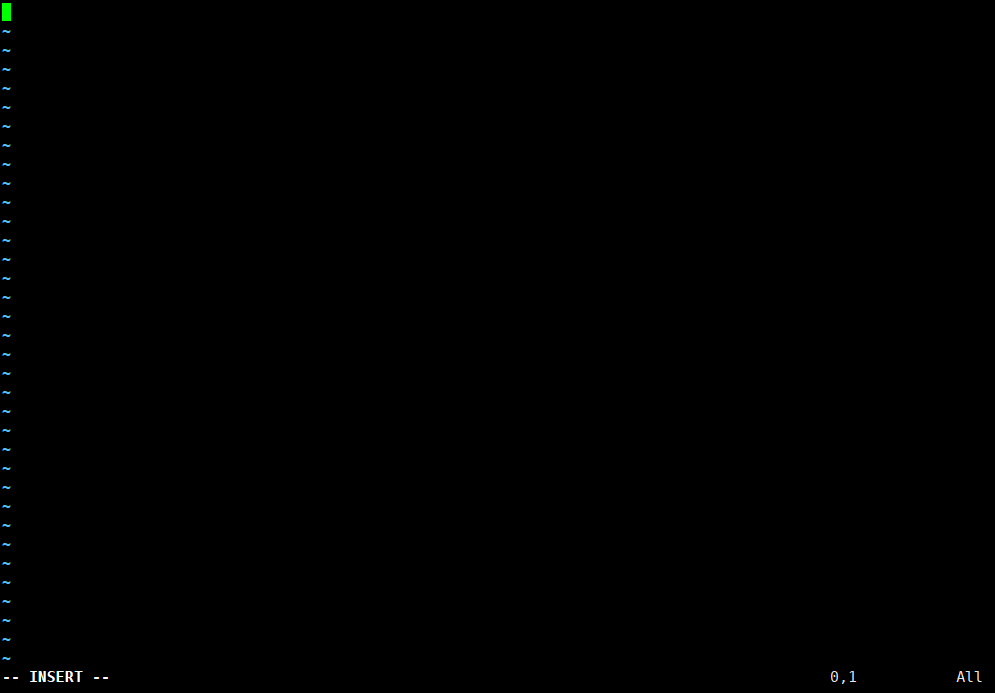

# 搭建开发环境

C程序可以在许多不同的机器上运行。这种可移植性是C语言的另一个优点。程序首先在目标机器上使用C编译器编译。存在略有不同的C编译器版本，包括cc（C编译器）、gcc（GNU C编译器）。

如果本机是Windows系统，可采取以下几种方式搭建开发环境：
- Windows本地安装MingGW等C语言编译器，将bin目录添加到环境变量，CMD完成操作。
- 本机安装双系统，多配置一个Linux系统。
- Windows本地安装Linux虚拟机。
- 远程连接Linux服务器。

这里我们用gcc编译并运行一个C程序，该编译器可以免费下载。它可以直接运行在Linux机器上，也可以在Windows机器上通过Cygwin环境访问。

# 基本操作流程

下面描述的C文件创建、编译和执行的一般过程对于任何C程序都是相同的。

 1. 创建文本文件（Wndows可用经典的记事本，但是不要用Word这种有格式化的，和Java要求一样）。我们这里取名为hello.c。
 2. 在终端窗口中，切换到hello.c文件的目录，在命令提示符处输入gcc hello.c。
 3. 编译器创建一个可执行文件。默认情况下，可执行文件名为a.out（Windows机器上是a.exe）。
 4. 在命令提示符处，键入 ./a.out（Windows为 ./a.exe），然后按回车。
 5. 终端窗口显示输出。

# 本地Windows编译执行过程

为了解决执行时闪退的问题，可以加上一行`system("pause");`。

```c
#include <stdlib.h>

int main()
{
  printf("Hello, World!\n");
  system("pause");  // 显示“请按任意键继续……”
  return 0;
}
```

# 远程Linux服务器编译执行过程

本文以远程Linux服务器为例。
输入`mkdir hello`，创建hello文件夹。输入`cd hello`，切换进`hello`目录下。


输入`vim hello.c`，用Vim打开新文件`hello.c`。


输入`I`，进入文本编辑模式。


正常完成代码编写。


输入`Esc`，返回命令模式。


输入`:wq`，保存并退出。


输入`ls`，查看当前目录下的文件，出现`hello.c`。


输入`gcc hello.c -o hello`编译`hello.c`并将编译结果保存为`hello`可执行文件。


输入`./hello`执行可执行文件，查看输出结果。


# 更多的C/C++程序编译知识

## 同时编译多个C/C++程序

一组C/C++文件中只能包含一个main()函数，通常在`main.c`/`main.cpp`中。

```shell
gcc main.c file1.c file2.c
```

```shell
g++ main.c file1.c file2.c
```

## C/C++编译器选项

### gcc编译器选项

命令行中输入`gcc --help`可以查看gcc编译器选项。

```shell
$ gcc --help
Usage: gcc [options] file...
Options:
  -pass-exit-codes         Exit with highest error code from a phase.
  --help                   Display this information.
  --target-help            Display target specific command line options.
  --help={common|optimizers|params|target|warnings|[^]{joined|separate|undocumented}}[,...].
                           Display specific types of command line options.
  (Use '-v --help' to display command line options of sub-processes).
  --version                Display compiler version information.
  -dumpspecs               Display all of the built in spec strings.
  -dumpversion             Display the version of the compiler.
  -dumpmachine             Display the compiler's target processor.
  -print-search-dirs       Display the directories in the compiler's search path.
  -print-libgcc-file-name  Display the name of the compiler's companion library.
  -print-file-name=<lib>   Display the full path to library <lib>.
  -print-prog-name=<prog>  Display the full path to compiler component <prog>.
  -print-multiarch         Display the target's normalized GNU triplet, used as
                           a component in the library path.
  -print-multi-directory   Display the root directory for versions of libgcc.
  -print-multi-lib         Display the mapping between command line options and
                           multiple library search directories.
  -print-multi-os-directory Display the relative path to OS libraries.
  -print-sysroot           Display the target libraries directory.
  -print-sysroot-headers-suffix Display the sysroot suffix used to find headers.
  -Wa,<options>            Pass comma-separated <options> on to the assembler.
  -Wp,<options>            Pass comma-separated <options> on to the preprocessor.
  -Wl,<options>            Pass comma-separated <options> on to the linker.
  -Xassembler <arg>        Pass <arg> on to the assembler.
  -Xpreprocessor <arg>     Pass <arg> on to the preprocessor.
  -Xlinker <arg>           Pass <arg> on to the linker.
  -save-temps              Do not delete intermediate files.
  -save-temps=<arg>        Do not delete intermediate files.
  -no-canonical-prefixes   Do not canonicalize paths when building relative
                           prefixes to other gcc components.
  -pipe                    Use pipes rather than intermediate files.
  -time                    Time the execution of each subprocess.
  -specs=<file>            Override built-in specs with the contents of <file>.
  -std=<standard>          Assume that the input sources are for <standard>.
  --sysroot=<directory>    Use <directory> as the root directory for headers
                           and libraries.
  -B <directory>           Add <directory> to the compiler's search paths.
  -v                       Display the programs invoked by the compiler.
  -###                     Like -v but options quoted and commands not executed.
  -E                       Preprocess only; do not compile, assemble or link.
  -S                       Compile only; do not assemble or link.
  -c                       Compile and assemble, but do not link.
  -o <file>                Place the output into <file>.
  -pie                     Create a dynamically linked position independent
                           executable.
  -shared                  Create a shared library.
  -x <language>            Specify the language of the following input files.
                           Permissible languages include: c c++ assembler none
                           'none' means revert to the default behavior of
                           guessing the language based on the file's extension.

Options starting with -g, -f, -m, -O, -W, or --param are automatically
 passed on to the various sub-processes invoked by gcc.  In order to pass
 other options on to these processes the -W<letter> options must be used.

For bug reporting instructions, please see:
<file:///usr/share/doc/gcc-9/README.Bugs>.
```

对常见编译器选项的解释：

| 编译器选项 | 描述 | 示例 |
|:----:|:----:|:----:|
| -ooutfile | 指定输出文件名 | `gcc -o hello hello.c` |
| -S | 创建汇编语言输出文件（不可执行） | `gcc -S hello.c this produces hello.s` |
| -v | 详细模式——在完成编译时输出编译结果和过程 | `gcc -v hello.c` |
| -O\<level\> | 指定优化水平（通常为0~3），生成更快和更小的代码，但是代价是编译时间长 | `gcc -O2 hello.c` |
| --version | 列出编译器版本 | `gcc -version` |
| --help | 列出所有命令行选项 | `gcc - -help` |
| --Wall | 输出所有警告 | `gcc -Wall hello.c` |

### g++编译器选项

命令行中输入`g++ --help`可以查看C++编译器选项。
```shell
$ g++ --help
Usage: g++ [options] file...
Options:
  -pass-exit-codes         Exit with highest error code from a phase.
  --help                   Display this information.
  --target-help            Display target specific command line options.
  --help={common|optimizers|params|target|warnings|[^]{joined|separate|undocumented}}[,...].
                           Display specific types of command line options.
  (Use '-v --help' to display command line options of sub-processes).
  --version                Display compiler version information.
  -dumpspecs               Display all of the built in spec strings.
  -dumpversion             Display the version of the compiler.
  -dumpmachine             Display the compiler's target processor.
  -print-search-dirs       Display the directories in the compiler's search path.
  -print-libgcc-file-name  Display the name of the compiler's companion library.
  -print-file-name=<lib>   Display the full path to library <lib>.
  -print-prog-name=<prog>  Display the full path to compiler component <prog>.
  -print-multiarch         Display the target's normalized GNU triplet, used as
                           a component in the library path.
  -print-multi-directory   Display the root directory for versions of libgcc.
  -print-multi-lib         Display the mapping between command line options and
                           multiple library search directories.
  -print-multi-os-directory Display the relative path to OS libraries.
  -print-sysroot           Display the target libraries directory.
  -print-sysroot-headers-suffix Display the sysroot suffix used to find headers.
  -Wa,<options>            Pass comma-separated <options> on to the assembler.
  -Wp,<options>            Pass comma-separated <options> on to the preprocessor.
  -Wl,<options>            Pass comma-separated <options> on to the linker.
  -Xassembler <arg>        Pass <arg> on to the assembler.
  -Xpreprocessor <arg>     Pass <arg> on to the preprocessor.
  -Xlinker <arg>           Pass <arg> on to the linker.
  -save-temps              Do not delete intermediate files.
  -save-temps=<arg>        Do not delete intermediate files.
  -no-canonical-prefixes   Do not canonicalize paths when building relative
                           prefixes to other gcc components.
  -pipe                    Use pipes rather than intermediate files.
  -time                    Time the execution of each subprocess.
  -specs=<file>            Override built-in specs with the contents of <file>.
  -std=<standard>          Assume that the input sources are for <standard>.
  --sysroot=<directory>    Use <directory> as the root directory for headers
                           and libraries.
  -B <directory>           Add <directory> to the compiler's search paths.
  -v                       Display the programs invoked by the compiler.
  -###                     Like -v but options quoted and commands not executed.
  -E                       Preprocess only; do not compile, assemble or link.
  -S                       Compile only; do not assemble or link.
  -c                       Compile and assemble, but do not link.
  -o <file>                Place the output into <file>.
  -pie                     Create a dynamically linked position independent
                           executable.
  -shared                  Create a shared library.
  -x <language>            Specify the language of the following input files.
                           Permissible languages include: c c++ assembler none
                           'none' means revert to the default behavior of
                           guessing the language based on the file's extension.

Options starting with -g, -f, -m, -O, -W, or --param are automatically
 passed on to the various sub-processes invoked by g++.  In order to pass
 other options on to these processes the -W<letter> options must be used.

For bug reporting instructions, please see:
<file:///usr/share/doc/gcc-9/README.Bugs>.
```

对常见编译器选项的解释：

| 编译器选项 | 描述 |
|:----:|:----:|
| -ansi | 只支持 ANSI 标准的 C 语法<br>这一选项将禁止 GNU C 的某些特色， 例如 asm 或 typeof 关键词 |
| -c | 只编译并生成目标文件 |
| -DMACRO | 以字符串"1"定义 MACRO 宏 |
| -DMACRO=DEFN | 以字符串"DEFN"定义 MACRO 宏 |
| -E | 只运行 C 预编译器 |
| -g | 生成调试信息 |GNU 调试器可利用该信息 |
| -IDIRECTORY | 指定额外的头文件搜索路径DIRECTORY |
| -LDIRECTORY | 指定额外的函数库搜索路径DIRECTORY |
| -lLIBRARY | 连接时搜索指定的函数库LIBRARY |
| -m486 | 针对 486 进行代码优化 |
| -o | FILE 生成指定的输出文件 |用在生成可执行文件时 |
| -O0 | 不进行优化处理 |
| -O | 或 -O1 优化生成代码 |
| -O2 | 进一步优化 |
| -O3 | 比 -O2 更进一步优化，包括 inline 函数 |
| -shared | 生成共享目标文件 |通常用在建立共享库时 |
| -static | 禁止使用共享连接 |
| -UMACRO | 取消对 MACRO 宏的定义 |
| -w | 不生成任何警告信息 |
| -Wall | 生成所有警告信息 |

## 配置命令行参数

`argc`表示参数计数，表示命令行上参数的个数；`argv`表示参数向量，为命令行上发现的字符串数组。

请看下面的C语言代码：
```c
#include<stdio.h>

int main(int argc, char *argv[])
{
    int i;
    for (i = 0; i < argc; i++)
    {
        printf("argv[%d]=%s\n", i, argv[i]);
    }
}
```

编译：
```c
gcc -o testargs.c ./testargs arg1 25 lastarg!
```
控制台输出：
<font color="orange">argv[0]=./testargs
argv[1]=arg1
argv[2]=25
argv[3]=lastarg!
</font>

## 编译过程中编译器的整体操作

编译过程中编译器的整体操作：
 1. 通过包含引用库和扩大宏定义来预处理文件。
 2. 忽略所有的不必要信息，如注释。
 3. 将高级代码转换为用二进制表示的本地处理器的简单指令，即机器语言。
 4. 将所有的指令转换成一个可由计算机读取和执行的简单二进制可执行文件。

每种机器语言特定于一种给定的机器，因此程序必须专门为其将要运行的系统进行编译。
