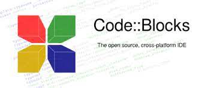
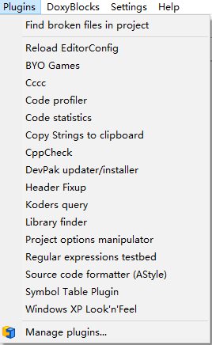

# Code::Blocks

Code::Blocks 是一款免费、开源、跨平台的 C、C++ 和 Fortran IDE，旨在满足其用户最苛刻的需求。它被设计成非常可扩展和完全可配置的。

Code::Blocks 是一款功能齐全的 IDE，具有跨平台一致的外观、感觉和操作，旨在使个人开发人员（和开发团队）在一个良好的编程环境中工作，提供他/他们从此类程序中需要的一切。

Code::Blocks 围绕插件框架构建，可以使用插件进行扩展。开发者可以通过安装/编码插件来添加任何类型的功能。

Code::Blocks由纯粹的C++语言开发完成，它使用了著名的图形界面库wxWidgets(2.6.2 unicode)版。

推荐阅读：[开源软件](https://blankspace.blog.csdn.net/article/details/129073143)

推荐阅读：[集成开发环境](https://blankspace.blog.csdn.net/article/details/129351285)

# Code::Blocks下载安装

前往[官网](http://www.codeblocks.org/downloads/)下载：

前往[SourceForge](https://sourceforge.net/projects/codeblocks/files/Binaries/20.03/Windows/codeblocks-20.03-setup.exe/download)下载exe文件：

点击Download即可下载。

下载后开始安装。

至此，安装完成。

# Code::Blocks开发流程

1. 创建新工程`New `$→$`Project`。

2. 选择控制台应用程序`Console Application`工程。

3. 选择`Next`，继续完成`Console Application`工程创建。

4. 选择编程语言是C还是C++。

5. 填写工程基本信息。

6. 配置工程编译器信息，一般选择默认即可。

7. 创建完成，查看工程结构。

8. 双击`main.c`查看C源文件代码。

9. 选择`Build and run`，构建并执行程序。

10. 弹出CMD窗体输出运行结果，程序结束，按任意键退出窗体。

# Code::Blocks的核心功能

1. 工程的创建、打开、保存、导出、关闭等功能。

2. 选择不同语言的代码高亮设置。

3. 可视化窗体组件的选择配置。

4. 代码构建与运行的选项，主要是`Build`、`Run`、`Build and run`、`Rebuild`。

5. Code::Blocks插件选择与配置。

6. Code::Blocks设置，例如开发环境设置、代码编辑器设置、编译器设置、调试器设置。

