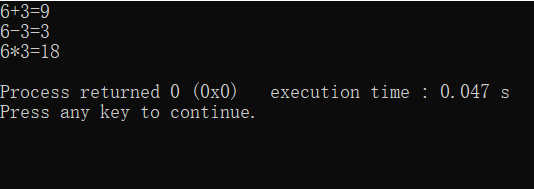
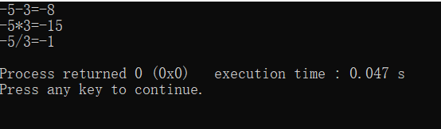

---
title: C语言原子操作实现加减乘除
date: 2019-10-02 20:28:04
summary: 本文分享两则C语言通过原子操作实现加减乘除功能的策略。
tags:
- C语言
categories:
- 开发技术
---

# 任务Ⅰ

已知计算机有下列原子操作：
1. 赋值操作：`b=a`
2. 自增$1$：`++a`
3. `for() {***}` ：有限循环
4. 操作数只能为$0$或者正整数

利用这些原子操作定义函数实现加、减、乘操作。

## 实现代码

```c
#include <stdio.h>

int add(int a, int b) {     //求a+b
    int result = a;
    for (int i = 0; i < b; ++i) {
        ++result;
    }
    return result;
}

int decone(int n) {     //求n-1
    int tmp = 0;
    int result = 0;
    for (int i = 0; i < n; ++i) {
        result = tmp;
        ++tmp;
    }
    return result;
}

int sub(int a, int b) {     //求a-b，只适合a>=b的情况
    int result = a;
    for (int i = 0; i < b; ++i) {
        result = decone(result);
    }
    return result;
}

int mult(int a, int b) {    //求a*b
    int result = 0;
    for (int i = 0; i < a; ++i) {
        for (int j = 0; j < b; ++j) {
            ++result;
        }
    }
    return result;
}

int main() {
    int a = 6, b = 3;
    printf("%d+%d=%d\n", a, b, add(a, b));
    printf("%d-%d=%d\n", a, b, sub(a, b));
    printf("%d*%d=%d\n", a, b, mult(a, b));
}
```



# 任务Ⅱ

只允许使用+、赋值语句、判断语句、有限循环语句实现两个整数的减法、乘法和除法（整除）运算。

由提供的操作，我们需要先设计两个函数：
1. negate()：改变整数符号。
2. abs()：求整数绝对值。

各功能运算设计如下：
1. a-b=a+negate(b)。
2. 若a>=0，a×b=(b累加a次)；若a<0,a×b=-(b累加abs(a)次)。
3. x=a÷b，即a=bx，在a>0并且b>0时，x=累加b小于或等于a的最多次数。再考虑b为负数的其他情况。

## 实现代码

```c
#include <stdio.h>

int negate(int a) {     //改变a的符号
    int neg = 0;
    int d = (a < 0 ? 1 : -1);
    while (a != 0) {
        neg += d;
        a += d;
    }
    return neg;
}

int abs(int a) {        //求a的绝对值
    if (a < 0) {
        return negate(a);
    } else {
        return a;
    }
}

int sub(int a, int b) {     //求a-b
    return a+negate(b);
}

int mult(int a, int b) {        //求a*b
    int result = 0;
    for (int i = abs(a); i > 0; i--) {
        result += b;
    }
    if (a > 0) {
        return result;
    } else {
        return negate(result);
    }
}

int div(int a, int b) {     //求a/b
    int a1 = abs(a);
    int b1 = abs(b);
    int product = b1;
    int x = 0;
    while (product <= a1) {
        product += b1;
        x++;
    }
    if ((a < 0 && b < 0) || (a > 0 && b > 0)) {
        //a、b同号返回x
        return x;
    } else {
        //a、b异号返回-x
        return negate(x);
    }
}

int main() {
    int a = -5, b = 3;
    printf("%d-%d=%d\n", a, b, sub(a, b));
    printf("%d*%d=%d\n", a, b, mult(a, b));
    printf("%d/%d=%d\n", a, b, div(a, b));
}
```


