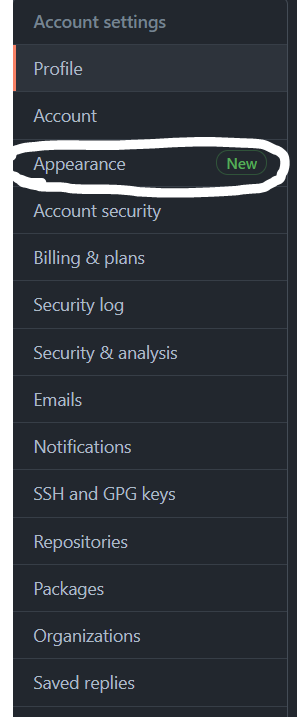
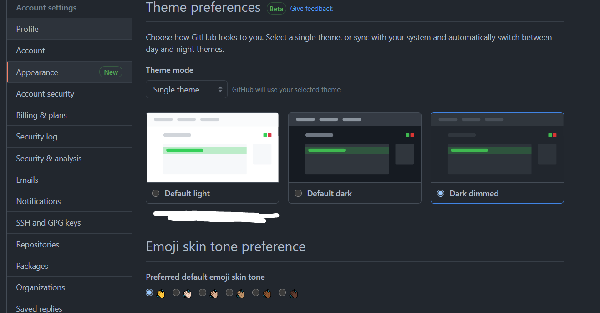

---
title: GitHub从Dark主题改回Light主题
date: 2022-01-29 22:37:06
summary: 本文分享GitHub从Dark主题改回Light主题的方法。
tags:
- Git
- GitHub
categories:
- 开发技术
---

现在的GitHub右上角有一个调节黑白色的按钮，但我好像最近操作失误，现在显示不出来了，但Dark有时候看起来真的难受，所以就要想想办法改回白色。

先选择Settings：

点开以后，找设置，发现Appearance，用IDE调过皮肤的应该会比较熟悉：

最后，自己选一个即可，解决！

好多时候找不到设置的话，记住这些基本的设置肯定是被支持的，实在不行一个一个找，总会找到的。
