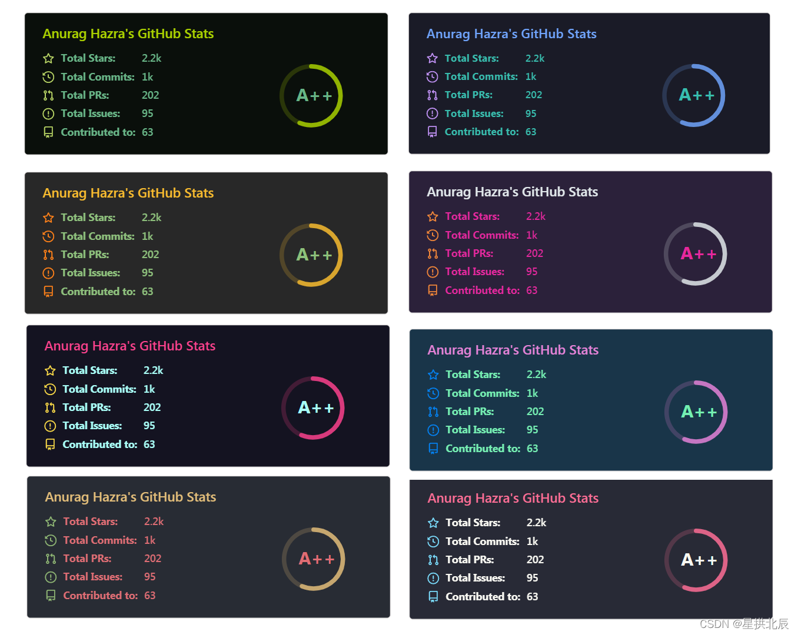
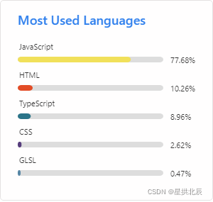
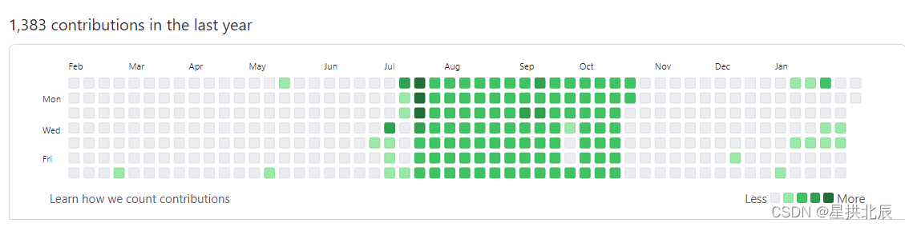
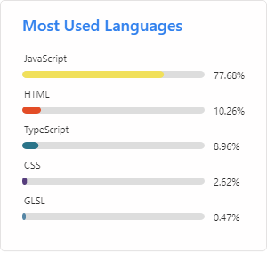
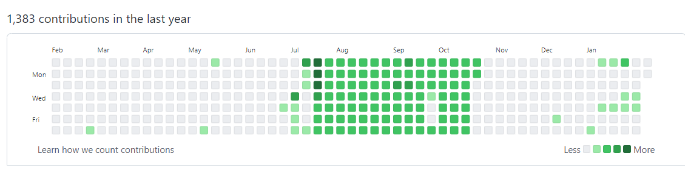
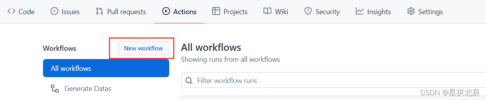
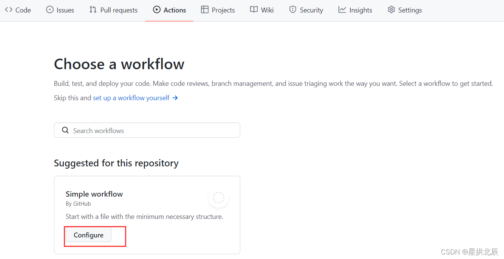
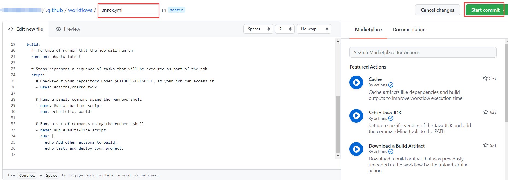

---
title: GitHub同名项目实现丰富多彩的README.md
date: 2022-02-07 14:29:11
summary: 本文分享GitHub同名项目实现丰富多彩的README.md的经验。
tags:
- Git
- GitHub
- Markdown
categories:
- 开发技术
---

# 导读

README.md作为Markdown文件，GitHub支持了Markdown的基本语法，但不支持CSDN提供的强大的公式编辑\$\$功能以及标题功能等。

看到别人的GitHub同名项目里README.md丰富多彩，你是否羡慕呢？本文给读者分享几种常见的装饰README.md的小技巧，遇到新鲜的玩法会持续更新。

# 徽章图片

[Shields IO](https://img.shields.io)有丰富的图片资源可以用在GitHub用户的README.md中，[Shields](https://github.com/badges/shields)项目也已开源。

该项目以SVG和raster格式提供简洁、一致和易读的徽章的服务，可以轻松地包含在GitHub的README.md文件或任何其他网页中。 该服务支持数十种持续集成服务、包注册表、分发、应用商店、社交网络、代码覆盖服务和代码分析服务。每个月它提供超过7.7亿张图片，并被一些世界上最受欢迎的开源项目使用，如 VS Code、Vue.js 和 Bootstrap 等等。

比如：


# Emoji

有很多可以提供Emoji图片的网站，试推荐一个：[emojipedia](https://emojipedia.org)。


# 数据统计

[github-readme-stats](https://github.com/anuraghazra/github-readme-stats/blob/master/docs/readme_cn.md)是一款非常有趣的GitHub数据统计可视化工具，也提供了[中文文档](https://github.com/anuraghazra/github-readme-stats/blob/master/docs/readme_cn.md)，可以在GitHub用户的README.md里呈现出如下效果：


数据统计卡片有很多样式，还支持渐变色：


支持自定义repo卡片：


支持热门语言统计：


# 贪吃蛇

逛GitHub的时候发现了一个有趣的README.md内容，就是snack，容笔者称其为“贪吃蛇”。

比如下图为某GitHub用户的contributions统计：


通过一系列的操作，呈现在README.md上的是一个SVG格式的贪吃蛇动图：


操作方法如下：







将以下yml内容填入以后点击“Start Commit”，注意填写用户名：
```yml
name: Generate Datas

on:
  schedule:
    - cron: "* */12 * * *"
  workflow_dispatch:

jobs:
  build:
    name: Jobs to update datas
    runs-on: ubuntu-latest
    steps:
      # Snake Animation
      - uses: Platane/snk@master
        id: snake-gif
        with:
          github_user_name: 你的用户名
          svg_out_path: dist/github-contribution-grid-snake.svg

      - uses: crazy-max/ghaction-github-pages@v2.1.3
        with:
          target_branch: output
          build_dir: dist
        env:
          GITHUB_TOKEN: ${{ secrets.GITHUB_TOKEN }}

```

通过以上方法生成了SVG文件，README.md引入方法就是：
``

两个“你的用户名”都是为了凑URL，第一个是你的用户名必须要有，第二个是你的repo一般是同名repo，所以需要填这个。

# 成熟案例

推荐一份成熟案例：[GitHub用户: BEPb](https://github.com/BEPb/BEPb)
