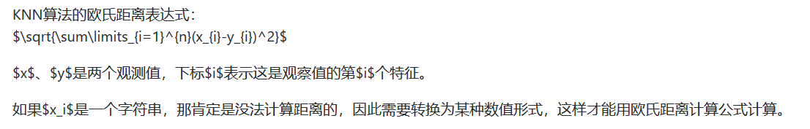
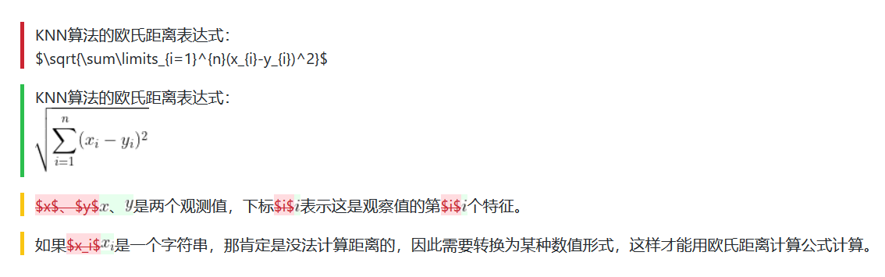
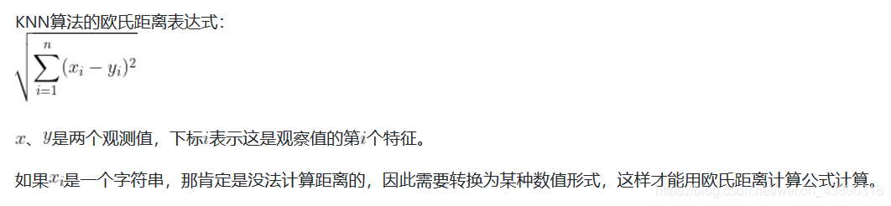

---
title: GitHub无法解析LaTeX语句的解决方法
date: 2020-09-26 19:14:00
summary: 本文介绍Github无法解析LaTeX语句的解决方法。
mathjax: true
tags:
- Git
- GitHub
- LaTeX
categories:
- 开发技术
---

CSDN解析的Markdown语句：

> KNN算法的欧氏距离表达式：$\sqrt{\sum\limits_{i=1}^{n}(x_{i}-y_{i})^2}$
>
> $x$、$y$是两个观测值，下标$i$表示这是观察值的第$i$个特征。
>
> 如果$x_i$是一个字符串，那肯定是没法计算距离的，因此需要转换为某种数值形式，这样才能用欧氏距离计算公式计算。

GitHub加载后的样式：


我们在两个\$中间编辑的Latex语句全都失效了！这是为什么呢？（其实我们在PyCharm里查看也是不解析Latex的）
划重点：==Markdown本来是不支持Latex的==，像CSDN这种Markdown编辑器肯定是做了增强的。

以根式公式为例，有两种修改方法：
```

^2})
```

修改展示：


修改后的样式：


如此，虽然丑了些，却也完成了任务。

更新：GitHub目前已支持LaTeX语句，尽管支持还不够充分，但读者朋友们可以参考我写过的这篇文章：[LaTeX符号语法总结](https://blankspace.blog.csdn.net/article/details/104517063)。
