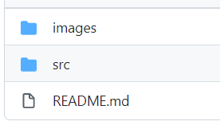

---
title: GitHub设置README.md引用本repo目录下的图片
date: 2022-02-07 15:47:30
summary: 本文分享GitHub设置README.md引用本repo目录下的图片的方法。
tags:
- Git
- GitHub
categories:
- 开发技术
---

我们在完善GitHub的repo时，往往需要完善其README.md。图片是一种表现力较强的呈现形式，引入图片也是Markdown支持的语法，因此有时候我们需要将一些图片放在README.md中显示给读者直接过目。本文介绍如何在GitHub设置README.md引用本repo图片。

复习一下Markdown图片语法：``

图片URL的填写可以用绝对路径，也可以用相对路径。

绝对路径的使用相对简单，但不够灵活。如果使用绝对路径，直接将图片对应在GitHub的URL键入即可。如果发生用户名或repo名的修改，所有的图片绝对路径配置都会失效，导致维护不方便。

相对路径是一个不错的方案，笔者后来将自己所有的README.md中引用的图片URL和文件夹URL都改成了相对路径。
比如如下的repo结构：

README.md的URL是：`https://github.com/用户名称/repo名称/blob/master/README.md`
images文件夹的URL是：`https://github.com/用户名称/repo名称/tree/master/images`
images文件夹下的image.jpg文件的URL是：`https://github.com/用户名称/repo名称/blob/master/images/image.jpg`

所以从README.md引用如上图所示的相对位置的名为image.jpg的图片，应该这样去写：``
