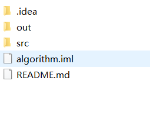
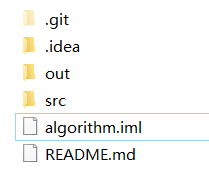
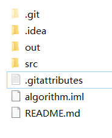

---
title: Git修改Repository语言类型
date: 2020-05-07 21:34:30
summary: 本文分享Git修改Repository语言类型的方法。
tags:
- Git
categories:
- 开发技术
---

# 问题描述

Github私有的洛谷代码库由于掺杂了大量的.cpp、.cmake等乱七八糟的东西，又被归类为CMake了：


但我们想把它恢复为Java并且以后还是Java，怎么操作呢？

# 操作步骤

首先找到本地Git项目的根目录：


我们打开隐藏的文件，可以看到.git：


在这里创建.gitattributes文件，输入以下内容：

```
*.* linguist-language=java
```

这是一个隐藏文件，创建成功之后可以看到：



接下来使用Git提交代码，提交成功之后可发现语言类型被改回了Java：


# .gitattributes

如果Github上未指定语言，Linguist会识别代码的类别，它是根据某种语言的代码量来决定是哪种语言的项目。如果识别有误，可以新建.gitattributes文件来进行设置。
格式如下：

```
*.cmake linguist-language=java
```

多个设置使用分号隔开。

更具体的配置语法：
- 斜杠 / 开头表示目录
- 星号 * 通配多个字符
- 问号 ? 通配单个字符
- 方括号 [] 包含单个字符的匹配列表
- 叹号 ! 表示不忽略(跟踪)匹配到的文件或目录

所以说，我写的`\*.\*`可以表示任何文件。

想了解更更多吗？[点此开启新世界](https://blog.csdn.net/taiyangdao/article/details/78484623)

# 如何创建.gitattributes文件

事实上，我们创建.gitattributes文件的通常方法是新建txt的时候改名，但这样创建.gitattributes文件的时候Windows系统会报错，而这点是网络上很多博客并没有提及的，所以我做一下说明。

创建的时候，默认是“新建文本文档.txt”，全部删去，改成“.gitattributes.”，注意末尾这个点然后回车新建，就OK了。

更多的方法可以看这篇文章：[《在 Windows 中创建以点开头的文件》](https://zzz.buzz/zh/2016/01/04/create-dotfiles-in-windows/)
