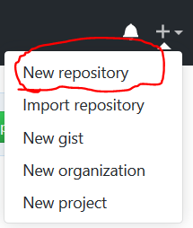
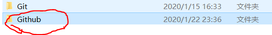

---
title: Git提交代码到GitHub
date: 2020-01-23 00:07:23
summary: 本文分享Git提交代码到GitHub的基本流程。
tags:
- Git
- GitHub
categories:
- 开发技术
---

# 说明

本篇博客并非用于全程指导初学者入门Git，但我可以推荐[一篇优秀的博文](https://blog.csdn.net/nmjuzi/article/details/82184818)，是我入门所参考的。

本文适合于把基本配置做好并自己提交过一次的初学者，可以防止忘记命令或者走错流程。

# 操作流程

首先我们在GitHub建立新的代码仓库，即New Repository：


然后完成信息的填写。

接下来找到存放本地库的文件夹：
（这是我的：D:/Github）

右键直接开启Git bash：
进行clone，建立本地库：

在上述的新的库的网页里复制URL：


输入命令：
```shell
git clone url
```

注意粘贴时要用右键的Paste，Git bash里面的Ctrl+C/Ctrl+V不好使！！

完成以后就打开Github文件夹，找到本地库，将待提交的文件全部复制进去。

然后退到本地库的文件夹那里，比如我的库名为hh，就是D:/Github/，在里面右键hh文件夹，再次打开Git bash。（当然，也可以用cd调位置啦）

接下来在Git bash里依次输入以下命令：

```shell
git add .
```

```shell
git commit -m "你想说的"
```

```shell
git push -u origin master
```

done.
