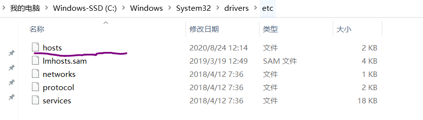
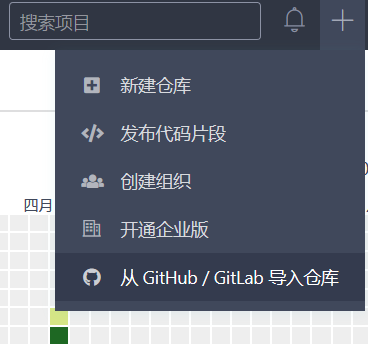

---
title: Git运行错误的解决方法
date: 2022-01-29 22:37:06
summary: 本文分享Git运行错误的解决方法。
tags:
- Git
- GitHub
categories:
- 开发技术
---

# error: failed to push some refs to 'https://github.com/username/repository_name'

新建的Github项目在提交过程中报错：

> git push origin master

error: src refspec master does not match any
error: failed to push some refs to 'https://github.com/username/repository_name'

我反复测试了多种可能的错因，最终想到了Github为了某些目的将master改为main，而原先的master予以保留，所以提交之前的项目代码都不会错，这一次就会错。

故现在的正解为：

> git push origin main

# Unable to access 'https://github.com/user_name/repository_name/': OpenSSL SSL_read: Connection was reset, errno 10054

Unable to access 'https://github.com/user_name/repository_name/': OpenSSL SSL_read: Connection was reset, errno 10054

网上看到很多说法，其实你之前配置没问题的话我相信一般是没有问题的，你照着他们说的去做也未必能解决问题。当时查资料倒是看到一个有趣的说法，有关于自己的网络连接，我觉得这种思考是很好的，都可以提供大家的参考。

我的问题也给大家分享一下吧，希望给大家排坑提供一种思考的可能：
我在本地commit之前在GitHub直接修改了readme.md的内容，导致本地修改记录和GitHub修改记录冲突，进而报错。
其实之前写的的[《Git解决文件本地更改的合并覆盖错误》](https://blankspace.blog.csdn.net/article/details/106114816)一文中的弊病原因在哪里呢？就是在 New Repository 的时候点了初始化readme.md，这次创建算是一次commit，但你的本地没有这次记录，所以就会冲突，就不能提交，就必须在pull的时候处理新老版本的兼容问题。

所以处理的方法就是做一下`git pull origin master --allow-unrelated-histories`，然后再push即可。

# 从GitHub到本地clone项目慢

众所周知GitHub上clone项目可能很慢，网上搜解决办法有很多都说建议Hosts文件：

可惜的是，可能效果不明显或者无效，所以这里介绍几种应对方法。

## 解决方案1：项目拷贝到Gitee再下载

Gitee支持直接导入GitHub工程：

然后再从Gitee克隆，就会很快。

## 解决方案2：改路径

比如项目路径是：`https://github.com/username/repository.git`，命令就是`git clone "https://github.com/username/repository.git"`，我们只需稍加修改这个命令，在`github.com`后加上`.cnpmjs.org`，命令就变成了`git clone "https://github.com.cnpmjs.org/username/repository.git"`。

# error: Your local changes to the following files would be overwritten by merge:

push代码到GitHub的过程中，遇到报错：

error: Your local changes to the following files would be overwritten by merge:
XXXXXXXXXXXXXXXXXXXXXXXXXXXXXXXXXXXX

先说说怎么出现的问题：
add和commit是没有错误的，由于我在新建项目的时候顺便初始化了README.md，所以需要先pull过来，为避免麻烦，直接输入`git pull origin master --allow-unrelated-histories`，就报错了。

下面再说说怎么解决问题：
先输入`git stash`，将本地快照，
接下来输入`git pull origin master --allow-unrelated-histories`，不报错的话再退出，最后push代码即可。
